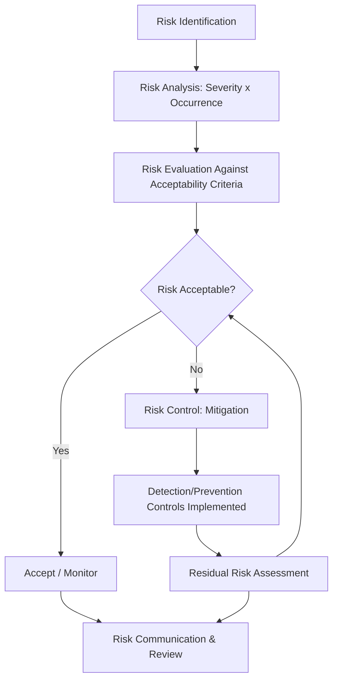

## Risk Management Terminology

### Overview

Quality risk management (QRM) applies structured risk terminology to identify, assess, and control potential failure modes before they manifest as nonconformances. This chapter establishes the foundational vocabulary used across risk-based quality tools (FMEA, risk matrices, ISO 31000, ISO 14971) that recur throughout precision metrology risk analysis — particularly in determining where measurement rigor should be concentrated based on risk severity rather than applied uniformly.

### Core Risk Concepts

**Key Points**

- **Risk**: the combination of the probability of occurrence of harm and the severity of that harm (per ISO 14971 and ISO 31000 conceptual framing); risk is inherently a function of both likelihood and consequence, not either alone
- **Hazard**: a potential source of harm; in a manufacturing/metrology context, this may be a process step, material property, or measurement system limitation capable of producing a nonconforming or unsafe outcome
- **Harm**: the actual physical injury, damage to health, property, or the environment, or degradation of product function resulting from a hazard being realized
- **Hazardous situation**: a circumstance in which people, property, or the environment are exposed to one or more hazards

$$Risk=f(Severity,Occurrence)$$

### Probability and Severity Terminology

**Key Points**

- **Severity (S)**: the magnitude of consequence if a failure occurs, typically rated on an ordinal scale (commonly 1-10 in FMEA methodology, with 10 representing the most severe outcome, such as safety hazard without warning)
- **Occurrence (O)**: the likelihood or frequency that a specific failure cause will occur, also typically rated on an ordinal scale
- **Detection (D)**: the likelihood that a control (including measurement/inspection) will detect the failure or its cause before it reaches the customer; in FMEA, a *lower* detection rating indicates *higher* detection capability, an inverted scale that is a frequent source of confusion
- **Risk Priority Number (RPN)**: the composite score used in traditional FMEA to prioritize risks:

$$RPN=S\times O\times D$$

**Example**

A characteristic with Severity=8 (critical function loss), Occurrence=3 (occasional cause), and Detection=2 (highly capable measurement system) yields $RPN=8\times3\times2=48$, versus a characteristic with lower severity but poor detection capability (S=4, O=3, D=9, $RPN=108$) — illustrating that RPN can rank a lower-severity risk with inadequate detection controls (often reflecting weak measurement system capability) above a higher-severity risk with strong detection.

### Risk Matrix Terminology

**Key Points**

- **Risk Matrix (Risk Heat Map)**: a two-dimensional visualization plotting Severity against Occurrence (or Likelihood), with risk level typically color-coded (e.g., green/yellow/red) to communicate priority without necessarily computing a numerical composite score
- **Risk Acceptability Criteria**: predefined thresholds (often organizationally or regulatorily defined) distinguishing acceptable risk, risk requiring mitigation, and unacceptable risk requiring elimination or redesign
- **ALARP (As Low As Reasonably Practicable)**: a risk-acceptance principle, common in safety-critical industries, holding that risk should be reduced to the lowest level reasonably achievable considering cost, time, and effort relative to the risk reduction gained

### Risk Treatment Terminology

**Key Points**

- **Risk Avoidance**: eliminating the hazard entirely, often through design change (e.g., redesigning a feature to remove a tight tolerance requiring difficult-to-achieve measurement capability)
- **Risk Reduction (Mitigation)**: lowering severity, occurrence, or improving detection without eliminating the underlying hazard (e.g., adding a more capable measurement system to improve detection)
- **Risk Transfer**: shifting risk ownership or financial consequence to another party (e.g., insurance, supplier liability agreements)
- **Risk Retention (Acceptance)**: a deliberate decision to accept a risk within defined acceptability criteria without further mitigation, typically requiring formal sign-off and ongoing monitoring
- **Residual Risk**: the risk remaining after risk control measures have been applied — the treated, rather than initial (inherent), risk level

### Prevention vs. Detection Controls

**Key Points**

- **Prevention Controls**: measures that reduce the *occurrence* of a failure cause (e.g., process capability improvement, poka-yoke/error-proofing, robust design per Taguchi methodology)
- **Detection Controls**: measures that identify a failure after it occurs but before it causes harm or reaches the customer (e.g., in-process inspection, SPC monitoring, final measurement verification)
- This distinction is central to metrology's role in risk management: measurement systems are fundamentally **detection controls**; their capability (Gauge R&R, sensitivity, sampling frequency) directly determines the Detection rating in FMEA-based risk assessment, and therefore directly influences calculated risk priority

### Failure Terminology

**Key Points**

- **Failure Mode**: the specific manner in which a process, product, or system fails to meet its intended function (e.g., "diameter out of tolerance," "surface finish exceeds Ra limit")
- **Failure Effect**: the consequence of the failure mode on the next process step, end product, or end user
- **Failure Cause**: the underlying mechanism or root reason the failure mode occurs (e.g., tool wear, fixture misalignment, measurement system bias)
- **Root Cause**: the fundamental, underlying source of a problem, distinguished from symptoms or immediate causes — identified through structured methods such as 5 Whys or fishbone analysis

### Organizational Risk Management Terminology

**Key Points**

- **Risk Owner**: the individual or role accountable for managing a specific identified risk, including monitoring and ensuring mitigation actions are executed
- **Risk Register**: a structured, typically living document cataloging identified risks, their assessment, assigned owners, mitigation status, and residual risk level
- **Risk Appetite**: the amount and type of risk an organization is willing to accept in pursuit of its objectives, distinct from risk *tolerance* (the acceptable variation around a specific risk target)
- **Risk-Based Thinking**: an ISO 9001:2015 requirement that quality management decisions (including inspection frequency, measurement rigor, and process control intensity) be proportionate to assessed risk rather than uniformly applied

### Standards Reference Context

**Key Points**

- **ISO 31000**: general risk management principles and guidelines, applicable across industries and risk types (not quality-specific)
- **ISO 14971**: risk management specifically for medical devices, widely referenced for its rigorous hazard/harm terminology even outside medical device contexts
- **AIAG-VDA FMEA Handbook**: current joint automotive industry standard for FMEA methodology, terminology, and the Action Priority (AP) framework that has increasingly supplemented or replaced traditional RPN ranking in automotive applications [Unverified: adoption of AP over RPN varies significantly by industry sector and organization]

### Conclusion

Precise risk terminology is a prerequisite for consistent, comparable risk assessment across an organization — without shared definitions of severity, occurrence, and detection, risk prioritization becomes subjective and inconsistent between assessors. For precision metrology specifically, the prevention/detection control distinction is foundational: measurement system capability directly determines detection ratings, meaning investment in Gauge R&R-capable, well-calibrated measurement infrastructure is itself a risk mitigation action with a quantifiable effect on calculated risk priority.

**Related Topics**

- Failure Mode and Effects Analysis (FMEA) methodology
- Risk Priority Number (RPN) vs. Action Priority (AP) frameworks
- ISO 31000 risk management framework
- Risk registers and risk ownership structures
- Poka-yoke and error-proofing as prevention controls
- Measurement System Analysis (MSA) as a detection-control capability driver