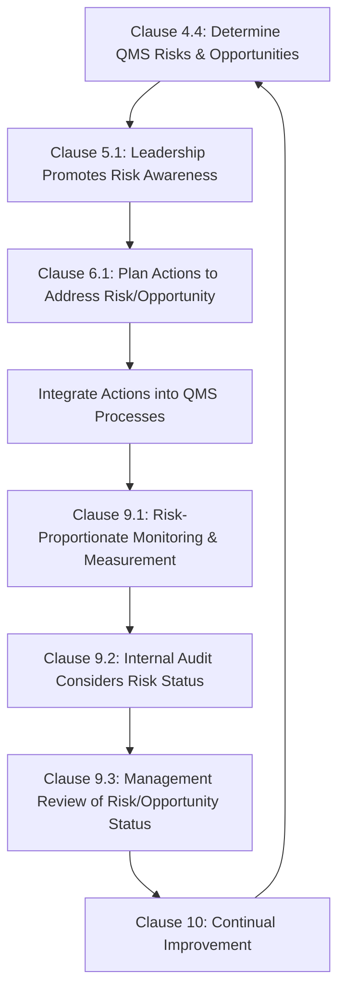

## Risk Based Thinking in ISO 9001

### Overview

Risk-based thinking is a structural requirement introduced in the **ISO 9001:2015** revision, replacing the previous edition's reliance on a dedicated "preventive action" clause with a pervasive expectation that risk and opportunity considerations are embedded throughout the entire quality management system. For precision metrology functions, this shift has direct practical consequences: inspection frequency, measurement system rigor, and calibration interval determination are expected to be risk-justified rather than uniformly applied by default.

### Historical Context: From Preventive Action to Risk-Based Thinking

**Key Points**

- **ISO 9001:2008** and earlier editions contained an explicit **Clause 8.5.3 (Preventive Action)**, requiring documented preventive action procedures as a standalone, largely reactive-adjacent activity
- **ISO 9001:2015** eliminated the standalone preventive action clause, replacing it with risk-based thinking woven throughout the standard's structure — the stated rationale being that an organization applying risk-based thinking consistently has no need for a separate preventive action clause, since prevention becomes inherent to how every process is planned
- This represents a shift from *reactive-oriented* prevention (identify a potential problem, then act to prevent it) to *proactive-embedded* risk consideration (risk is evaluated as a standard input to process design from the outset)

### Where Risk-Based Thinking Appears in ISO 9001:2015 Structure

**Key Points**

- **Clause 4.4 (QMS and its processes)**: requires the organization to determine risks and opportunities affecting conformity of products/services and the QMS's ability to achieve intended results
- **Clause 5.1 (Leadership and commitment)**: top management must promote awareness of risk-based thinking throughout the organization
- **Clause 6.1 (Actions to address risks and opportunities)**: the most explicit risk-focused clause, requiring the organization to plan actions to address identified risks and opportunities, integrate and implement these actions into QMS processes, and evaluate their effectiveness
- **Clause 9.1 (Monitoring, measurement, analysis, evaluation)**: measurement and monitoring activities should be planned with regard to identified risk, not applied uniformly regardless of risk level
- **Clause 9.3 (Management Review)**: risk and opportunity status is an explicit required input to management review

### Key Conceptual Shift: Risk and Opportunity as Paired Concepts

**Key Points**

- ISO 9001:2015 explicitly pairs risk with **opportunity**, not merely potential negative outcomes — Clause 6.1 requires consideration of both threats to be mitigated and opportunities to be pursued (e.g., a new measurement technology that could reduce inspection cost while improving detection capability represents an opportunity, not merely a risk-avoidance action)
- The standard notably does **not** mandate a specific, formal risk management methodology (no requirement for FMEA, formal risk matrices, or documented risk registers) — organizations have latitude to apply risk-based thinking proportionate to their context, complexity, and risk exposure [Inference: while ISO 9001 itself does not mandate a specific methodology, sector-specific standards such as IATF 16949 do require formal FMEA methodology, so practical implementation is often shaped by applicable sector schemes]

### Practical Application to Metrology Functions

**Key Points**

- **Risk-proportionate inspection frequency**: characteristics identified as higher-risk (critical-to-function, critical-to-safety, historically problematic) warrant more frequent or rigorous measurement verification than low-risk characteristics, rather than applying a uniform inspection plan regardless of consequence
- **Calibration interval determination**: risk-based thinking supports justifying calibration intervals based on instrument criticality, historical drift/OOT (out-of-tolerance) data, and consequence of measurement error, rather than applying identical intervals to all equipment regardless of risk profile
- **Measurement System Analysis (MSA) prioritization**: Gauge R&R study resources can be risk-prioritized toward characteristics where measurement error consequence is highest (tight tolerances, safety-critical dimensions) rather than distributed uniformly
- **Sampling plan design**: acceptance sampling rigor (100% inspection vs. statistical sampling vs. skip-lot) can be justified through documented risk assessment tied to characteristic criticality and supplier process capability history

**Example**

A precision component with two dimensional characteristics — one cosmetic (low consequence of nonconformance) and one load-bearing (high consequence, potential safety implication) — under risk-based thinking would justify different inspection frequencies and measurement system capability requirements for each characteristic, rather than treating both identically simply because both appear on the same drawing.

### Documentation Expectations

**Key Points**

- ISO 9001:2015 requires the organization to determine and address risks and opportunities, but does **not** mandate a specific documented risk assessment format as a certification requirement
- In practice, most organizations document risk-based thinking outcomes through existing QMS mechanisms already in use for other purposes: FMEA records, control plans, inspection plan justifications, calibration interval rationale documents, or management review minutes
- Auditors typically assess risk-based thinking through **evidence of proportionate decision-making** (e.g., "why does this characteristic receive 100% inspection while this one uses sampling?") rather than requiring a standalone risk management document per se

### Integration with Formal Risk Tools

**Key Points**

- While ISO 9001 does not mandate FMEA or formal risk matrices, organizations frequently satisfy risk-based thinking requirements by leveraging structured tools already covered in this chapter's terminology (Severity/Occurrence/Detection ratings, risk matrices, ALARP principles)
- **Design FMEA (DFMEA)** and **Process FMEA (PFMEA)**, where already in use (common in automotive/aerospace via IATF 16949 and AS9100 sector schemes), provide a natural, auditable evidentiary basis for demonstrating risk-based thinking compliance under the broader ISO 9001 framework
- **Control plans** derived from PFMEA outputs directly link identified risk (via Detection ratings tied to measurement system capability) to specific inspection frequency and method — the practical mechanism by which risk-based thinking translates into actual metrology resource allocation

### Common Misapplications

**Key Points**

- **Treating risk-based thinking as a standalone documented procedure**: creating a single "Risk Management Procedure" document to satisfy the requirement in isolation, without actually altering how inspection frequency, sampling, or calibration decisions are made, misses the intent of the requirement
- **Uniform risk-blind resourcing**: continuing to apply identical inspection rigor across all characteristics regardless of criticality, then only retroactively documenting a risk justification for audit purposes, inverts the intended proactive planning sequence
- **Confusing risk-based thinking with formal quantitative risk scoring**: assuming RPN calculation or a specific numerical risk matrix is an ISO 9001 requirement, when the standard's actual requirement is qualitative and proportionate risk consideration, not a specific mandated methodology

### Conclusion

Risk-based thinking in ISO 9001:2015 represents a structural shift from isolated preventive action activities to a pervasive expectation that risk and opportunity assessment inform every QMS process, without prescribing a specific mandated methodology. For precision metrology, the practical consequence is that measurement resource allocation — inspection frequency, calibration intervals, MSA prioritization, sampling rigor — should be demonstrably proportionate to assessed risk and consequence, providing auditable justification for why measurement rigor varies across characteristics rather than being applied uniformly by default.

**Related Topics**

- FMEA methodology and Severity/Occurrence/Detection terminology
- Risk-proportionate inspection and sampling plan design
- Calibration interval determination methodology
- ISO 9001 Clause 9.3 Management Review requirements
- Control plan development linking PFMEA to inspection frequency
- IATF 16949 and AS9100 sector-specific risk management requirements