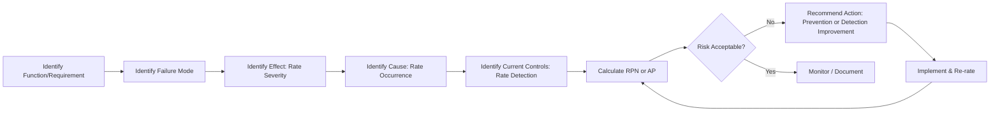

## Risk Assessment Techniques

### Overview

Risk assessment techniques are the structured methodologies used to identify, analyze, and evaluate risk within quality systems. This chapter surveys the primary techniques applied in precision metrology and manufacturing quality contexts, building on the terminology and ISO 9001 risk-based thinking framework established earlier in this chapter.

### Failure Mode and Effects Analysis (FMEA)

**Key Points**

- The most widely used structured risk assessment technique in manufacturing quality; systematically identifies potential failure modes, their effects, causes, and existing controls
- **Design FMEA (DFMEA)**: analyzes risk within a product design, evaluating failure modes arising from design decisions before production begins
- **Process FMEA (PFMEA)**: analyzes risk within a manufacturing process, evaluating failure modes arising from process steps, equipment, and material handling
- Standard FMEA worksheet columns: item/function, failure mode, effect(s) of failure, severity (S), cause(s) of failure, occurrence (O), current controls (prevention and detection), detection (D), Risk Priority Number (RPN) or Action Priority (AP), recommended actions, responsibility, and results after action
- The **AIAG-VDA FMEA Handbook** (current joint automotive standard) introduced the **Action Priority (AP)** framework — categorizing risk as High/Medium/Low based on a structured lookup table of S/O/D combinations — as an alternative to pure RPN multiplication, addressing RPN's known weakness of allowing dissimilar risk profiles to produce identical scores

**Example**

For a precision-bored hole diameter characteristic: Failure Mode = "diameter undersized," Effect = "loss of press-fit retention force," Cause = "tool wear beyond replacement interval," current Detection control = "CMM measurement every 25th part." If Gauge R&R on the CMM measurement is poor, the Detection rating (and therefore RPN/AP) worsens even though the underlying process cause is unchanged — directly linking measurement system capability to calculated risk.

### Fault Tree Analysis (FTA)

**Key Points**

- A **top-down, deductive** technique starting from an undesired top event (e.g., "critical dimension out of specification undetected") and working backward through logical gates (AND/OR) to identify combinations of underlying causes
- Useful for analyzing complex systems where multiple contributing factors must combine to produce a failure, particularly relevant where measurement system failure combines with process failure to allow defect escape (e.g., process drift AND simultaneous gauge calibration failure)
- Graphically represented using standardized symbols: AND gates (all inputs required), OR gates (any input sufficient), and basic events (root causes)

### Hazard and Operability Study (HAZOP)

**Key Points**

- A structured, team-based technique originating in the process/chemical industry, using **guide words** (No, More, Less, As Well As, Part Of, Reverse, Other Than) applied systematically to process parameters to identify deviations and their consequences
- Less commonly applied in discrete precision manufacturing than FMEA, but relevant where process parameters (temperature, pressure, flow) affect dimensional or material characteristics requiring metrology verification

### Risk Matrix / Risk Ranking and Filtering

**Key Points**

- A simplified, typically qualitative technique plotting **Severity** against **Occurrence/Likelihood** on a two-dimensional grid, with resulting risk level color-coded (commonly green/yellow/red)
- Faster to apply than full FMEA, often used as an initial screening technique before committing resources to detailed FMEA on higher-risk items
- Risk Ranking and Filtering extends the basic matrix by incorporating additional weighted factors beyond severity/occurrence alone (e.g., detectability, cost of failure, strategic importance)

### Preliminary Hazard Analysis (PHA)

**Key Points**

- An early-stage, typically qualitative technique conducted before detailed design is finalized, identifying broad categories of hazards and their potential severity to inform early risk-based design decisions
- Commonly used as an initial input before more detailed FMEA is conducted once design specifics are available

### Bowtie Analysis

**Key Points**

- Combines elements of fault tree analysis (causes leading to an event, on the left) and event tree analysis (consequences following an event, on the right) into a single visual diagram centered on a specific hazardous event
- Explicitly visualizes both **prevention controls** (left side, reducing occurrence) and **mitigation/detection controls** (right side, reducing consequence severity after the event occurs) — a natural visual complement to the prevention/detection terminology established earlier in this chapter

### Statistical and Data-Driven Risk Assessment

**Key Points**

- **Process capability-based risk assessment**: using $C_{pk}$/$P_{pk}$ values as a quantitative proxy for occurrence risk — lower capability indices correspond to higher probability of producing out-of-tolerance parts
- **Historical failure data analysis**: Pareto analysis of nonconformance records, warranty claims, or SCAR history to identify and prioritize recurring risk sources empirically rather than through purely judgment-based assessment
- **Measurement uncertainty-based risk assessment**: evaluating the risk of incorrect accept/reject decisions near tolerance limits using measurement uncertainty budgets — parts measured close to a tolerance boundary carry elevated risk of misclassification if measurement uncertainty is not adequately accounted for (related to guard-banding practices)

### Selecting an Appropriate Technique

| Technique | Best Suited For | Approach |
| --- | --- | --- |
| FMEA (D/P) | Detailed design/process risk analysis | Bottom-up, systematic |
| Fault Tree Analysis | Complex multi-cause system failures | Top-down, deductive |
| HAZOP | Continuous process parameter deviations | Guide-word based |
| Risk Matrix | Rapid screening/prioritization | Qualitative, two-factor |
| Bowtie Analysis | Visualizing prevention vs. mitigation controls | Combined FTA/ETA |
| Statistical/Capability-based | Data-rich, established processes | Quantitative, empirical |

**Key Points**

- Technique selection should be proportionate to risk consequence and available data: high-consequence, safety-critical characteristics typically warrant detailed FMEA or fault tree analysis, while lower-risk characteristics may be adequately served by a simple risk matrix screening
- Many organizations use techniques in combination: a risk matrix for initial screening, followed by detailed FMEA on items exceeding a defined risk threshold, informed by statistical process capability data where available

### Common Pitfalls in Risk Assessment Technique Application

**Key Points**

- **Static, one-time assessment**: treating FMEA or risk matrices as documents completed once at design release rather than living assessments updated as field data, process changes, or measurement capability changes accumulate
- **Detection rating disconnected from actual measurement capability**: assigning optimistic Detection ratings without underlying Gauge R&R or MSA evidence to support the claimed detection capability
- **Team composition bias**: risk assessments conducted by a narrow functional group (e.g., design engineering alone) without cross-functional input from quality, metrology, and manufacturing miss failure modes and control realities outside that group's direct visibility

### Conclusion

Risk assessment techniques span a spectrum from rapid qualitative screening (risk matrices) to detailed systematic analysis (FMEA, fault tree analysis) to quantitative data-driven methods (capability-based, uncertainty-based assessment). For precision metrology, the recurring connective thread across all these techniques is that measurement system capability directly determines detection-related risk ratings — meaning the selection and rigor of risk assessment technique should itself be informed by, and should in turn inform, where measurement investment is prioritized.

**Related Topics**

- FMEA methodology: Severity/Occurrence/Detection and Action Priority frameworks
- Fault Tree Analysis and Boolean logic gate structures
- Measurement uncertainty and guard-banding near tolerance limits
- Process capability indices ($C_{pk}$, $P_{pk}$) as occurrence risk proxies
- Control plan development linking risk assessment to inspection frequency
- Bowtie analysis for prevention/mitigation control visualization