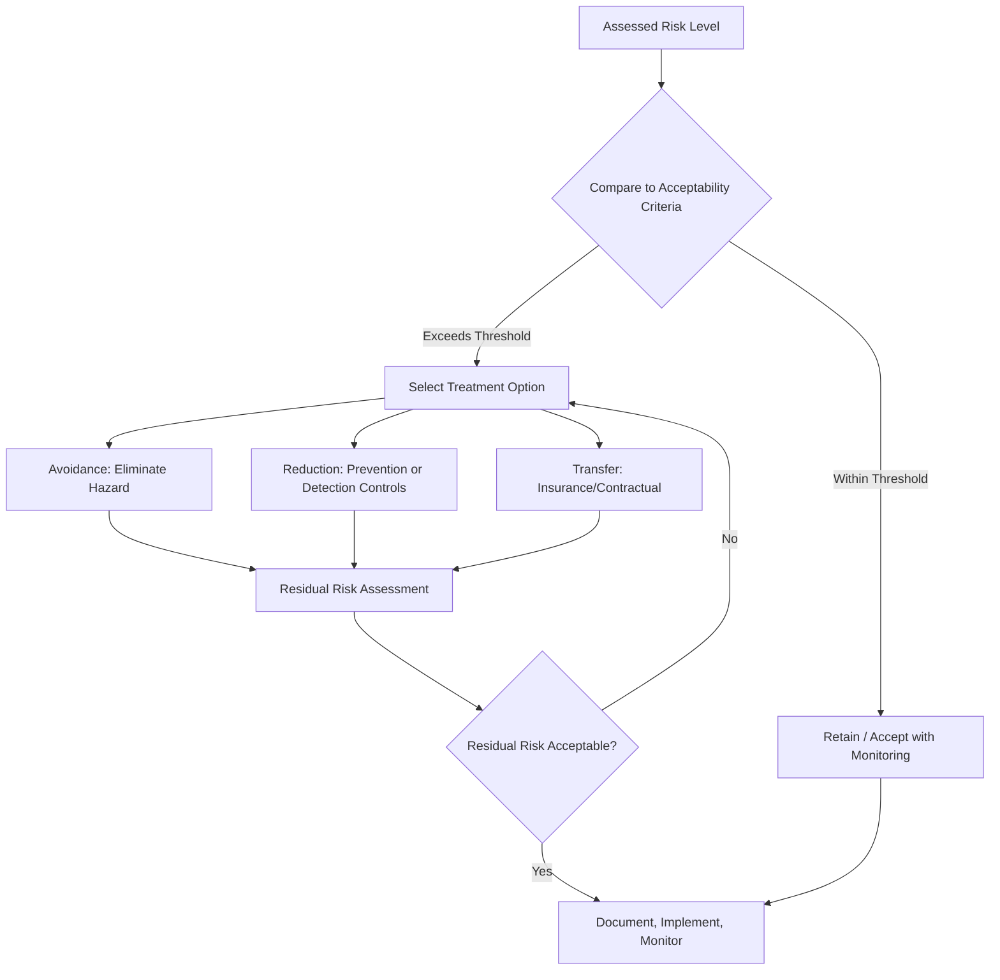

## Risk Treatment and Control

<syllabot_broad_topic/>

### Overview

Risk treatment and control encompasses the decisions and actions taken once a risk has been identified and assessed — determining how to respond to a given risk level and implementing the controls that reduce risk to an acceptable state. This chapter builds directly on the terminology (severity, occurrence, detection) and assessment techniques (FMEA, risk matrices) established earlier, focusing specifically on the treatment phase of the risk management cycle.

### The Risk Treatment Decision Framework

**Key Points**

- Risk treatment follows risk assessment in the ISO 31000 risk management process cycle: Identification → Analysis → Evaluation → **Treatment** → Monitoring/Review
- Treatment decisions are made by comparing assessed risk against predefined **risk acceptability criteria**; risk exceeding the acceptable threshold requires treatment, while risk within acceptable bounds may be retained with ongoing monitoring
- The four canonical risk treatment options (introduced in this chapter's terminology section) are: **avoidance**, **reduction/mitigation**, **transfer**, and **retention/acceptance**

### Risk Avoidance

**Key Points**

- Eliminates the hazard entirely by removing the source of risk, rather than managing its consequences
- In precision manufacturing/metrology contexts, common avoidance strategies include: design changes that eliminate a difficult-to-hold tolerance, substituting a process step known to introduce variability, or eliminating a measurement method with poor inherent capability in favor of an alternative technology
- Avoidance is typically the most effective but also often the most costly or design-disruptive treatment option, generally reserved for the highest-severity risks where reduction alone cannot bring risk to an acceptable level

### Risk Reduction: Prevention Controls

**Key Points**

- **Prevention controls** reduce the **occurrence** of a failure cause — addressing the root cause rather than catching the failure after it occurs
- Common prevention-oriented treatments:
  - **Poka-yoke (error-proofing)**: mechanical or procedural design that makes a specific error physically impossible or immediately obvious (e.g., asymmetric fixturing that prevents incorrect part orientation)
  - **Process capability improvement**: reducing inherent process variation through DOE-driven parameter optimization (Taguchi robust design methodology), tooling upgrades, or tighter process control
  - **Preventive maintenance programs**: scheduled equipment maintenance reducing failure modes caused by tool wear, fixture degradation, or equipment drift
  - **Standardized work instructions and training**: reducing occurrence of human-error-driven failure causes

### Risk Reduction: Detection Controls

**Key Points**

- **Detection controls** do not reduce the probability a failure occurs, but reduce the probability that the failure reaches the customer or causes harm undetected
- Common detection-oriented treatments, directly relevant to metrology:
  - **Increased inspection frequency**: moving from sampling to 100% inspection for a specific characteristic
  - **Improved measurement system capability**: upgrading equipment, reducing measurement uncertainty, or improving Gauge R&R performance to increase confidence in accept/reject decisions
  - **In-process/real-time monitoring**: shifting from post-process sampling to in-line SPC or automated in-process gauging, catching deviations earlier in the process
  - **Redundant/independent verification**: a second, independent measurement method or inspector for the highest-risk characteristics
- **Key distinction for risk scoring**: improving detection controls lowers the Detection (D) rating in FMEA and therefore lowers calculated RPN/AP, but does *not* reduce the underlying Occurrence — a detection-only treatment leaves the failure cause unaddressed, meaning defective parts are still produced, merely caught more reliably

### Risk Transfer

**Key Points**

- Shifts financial or operational consequence of a risk to another party without necessarily reducing the underlying probability or severity
- Manufacturing/supply chain examples: contractual liability clauses in Supplier Quality Agreements assigning cost responsibility for nonconformance to the supplier, product liability insurance, or warranty cost-sharing arrangements
- Risk transfer does not eliminate the hazard or reduce occurrence/severity at the technical level — it redistributes consequence, and is typically used as a complement to, not a substitute for, technical risk reduction

### Risk Retention (Acceptance)

**Key Points**

- A deliberate, documented decision to accept a risk within defined acceptability criteria without further treatment, typically because the cost/effort of further mitigation is disproportionate to the residual risk reduction achieved (the **ALARP** principle)
- Retention requires an explicit **risk owner** and formal sign-off, distinguishing intentional acceptance from simply neglecting to treat an identified risk
- Retained risks should remain in the risk register with defined monitoring triggers (e.g., if occurrence data trends upward, the retention decision should be revisited)

### Prioritizing Treatment Actions

**Key Points**

- Treatment resources are typically allocated using the same S/O/D-derived prioritization established in the risk assessment techniques discussion (RPN ranking, Action Priority categorization, or risk matrix positioning)
- **AIAG-VDA Action Priority (AP) framework** explicitly links priority category (High/Medium/Low) to expected organizational response: High priority typically mandates that the organization must identify an action to reduce risk or provide justification for why no action is needed, rather than allowing high-risk items to be silently accepted
- Treatment prioritization should favor **prevention over detection where feasible**: a prevention control that reduces occurrence provides a more fundamental risk reduction than a detection control that merely improves the odds of catching an already-occurring failure

### Residual Risk Evaluation

**Key Points**

- After treatment implementation, risk must be **re-assessed** to determine the residual risk level — treatment effectiveness cannot be assumed without verification
- Common failure mode in risk treatment: implementing an action and closing the risk item administratively without re-scoring Severity/Occurrence/Detection based on verified post-action data (e.g., re-running a Gauge R&R study after a measurement system upgrade to confirm the Detection rating improvement is real, not assumed)
- If residual risk remains above acceptability criteria after treatment, further treatment iterations are required — treatment is an iterative cycle, not necessarily a single action

### Control Plan Integration

**Key Points**

- The **Control Plan** is the primary document through which risk treatment decisions become operationalized in ongoing production: it specifies, for each characteristic, the prevention and detection methods, measurement technique, sample size, frequency, and reaction plan if nonconformance is detected
- Control plans should trace directly back to FMEA-identified risk: a characteristic with high assessed risk should show correspondingly rigorous control plan entries (tighter sampling, more capable measurement method, more detailed reaction plan) — providing the auditable link between risk assessment and actual shop-floor practice
- **Reaction plans** within the control plan specify what action is taken if a measurement result falls outside control limits or specification — itself a risk treatment mechanism operating in real time during production

### Monitoring and Review of Treated Risks

**Key Points**

- Risk treatment is not a one-time event; treated risks require ongoing monitoring to confirm sustained effectiveness (paralleling the corrective action effectiveness verification principle covered in supplier management)
- Triggers for risk treatment review include: process or design changes, new field failure/warranty data, audit findings, supplier changes, or scheduled periodic FMEA review cycles
- **Living FMEA** practice: treating the FMEA and its associated risk treatments as a continuously updated document throughout the product/process lifecycle rather than a static design-phase artifact

### Conclusion

Risk treatment and control translates risk assessment output into concrete organizational action, choosing among avoidance, prevention-based reduction, detection-based reduction, transfer, and retention based on assessed risk severity, occurrence likelihood, and treatment cost-effectiveness. For precision metrology, detection control improvement is a primary and frequently used treatment lever, but should be understood as addressing symptom visibility rather than root cause — sustainable risk reduction requires pairing measurement system improvements with genuine prevention-oriented process and design changes, with residual risk formally re-verified rather than assumed after any treatment action.

**Related Topics**

- FMEA methodology and Action Priority (AP) framework
- Control plan development and reaction plan design
- Poka-yoke and error-proofing techniques
- Measurement System Analysis (MSA) as a detection-control improvement lever
- ALARP (As Low As Reasonably Practicable) risk acceptance principle
- Corrective action effectiveness verification methods