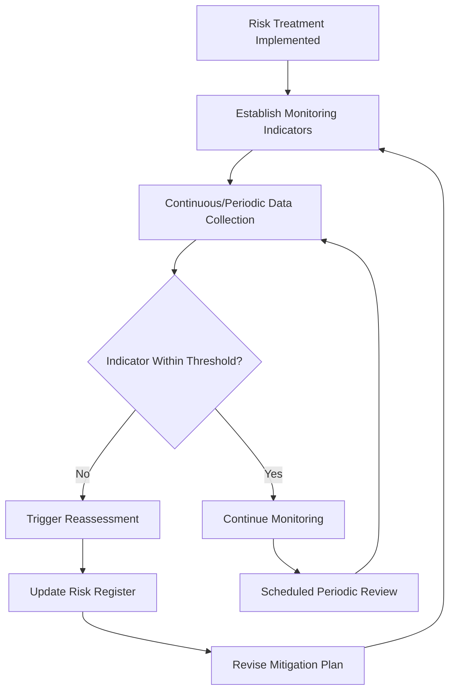

## Risk Monitoring and Mitigation Planning

### Overview

Risk monitoring and mitigation planning closes the risk management cycle, establishing the ongoing surveillance mechanisms and structured action plans needed to ensure treated risks remain controlled and emerging risks are detected promptly. This section builds directly on the risk treatment and control framework established previously, focusing specifically on the sustained, cyclical activities that follow initial treatment implementation.

### Distinguishing Monitoring from Assessment

**Key Points**

- **Risk assessment** (covered earlier in this chapter) is the analytical process of identifying and evaluating risk at a point in time
- **Risk monitoring** is the ongoing, continuous or periodic surveillance activity that tracks whether risk levels remain within acceptable bounds after treatment, and detects when reassessment is triggered
- The ISO 31000 risk management framework explicitly positions monitoring and review as a continuous activity running alongside every other risk management stage, not a discrete final step performed once

### Monitoring Indicators and Leading vs. Lagging Metrics

**Key Points**

- **Lagging indicators**: measure outcomes after a risk has already materialized (e.g., PPM defect rate, customer complaints, field failure rate) — valuable for validating whether treatment was effective, but inherently reactive
- **Leading indicators**: measure conditions that precede risk materialization, providing earlier warning (e.g., process capability trend, Gauge R&R degradation over time, calibration drift rate, tool wear trend approaching replacement threshold)
- Effective risk monitoring programs prioritize leading indicators wherever feasible, since they allow intervention before a failure mode actually produces nonconforming output — directly paralleling the prevention-over-detection principle from risk treatment

**Example**

For a risk treated through improved measurement system capability, appropriate monitoring indicators include: periodic re-verification of Gauge R&R performance (leading indicator, confirms detection capability is sustained), alongside tracking of actual escape rate to the customer (lagging indicator, confirms the treatment's ultimate effectiveness).

### Statistical Process Control as a Monitoring Mechanism

**Key Points**

- **Control charts** (Shewhart's foundational SPC tool) function as a primary real-time risk monitoring mechanism: special cause signals indicate a process has shifted out of its established statistical control state, representing an emerging risk requiring investigation before it produces nonconforming output
- **Western Electric Rules** (or equivalent run rules) provide standardized criteria for identifying non-random patterns in control chart data that warrant investigation even before a point exceeds control limits
- Trend monitoring on process capability indices ($C_{pk}$/$P_{pk}$) over time provides a rolling indicator of whether occurrence-related risk is stable, improving, or degrading

### Risk Register Maintenance

**Key Points**

- The **risk register**, introduced in this chapter's terminology, is the living document through which monitoring activity is formally tracked: each entry should specify the risk, its current assessed level, assigned risk owner, treatment status, monitoring indicators, and review frequency
- Effective risk register practice requires **defined review triggers**, not solely calendar-based review: process changes, new supplier introduction, engineering changes, audit findings, or customer complaints should each trigger risk register reassessment regardless of scheduled review timing
- Risk registers should distinguish between **inherent risk** (before treatment), **residual risk** (after treatment, as verified), and **target risk** (the acceptability threshold), allowing at-a-glance identification of risks where residual risk has not yet been confirmed to meet target

### Mitigation Planning Structure

**Key Points**

- A mitigation plan translates a selected risk treatment (from the avoidance/reduction/transfer/retention options) into a concrete, resourced, time-bound action plan
- Standard mitigation plan elements:
  - **Specific action description**: precisely what will be done (e.g., "upgrade CMM probe to reduce measurement uncertainty on bore diameter characteristic")
  - **Responsible owner**: a named individual accountable for execution, not a department or role alone
  - **Target completion date**: a defined deadline, supporting progress tracking
  - **Success criteria**: how effectiveness will be measured post-implementation (e.g., "Gauge R&R %GRR reduced from 22% to below 10%")
  - **Verification method and date**: how and when residual risk will be re-assessed to confirm the mitigation achieved its intended effect
- Mitigation plans should be prioritized using the same risk ranking mechanism (RPN, Action Priority, or risk matrix position) established during risk assessment, ensuring resource allocation follows risk magnitude

### Contingency Planning

**Key Points**

- Distinct from mitigation (which aims to reduce risk before it materializes), **contingency planning** defines the response if a risk event occurs despite treatment — a "what do we do if this happens anyway" plan
- Relevant contingency elements for metrology-related risk: defined containment actions if a measurement system is found out-of-calibration (e.g., retroactive review of parts measured since last known-good calibration), and defined escalation paths for suspected measurement system failure discovered mid-production
- Contingency plans reduce response time and inconsistency when a risk event does occur, complementing rather than replacing proactive mitigation

### Escalation and Governance

**Key Points**

- Monitoring programs require defined **escalation thresholds**: indicator values or trends that automatically trigger elevation to management review or quality council attention, rather than relying solely on individual judgment
- **Management Review** (ISO 9001 Clause 9.3) serves as a formal governance checkpoint where risk register status, mitigation plan progress, and monitoring indicator trends are reviewed at the leadership level, ensuring risk monitoring connects to the organizational accountability structures established in this chapter's leadership discussion
- Recurring risk items that repeatedly trigger reassessment despite prior mitigation efforts warrant escalation to a more fundamental review (potentially design change or process redesign) rather than repeated incremental mitigation cycles

### Integrating Monitoring with Existing Quality Systems

**Key Points**

- Risk monitoring is most effective when integrated with existing data systems rather than operated as a parallel, disconnected activity: SPC software, calibration management systems, and nonconformance tracking should feed risk register updates rather than requiring separate manual monitoring
- **Control plan linkage**: monitoring indicators for a given risk should align with the inspection frequency and method already specified in the control plan for that characteristic, ensuring monitoring data collection is embedded in standard production activity rather than requiring additional, redundant data collection effort

### Common Pitfalls in Monitoring and Mitigation Planning

**Key Points**

- **Mitigation without verification**: closing a mitigation action administratively upon completion of the action itself, without confirming through data that the intended risk reduction was actually achieved
- **Static risk registers**: risk registers that are updated only during scheduled periodic reviews rather than in response to triggering events, allowing emerging risk to go undetected between review cycles
- **Lagging-indicator-only monitoring**: relying solely on outcome metrics (defect rate, complaints) without leading indicators, meaning risk materialization is only detected after nonconforming output has already occurred
- **Ownerless mitigation actions**: assigning mitigation actions to a department or function rather than a named individual, diffusing accountability and increasing the likelihood actions stall without follow-through

### Conclusion

Risk monitoring and mitigation planning transforms risk treatment from a one-time decision into a sustained management discipline: monitoring indicators (particularly leading indicators such as SPC signals and measurement system capability trends) provide early warning of emerging risk, while structured mitigation plans with named ownership, success criteria, and verification dates ensure treatment actions are genuinely resourced and confirmed effective rather than administratively closed. For precision metrology, this closes the loop established throughout this chapter: measurement system capability is both a risk factor requiring monitoring and a primary tool used to monitor risk elsewhere in the quality system.

**Related Topics**

- Statistical Process Control (SPC) and Western Electric Rules for special cause detection
- Risk register design and review trigger definition
- ISO 9001 Clause 9.3 Management Review as risk governance
- Control plan linkage between risk assessment and inspection frequency
- Corrective action effectiveness verification methodology
- Living FMEA practice and periodic risk reassessment cycles