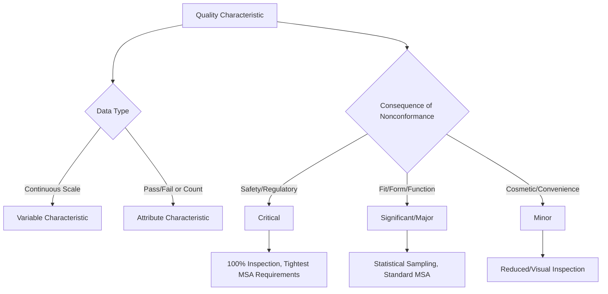

## Classification of Quality Characteristics

### Overview

Classification of quality characteristics establishes the systematic categorization frameworks used to prioritize which product and process attributes receive which level of design attention, control rigor, and measurement investment. This classification directly determines control plan structure, inspection frequency, and measurement system requirements — a characteristic's classification tier is typically the single strongest driver of how much metrology resource is allocated to verifying it.

### Fundamental Distinction: Variable vs. Attribute Characteristics

**Key Points**

- **Variable characteristics**: measured on a continuous numerical scale (e.g., diameter, length, hardness, surface roughness, force). Variable data carries more statistical information per data point and supports continuous SPC methods (X-bar/R charts, capability indices)
- **Attribute characteristics**: evaluated as conforming/nonconforming (pass/fail) or as a count of defects/defectives (e.g., presence of a required feature, visual surface defect, go/no-go gauge result). Attribute data requires larger sample sizes to achieve equivalent statistical confidence and uses different control chart types (p-charts, np-charts, c-charts, u-charts)
- This distinction directly determines applicable measurement equipment and statistical methodology: variable characteristics require calibrated measuring instruments capable of continuous output (micrometers, CMMs), while attribute characteristics may use simpler go/no-go gauging or visual/functional criteria

$$C_{pk}=\min\left(\frac{USL-\bar{x}}{3\sigma},\frac{\bar{x}-LSL}{3\sigma}\right)$$

*(Variable data capability index — not directly applicable to attribute data, which instead uses defect rate/DPMO-based capability measures.)*

### Criticality-Based Classification

**Key Points**

- **Critical characteristics**: directly affect safety, regulatory compliance, or fundamental product function; nonconformance can result in safety hazard, field failure, or regulatory non-compliance. Typically require the most rigorous control: tightest measurement system requirements, highest inspection frequency (often 100%), and formal risk assessment documentation (FMEA linkage)
- **Significant/Major characteristics**: affect fit, form, or function but without safety implications; nonconformance causes functional failure, customer dissatisfaction, or downstream assembly problems but not hazard. Moderate control rigor, often statistical sampling rather than 100% inspection
- **Minor characteristics**: affect appearance, convenience, or characteristics with minimal functional consequence (e.g., cosmetic surface finish on a non-visible surface). Lowest control rigor, often broader tolerance sampling or visual inspection only

### Industry-Standard Symbol Classification Systems

**Key Points**

- **Automotive (AIAG/customer-specific requirements)**: commonly uses special symbol designations on engineering drawings identifying critical and significant characteristics — often a flag or diamond symbol for critical characteristics requiring the most rigorous control plan entries, and a different symbol for significant characteristics; exact symbol conventions are customer/OEM-specific
- **Aerospace (AS9100/customer-specific)**: similarly designates **Key Characteristics (KCs)** or **Critical Items**, often requiring specific statistical process control and traceability beyond standard characteristics
- **Government/Defense**: **Critical Safety Items (CSIs)** designation under various defense procurement standards, requiring the most stringent configuration control, traceability, and inspection documentation
- [Inference: exact symbol conventions and terminology vary meaningfully by industry sector and specific customer requirements; engineers should consult the applicable drawing standard or customer-specific requirement document rather than assuming a universal symbol set]

### Functional Classification

**Key Points**

- **Form characteristics**: geometric shape and configuration (e.g., flatness, roundness, straightness) — governed by GD&T form tolerances per ASME Y14.5
- **Fit characteristics**: dimensional relationships governing how mating parts assemble (e.g., clearance/interference fit tolerances)
- **Function characteristics**: characteristics directly governing intended product performance (e.g., material hardness affecting wear resistance, electrical resistance affecting circuit performance)
- **Finish/Appearance characteristics**: surface texture, cosmetic appearance, coating characteristics — typically classified as minor unless functionally significant (e.g., surface roughness affecting seal performance would be reclassified as significant/functional)

### Design Characteristic Classification (Key Characteristics Methodology)

**Key Points**

- **Key Characteristics (KC)** methodology, prominent in aerospace, identifies characteristics whose variation has a significant, direct effect on final product performance, fit, or safety, distinguishing them from the broader set of dimensions on a drawing
- KC identification typically flows from a structured **Key Characteristics flow-down** process: system-level requirements → subsystem KCs → component KCs → process KCs, tracing customer/functional requirements down to specific measurable characteristics (methodologically related to the CTQ flow-down covered in the customer relations discussion)
- Characteristics not designated as KC are still required to meet drawing tolerance but do not receive the elevated statistical control, tighter measurement system requirements, or dedicated capability study attention applied to KCs

### Statistical Classification for Process Control Purposes

**Key Points**

- **Special characteristics**: a term used across various QMS standards (including historically in automotive quality systems) for characteristics requiring SPC monitoring and documented process capability evidence, roughly paralleling critical/significant classification but specifically tied to statistical control plan requirements
- **Standard characteristics**: all other dimensional/functional characteristics on a drawing, verified for conformance but without the elevated ongoing statistical monitoring requirement applied to special characteristics

### Classification's Direct Impact on Measurement System Requirements

**Key Points**

- Characteristic classification tier is the primary input determining required **measurement system capability**: critical/special characteristics typically require demonstrated %GRR below stricter thresholds (e.g., <10%) with formal Gauge R&R studies on file, while minor characteristics may tolerate looser measurement system performance or simpler go/no-go verification
- **Sampling plan rigor** scales directly with classification: critical characteristics commonly require 100% inspection or continuous SPC monitoring, while minor characteristics may use reduced statistical sampling (per ANSI/ASQ Z1.4 AQL-based plans) or periodic audit-level verification only
- **Calibration interval and instrument selection**: measurement equipment used on critical/special characteristics often warrants shorter calibration intervals and higher-resolution/lower-uncertainty instruments than equipment used solely for minor characteristic verification

### Classification and Control Plan Structure

**Key Points**

- The **control plan**, introduced in the risk treatment discussion, formally documents classification-driven control decisions: each characteristic's classification tier should map directly and traceably to its specified inspection method, sample size, frequency, and reaction plan
- Classification should be established during design (informed by FMEA severity ratings and functional analysis) and carried forward consistently through process design, control plan development, and ongoing production — inconsistent classification between design intent and shop-floor practice is a common audit finding

### Common Misclassification Pitfalls

**Key Points**

- **Over-classification**: designating excessive characteristics as critical/special without genuine functional or safety justification, diluting resource focus and inspection capacity away from genuinely high-risk characteristics
- **Under-classification**: failing to elevate a characteristic's classification despite field failure or complaint history indicating it warrants tighter control than originally assigned — classification should be a living designation subject to revision based on accumulating field/process data, not fixed permanently at initial design release
- **Classification without corresponding measurement system verification**: designating a characteristic critical without ensuring the measurement system actually assigned to verify it has documented, adequate Gauge R&R performance for that elevated classification tier

### Conclusion

Classification of quality characteristics provides the structural logic connecting design intent, risk assessment, and measurement resource allocation: critical and significant/special characteristics warrant the tightest measurement system capability, highest inspection frequency, and most rigorous statistical control, while minor characteristics justify proportionately lighter verification. For precision metrology, characteristic classification is the practical starting point for nearly every downstream decision — which instruments to specify, how frequently to calibrate them, what Gauge R&R threshold to require, and how large a sample to inspect — making accurate, consistently maintained classification a foundational prerequisite for efficient, risk-proportionate quality control.

**Related Topics**

- Key Characteristics (KC) flow-down methodology
- GD&T classification of form, fit, and function tolerances (ASME Y14.5)
- Control plan development and classification-driven inspection frequency
- Measurement System Analysis (MSA) threshold requirements by classification tier
- FMEA Severity ratings as classification input
- Acceptance sampling plans (ANSI/ASQ Z1.4) for attribute characteristics