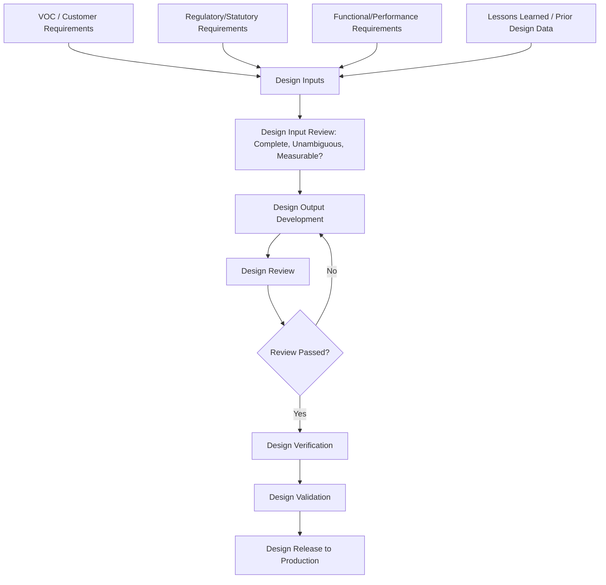

## Design Inputs and Design Review

### Overview

Design inputs and design review are the structured front-end activities of the product development process that translate requirements into verified design specifications before production commitment. For precision metrology, this stage determines what will need to be measured, to what tolerance, and establishes the earliest point at which measurement system feasibility should be evaluated — deferring this consideration to production ramp-up frequently results in costly late-stage discovery that a specified tolerance cannot be reliably measured or achieved.

### Design Inputs: Definition and Sources

**Key Points**

- **Design inputs** are the documented requirements that a design must satisfy, forming the baseline against which design outputs are later verified (per ISO 9001 Clause 8.3.3 and equivalent design control requirements)
- Primary sources of design input:
  - **Voice of the Customer (VOC)**, translated through QFD/House of Quality into specific engineering characteristics (as covered in the customer relations discussion)
  - **Regulatory and statutory requirements**: applicable safety, environmental, or industry-specific compliance standards
  - **Functional and performance requirements**: how the product must perform under specified operating conditions
  - **Interface requirements**: how the product must physically or functionally interact with mating components or systems
  - **Prior design/lessons-learned**: known issues, corrective actions, or field failure data from previous similar designs
  - **Applicable standards**: industry, company, or customer-specific design standards (materials, GD&T conventions, safety margins)

### Design Input Requirements per ISO 9001 / Design Control Standards

**Key Points**

- Documented design inputs must be sufficiently complete, unambiguous, and not in conflict with one another — conflicting or incomplete requirements identified at the input stage prevent costly downstream rework
- Design inputs should be **traceable**: each input should be identifiable back to its source (customer requirement, regulatory clause, standard reference), supporting later verification and validation traceability
- **Measurability as an implicit input quality criterion**: a design input specifying a characteristic that cannot be reliably measured with reasonably available measurement technology is an incomplete input — measurement feasibility should be considered during input review, not discovered during process validation

### Design Outputs and the Input-Output Relationship

**Key Points**

- **Design outputs** are the results of the design process — drawings, specifications, GD&T-toleranced models, material specifications, and manufacturing/inspection requirements — that must be verifiable against the design inputs
- Design outputs should provide sufficient information for procurement, production, and verification activities, including explicit or implicit acceptance criteria for each specified characteristic
- The input-output relationship is foundational to design verification: verification confirms design outputs meet design inputs, while separate **design validation** confirms the resulting product meets the actual user need (which may reveal gaps even when formal input-output verification passes, if the original inputs themselves were incompletely specified)

### Design Reviews: Purpose and Types

**Key Points**

- **Design reviews** are formal, structured, cross-functional evaluations conducted at defined project milestones to assess whether the design is progressing correctly and to identify issues before they propagate further into the development cycle
- Common design review milestones (terminology varies by industry/organization):
  - **Conceptual/Preliminary Design Review (PDR)**: evaluates early design concept against requirements before detailed design work begins
  - **Critical Design Review (CDR)**: evaluates detailed design maturity before release to production tooling/process development
  - **Production Readiness Review**: evaluates whether manufacturing and inspection processes are prepared to produce and verify the design at required volume and quality
- Design reviews are explicitly required activities under most formal design control frameworks (ISO 9001 Clause 8.3.4, APQP phases, AS9100 design control requirements)

### Design Review Participants and Cross-Functional Input

**Key Points**

- Effective design reviews require cross-functional participation extending beyond design engineering alone: manufacturing engineering, quality engineering, and **metrology/measurement specialists** should be explicit participants, not optional attendees
- Metrology participation in design review specifically evaluates:
  - **Measurability of specified tolerances**: whether existing or reasonably obtainable measurement equipment can verify the specified tolerance with adequate measurement system capability (sufficient Gauge R&R margin relative to tolerance width)
  - **Accessibility for measurement**: whether toleranced features are physically accessible for the intended measurement method (e.g., an internal feature requiring CMM probe access that the part geometry does not permit)
  - **GD&T datum scheme feasibility**: whether the specified datum reference frame can be practically established and repeated using available fixturing and measurement equipment

**Example**

A design review identifies a specified positional tolerance of 0.05mm on an internal bore feature accessible only through a small external opening. Metrology review flags that standard CMM touch-probe access is not feasible at that geometry, requiring either a design change (larger access opening), a tolerance revision informed by realistically achievable measurement capability, or investment in specialized measurement technology (e.g., a non-contact optical or CT-scanning method) before the design can proceed to release.

### Design Review Inputs and Documentation

**Key Points**

- Standard design review inputs typically include: current design outputs (drawings/models), FMEA status (linking to the risk assessment framework covered earlier in this curriculum), test/verification data available to date, open action items from prior reviews, and any identified risks or design changes since the previous review
- **Design Review Records**: formal documentation of review findings, action items, responsible owners, and target closure dates — required for audit traceability under most design control standards
- Unresolved critical action items should typically block progression to the next design phase (a "gate" review structure) rather than being carried forward indefinitely as open items

### Verification and Validation Distinction

**Key Points**

- **Design Verification**: confirms design outputs meet design inputs — "did we design it right?" — typically through analysis, inspection, testing, or demonstration against the documented input requirements
- **Design Validation**: confirms the resulting product meets the actual intended use and user needs under actual or simulated operating conditions — "did we design the right thing?" — validation can reveal gaps in the original input requirements themselves that verification alone (checking outputs against potentially incomplete inputs) would not catch
- Measurement system requirements differ between the two: verification typically relies on dimensional/functional measurement against drawing tolerances, while validation may require broader functional or field-representative testing beyond pure dimensional conformance

### Design Changes and Input Traceability

**Key Points**

- Engineering changes occurring after initial design input approval require **change impact assessment**, evaluating whether the change affects previously verified design inputs, requiring re-verification of affected characteristics
- Changes affecting measurement-critical characteristics (tolerance tightening, datum scheme changes, new critical/special characteristic designation) should trigger reassessment of measurement system capability, potentially requiring new Gauge R&R studies before production release under the revised design

### Common Design Input/Review Pitfalls

**Key Points**

- **Incomplete measurability consideration**: specifying tolerances based purely on functional requirement without confirming a reasonably available measurement method exists with adequate capability margin, discovered only during process validation or worse, in production
- **Design review as documentation formality**: conducting reviews as a scheduling/administrative checkpoint without genuine cross-functional technical scrutiny, particularly omitting metrology input on measurability and datum feasibility
- **Design inputs without traceability**: outputs that cannot be traced back to a specific documented input requirement, making later verification and change impact assessment difficult
- **Skipping validation when verification passes**: assuming design verification success (outputs match inputs) is sufficient, without validating that the original inputs correctly captured actual customer/functional need

### Conclusion

Design inputs and design review establish the requirements baseline and structured evaluation gates that determine whether a design is both functionally sound and practically manufacturable and measurable before production commitment. For precision metrology, early involvement in design review — specifically evaluating tolerance measurability, measurement access, and datum scheme feasibility — represents the most cost-effective point of intervention: measurement system limitations identified at the design review stage are dramatically less costly to resolve than those discovered after tooling and process design have been finalized.

**Related Topics**

- Advanced Product Quality Planning (APQP) phase structure
- Design Verification vs. Design Validation methodology
- GD&T datum reference frame feasibility and measurement access
- FMEA integration with design review milestones
- Engineering change control and measurement system re-verification triggers
- Measurement System Analysis (MSA) as a design review input