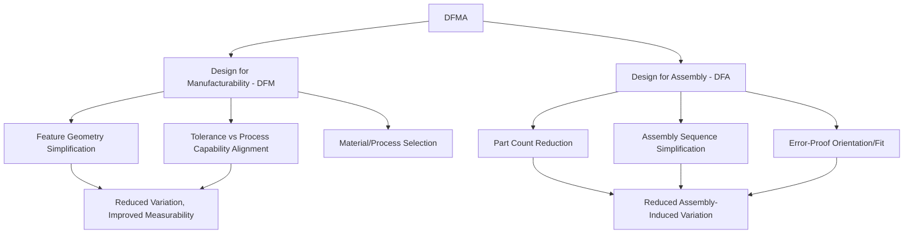

## Design for Manufacturability and Assembly

### Overview

Design for Manufacturability and Assembly (DFMA) is the structured design methodology that evaluates and optimizes a product design for ease, cost-effectiveness, and reliability of both fabrication (DFM) and assembly (DFA) processes. Building on design inputs and design review, DFMA represents where design intent is stress-tested against real production and measurement constraints — a stage where measurement system feasibility, tolerance stack-up, and process capability alignment are evaluated before tooling investment is committed.

### DFM vs. DFA: Distinguishing the Two Disciplines

**Key Points**

- **Design for Manufacturability (DFM)**: focuses on optimizing individual component design for efficient, capable, low-variation fabrication — material selection, feature geometry, tolerance specification relative to achievable process capability, and minimizing the number of manufacturing operations required
- **Design for Assembly (DFA)**: focuses on optimizing how multiple components fit and join together — minimizing part count, simplifying assembly sequence, ensuring unambiguous orientation, and reducing assembly-induced variation
- The two disciplines are frequently practiced together (DFMA) since component-level manufacturability decisions directly affect assembly-level outcomes, and vice versa

### Core DFM Principles

**Key Points**

- **Minimize the number of manufacturing operations**: each additional process step (machining pass, secondary operation, heat treatment) introduces an additional source of variation and an additional measurement/verification point
- **Design to standard tooling and process capability**: specifying features achievable with standard, well-characterized tooling and processes (rather than custom or exotic processes) leverages existing process capability data and avoids unproven capability assumptions
- **Avoid unnecessarily tight tolerances**: specifying tolerances tighter than functionally required increases both manufacturing cost (requiring more capable, often more expensive processes) and measurement burden (requiring more capable, often more expensive measurement systems to verify with adequate Gauge R&R margin)
- **Design features for measurement accessibility**: as introduced in the design review discussion, features should be geometrically accessible to standard measurement methods (CMM probe access, optical line-of-sight, gauge accessibility) without requiring specialized or custom measurement solutions

### Tolerance Allocation and Process Capability Alignment

**Key Points**

- DFM tolerance allocation should be informed by **known or estimated process capability** ($C_{pk}$/$P_{pk}$) of the intended manufacturing process, rather than specified purely from functional requirement without regard to what the process can reliably achieve
- **Tolerance stack-up analysis**: evaluating how individual component tolerances combine (through worst-case or statistical/RSS methods) to affect final assembly fit and function, preventing scenarios where individually-conforming components combine to produce a nonconforming assembly

$$T_{assembly,RSS}=\sqrt{T_1^2+T_2^2+\cdots+T_n^2}$$

*(Root-Sum-Square statistical tolerance stack-up, generally yielding tighter — more realistic — assembly tolerance predictions than worst-case summation, contingent on component tolerances being approximately normally distributed and processes being statistically independent.)*

- Where a tolerance cannot be achieved within standard process capability, DFM review should trigger either a design change (relaxing the functional requirement, redesigning the feature) or a documented decision to invest in higher-capability process/measurement technology, made consciously at the design stage rather than discovered during production ramp-up

### Core DFA Principles

**Key Points**

- **Part count reduction**: combining multiple components into a single part (where feasible via casting, molding, or additive manufacturing) eliminates assembly operations, assembly-induced variation, and the corresponding in-process measurement/verification points for that joint
- **Standardization**: using common fasteners, common component families, and standardized interfaces across a product line reduces process variation and simplifies measurement system requirements (fewer unique gauge/fixture configurations required)
- **Poka-yoke (error-proofing) by design**: geometric features that physically prevent incorrect assembly orientation (asymmetric features, keying) reduce assembly error occurrence, directly supporting the prevention-control principles covered in risk treatment
- **Minimize assembly directions/reorientations**: designs assembled predominantly from a single direction (top-down assembly) reduce fixturing complexity and assembly-induced positional variation compared to designs requiring multiple reorientations

### DFMA and Measurement System Design

**Key Points**

- DFMA decisions directly shape the eventual **measurement and inspection strategy**: a design with accessible, standardized features supports efficient, capable measurement using standard equipment; a design with poor DFM/DFA discipline (excessive tight tolerances, poor measurement access, complex assembly-dependent characteristics) forces reliance on custom fixturing, specialized measurement technology, or reduced measurement confidence
- **Design for Inspection (DFI)**, sometimes treated as a related sub-discipline, explicitly considers measurement/inspection ease as a first-class design criterion alongside manufacturability and assembly — evaluating datum accessibility, feature accessibility for chosen measurement method, and minimizing the number of setups required to verify all critical characteristics
- Characteristics requiring measurement across an assembly interface (rather than on a single component) are inherently harder to verify and control than single-component characteristics — DFA part-count reduction indirectly simplifies measurement scope by reducing the number of assembly-dependent characteristics requiring verification

### Structured DFMA Methodologies

**Key Points**

- **Boothroyd-Dewhurst DFMA methodology**: a widely referenced structured, quantitative approach assigning handling and insertion time/cost estimates to assembly operations, enabling systematic comparison of design alternatives on assembly efficiency
- **Design for Six Sigma (DFSS)**: integrates DFMA principles within the broader Six Sigma framework, explicitly incorporating statistical tolerance analysis, robust design (Taguchi methodology), and process capability alignment into the design process using structured phases (commonly DMADV: Define, Measure, Analyze, Design, Verify)

### Cross-Functional DFMA Review

**Key Points**

- Effective DFMA review, like the design review process covered previously, requires cross-functional participation: manufacturing engineering (process capability input), quality/metrology engineering (measurability and measurement system capability input), and procurement (material/component availability input) alongside design engineering
- DFMA review should explicitly evaluate whether each critical/significant characteristic (per the classification framework established earlier) has a clearly identified, feasible measurement method with adequate expected capability before design release — deferring this evaluation to process validation risks discovering infeasibility after tooling investment

### Common DFMA Pitfalls

**Key Points**

- **DFM without DFA integration**: optimizing individual component manufacturability without considering how component-level tolerance choices propagate through assembly stack-up, potentially producing individually excellent but poorly assembling components
- **Ignoring measurement feasibility until process validation**: treating DFMA as purely a manufacturing/assembly cost exercise without explicit measurement accessibility and capability review, repeating the late-discovery problem DFMA is intended to prevent
- **Over-reliance on worst-case tolerance stack-up**: applying overly conservative worst-case tolerance stack-up analysis without considering statistical (RSS) methods where appropriate, potentially driving unnecessarily tight, costly-to-measure component tolerances beyond genuine functional need
- **Treating DFMA as a one-time gate**: conducting DFMA review only once early in development without revisiting it as the design matures through subsequent design reviews and engineering changes

### Conclusion

Design for Manufacturability and Assembly systematically evaluates design decisions against real fabrication and assembly process constraints before production commitment, directly shaping the tolerance allocation, feature accessibility, and part-count structure that ultimately determine measurement system requirements. For precision metrology, DFMA review represents a critical upstream checkpoint: characteristics designed with process capability and measurement accessibility in mind require proportionately less specialized measurement investment and achieve more reliable, statistically sound conformance verification than characteristics whose manufacturability and measurability were not explicitly considered during design.

**Related Topics**

- Tolerance stack-up analysis: worst-case vs. statistical (RSS) methods
- Design for Inspection (DFI) and measurement accessibility criteria
- Process capability indices ($C_{pk}$/$P_{pk}$) as tolerance allocation input
- Design for Six Sigma (DFSS) and DMADV methodology
- Poka-yoke and error-proofing in assembly design
- Classification of quality characteristics and DFMA prioritization