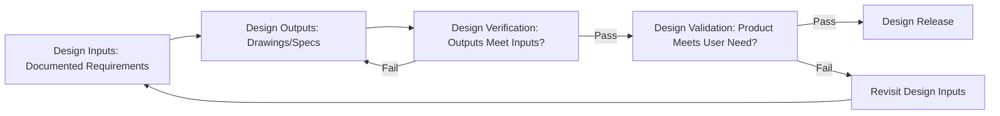

## Design Verification and Validation

### Overview

Design Verification and Validation (V&V) are the formal, complementary activities that confirm a design meets its documented requirements and satisfies the actual intended use before production release. Building on the design inputs, design review, and DFMA foundations established earlier in this chapter, V&V represents the evidentiary confirmation stage where measurement data provides the objective proof that design intent has been correctly translated into a producible, functional product.

### Verification vs. Validation: The Core Distinction

**Key Points**

- **Design Verification** answers: **"Did we design it right?"** — confirms that design outputs (drawings, specifications, models) meet the documented design inputs (requirements established at the input stage)
- **Design Validation** answers: **"Did we design the right thing?"** — confirms that the resulting product satisfies the actual user need and intended use, under actual or simulated operating conditions
- This distinction matters because verification alone cannot catch errors in the original input requirements themselves: a product can pass every verification check against its specifications while still failing to satisfy the genuine customer need if the specifications were incorrectly derived from VOC in the first place

### Verification Methods

**Key Points**

- **Inspection**: direct measurement or examination of the design output against specified requirements — the primary method through which precision metrology contributes to verification, confirming dimensional, geometric, and material characteristics conform to specification
- **Analysis**: mathematical, statistical, or simulation-based confirmation (e.g., tolerance stack-up analysis, finite element analysis, thermal modeling) used where physical measurement of every requirement is impractical or where predictive confirmation is needed before physical parts exist
- **Demonstration**: functional operation of the product or system to confirm qualitative requirements are met (e.g., demonstrating an assembly operation can be performed as intended)
- **Test**: controlled application of specified conditions to determine whether quantitative performance requirements are met (e.g., load testing, environmental testing, life-cycle testing)
- Verification method selection should match the nature of the requirement: dimensional/geometric requirements are typically verified through inspection (measurement), while performance-under-condition requirements typically require test

### Verification and Measurement System Requirements

**Key Points**

- Verification inspection activities require the same measurement system rigor established elsewhere in this curriculum: adequate Gauge R&R capability relative to the tolerance being verified, calibration traceability, and appropriate sample size given the characteristic's classification tier (critical/significant/minor)
- **First Article Inspection (FAI)**, introduced in the supplier management discussion, functions as a formal verification activity at the production-representative stage — comprehensive dimensional verification of initial parts against the complete drawing/specification, providing the evidentiary basis that the design output (as actually produced) meets design input requirements
- Verification data should be traceable to the specific requirement it satisfies, typically through a **Verification Cross-Reference Matrix (VCRM)** or equivalent traceability record linking each design input requirement to the specific verification method, data, and result confirming it was met

### Validation Methods

**Key Points**

- **Field/actual-use validation**: evaluating product performance under genuine end-use conditions, providing the highest-fidelity validation evidence but often the most costly and slowest to obtain
- **Simulated-use validation**: controlled testing that replicates actual use conditions in a laboratory or test environment when field validation is impractical before production release (common where field validation would require unacceptable risk or timeline)
- **Customer/user trials**: structured evaluation involving actual end users or customer representatives assessing whether the product satisfies their functional need, often incorporating direct VOC-style feedback collection
- Validation should occur on production-representative units wherever feasible — validating using prototype or non-representative units risks validating a different product than what will actually be manufactured and shipped

### Verification and Validation Planning

**Key Points**

- A formal **V&V Plan**, typically developed during the design input/design review stage rather than after design completion, specifies for each requirement: the verification and/or validation method to be used, acceptance criteria, required sample size, and responsible function
- Planning V&V activities early allows measurement system capability gaps to be identified and addressed (per the DFMA and design review discussion) before they become schedule-critical blockers late in the development cycle
- **Traceability matrices** linking requirements to verification/validation methods and results support both internal design control compliance and external audit/regulatory review

### Statistical Considerations in Verification and Validation

**Key Points**

- Verification sample sizes should be statistically justified relative to the characteristic's classification tier and required confidence level, rather than arbitrarily selected — critical characteristics typically warrant larger verification sample sizes or formal confidence/reliability statistical methods (e.g., demonstrating a specific reliability level at a specific confidence level through defined sample size and test duration)
- **Process capability studies** ($C_{pk}$/$P_{pk}$) conducted during verification provide statistical evidence that the manufacturing process, not merely a small verification sample, can sustainably produce conforming output — distinguishing "these specific parts conform" from "this process reliably produces conforming parts"
- Validation activities involving statistical performance claims (reliability, life expectancy) require appropriately designed sample sizes and test durations to support the statistical confidence being claimed, avoiding overgeneralization from insufficient data

### Design Changes and Re-Verification/Re-Validation

**Key Points**

- Engineering changes occurring after initial V&V completion require **change impact assessment** to determine which previously verified/validated requirements are affected and require re-confirmation, paralleling the change control principle established in the design inputs discussion
- Changes affecting critical/significant characteristics (per classification) or affecting the measurement method/system used for prior verification typically warrant re-verification even for seemingly minor design changes, since measurement system capability assumptions from the original verification may no longer hold

### Documentation and Records

**Key Points**

- V&V records constitute primary objective evidence for design control compliance under ISO 9001 Clause 8.3.4/8.3.5 and equivalent standards (AS9100, IATF 16949 design control requirements)
- Required documentation typically includes: verification/validation plans, raw measurement/test data, pass/fail determination against defined acceptance criteria, and formal sign-off by responsible personnel
- Records should be retained per applicable regulatory/contractual retention requirements, supporting traceability for future field issues, audits, or design changes referencing the original V&V basis

### Common V&V Pitfalls

**Key Points**

- **Verification without validation**: assuming that passing verification (outputs match documented inputs) is sufficient confirmation, without separately validating that the inputs themselves correctly captured genuine user need — particularly risky where design inputs were incompletely or ambiguously derived from VOC
- **Validating non-representative units**: conducting validation on prototype, hand-built, or otherwise non-production-representative units, then assuming the conclusions transfer directly to full production output without re-confirmation
- **Inadequate measurement system capability for verification claims**: making verification pass/fail determinations using measurement systems without adequately demonstrated Gauge R&R capability relative to the tolerance being verified, undermining the statistical validity of the verification conclusion
- **Treating V&V as a single late-stage gate**: deferring all verification and validation activity to the end of development rather than integrating it progressively through design reviews, risking late discovery of fundamental design issues when correction is most costly

### Conclusion

Design verification confirms a design's outputs correctly satisfy its documented inputs, while design validation confirms the resulting product genuinely satisfies the actual user need — two distinct, complementary confirmations that together provide the evidentiary basis for design release. For precision metrology, verification activities in particular depend directly on demonstrated measurement system capability: a verification conclusion is only as statistically trustworthy as the measurement system generating the underlying data, reinforcing the recurring theme across this curriculum that measurement system capability (Gauge R&R, calibration traceability, appropriate sample sizing) underlies the validity of nearly every downstream quality determination.

**Related Topics**

- First Article Inspection (FAI) as a formal verification activity
- Verification Cross-Reference Matrix (VCRM) and requirements traceability
- Process capability studies ($C_{pk}$/$P_{pk}$) as verification evidence
- Measurement System Analysis (MSA) as a prerequisite for valid verification conclusions
- Design change impact assessment and re-verification triggers
- ISO 9001 Clause 8.3.4/8.3.5 design verification and validation requirements