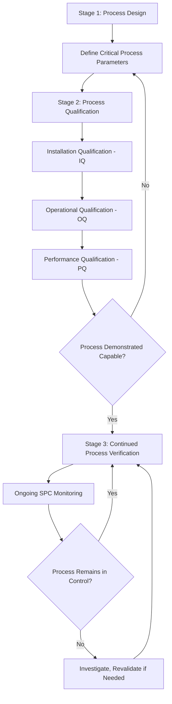

## Process Validation

### Overview

Process validation is the formal, documented confirmation that a manufacturing process consistently produces output meeting predetermined requirements, establishing objective evidence that a process is capable — not merely that a sample of output happened to conform. Distinct from design verification and validation covered previously, process validation focuses specifically on the manufacturing process itself, providing the statistical foundation for the reduced-inspection strategies referenced throughout this curriculum's supplier management and risk-based thinking discussions.

### Process Validation vs. Design Verification/Validation

**Key Points**

- **Design V&V** (previous section) confirms the *design* meets requirements and user need; **process validation** confirms the *manufacturing process*, as actually implemented with production tooling, equipment, and personnel, can consistently produce conforming output at required volume
- A design can pass full verification and validation using prototype or pilot-run parts while the eventual production process — with its own tooling variation, cycle time pressures, and operator variability — has not yet been demonstrated capable of sustained conformance; process validation closes this gap
- Process validation is typically a **production readiness** gate, distinct from and sequenced after design release

### The Three-Stage Process Validation Framework

**Key Points**

- Widely referenced framework (notably formalized in FDA process validation guidance for regulated industries, but broadly applicable across precision manufacturing):
  - **Stage 1 — Process Design**: establishing the commercial manufacturing process based on knowledge gained through development and scale-up activities, defining critical process parameters and their acceptable ranges
  - **Stage 2 — Process Qualification**: confirming the process is capable of reproducible commercial manufacturing, typically comprising **Installation Qualification (IQ)**, **Operational Qualification (OQ)**, and **Performance Qualification (PQ)**
  - **Stage 3 — Continued Process Verification**: ongoing monitoring during routine production to ensure the process remains in a state of control over time

### Installation Qualification (IQ)

**Key Points**

- Verifies equipment and tooling are installed correctly, according to specification, in the intended production environment
- Confirms: correct equipment/tooling received and installed per manufacturer/design specification, utilities and environmental conditions meet requirements, and all documentation (manuals, calibration certificates for associated measurement equipment) is in place
- IQ for metrology equipment specifically confirms measurement instruments are correctly installed, environmentally appropriate (e.g., temperature-controlled CMM room), and have current, traceable calibration before qualification proceeds further

### Operational Qualification (OQ)

**Key Points**

- Verifies equipment operates correctly across its intended operating range, typically testing the equipment/process at the boundaries of specified operating parameters, not merely at nominal conditions
- Confirms the process performs as intended when operated at its specified parameter ranges (e.g., a machining process demonstrated capable across its full specified feed rate and speed range, not solely at a single nominal setting)
- Measurement systems used to verify OQ outcomes must themselves have demonstrated adequate capability (Gauge R&R) for the characteristics being evaluated — an OQ conclusion is only as reliable as the measurement system generating the underlying data

### Performance Qualification (PQ)

**Key Points**

- Confirms the process, operating under normal production conditions with production personnel, produces output consistently meeting specification over a statistically meaningful production run
- PQ typically requires collection of data across multiple production lots/runs (not a single run) to demonstrate the process is robust to normal production variation (shift changes, material lot variation, routine tool changes) rather than merely capable under a single, potentially optimized, qualification run
- **Process capability study** ($C_{pk}$/$P_{pk}$ calculation) is a standard PQ deliverable, providing quantitative statistical evidence of sustained process capability rather than pass/fail conformance of the specific qualification sample alone

$$P_{pk}=\min\left(\frac{USL-\bar{x}}{3s},\frac{\bar{x}-LSL}{3s}\right)$$

*(Process Performance index, using overall/long-term standard deviation $s$ across the full qualification run — appropriate for PQ, which specifically aims to capture normal production variation over time, distinct from the within-subgroup variation used in short-term $C_{pk}$ capability estimates.)*

### Automotive/Manufacturing-Specific Process Validation: PPAP Context

**Key Points**

- The **Production Part Approval Process (PPAP)**, introduced in the supplier management discussion, functions as the automotive industry's structured process validation framework, requiring documented evidence including process flow diagrams, Process FMEA, control plans, MSA results, dimensional results, and process capability studies before production part approval
- **Significant Production Run (SPR)**: PPAP typically requires evidence from a defined production run at production rate, using production tooling, equipment, and personnel — directly analogous to the PQ concept, ensuring validation reflects genuine production conditions rather than an idealized pilot build

### Measurement System Analysis as a Process Validation Prerequisite

**Key Points**

- Process validation conclusions are only as trustworthy as the measurement systems used to generate the underlying conformance data — a process validation study relying on a measurement system with poor Gauge R&R cannot reliably distinguish genuine process capability from measurement noise
- Best practice sequences **MSA before process capability studies**: confirming the measurement system itself is adequately capable (commonly %GRR below defined thresholds relative to the tolerance) before that measurement system's data is used to calculate and report process capability indices as part of validation evidence
- Where measurement system capability is inadequate relative to the tolerance being validated, apparent process capability results may be artificially inflated or deflated by measurement system variation rather than reflecting true process variation — a critical distinction process validation reviewers must account for

### Statistical Basis for Process Validation Sample Sizing

**Key Points**

- Process validation sample sizes and run duration should be statistically justified relative to the confidence level required and the characteristic's classification tier (critical/significant/minor, per the classification framework established earlier), rather than arbitrarily selected
- Validation studies for critical/special characteristics typically require larger sample sizes, longer qualification run duration, or formal statistical confidence/reliability demonstration compared to minor characteristics
- Validation should span sources of normal production variation (multiple shifts, multiple material lots, routine tool changes) to avoid overstating process capability based on an artificially controlled or unrepresentative qualification window

### Revalidation Triggers

**Key Points**

- Process validation is not permanently valid; defined triggers should require revalidation, including: significant process changes (equipment, tooling, material source), extended production shutdowns, sustained process capability decline observed during Stage 3 continued monitoring, or customer/regulatory requirement changes
- Revalidation scope should be risk-based (per the risk-based thinking framework established earlier in this curriculum) — proportionate to the significance of the change and the classification tier of affected characteristics, rather than requiring full re-validation for every minor change regardless of actual risk

### Continued Process Verification (Stage 3)

**Key Points**

- Ongoing SPC monitoring (control charts, capability index trending) during routine production provides continuous evidence the process remains in the validated state of control, rather than treating validation as a one-time historical event
- Sustained special-cause signals or capability decline during continued monitoring should trigger investigation and, if warranted, revalidation — directly connecting process validation to the risk monitoring and mitigation planning principles established earlier in this curriculum

### Common Process Validation Pitfalls

**Key Points**

- **Validating with an unrepresentative run**: conducting PQ using hand-selected, optimally-run conditions rather than genuine normal production variability, producing an overly optimistic capability conclusion that does not hold under actual sustained production
- **Skipping MSA before capability studies**: reporting process capability indices without first confirming adequate measurement system capability, risking capability conclusions confounded by measurement system variation
- **Treating validation as permanent**: failing to define and act on revalidation triggers, allowing a process to drift from its validated state without formal reassessment
- **IQ/OQ/PQ conflation**: skipping directly to PQ-style production-condition testing without first confirming installation and operational qualification, risking process validation conclusions built on an improperly installed or operationally uncharacterized foundation

### Conclusion

Process validation provides the statistical, documented evidence that a manufacturing process — as actually implemented with production tooling, personnel, and normal operating variation — reliably produces conforming output, extending beyond the design-level confirmation provided by design verification and validation. For precision metrology, process validation depends critically on measurement system capability sequenced correctly (MSA before capability study) and sample sizing/duration sufficient to capture genuine production variation, making it the practical convergence point where design intent, process capability, and measurement system reliability are jointly and statistically confirmed before full production release.

**Related Topics**

- Production Part Approval Process (PPAP) and Significant Production Run evidence
- Measurement System Analysis (MSA) as a prerequisite for valid capability studies
- Process capability indices: short-term $C_{pk}$ vs. long-term $P_{pk}$
- Statistical Process Control (SPC) for continued process verification
- Classification of quality characteristics and validation rigor scaling
- Revalidation triggers and change impact assessment