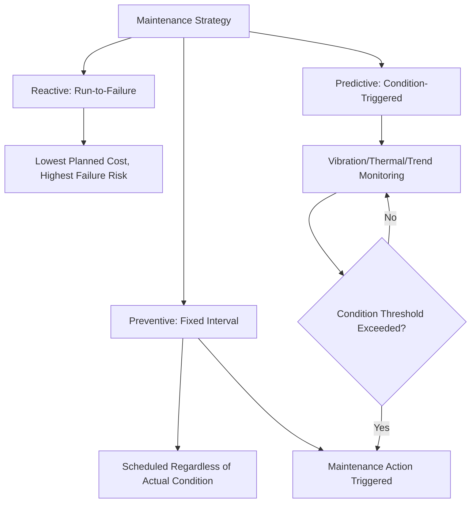

## Predictive and Preventive Maintenance Planning

### Overview

Predictive and preventive maintenance planning establishes the structured programs that sustain equipment reliability and process capability over the operational lifecycle — directly determining whether the process capability and measurement system performance validated earlier (per the process validation discussion) remains representative of actual ongoing production. For precision metrology specifically, maintenance planning applies equally to production equipment and to measurement/inspection equipment itself, since undetected drift in either can silently undermine conformance decisions.

### Maintenance Strategy Classification

**Key Points**

- **Reactive (Run-to-Failure) Maintenance**: equipment is repaired only after failure occurs; lowest planned maintenance cost but highest risk of unplanned downtime, quality escapes, and consequential damage
- **Preventive Maintenance (PM)**: scheduled maintenance performed at fixed time or usage intervals (e.g., calendar-based or cycle-count-based), regardless of the equipment's actual current condition, intended to prevent failure before it occurs
- **Predictive Maintenance (PdM)**: maintenance triggered by monitored equipment condition data (vibration analysis, thermal imaging, oil analysis, measurement drift trending) rather than fixed schedules, aiming to intervene just before failure based on actual degradation evidence
- **Condition-Based Maintenance (CBM)**: closely related to predictive maintenance, using real-time or periodic condition monitoring to trigger maintenance action based on defined threshold criteria rather than calendar intervals

### Preventive Maintenance Program Design

**Key Points**

- Preventive maintenance intervals should be established based on equipment manufacturer recommendations, historical failure data (mean time between failures, MTBF), and criticality of the equipment to quality/production outcomes
- **PM task lists** typically specify: inspection/lubrication/replacement tasks, required frequency, responsible personnel, and acceptance criteria for each task
- Risk-based thinking (established earlier in this curriculum's risk management chapter) should inform PM interval determination: equipment supporting critical/special characteristics (per the classification framework) warrants tighter PM intervals and more rigorous task scope than equipment supporting only minor characteristics

### Predictive Maintenance Technologies

**Key Points**

- **Vibration analysis**: detects bearing wear, misalignment, or imbalance in rotating equipment before failure, using accelerometers and frequency-domain analysis to identify characteristic failure signatures
- **Thermal imaging (infrared thermography)**: identifies abnormal heat signatures indicating friction, electrical resistance issues, or lubrication failure before catastrophic failure occurs
- **Oil/lubricant analysis**: detects wear metal particulates, contamination, or lubricant degradation indicating internal component wear
- **Ultrasonic analysis**: detects high-frequency sound patterns associated with early-stage bearing wear, leaks, or electrical discharge not yet audible or detectable through other means
- **Statistical trending of process/measurement output**: for precision equipment, gradual drift in dimensional output or measurement calibration results over successive checks can itself serve as a predictive indicator of impending equipment degradation, directly linking PdM to SPC principles established earlier in this curriculum

### Maintenance Planning for Metrology Equipment Specifically

**Key Points**

- Measurement equipment (CMMs, optical comparators, force gauges, surface roughness testers) requires its own maintenance program distinct from, but coordinated with, production equipment maintenance — equipment drift affects measurement system capability (%GRR) even when the underlying production process remains stable
- **Calibration** functions as a scheduled preventive/verification activity specifically for measurement equipment, confirming instrument accuracy against traceable reference standards at defined intervals
- **Calibration interval determination** should itself follow risk-based and, where sufficient historical data exists, predictive principles: instruments with a history of remaining well within tolerance across successive calibrations may justify interval extension, while instruments showing trending drift or frequent out-of-tolerance (OOT) findings warrant interval reduction
- **Out-of-Tolerance (OOT) investigation**: when a measurement instrument is found out of calibration tolerance, a defined process should assess the potential impact on conformance decisions made using that instrument since its last known-good calibration — a maintenance/calibration failure with direct quality risk implications requiring retroactive review, not merely a routine recalibration event

### Total Productive Maintenance (TPM)

**Key Points**

- A broader organizational maintenance philosophy, originating from Japanese manufacturing practice (closely associated with the Toyota Production System lineage referenced in the quality management thought evolution earlier in this curriculum), extending maintenance responsibility beyond a dedicated maintenance department to include operator-level involvement
- **Autonomous Maintenance**: operators perform basic maintenance tasks (cleaning, inspection, lubrication, minor adjustment) on equipment they operate daily, improving early detection of abnormal conditions through operator familiarity with normal equipment behavior
- **Overall Equipment Effectiveness (OEE)**: a composite metric combining Availability, Performance, and Quality, commonly used within TPM programs to quantify the combined impact of equipment downtime, speed loss, and quality loss on overall productive capacity

$$OEE=Availability\times Performance\times Quality$$

### Maintenance Planning and Risk Prioritization

**Key Points**

- Maintenance resource allocation should follow the same risk-proportionate logic established in this curriculum's risk management chapter: equipment supporting critical/special characteristics warrants more rigorous PdM investment and tighter PM intervals than equipment supporting minor, low-consequence characteristics
- **Criticality analysis** (sometimes formalized through equipment FMEA) identifies which equipment failure modes carry the highest severity/occurrence risk to quality outcomes, directing predictive monitoring investment toward the highest-risk equipment rather than distributing monitoring resources uniformly

### Maintenance Data Integration with Quality Systems

**Key Points**

- Maintenance history, calibration records, and process capability/SPC data are most effective when integrated rather than maintained as disconnected systems — a sudden process capability decline detected through SPC monitoring should prompt review of associated equipment maintenance/calibration history as a potential root cause, and vice versa
- **Computerized Maintenance Management Systems (CMMS)** provide the typical technical infrastructure for tracking PM schedules, work order history, and equipment condition data, ideally with connectivity to quality data systems for cross-referencing during root cause investigations

### Common Maintenance Planning Pitfalls

**Key Points**

- **Fixed-interval PM without condition consideration**: applying rigid calendar-based maintenance intervals uniformly regardless of actual equipment usage intensity or condition, potentially over-maintaining low-usage equipment while under-maintaining high-usage equipment
- **Measurement equipment maintenance treated as lower priority than production equipment**: given the direct link between measurement system capability and conformance decision validity, underinvesting in metrology equipment maintenance/calibration relative to production equipment maintenance creates disproportionate quality risk
- **No retroactive OOT impact assessment**: recalibrating an out-of-tolerance measurement instrument without assessing potential impact on prior conformance decisions made using that instrument, missing potential undetected nonconformances already shipped
- **PdM technology adoption without integration**: implementing vibration analysis, thermal imaging, or other predictive technologies without integrating resulting data into a defined action-triggering process, generating data without corresponding maintenance action

### Conclusion

Predictive and preventive maintenance planning sustains the equipment reliability and measurement system capability that process validation confirms at a point in time, extending that confidence across the equipment's ongoing operational life through scheduled preventive tasks and condition-triggered predictive intervention. For precision metrology specifically, maintenance planning must explicitly encompass measurement equipment alongside production equipment, since calibration and instrument condition monitoring function as a specialized, risk-critical branch of the broader maintenance discipline — undetected measurement equipment degradation silently undermines the validity of every conformance decision made using that equipment until detected.

**Related Topics**

- Calibration interval determination and Out-of-Tolerance (OOT) investigation
- Total Productive Maintenance (TPM) and Autonomous Maintenance
- Overall Equipment Effectiveness (OEE) as a composite maintenance metric
- Statistical Process Control (SPC) trending as a predictive maintenance indicator
- Equipment criticality analysis and risk-based maintenance prioritization
- Computerized Maintenance Management Systems (CMMS) integration with quality data