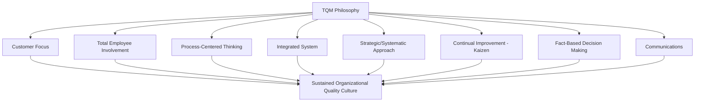

## TQM Philosophy and Principles

### Overview

Total Quality Management (TQM) is the organizational management philosophy that synthesizes the contributions of the quality pioneers covered earlier in this curriculum — Deming, Juran, Crosby, Feigenbaum, and Ishikawa — into an integrated, company-wide approach to sustained quality improvement. Rather than a single tool or technique, TQM is a cultural and structural orientation that treats quality as the responsibility of every function and every employee, providing the philosophical foundation from which Six Sigma, Lean, and modern continuous improvement methodologies subsequently developed.

### Historical Synthesis

**Key Points**

- TQM formalized during the 1980s as Western industry sought to understand and replicate the quality successes of postwar Japanese manufacturing, itself built on Deming and Juran's earlier teachings to Japanese industry in the 1950s
- Feigenbaum's **Total Quality Control (TQC)** concept — quality as a company-wide responsibility rather than an inspection department's sole function — is widely regarded as the direct conceptual precursor to TQM
- TQM does not originate from a single codified source or standard in the way ISO 9001 or Six Sigma's DMAIC does; it represents an evolved, broadly shared philosophy drawing on multiple pioneers' frameworks, which is why TQM's specific "principles" are described somewhat variably across different reference sources [Inference: because TQM lacks a single authoritative codifying body or standard, principle lists vary in number and exact wording between different quality management texts and certifying bodies]

### Core TQM Principles

**Key Points**

- **Customer Focus**: quality is ultimately defined by the customer, echoing Juran's "fitness for use" definition; all quality efforts trace back to satisfying customer requirements, whether external customers or internal process customers (Deming's systems view)
- **Total Employee Involvement**: quality is every employee's responsibility, not confined to a dedicated quality department — directly reflecting Ishikawa's Quality Circles philosophy and Feigenbaum's company-wide accountability model
- **Process-Centered Thinking**: quality outcomes result from process performance; improving the process, not merely inspecting output, is the sustainable path to quality improvement, reflecting Shewhart and Deming's foundational SPC-era insight
- **Integrated System**: quality management should function as a coherent, interconnected system linking business processes, not a collection of isolated departmental initiatives — echoing Deming's insistence on breaking down barriers between departments
- **Strategic and Systematic Approach**: quality planning is integrated into strategic business planning, not treated as a separate, tactical afterthought
- **Continual Improvement**: reflecting the Japanese concept of **kaizen**, quality is pursued as an ongoing journey rather than a fixed destination or one-time achievement
- **Fact-Based Decision Making**: decisions are grounded in data and statistical analysis rather than opinion or assumption, directly inheriting Shewhart's statistical control philosophy
- **Communications**: effective, transparent communication across all organizational levels sustains the cultural and operational elements of TQM, particularly Deming's emphasis on driving out fear so that quality-relevant information flows freely

### TQM's Relationship to Its Foundational Pioneers

**Key Points**

- TQM does not replace the individual philosophies of Deming, Juran, Crosby, Feigenbaum, Ishikawa, and Taguchi (covered earlier in this curriculum); it integrates their complementary emphases into a unified organizational framework:
  - Deming's systems thinking and statistical rigor provide TQM's process-centered and fact-based foundations
  - Juran's Quality Trilogy provides TQM's structured planning/control/improvement cycle
  - Crosby's Zero Defects and Cost of Quality reinforce TQM's prevention-oriented, economically justified improvement focus
  - Ishikawa's Quality Circles provide the practical mechanism for total employee involvement
  - Feigenbaum's TQC provides the direct organizational precursor and company-wide accountability concept

### PDCA/PDSA as the TQM Operational Engine

**Key Points**

- The **Plan-Do-Check-Act (PDCA)** cycle (originating from Shewhart, popularized by Deming, who preferred **Plan-Do-Study-Act, PDSA**) functions as TQM's core operational improvement mechanism, providing the structured, repeatable cycle through which continual improvement is executed
- **Plan**: identify an improvement opportunity and plan a change, grounded in data analysis
- **Do**: implement the change on a small, controlled scale
- **Check/Study**: analyze results against the predicted outcome, using statistical methods consistent with fact-based decision making
- **Act**: standardize the change if successful, or adjust and repeat the cycle if results did not meet expectations

### TQM and Employee Empowerment Structures

**Key Points**

- **Quality Circles**: small, voluntary employee groups (Ishikawa's contribution) that identify and solve workplace quality problems using basic statistical tools, operationalizing total employee involvement at the shop-floor level
- **Cross-functional teams**: structured collaboration across departmental boundaries to address quality issues spanning multiple functions, directly countering the silo barriers identified in this curriculum's barriers-to-improvement discussion
- **Employee suggestion systems**: formal mechanisms capturing frontline improvement ideas, reflecting the principle that those closest to a process often have the most direct insight into its improvement opportunities

### TQM's Relationship to Metrology Practice

**Key Points**

- **Fact-based decision making** directly elevates the role of measurement data: TQM's philosophical commitment to data-driven decisions is only as trustworthy as the measurement systems generating that data, reinforcing the recurring theme throughout this curriculum that measurement system capability (Gauge R&R, calibration traceability) underlies the validity of quality decisions
- **Process-centered thinking** shifts metrology's role from purely end-of-line conformance verification toward in-process monitoring (SPC) that informs real-time process understanding, consistent with the shift from inspection-era to statistical-control-era quality management covered in the evolution of quality management thought
- **Total employee involvement** implies measurement literacy should extend beyond dedicated quality/metrology personnel to production operators — supporting the training program design principles covered earlier in this curriculum, where basic measurement and SPC data collection competency is distributed rather than centralized

### TQM Implementation Challenges

**Key Points**

- TQM implementation historically faced criticism for being difficult to sustain: broad, cultural philosophies without specific, structured methodologies (unlike Six Sigma's defined DMAIC framework) can struggle to maintain momentum and demonstrate measurable ROI, contributing to the eventual rise of more structured frameworks like Six Sigma and Lean Six Sigma
- Common implementation barriers directly parallel the barriers to quality improvement covered earlier in this curriculum: lack of sustained leadership commitment, fear-based culture undermining total employee involvement, and short-term financial pressure conflicting with continual improvement's longer-term orientation

### TQM's Legacy in Modern Quality Frameworks

**Key Points**

- **ISO 9001**, in its structure and requirements (customer focus, process approach, continual improvement, evidence-based decision making, leadership engagement), reflects substantial direct inheritance from TQM principles, formalized into an auditable, certifiable management system standard
- **Six Sigma and Lean Six Sigma** retained TQM's fact-based, process-centered, and customer-focused orientation while adding more prescriptive, statistically rigorous methodology (DMAIC) and stronger financial/ROI framing, addressing some of TQM's historical sustainability criticisms
- Contemporary quality management largely operates as a practical synthesis: TQM's cultural and philosophical principles combined with more structured methodological frameworks (Six Sigma, Lean) for executing specific improvement initiatives

### Conclusion

TQM represents the philosophical and cultural synthesis of the individual quality pioneers' contributions into an integrated, company-wide management approach centered on customer focus, total employee involvement, process-centered fact-based decision making, and continual improvement. While later frameworks like Six Sigma introduced more structured, prescriptive methodology, TQM's core principles remain embedded in modern quality management practice, including ISO 9001's structure — and its commitment to fact-based decision making remains directly dependent on the measurement system capability and data trustworthiness that precision metrology exists to provide.

**Related Topics**

- Plan-Do-Check-Act (PDCA) / Plan-Do-Study-Act (PDSA) cycle methodology
- Quality Circles and cross-functional team structures
- ISO 9001's inheritance of TQM principles
- Six Sigma DMAIC as a structured evolution of TQM methodology
- Barriers to quality improvement and TQM implementation challenges
- Fact-based decision making and measurement system trustworthiness