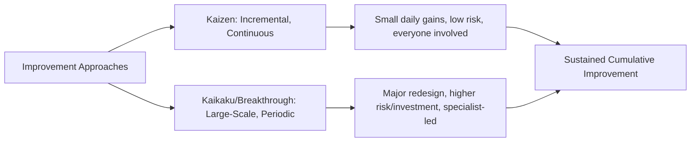

## Kaizen and Continuous Improvement Culture

### Overview

Kaizen (Japanese: 改善, "change for better" or commonly translated "continuous improvement") is both a specific structured improvement methodology and a broader organizational culture that treats incremental, ongoing improvement as an embedded daily practice rather than a periodic initiative. Building directly on TQM's continual improvement principle covered previously, kaizen provides the practical, ground-level mechanism through which TQM philosophy translates into sustained day-to-day behavior across an organization, including within precision metrology functions themselves.

### Kaizen Philosophy: Incremental vs. Breakthrough Improvement

**Key Points**

- Kaizen philosophy emphasizes **small, incremental, continuous improvements** made by everyone, every day, as distinct from large-scale, infrequent breakthrough innovations driven by specialists or major capital investment
- This contrasts with, but does not replace, breakthrough/innovation-driven improvement (e.g., major process redesign, new technology adoption) — mature improvement cultures typically employ both: kaizen for continuous incremental gains and periodic breakthrough initiatives for step-change improvement
- Masaaki Imai's formalization of kaizen (notably in *Kaizen: The Key to Japan's Competitive Success*, 1986) popularized the concept internationally, framing it as a comprehensive philosophy encompassing all improvement activities — not a narrow technique — spanning management, processes, and individual behavior

### The Kaizen Cycle and PDCA Integration

**Key Points**

- Kaizen operationalizes through the same **PDCA (Plan-Do-Check-Act)** cycle established in TQM's discussion, applied at a small, frequent, localized scale rather than large infrequent projects
- A typical kaizen event structure: identify a specific, bounded improvement opportunity → implement a small test change → measure the result → standardize if successful or adjust and retry if not — directly mirroring Shewhart/Deming's PDSA cycle but applied with kaizen's characteristic frequency and incrementalism

### Kaizen Events (Kaizen Blitz)

**Key Points**

- A **Kaizen Event** (also called Kaizen Blitz) is a focused, time-bounded (typically 3-5 day) cross-functional workshop concentrating intensive improvement effort on a specific, well-defined process or problem area
- Standard kaizen event structure: current-state process mapping, root cause analysis, brainstorming and rapid testing of countermeasures, implementation of improvements, and standardization of the new process, typically culminating in a report-out to leadership
- Distinguished from routine daily kaizen activity by its concentrated, structured, cross-functional format — kaizen events supplement rather than replace ongoing daily continuous improvement behavior

### Kaizen and Employee Engagement Structures

**Key Points**

- **Suggestion systems**: formal mechanisms for capturing frontline employee improvement ideas, historically a core kaizen practice in Japanese manufacturing (notably associated with Toyota's employee suggestion program), reflecting the principle that those performing a task daily often identify improvement opportunities specialists might miss
- **Gemba-centered improvement**: kaizen activity is grounded in the "gemba" (the real place — the shop floor, the inspection station, wherever value-adding work actually occurs), consistent with the Gemba walk leadership practice introduced earlier in this curriculum
- **5S methodology**: a foundational kaizen workplace organization practice — Sort (Seiri), Set in Order (Seiton), Shine (Seiso), Standardize (Seiketsu), Sustain (Shitsuke) — creating the organized, visually manageable workplace conditions that support sustained continuous improvement and, relevant to metrology, reduce measurement error caused by disorganized or poorly maintained inspection areas

### Standardization as a Prerequisite for Kaizen

**Key Points**

- A core kaizen principle: improvement must be built upon a **standardized baseline** — without a documented, consistently followed standard process, it is impossible to reliably identify whether a change constitutes genuine improvement or merely uncontrolled variation
- This directly reinforces the SPC principle (Shewhart) that a process must first be brought into and held in statistical control before meaningful improvement or capability assessment can occur — kaizen and SPC share this foundational logic despite differing in operational scale and frequency
- **Standard Work**: documented, current best-known method for performing a task, serving simultaneously as a training reference, a baseline for identifying deviation, and the platform from which the next kaizen improvement cycle begins

### Kaizen Culture vs. Kaizen Events: Sustaining the Difference

**Key Points**

- A genuine **kaizen culture** embeds continuous improvement as routine daily behavior at every organizational level, distinct from an organization that conducts periodic kaizen events but does not sustain improvement behavior between them
- Cultural indicators of genuine kaizen adoption: employees routinely identify and implement small improvements without requiring formal event sponsorship, leadership visibly participates in and resources improvement suggestions (echoing Deming's insistence on visible management commitment), and improvement metrics are tracked and reviewed as routine management practice rather than only during dedicated events
- Organizations that treat kaizen exclusively as periodic scheduled events, without sustaining daily improvement behavior between them, risk the same "initiative fatigue" barrier identified earlier in this curriculum's barriers-to-quality-improvement discussion

### Kaizen's Relationship to Lean and Toyota Production System

**Key Points**

- Kaizen is a foundational pillar of the **Toyota Production System (TPS)** and the broader Lean manufacturing philosophy that developed from it, alongside other TPS elements such as just-in-time production and jidoka (automation with a human touch/built-in quality)
- Lean's waste elimination focus (the seven/eight wastes — overproduction, waiting, transport, over-processing, inventory, motion, defects, and sometimes unused talent) provides kaizen activity with specific, structured categories of improvement opportunity to target
- Lean Six Sigma's integration of kaizen-style continuous, incremental improvement with Six Sigma's structured DMAIC statistical rigor reflects the broader pattern (established in TQM's discussion) of TQM-era cultural philosophy combining with more statistically structured modern methodology

### Kaizen Applied to Metrology Functions

**Key Points**

- Kaizen principles apply directly within metrology/inspection operations themselves, not solely to production processes: incremental improvements to measurement setup time, fixture design, inspection sequence, or data recording workflow are legitimate, valuable kaizen targets
- **Standardized inspection work**: applying standard work principles to measurement procedures (consistent probing sequence, consistent fixturing approach, documented technique) reduces measurement variation attributable to procedural inconsistency — a direct contributor to improved Gauge R&R reproducibility
- Measurement data itself frequently serves as the objective evidence supporting kaizen event outcomes: before/after capability studies, cycle time measurements, and defect rate tracking provide the fact-based confirmation (per TQM's fact-based decision-making principle) that a kaizen change constituted genuine improvement rather than assumed benefit

### Common Kaizen Implementation Pitfalls

**Key Points**

- **Event-only kaizen without cultural sustainment**: conducting periodic kaizen blitz events without embedding daily improvement behavior, resulting in temporary gains that erode once event momentum fades
- **Improvement without standardization**: implementing changes without first establishing (or subsequently documenting) a standardized baseline, making it difficult to distinguish genuine improvement from uncontrolled process drift
- **Kaizen without measurement verification**: treating a kaizen change as successful based on qualitative impression rather than objective before/after measurement data, undermining the fact-based decision-making principle central to sustainable improvement culture
- **Top-down-only kaizen**: restricting improvement activity to management-initiated events without genuine frontline employee suggestion and ownership, contradicting kaizen's foundational total-employee-involvement premise

### Conclusion

Kaizen translates TQM's continual improvement principle into a concrete, daily organizational practice grounded in small incremental changes, employee-driven suggestion, standardized baselines, and PDCA-cycle discipline. For precision metrology, kaizen principles apply both to how metrology supports improvement elsewhere in the organization (providing the objective before/after measurement data that validates genuine improvement) and to how metrology functions themselves continuously improve their own measurement processes, standardized work, and workplace organization — reinforcing that sustainable quality improvement culture depends on trustworthy, consistently applied measurement at every level of the organization.

**Related Topics**

- Plan-Do-Check-Act (PDCA) cycle and kaizen event structure
- 5S workplace organization methodology
- Toyota Production System and Lean waste elimination (the seven/eight wastes)
- Standard Work documentation and its role in improvement baselining
- Gemba-centered leadership and improvement practices
- Lean Six Sigma integration of kaizen and DMAIC methodology