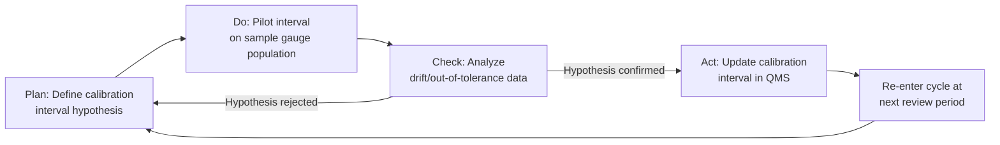

## PDCA Cycle

### Overview

The Plan-Do-Check-Act (PDCA) cycle, also known as the Deming Cycle or Shewhart Cycle, is an iterative four-stage management method used for the control and continuous improvement of processes and products. In precision metrology and quality control contexts, PDCA provides the structural framework within which measurement systems, calibration programs, and inspection protocols are continuously refined based on data-driven feedback.

**Key Points**

- Originated from Walter Shewhart's work at Bell Labs in the 1930s; popularized by W. Edwards Deming in post-war Japan
- Forms the operational backbone of ISO 9001, IATF 16949, and most quality management system (QMS) standards
- In metrology, PDCA governs measurement system analysis (MSA) improvement, calibration interval optimization, and nonconformance resolution
- Cyclical, not linear — each iteration should feed into the next (also called PDSA when "Check" is replaced by "Study")

### The Four Phases

#### Plan

Identify a problem or improvement opportunity, define objectives, and establish the process changes needed to achieve them.

In a metrology context, planning typically involves:

- Defining the measurement problem (e.g., excessive Gauge R&R variation, drift in calibration standards, out-of-tolerance trend)
- Establishing measurable objectives, such as reducing repeatability variance by a target percentage
- Selecting appropriate statistical tools: control charts, Pareto analysis, fishbone (Ishikawa) diagrams, or measurement system analysis
- Defining the scope: which gauges, which characteristics, which work instructions are affected
- Setting success criteria in advance, for example a target $C_{pk} \geq 1.33$

#### Do

Implement the planned change on a small scale or in a controlled pilot environment to limit risk before full deployment.

- Execute the change in a single cell, single gauge, or single shift rather than across the entire facility
- Collect data under the new condition using the same measurement protocol as the baseline, to ensure comparability
- Document deviations from plan as they occur (e.g., environmental conditions, operator substitutions)
- Preserve raw data traceability — every measurement should be attributable to instrument, operator, and timestamp

#### Check

Analyze the results of the pilot against the objectives set in the Plan phase. This is the statistical validation step.

- Compare pre- and post-change process capability indices ($C_p$, $C_{pk}$, $P_p$, $P_{pk}$)
- Apply hypothesis testing (e.g., F-test for variance reduction, paired t-test for mean shift) to confirm the change produced a statistically significant effect rather than random variation
- Re-run or extend the Gauge R&R study if the change affects the measurement system itself
- Check for unintended consequences — a change that improves repeatability might worsen reproducibility across operators

#### Act

Standardize the change if successful, or revise the plan and re-enter the cycle if not.

- If successful: update the control plan, work instructions, and calibration procedures; retrain affected personnel; update the FMEA (Failure Mode and Effects Analysis) risk scores
- If unsuccessful: return to Plan with the new data as input — this is what makes PDCA a cycle rather than a one-time project
- Institutionalize via document control: revise SOPs, update inspection frequency tables, or adjust calibration intervals in the calibration management system

### Diagram: The PDCA Cycle (svg_diagram)

<svg xmlns="http://www.w3.org/2000/svg" viewBox="0 0 480 480">
<title>PDCA Cycle (svg_diagram)</title>
<circle cx="240" cy="240" r="150" fill="none" stroke="#999" stroke-width="1" stroke-dasharray="4,4" />

<path d="M 240 70 A 170 170 0 0 1 410 240" fill="none" stroke="#2b6cb0" stroke-width="26" marker-end="url(#arrow)" />
<text x="345" y="130" font-size="18" font-weight="bold" fill="#1a365d" text-anchor="middle">PLAN</text>

<path d="M 410 240 A 170 170 0 0 1 240 410" fill="none" stroke="#2f855a" stroke-width="26" marker-end="url(#arrow)" />
<text x="345" y="355" font-size="18" font-weight="bold" fill="#1c4532" text-anchor="middle">DO</text>

<path d="M 240 410 A 170 170 0 0 1 70 240" fill="none" stroke="#c05621" stroke-width="26" marker-end="url(#arrow)" />
<text x="135" y="355" font-size="18" font-weight="bold" fill="#652b19" text-anchor="middle">CHECK</text>

<path d="M 70 240 A 170 170 0 0 1 240 70" fill="none" stroke="#805ad5" stroke-width="26" marker-end="url(#arrow)" />
<text x="135" y="130" font-size="18" font-weight="bold" fill="#44337a" text-anchor="middle">ACT</text>

<text x="240" y="245" font-size="16" fill="#333" text-anchor="middle">Continuous</text>

<text x="240" y="265" font-size="16" fill="#333" text-anchor="middle">Improvement</text>

</svg>

### Application to Measurement System Analysis

A common PDCA application in a metrology lab is resolving excessive Gauge R&R (%GRR) on a critical dimension.

**Example**

- **Plan**: Baseline %GRR is measured at 28% (above the 10% acceptance threshold per AIAG MSA guidelines). Root cause hypothesis via fishbone analysis: operator technique variation on a manual micrometer.
- **Do**: Pilot a revised work instruction with a fixed fixture and standardized clamping torque, tested with 3 operators × 10 parts × 3 trials.
- **Check**: Recompute %GRR. Reproducibility component (operator-to-operator variance) drops from 18% to 4%; overall %GRR falls to 9%, now within acceptable limits. Confirm via ANOVA that the operator×part interaction term is no longer significant.
- **Act**: Update the controlled work instruction, mandate the fixture as standard tooling, retrain all operators, and schedule a follow-up %GRR audit in 6 months to confirm the gain holds — closing the loop into the next PDCA iteration.

### PDCA vs. Related Frameworks

| Framework | Origin | Primary Use | Relation to PDCA |
| --- | --- | --- | --- |
| PDSA (Plan-Do-Study-Act) | Deming's later refinement | Emphasizes learning over verification | "Study" replaces "Check" to stress hypothesis-driven learning |
| DMAIC | Six Sigma | Structured problem-solving with statistical rigor | More granular; DMAIC's five phases map roughly onto Plan (Define, Measure, Analyze) and Do/Check/Act (Improve, Control) |
| 8D | Automotive/Ford | Formal corrective action for nonconformances | Often run as a single "Check→Act" cycle within a larger PDCA program |
| A3 Problem Solving | Toyota | One-page visual PDCA documentation | A3 report format is essentially PDCA on a single sheet |

### Common Pitfalls in Metrology Applications

- Skipping the Check phase's statistical rigor — relying on visual trend inspection instead of formal significance testing, leading to false confidence in a change
- Failing to control confounding variables during "Do" (e.g., changing both fixture and operator simultaneously, making root cause attribution impossible)
- Treating PDCA as a one-time project rather than re-entering the cycle after Act — calibration intervals and control limits should be periodically re-validated, not fixed permanently
- Under-sampling during the pilot phase, producing a Check-phase conclusion that lacks statistical power [Inference: pilot sample sizes below n=30 per condition commonly produce underpowered tests for the moderate effect sizes typical of process improvements in this domain]

### Mermaid: PDCA Integration with Calibration Management

**Related Topics**

- Statistical Process Control (SPC) and control chart interpretation
- Gauge Repeatability and Reproducibility (Gauge R&R) studies
- Process capability analysis ($C_p$, $C_{pk}$, $P_p$, $P_{pk}$)
- DMAIC methodology and Six Sigma tool integration
- Calibration interval analysis (e.g., S2 method, reliability-based interval adjustment)
- 8D problem solving and root cause analysis
- ISO 9001 and IATF 16949 continual improvement clauses
- A3 problem-solving reports