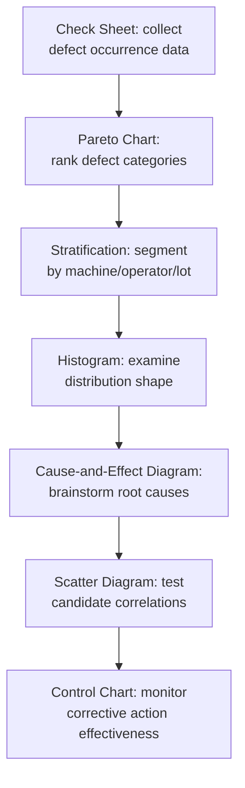

## Seven Basic Quality Control Tools

### Overview

The Seven Basic Quality Control Tools (also called the "Seven QC Tools" or "Old Seven Tools") are a standardized set of graphical and statistical techniques popularized by Kaoru Ishikawa for analyzing and solving quality problems. They were deliberately chosen to be simple enough for shop-floor workers with minimal statistical training to use, while remaining powerful enough to resolve the vast majority (some estimates cite roughly 95%) of quality issues encountered in manufacturing and metrology environments. They form the analytical toolkit most commonly deployed within PDCA cycles and quality circles.

**Key Points**

- All seven tools are non-parametric or graphical — no advanced statistical training required to apply them
- Widely taught as the core toolkit in Six Sigma Green Belt and ISO 9001 internal auditor training
- Distinct from the "Seven New QC Tools" (affinity diagrams, relations diagrams, tree diagrams, matrix diagrams, prioritization matrices, process decision program charts, activity network diagrams), which address management and planning problems rather than numerical process data
- In precision metrology, these tools are the primary means of interpreting measurement data, tracking gauge performance, and driving root cause investigations for out-of-tolerance conditions

### 1. Check Sheet

A structured, pre-formatted form used to collect and tally data in real time at the point of occurrence.

- Purpose: convert raw observation into structured, countable data with minimal transcription error
- Metrology application: tallying types of nonconformance found during incoming inspection (e.g., dimension out of tolerance, surface finish defect, missing feature) by shift or by gauge
- Design principle: categories should be mutually exclusive and defined before data collection begins, to avoid ambiguous tallying

**Example**

| Defect Type | Shift 1 | Shift 2 | Shift 3 | Total |
| --- | --- | --- | --- | --- |
| Diameter OOT | |||| | ||| | || | 9 |
| Surface finish | || | | | |||| | 7 |
| Missing chamfer | | | — | | | 2 |

### 2. Histogram

A bar chart showing the frequency distribution of a continuous measured variable, used to visualize process spread, centering, and shape relative to specification limits.

- Reveals whether a process distribution is normal, skewed, bimodal (suggesting two intermixed populations, e.g., two operators or two machines), or truncated (suggesting 100% sorting/inspection is already occurring)
- Bin width selection commonly follows Sturges' rule: $k = 1 + 3.322 \log_{10}(n)$, where $k$ is the number of bins and $n$ is the sample size
- In metrology, histograms of repeated measurements on a single part reveal measurement system resolution and repeatability limitations distinct from true part-to-part variation

### 3. Pareto Chart

A bar chart of defect categories ranked in descending frequency, overlaid with a cumulative percentage line, based on the Pareto principle that roughly 80% of effects come from 20% of causes.

- Used to prioritize which defect category or root cause to address first for maximum impact
- Distinguishes the "vital few" from the "trivial many"

**Diagram: Pareto Chart Structure (svg_diagram)**

<svg xmlns="http://www.w3.org/2000/svg" viewBox="0 0 500 300">
<title>Pareto Chart Structure (svg_diagram)</title>
<line x1="50" y1="20" x2="50" y2="250" stroke="#333" stroke-width="2" />
<line x1="50" y1="250" x2="470" y2="250" stroke="#333" stroke-width="2" />
<text x="20" y="140" font-size="12" fill="#333" transform="rotate(-90 20 140)" text-anchor="middle">Frequency</text>
<text x="480" y="140" font-size="12" fill="#333" transform="rotate(90 480 140)" text-anchor="middle">Cumulative %</text>
<rect x="65" y="60" width="60" height="190" fill="#2b6cb0" />
<rect x="140" y="110" width="60" height="140" fill="#2b6cb0" />
<rect x="215" y="160" width="60" height="90" fill="#2b6cb0" />
<rect x="290" y="200" width="60" height="50" fill="#2b6cb0" />
<rect x="365" y="230" width="60" height="20" fill="#2b6cb0" />

<text x="95" y="265" font-size="10" text-anchor="middle">Diam.</text>

<text x="170" y="265" font-size="10" text-anchor="middle">Surf.</text>

<text x="245" y="265" font-size="10" text-anchor="middle">Chamf.</text>

<text x="320" y="265" font-size="10" text-anchor="middle">Thread</text>

<text x="395" y="265" font-size="10" text-anchor="middle">Other</text>

<polyline points="95,60 170,90 245,110 320,120 395,125" fill="none" stroke="#c05621" stroke-width="2" />
<circle cx="95" cy="60" r="3" fill="#c05621" />
<circle cx="170" cy="90" r="3" fill="#c05621" />
<circle cx="245" cy="110" r="3" fill="#c05621" />
<circle cx="320" cy="120" r="3" fill="#c05621" />
<circle cx="395" cy="125" r="3" fill="#c05621" />
</svg>

### 4. Cause-and-Effect Diagram (Ishikawa / Fishbone)

A structured diagram organizing potential root causes of a defect into major categories branching off a central "spine" pointing to the effect (the defect itself).

- Standard manufacturing categories (the 6M's): Man, Machine, Method, Material, Measurement, Mother Nature (Environment)
- Used in facilitated brainstorming sessions, often as the analysis step immediately following Pareto prioritization
- Frequently paired with the **5 Whys** technique to drill from a branch cause down to true root cause

### 5. Scatter Diagram

A plot of paired data points for two variables, used to visually assess whether a correlation exists between them.

- Metrology application: plotting measured dimension against ambient temperature at time of measurement to assess thermal expansion effects, or plotting gauge reading against a reference master to assess linearity
- Correlation strength assessed visually by scatter tightness, or quantitatively via the Pearson correlation coefficient:

$$r = \frac{\sum (x_i - \bar{x})(y_i - \bar{y})}{\sqrt{\sum (x_i - \bar{x})^2 \sum (y_i - \bar{y})^2}}$$

- Important caveat: correlation shown by a scatter diagram does not establish causation; it identifies candidate relationships for further investigation

### 6. Control Chart

A time-ordered plot of process data with a centerline (process mean) and upper/lower control limits (typically $\pm 3\sigma$), used to distinguish common-cause (inherent, random) variation from special-cause (assignable, non-random) variation.

- The foundational tool of Statistical Process Control (SPC)
- Common variants relevant to metrology: $\bar{X}$-R charts (subgroup mean and range) for dimensional monitoring, individual-moving range (I-MR) charts for low-frequency destructive testing, and $p$-charts for defect proportion
- Control limits are calculated from process data itself, not from specification/tolerance limits — a process can be "in control" (stable, predictable) while still producing parts outside specification if the process is not capable

$$UCL = \bar{X} + A_2\bar{R}, \quad LCL = \bar{X} - A_2\bar{R}$$

where $A_2$ is a control chart constant dependent on subgroup size.

### 7. Stratification (or Flowchart, in some formulations)

Stratification is the technique of separating pooled data into meaningful subgroups (by machine, operator, shift, material lot, or gauge) to reveal patterns masked when data is analyzed in aggregate.

- Note: some references substitute the **flowchart** (a step-by-step process map) as the seventh tool in place of stratification; both formulations are widely taught, and the discrepancy stems from divergent translations and adaptations of Ishikawa's original Japanese text
- Metrology application: a histogram that appears bimodal when all data is pooled may resolve into two well-centered, narrow distributions once stratified by inspector or by CMM unit — revealing an inter-operator or inter-instrument bias rather than a true process variation issue

### Mermaid: Typical Tool Sequence in a QC Investigation

### Summary Table

| Tool | Data Type | Primary Question Answered |
| --- | --- | --- |
| Check Sheet | Tally/count | How often does each defect occur? |
| Histogram | Continuous | What is the shape and spread of the data? |
| Pareto Chart | Ranked count | Which few causes matter most? |
| Cause-and-Effect Diagram | Qualitative | What could be causing this effect? |
| Scatter Diagram | Paired continuous | Is there a relationship between two variables? |
| Control Chart | Time-ordered continuous | Is the process stable over time? |
| Stratification/Flowchart | Segmented data / process steps | Does the pattern change by subgroup, or where in the process does the issue arise? |

**Related Topics**

- Statistical Process Control (SPC) and control limit calculation
- Process capability indices ($C_p$, $C_{pk}$)
- Seven New (Management) QC Tools
- 5 Whys and root cause analysis
- Gauge R&R and measurement system analysis
- PDCA cycle
- Quality circles