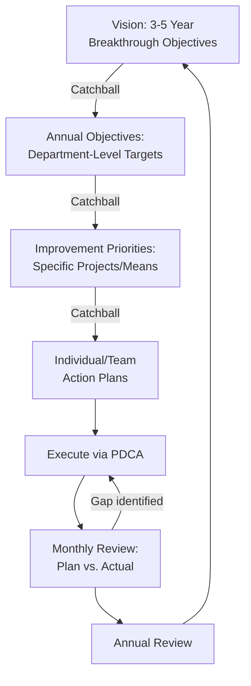

## Hoshin Kanri Policy Deployment

### Overview

Hoshin Kanri (方針管理, "direction management" or "compass management"), commonly translated as policy deployment, is a strategic planning methodology that aligns an organization's long-term strategic goals with the day-to-day activities of every level of the workforce, from executive leadership down to shop-floor operators. Developed in Japan in the 1960s and refined by companies such as Toyota and Bridgestone, Hoshin Kanri ensures that improvement efforts — including metrology and quality control initiatives — are not disconnected local optimizations, but are directly traceable to organizational strategic priorities.

**Key Points**

- Distinguishes itself from ordinary goal-setting (e.g., MBO — Management by Objectives) by using a structured, bidirectional communication process called "catchball"
- Typically operates on an annual planning cycle, cascading 3–5 year strategic breakthrough objectives into annual objectives, then into departmental and individual targets
- In a metrology/QC context, Hoshin Kanri is the mechanism by which a strategic goal such as "reduce warranty returns by 30%" gets translated into concrete, measurable departmental targets like "reduce Gauge R&R variation on critical characteristics to under 10%" or "reduce calibration interval overdue rate to zero"
- Closely integrated with PDCA — each level of the Hoshin plan is itself managed through a PDCA cycle

### Core Principles

- **Focus**: limits the organization to a small number (typically 3–5) of true breakthrough priorities per cycle, rather than diluting effort across dozens of initiatives
- **Alignment**: ensures vertical alignment (strategy-to-execution) and horizontal alignment (cross-functional consistency) of goals
- **Catchball**: an iterative, bidirectional negotiation process in which targets and means are proposed top-down, challenged and refined bottom-up, and re-negotiated until consensus and feasibility are confirmed at every level
- **PDCA-driven execution**: each annual plan, and each level of cascaded objectives, is executed and reviewed through the PDCA cycle
- **Fact-based management**: targets and progress are tracked using quantifiable metrics rather than subjective assessment

### The Hoshin Planning Process (Seven-Step Model)

#### 1. Establish the Organizational Vision

Senior leadership defines a long-term (3–5 year) vision statement describing the desired future state of the organization.

#### 2. Develop Breakthrough Objectives (3–5 Year Plan)

A small number of vital-few strategic objectives are identified — the things that, if achieved, would fundamentally change the organization's competitive position.

#### 3. Develop Annual Objectives

Breakthrough objectives are broken into annual objectives with specific, measurable targets for the current planning year.

#### 4. Deploy Objectives Through Catchball

Annual objectives cascade downward through the organization. At each level, the receiving team proposes the means (specific projects/actions) and resources needed to achieve the target, and negotiates back up if the target is deemed infeasible with current resources — this back-and-forth is catchball.

#### 5. Implement Objectives

Departments and individuals execute the negotiated action plans, typically tracked via project charters, A3 reports, or kaizen event plans.

#### 6. Monthly/Periodic Review

Progress is reviewed at regular intervals (commonly monthly) using visual management tools; gaps between plan and actual are investigated.

#### 7. Annual Review

A comprehensive year-end review assesses what was achieved, what was learned, and feeds directly into the next year's Hoshin planning cycle — closing the PDCA loop at the organizational level.

### The X-Matrix

The X-Matrix is the signature visual tool of Hoshin Kanri, displaying the relationships among four planning elements — long-term breakthrough objectives, annual objectives, improvement priorities/means, and process/results metrics — on a single diamond-shaped grid, along with a correlation section identifying who is responsible for each initiative.

**Diagram: Hoshin X-Matrix Structure (svg_diagram)**

<svg viewBox="0 0 500 500" xmlns="http://www.w3.org/2000/svg">
<title>Hoshin X-Matrix Structure (svg_diagram)</title>
<rect x="150" y="150" width="200" height="200" fill="none" stroke="#333" stroke-width="1.5"/>
<line x1="150" y1="150" x2="350" y2="350" stroke="#333" stroke-width="1"/>
<line x1="350" y1="150" x2="150" y2="350" stroke="#333" stroke-width="1"/>

<text x="250" y="60" font-size="13" font-weight="bold" text-anchor="middle" fill="`#1a365d`">Long-Term Breakthrough Objectives (3-5 yr)</text>

<rect x="150" y="70" width="200" height="65" fill="`#ebf8ff`" stroke="`#2b6cb0`"/>

<text x="250" y="100" font-size="10" text-anchor="middle">e.g. "Reduce warranty</text>

<text x="250" y="114" font-size="10" text-anchor="middle">returns by 30%"</text>

<text x="440" y="250" font-size="12" font-weight="bold" text-anchor="middle" fill="`#1c4532`" transform="rotate(90 440 250)">Annual Objectives</text>

<rect x="365" y="150" width="65" height="200" fill="`#f0fff4`" stroke="`#2f855a`"/>

<text x="397" y="245" font-size="10" text-anchor="middle" transform="rotate(90 397 245)">Cut GRR to <10%</text>

<text x="250" y="440" font-size="13" font-weight="bold" text-anchor="middle" fill="`#652b19`">Improvement Priorities / Means</text>

<rect x="150" y="365" width="200" height="65" fill="`#fffaf0`" stroke="`#c05621`"/>

<text x="250" y="395" font-size="10" text-anchor="middle">Fixture redesign,</text>

<text x="250" y="409" font-size="10" text-anchor="middle">operator retraining</text>

<text x="60" y="250" font-size="12" font-weight="bold" text-anchor="middle" fill="`#44337a`" transform="rotate(-90 60 250)">Process/Results Metrics</text>

<rect x="70" y="150" width="65" height="200" fill="`#faf5ff`" stroke="`#805ad5`"/>

<text x="102" y="255" font-size="10" text-anchor="middle" transform="rotate(-90 102 255)">%GRR, Cpk trend</text>

<circle cx="250" cy="250" r="4" fill="#333"/>
</svg>

### Application to a Metrology and Calibration Program

**Example**

- **3–5 Year Breakthrough Objective**: "Achieve industry-leading measurement traceability and reduce customer-reported dimensional nonconformances by 50%"
- **Annual Objective (Quality/Metrology Department)**: "Reduce out-of-tolerance calibration recalls from 8% to under 2% of the gauge population"
- **Catchball**: The metrology lab manager proposes that achieving this requires investment in an automated calibration tracking system and two additional certified technicians; leadership counters with a phased budget over two quarters; both sides converge on a revised target and implementation timeline
- **Deployed Means**: Implement statistical interval analysis (e.g., reliability-based calibration interval adjustment) to right-size calibration frequencies; install environmental monitoring in the calibration lab; retrain technicians on uncertainty budgeting
- **Metrics Tracked**: Monthly out-of-tolerance rate, calibration due-date compliance rate, measurement uncertainty budget trends
- **Monthly Review**: Visual management board tracks actual vs. target OOT rate; gaps trigger a focused PDCA sub-cycle
- **Annual Review**: Year-end assessment feeds into next year's breakthrough objective refinement

### Mermaid: Hoshin Kanri Cascade

### Hoshin Kanri vs. Related Frameworks

| Framework | Scope | Key Mechanism | Relation to Hoshin Kanri |
| --- | --- | --- | --- |
| MBO (Management by Objectives) | Individual/departmental goals | Top-down goal assignment | Lacks catchball's bidirectional negotiation and cross-level alignment focus |
| Balanced Scorecard | Strategic performance measurement | Four perspective metrics (financial, customer, process, learning) | Complementary — often used alongside Hoshin Kanri for metric selection, not for deployment |
| OKRs (Objectives and Key Results) | Team/individual goal-setting | Quarterly objective-setting with key results | Shorter cycle, less emphasis on structured catchball negotiation |
| PDCA | Single-loop problem-solving | Plan-Do-Check-Act | The execution engine used within each level of a Hoshin plan |

### Common Pitfalls

- Setting too many breakthrough objectives, diluting focus and resources — Hoshin Kanri's discipline depends on saying "no" to good ideas that don't serve the vital few priorities
- Treating catchball as a one-way top-down announcement rather than genuine negotiation, which undermines frontline buy-in and feasibility
- Disconnecting departmental metrics (e.g., a metrology lab's %GRR target) from the strategic objective they're meant to serve, turning Hoshin Kanri into ordinary goal-setting with extra paperwork
- Infrequent review cadence — without monthly (or more frequent) review, gaps between plan and actual are discovered too late in the annual cycle to correct

**Related Topics**

- PDCA cycle
- X-Matrix construction and use
- Catchball process facilitation
- Quality circles
- Seven quality management and planning tools
- Balanced Scorecard and strategic performance metrics
- A3 problem solving