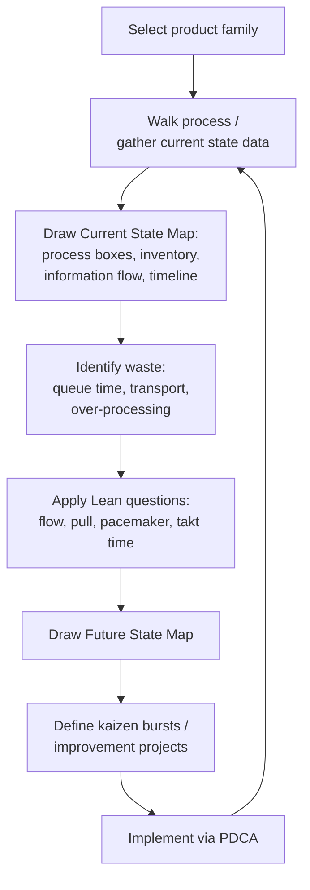

## Value Stream Mapping

### Overview

Value Stream Mapping (VSM) is a Lean visualization technique used to document, analyze, and redesign the flow of materials and information required to bring a product from raw input to the customer. It captures both the process steps themselves and the information flows that trigger them (schedules, orders, kanban signals), making non-value-added time and activity visible in a way that a simple process flowchart does not. In precision metrology and quality control, VSM is the primary tool for exposing how inspection, calibration, and measurement activities contribute to — or detract from — total lead time.

**Key Points**

- Popularized by Mike Rother and John Shook in *Learning to See* (1998), based on Toyota's internal "material and information flow mapping" practice
- Produces two maps in sequence: a **Current State Map** (documenting the process as it exists today) and a **Future State Map** (the redesigned, waste-reduced target process)
- Distinguishes itself from standard process flowcharts by including quantified timing data (cycle time, changeover time, uptime, queue time) at each step, plus the information/scheduling flow above the process flow
- In metrology programs, VSM frequently exposes that queue/wait time at inspection or calibration stations dwarfs actual measurement cycle time — a common and often surprising finding

### Standard VSM Icon Set

VSM uses a standardized icon vocabulary so maps are consistently interpretable across an organization.

| Icon Category | Represents |
| --- | --- |
| Process box | A single process step with a data box beneath it (cycle time, changeover time, uptime, number of operators) |
| Data box | Key metrics attached to a process box: cycle time (C/T), changeover time (C/O), uptime (%), defect rate |
| Inventory triangle | Accumulated WIP or inventory between process steps, with quantity and days-of-supply noted |
| Push arrow (striped) | Material pushed to the next process regardless of downstream need |
| Pull/kanban arrow | Material pulled based on a downstream kanban signal |
| Truck/shipment icon | Material transported externally (from supplier, to customer) |
| Information flow line (thin) | Scheduling and communication flow, typically electronic (jagged line) or manual (straight line) |
| Timeline (bottom of map) | Running total of value-added time vs. total lead time, stepped to show accumulated waiting |

### Building the Current State Map

#### 1. Select the Product Family

Choose a product or product family that shares similar processing steps, so a single map is representative.

#### 2. Walk the Process ("Gemba Walk")

Physically walk the actual process flow, from the customer end backward to the supplier end, observing and timing each step directly rather than relying on documented standard times, which frequently diverge from actual practice.

#### 3. Record Process Data at Each Step

For each process box, including inspection and calibration steps, record:

- Cycle time (C/T): time to complete one unit
- Changeover time (C/O): time to switch between part types or gauge setups
- Uptime/availability: percentage of scheduled time the process/equipment is actually available (relevant for CMMs and automated gauging)
- Number of operators/inspectors
- Defect/reject rate

#### 4. Map Inventory and Queue Time Between Steps

Measure the quantity of WIP waiting between each process step and convert to days of supply — this is where inspection bottlenecks typically become visible, such as a large queue of parts awaiting CMM measurement.

#### 5. Map the Information Flow

Document how production and inspection scheduling information flows — from customer order through production control to the shop floor and inspection stations — including whether this flow is electronic (MRP/ERP push) or manual (kanban card, verbal).

#### 6. Calculate the Timeline

Sum total lead time (sum of all process times plus all queue/wait times) versus total value-added time (sum of process times only). The ratio of value-added time to total lead time is often strikingly low — commonly in the low single-digit percentages for complex manufacturing flows — which is precisely the waste VSM is designed to expose.

$$\text{Process Cycle Efficiency} = \frac{\text{Value-Added Time}}{\text{Total Lead Time}} \times 100\%$$

### Diagram: Simplified VSM Structure (svg_diagram)

<svg xmlns="http://www.w3.org/2000/svg" viewBox="0 0 640 340">
<title>Simplified Value Stream Map Structure (svg_diagram)</title>
<g font-size="10">
<rect x="10" y="20" width="30" height="30" fill="#f7fafc" stroke="#333" />
<text x="25" y="15" text-anchor="middle" font-size="9">Supplier</text>



```
<rect x="270" y="20" width="30" height="30" fill="#f7fafc" stroke="#333" />
<text x="285" y="15" text-anchor="middle" font-size="9">Production Control</text>

<rect x="580" y="20" width="30" height="30" fill="#f7fafc" stroke="#333" />
<text x="595" y="15" text-anchor="middle" font-size="9">Customer</text>

<line x1="40" y1="35" x2="270" y2="35" stroke="#666" stroke-width="1" stroke-dasharray="3,2" />
<line x1="300" y1="35" x2="580" y2="35" stroke="#666" stroke-width="1" stroke-dasharray="3,2" />

<rect x="70" y="140" width="80" height="55" fill="#ebf8ff" stroke="#2b6cb0" stroke-width="2" />
<text x="110" y="163" text-anchor="middle" font-weight="bold">Machining</text>
<text x="110" y="178" text-anchor="middle" font-size="9">C/T: 45s</text>
<text x="110" y="190" text-anchor="middle" font-size="9">Uptime: 92%</text>

<path d="M150 167 h30" fill="none" stroke="#333" stroke-width="2" />
<polygon points="180,163 200,167 180,171" fill="#c05621" />
<text x="180" y="150" font-size="9" text-anchor="middle">120 pcs</text>
<text x="180" y="210" font-size="9" text-anchor="middle">1.5 days</text>

<rect x="220" y="140" width="80" height="55" fill="#fffaf0" stroke="#c05621" stroke-width="2" />
<text x="260" y="158" text-anchor="middle" font-weight="bold">CMM</text>
<text x="260" y="172" text-anchor="middle" font-weight="bold">Inspection</text>
<text x="260" y="186" text-anchor="middle" font-size="9">C/T: 90s</text>

<path d="M300 167 h30" fill="none" stroke="#333" stroke-width="2" />
<polygon points="330,163 350,167 330,171" fill="#c05621" />
<text x="330" y="150" font-size="9" text-anchor="middle">300 pcs</text>
<text x="330" y="210" font-size="9" text-anchor="middle">4.0 days</text>

<rect x="370" y="140" width="80" height="55" fill="#f0fff4" stroke="#2f855a" stroke-width="2" />
<text x="410" y="163" text-anchor="middle" font-weight="bold">Packaging</text>
<text x="410" y="178" text-anchor="middle" font-size="9">C/T: 30s</text>
<text x="410" y="190" text-anchor="middle" font-size="9">Uptime: 98%</text>
```

</g>
<line x1="10" y1="270" x2="610" y2="270" stroke="#333" stroke-width="1.5" />
<text x="110" y="290" font-size="10" text-anchor="middle">45s</text>
<text x="110" y="305" font-size="9" text-anchor="middle" fill="#666">VA time</text>
<text x="180" y="290" font-size="10" text-anchor="middle">1.5d</text>
<text x="260" y="290" font-size="10" text-anchor="middle">90s</text>
<text x="330" y="290" font-size="10" text-anchor="middle">4.0d</text>
<text x="410" y="290" font-size="10" text-anchor="middle">30s</text>
<text x="300" y="325" font-size="11" font-weight="bold" text-anchor="middle">Total Lead Time ≈ 5.5 days | Total VA Time ≈ 165s</text>
</svg>

### Designing the Future State Map

The future state map applies Lean questions to the current state to design a target process:

- Where can flow be established (e.g., moving from a centralized CMM lab to in-line, at-station gauging) to eliminate transport and queue waste?
- Where must a pull system (kanban) replace push-based scheduling?
- What is the pacemaker process — the single point in the flow that should be scheduled, with everything upstream pulling from it?
- Where can process cycle times be leveled to match customer takt time?
- What kaizen bursts (specific improvement events, often marked with a starburst icon on the map) are needed to close the gap — such as implementing SMED on gauge changeover, or deploying poka-yoke fixturing to reduce inspection cycle time?

### Mermaid: Current-to-Future State VSM Workflow



### Application to a Metrology-Heavy Process

**Example**

A current state map of a precision-machined component reveals:

- Machining cycle time: 45 seconds; queue before inspection: 1.5 days (120 pieces)
- CMM inspection cycle time: 90 seconds per part, but only one CMM serves three machining cells, creating a 4-day queue (300 pieces) — the single largest lead-time contributor in the entire value stream
- Packaging cycle time: 30 seconds

The future state analysis identifies the CMM as the primary bottleneck and waste source. Interventions include: introducing a lower-cost, faster in-line optical gauge for the majority characteristic checks (reserving the CMM for complex geometric tolerancing only), and right-sizing sampling frequency per a statistically justified plan rather than 100% inspection. Projected result: inspection queue reduced from 4 days to under 4 hours, cutting total lead time by roughly 70%.

### Common Pitfalls

- Mapping from memory or from documented standard work instead of directly observing the actual current process — actual cycle times and queue lengths frequently differ substantially from documented assumptions
- Omitting the information flow (scheduling signals) and mapping only physical material flow, which hides root causes of overproduction and batching
- Building a future state map that is aspirational but has no defined kaizen bursts or implementation plan, leaving it a static diagram rather than an improvement driver
- Failing to re-map periodically — a future state map should become the next current state map once implemented, keeping VSM itself a continuous-improvement cycle rather than a one-time exercise

**Related Topics**

- Lean principles and waste elimination
- Takt time and production leveling (heijunka)
- Kanban and pull systems
- Single-Minute Exchange of Die (SMED)
- PDCA cycle
- Kaizen events
- Gauge R&R and measurement system throughput analysis