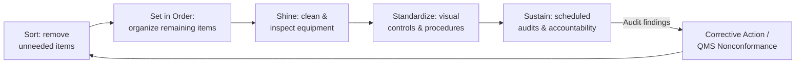

## 5S Workplace Organization

### Overview

5S is a systematic, five-phase workplace organization methodology derived from Japanese manufacturing practice, designed to create and sustain a clean, orderly, and standardized work environment. The name derives from five Japanese terms — Seiri, Seiton, Seiso, Seiketsu, Shitsuke — commonly translated as Sort, Set in Order, Shine, Standardize, and Sustain. In precision metrology and quality control, 5S is foundational: measurement accuracy and repeatability are directly sensitive to environmental contamination, gauge misplacement, and inconsistent handling practices, making disciplined workplace organization a prerequisite for reliable measurement rather than a cosmetic exercise.

**Key Points**

- Rooted in the Toyota Production System; often implemented as the entry-point Lean initiative because it is visible, low-cost, and builds discipline for later, more complex Lean tools
- Sometimes extended to "6S" with the addition of Safety as an explicit sixth pillar
- In a calibration or inspection lab, 5S directly supports measurement uncertainty control by reducing contamination risk, gauge damage, and mix-up between calibrated and out-of-service equipment
- Distinguishes itself from a one-time cleanup by embedding audit and sustainment mechanisms (the fourth and fifth S's) that prevent regression to disorder

### The Five Phases

#### 1. Seiri (Sort)

Remove all items from the work area that are not needed for current operations, retaining only what is necessary.

- Common technique: **red-tagging** — items of uncertain necessity are tagged with a red label and relocated to a holding area; if unused after a defined period (commonly 30 days), they are disposed of, transferred, or archived
- Metrology application: removing obsolete or decommissioned gauges, expired reference standards, and duplicate tooling from the active workbench, reducing the risk an inspector selects an incorrect or out-of-calibration instrument

#### 2. Seiton (Set in Order)

Arrange necessary items so they are easy to find, use, and return — "a place for everything, and everything in its place."

- Common techniques: shadow boards (outlined silhouettes showing where each tool belongs), labeled storage locations, color-coding by function or calibration status
- Metrology application: gauge storage organized by frequency of use and by calibration due-date visibility, with dedicated, clearly labeled locations for each instrument type (micrometers, calipers, gauge blocks, height gauges), minimizing motion waste and reducing the chance of picking up an instrument that is due for calibration

#### 3. Seiso (Shine)

Clean the work area and equipment thoroughly and establish a routine cleaning schedule, treating cleaning as an inspection activity that reveals abnormal conditions (wear, leaks, damage) before they cause failures.

- Metrology application: routine cleaning of gauge surfaces, CMM probes, and granite surface plates is not merely cosmetic — surface contamination directly introduces measurement error; a scratched or pitted granite plate surface, discovered during cleaning, is itself a quality signal requiring corrective action

#### 4. Seiketsu (Standardize)

Establish standard procedures, visual controls, and schedules that maintain the first three S's consistently across shifts and personnel, rather than relying on individual discipline alone.

- Common techniques: standard work instructions with photographs of the "correct" state, color-coded calibration status labels (e.g., green = in calibration, red = overdue/out of service), posted cleaning and inspection schedules
- Metrology application: a standardized visual system where every gauge has a calibration sticker with a clear due date and color-coded status, visible at a glance without needing to check a separate log

#### 5. Shitsuke (Sustain)

Build the discipline and habit to maintain the standards established in the first four S's indefinitely, through regular audits, accountability, and leadership reinforcement — widely regarded as the most difficult phase, since it depends on sustained behavioral change rather than a one-time physical reorganization.

- Common techniques: scheduled 5S audits with scored checklists, visual scoreboards tracking audit results by area, incorporating 5S compliance into standard operating procedures and performance reviews
- Metrology application: periodic audits of the calibration lab and inspection stations against a 5S checklist, with findings tracked and trended over time — often integrated directly into the internal quality audit program required by ISO 9001

### Diagram: The 5S Cycle (svg_diagram)

<svg xmlns="http://www.w3.org/2000/svg" viewBox="0 0 560 260">
<title>5S Cycle (svg_diagram)</title>
<g font-size="12" text-anchor="middle">
<circle cx="80" cy="60" r="45" fill="#ebf8ff" stroke="#2b6cb0" stroke-width="2" />
<text x="80" y="55" font-weight="bold">Sort</text>
<text x="80" y="70" font-size="9">(Seiri)</text>



```
<circle cx="220" cy="60" r="45" fill="#f0fff4" stroke="#2f855a" stroke-width="2" />
<text x="220" y="50" font-weight="bold">Set in</text>
<text x="220" y="63" font-weight="bold">Order</text>
<text x="220" y="76" font-size="9">(Seiton)</text>

<circle cx="360" cy="60" r="45" fill="#fffaf0" stroke="#c05621" stroke-width="2" />
<text x="360" y="55" font-weight="bold">Shine</text>
<text x="360" y="70" font-size="9">(Seiso)</text>

<circle cx="500" cy="60" r="45" fill="#faf5ff" stroke="#805ad5" stroke-width="2" />
<text x="500" y="50" font-weight="bold">Standard-</text>
<text x="500" y="63" font-weight="bold">ize</text>
<text x="500" y="76" font-size="9">(Seiketsu)</text>

<circle cx="290" cy="190" r="50" fill="#fff5f5" stroke="#c53030" stroke-width="2.5" />
<text x="290" y="185" font-weight="bold">Sustain</text>
<text x="290" y="200" font-size="9">(Shitsuke)</text>

<line x1="125" y1="60" x2="173" y2="60" stroke="#333" stroke-width="2" marker-end="url(#arrow5s)" />
<line x1="265" y1="60" x2="313" y2="60" stroke="#333" stroke-width="2" marker-end="url(#arrow5s)" />
<line x1="405" y1="60" x2="453" y2="60" stroke="#333" stroke-width="2" marker-end="url(#arrow5s)" />
<line x1="470" y1="95" x2="330" y2="160" stroke="#333" stroke-width="2" marker-end="url(#arrow5s)" />
<path d="M 250 220 Q 100 250 80 105" fill="none" stroke="#666" stroke-width="1.5" stroke-dasharray="5,3" marker-end="url(#arrow5s)" />
```

</g>
</svg>

### 5S Audit Scoring

Audits typically use a checklist with each S scored on a scale (commonly 0–5) against defined criteria, producing a composite score trended over time.

**Example (simplified calibration lab 5S audit)**

| Category | Criteria | Score (0-5) |
| --- | --- | --- |
| Sort | No obsolete/uncalibrated gauges present on active benches | 4 |
| Set in Order | All instruments have a labeled, dedicated storage location | 5 |
| Shine | Surface plates and gauge surfaces free of visible contamination | 3 |
| Standardize | Calibration status visual indicators present and current on all gauges | 4 |
| Sustain | Last scheduled audit completed on time; corrective actions closed | 3 |

$$\text{Overall 5S Score} = \frac{\sum \text{category scores}}{\text{max possible score}} \times 100\%$$

### Application to Precision Metrology Environments

**Example**

A calibration laboratory implementing 5S:

- **Sort**: Removes three obsolete dial indicators and two expired reference standards from the active bench, relocating them to a red-tag holding area for disposition
- **Set in Order**: Installs a labeled shadow board for hand tools and a dedicated, vibration-isolated shelf for gauge blocks, organized by nominal size
- **Shine**: Establishes a daily wipe-down schedule for the granite surface plate using lint-free cloth and approved solvent, with a weekly deeper inspection for surface wear
- **Standardize**: Adopts a three-color calibration status label system (green/yellow/red) visible from arm's length, and posts photographic "correct state" references at each workstation
- **Sustain**: Schedules monthly 5S audits by the quality manager, with scores posted on a visual board and trended quarter over quarter; audit findings are logged as corrective actions in the QMS

### 5S and Measurement System Integrity

Environmental and organizational discipline established by 5S directly supports measurement system analysis (MSA) validity. [Inference: while no single universal figure applies, environmental contamination and gauge handling inconsistency are commonly cited contributing factors to reproducibility variation in Gauge R&R studies, meaning that 5S improvements often show up indirectly as reduced %GRR even though 5S itself is not a statistical intervention.] A cluttered or contaminated measurement environment can introduce sources of variation that are difficult to distinguish from true gauge or operator variation during a Gauge R&R study, making 5S implementation a practical prerequisite before conducting a meaningful MSA.

### Mermaid: 5S Integration with Quality Audits



### Common Pitfalls

- Treating 5S as a one-time cleanup event rather than an embedded, audited discipline — without the Sustain phase, work areas typically regress to disorder within weeks to months
- Focusing exclusively on visible tidiness (Sort/Set in Order) while neglecting Shine's role as an equipment-inspection activity, missing early warning signs of gauge or surface plate degradation
- Implementing 5S without linking it to the broader QMS audit and corrective action system, causing findings to go untracked and unresolved
- Applying uniform storage/labeling standards without considering measurement-specific needs (e.g., vibration isolation for precision references, humidity/temperature control for certain gauge materials)

**Related Topics**

- Lean principles and waste elimination
- Gauge R&R and measurement system analysis
- Calibration management systems
- Visual management and andon systems
- PDCA cycle
- ISO 9001 internal audit requirements
- Value stream mapping