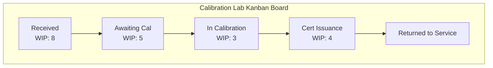

## Kanban and Pull Systems

### Overview

Kanban (看板, "signboard" or "visual signal") is a scheduling and inventory-control system that implements a pull-based production philosophy, in which upstream processes produce only what downstream processes actually consume, signaled by a physical or electronic card rather than a centralized forecast-driven schedule. Developed by Taiichi Ohno at Toyota, kanban is the primary operational mechanism through which the Lean principle of "establish pull" is implemented on the shop floor. In precision metrology and quality control, kanban governs not only production replenishment but also the flow of calibrated gauges, reference standards, and inspection capacity itself.

**Key Points**

- Inspired by supermarket restocking practice — shelves are replenished only as items are purchased, not according to a forecast
- Distinguishes push systems (production scheduled centrally based on forecast, regardless of immediate downstream need) from pull systems (production triggered by actual downstream consumption)
- A kanban card or signal carries specific information: part number, quantity, source location, destination location, and container type
- In metrology programs, kanban principles apply to gauge/standard replenishment, calibration lab work intake, and reference material inventory control

### Push vs. Pull: Core Distinction

| Aspect | Push System | Pull System (Kanban) |
| --- | --- | --- |
| Production trigger | Forecast/schedule (e.g., MRP) | Actual downstream consumption signal |
| Inventory tendency | Accumulates buffer stock to absorb forecast error | Minimal, sized to actual replenishment lead time |
| Visibility of problems | Buffers mask process instability | Problems (stockouts, bottlenecks) surface immediately |
| Typical waste generated | Overproduction, excess inventory | Requires disciplined signal response; risk of stockout if mismanaged |

### Types of Kanban Signals

- **Production kanban**: authorizes a process to produce a specific quantity of a specific item
- **Withdrawal (conveyance) kanban**: authorizes movement of a specific quantity of material from one location to another
- **Signal kanban**: a triangular card used for batch/setup processes, triggering production only when inventory reaches a reorder trigger point, sized to cover expected demand during changeover and replenishment lead time
- **Electronic kanban (e-kanban)**: digital signals (barcode scans, ERP-integrated triggers) replacing physical cards, common in facilities with system-of-record integration requirements

### The Kanban Formula

The number of kanban cards (and therefore the inventory level) in a loop is calculated from demand rate, lead time, and a safety factor:

$$N = \frac{D \times L \times (1 + S)}{C}$$

where $N$ is the number of kanban cards, $D$ is average demand rate per unit time, $L$ is total replenishment lead time, $S$ is a safety stock factor (expressed as a decimal), and $C$ is the container/lot quantity per card.

**Example**

A calibration lab replenishes a stock of certified gauge blocks used for daily gauge verification. Average consumption is 4 blocks/day, replenishment (recertification) lead time is 5 days, safety factor is 20% (0.2), and each kanban card represents a container of 2 blocks:

$$N = \frac{4 \times 5 \times (1 + 0.2)}{2} = \frac{24}{2} = 12 \text{ kanban cards}$$

Twelve cards in circulation ensures the lab never runs out of certified blocks while consumption and recertification lead time remain within their historical range.

### Diagram: Kanban Pull Loop (svg_diagram)

<svg xmlns="http://www.w3.org/2000/svg" viewBox="0 0 600 260">
<title>Kanban Pull Loop (svg_diagram)</title>
<g font-size="11" text-anchor="middle">
<rect x="20" y="60" width="110" height="60" rx="6" fill="#ebf8ff" stroke="#2b6cb0" stroke-width="2" />
<text x="75" y="85" font-weight="bold">Supplying</text>
<text x="75" y="100">Process</text>



```
<rect x="230" y="60" width="110" height="60" rx="6" fill="#f0fff4" stroke="#2f855a" stroke-width="2" />
<text x="285" y="85" font-weight="bold">Kanban</text>
<text x="285" y="100">Buffer/Store</text>

<rect x="440" y="60" width="140" height="60" rx="6" fill="#fffaf0" stroke="#c05621" stroke-width="2" />
<text x="510" y="85" font-weight="bold">Consuming</text>
<text x="510" y="100">Process (Inspection)</text>

<path d="M130 90 h95" fill="none" stroke="#333" stroke-width="2.5" marker-end="url(#arrowk)" />
<text x="177" y="80" font-size="9">Parts flow</text>

<path d="M340 90 h95" fill="none" stroke="#333" stroke-width="2.5" marker-end="url(#arrowk)" />
<text x="387" y="80" font-size="9">Parts flow</text>

<path d="M440 130 Q 285 190 75 130" fill="none" stroke="#c05621" stroke-width="2" stroke-dasharray="6,3" marker-end="url(#arrowk)" />
<text x="285" y="200" font-size="10" fill="#c05621">Kanban card returned: "produce more"</text>
```

</g>
</svg>

### Kanban Boards for Workflow Visualization

Beyond physical material replenishment, kanban boards are widely used to visualize and limit work-in-progress across any process, including inspection and calibration workflows.

- Structure: columns representing workflow stages (e.g., "Awaiting Inspection," "In Progress," "Awaiting Disposition," "Complete"), with cards representing individual work items (parts, calibration requests, nonconformance reports)
- **Work-in-progress (WIP) limits**: each column has a maximum card count, forcing the team to resolve bottlenecks before pulling in new work — directly analogous to physical kanban's inventory-limiting function
- Metrology application: a calibration lab intake board with columns "Received," "Awaiting Calibration," "In Calibration," "Awaiting Certificate Issuance," "Returned to Service" — WIP limits on "Awaiting Calibration" force proactive scheduling rather than allowing a backlog to grow unmanaged

### Mermaid: Kanban Board for Calibration Lab Workflow



### Six Sigma and Lean Integration

Kanban is frequently paired with Six Sigma's DMAIC framework when a pull system itself becomes the subject of improvement — for example, using control charts to monitor kanban cycle times or applying root cause analysis when WIP limits are chronically exceeded, tying kanban operationally back into the broader statistical toolkit of the seven basic QC tools.

### Application to Gauge and Standard Management

**Example**

A precision machining facility implements a two-bin kanban system for commonly used inspection consumables (gauge pins, calibrated shims): when the first bin is emptied, it is sent for replenishment/recertification while the second bin is used, and the returned first bin's kanban card triggers reorder. This eliminates the need for manual inventory counting of consumables and ensures inspectors are never without a certified instrument, while keeping total certified-standard inventory — and the associated recertification cost and expiration-tracking burden — near the practical minimum.

### Common Pitfalls

- Setting kanban card counts (or WIP limits) based on theoretical/nominal lead times rather than actual observed lead time variability, leading to stockouts when replenishment lead time exceeds plan
- Allowing kanban discipline to erode under schedule pressure — bypassing the signal system to "just get it done" reintroduces the push-system problems kanban was designed to eliminate
- Applying kanban to highly variable-demand items without adjusting card counts periodically; kanban card counts should be reviewed and recalculated as demand patterns shift, not set once and left static
- Confusing a kanban board (workflow visualization) with the broader philosophy of pull-based production — a kanban board alone does not guarantee a true pull system if upstream processes are not actually gated by consumption signals

**Related Topics**

- Lean principles and waste elimination
- Value stream mapping
- Just-in-Time (JIT) production
- Takt time and heijunka (production leveling)
- Work-in-progress (WIP) limits
- Calibration interval management
- Six Sigma DMAIC methodology