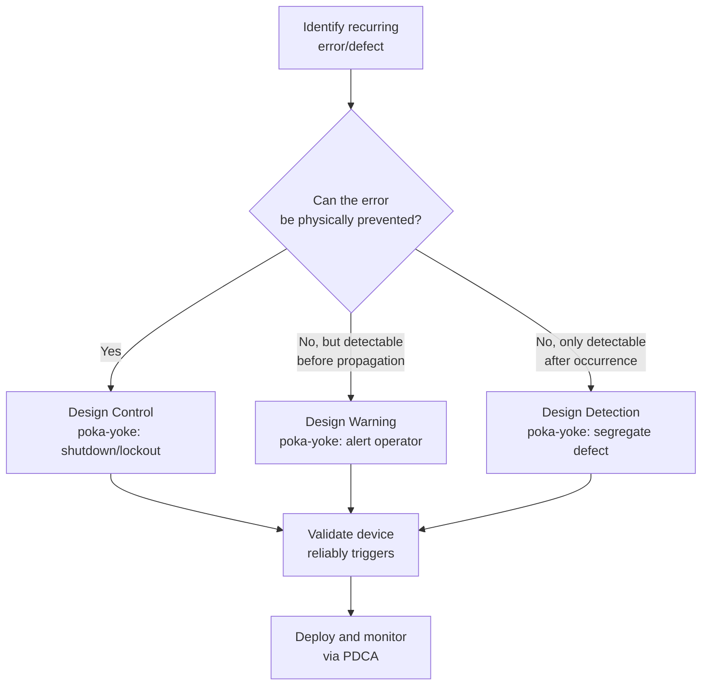

## Poka-Yoke Mistake-Proofing Techniques

### Overview

Poka-yoke (ポカヨケ, "mistake-proofing" or literally "avoiding inadvertent errors") is a Lean quality technique that uses mechanical, electrical, or procedural devices to prevent errors from occurring or to make them immediately detectable before they propagate downstream. Developed by Shigeo Shingo as part of the Toyota Production System's Zero Quality Control (ZQC) concept, poka-yoke shifts quality control from detecting defects after the fact toward eliminating the possibility of defects at their source. In precision metrology and quality control, poka-yoke is applied both to the manufacturing process being measured and to the measurement process itself, since measurement errors are as susceptible to mistake-proofing as production errors.

**Key Points**

- Coined and systematized by Shigeo Shingo in the 1960s; the term deliberately replaced an earlier, less diplomatic phrase ("baka-yoke," or "fool-proofing") out of respect for workers
- Central principle: 100% inspection through automated, in-process detection is more effective and less costly than statistical sampling after the fact, when applied at the right point in the process
- Distinguishes itself from statistical process control by preventing or catching errors at the individual-unit level in real time, rather than detecting drift in aggregate process behavior over time
- Directly supports Jidoka (automation with a human touch) — a poka-yoke device that halts a process on detecting an abnormality is a jidoka implementation

### Three Poka-Yoke Regulatory Functions

Shingo classified poka-yoke devices by what they do once an error condition is detected:

| Function | Behavior | Metrology/QC Example |
| --- | --- | --- |
| **Control (shutdown)** | Automatically stops the process when an abnormality is detected, preventing the defect from being produced at all | A CMM program that halts automatically if a probe calibration check fails before measurement begins |
| **Warning** | Alerts an operator (light, sound, alarm) to an abnormality, but does not stop the process | An audible tone when a digital caliper reading falls outside a pre-programmed tolerance band, prompting operator review |
| **Detection (after-the-fact)** | Identifies a defect that has already occurred, before it moves to the next process step | A go/no-go gauge check at the end of a machining operation that segregates out-of-tolerance parts before they reach packaging |

Control (shutdown) functions are generally preferred over warning functions where feasible, since they prevent the error from occurring at all rather than merely flagging it, and warning functions are preferred over pure detection where full prevention is not achievable.

### Two Poka-Yoke Detection Methods

- **Contact method**: physical contact (or lack thereof) between a device and the product/part detects an error, such as a fixture pin that will not seat if a part is misoriented or has the wrong dimension
- **Fixed-value (constant number) method**: detects an error when a fixed count or fixed quantity is not met, such as a parts-counting sensor that halts a conveyor if fewer than the expected number of fasteners have been installed
- **Motion-step (sequence) method**: detects an error when a required sequence of steps is not followed in the correct order, such as an assembly fixture that will not release the part unless every required sensor in a defined sequence has been triggered

### Diagram: Poka-Yoke Classification (svg_diagram)

<svg xmlns="http://www.w3.org/2000/svg" viewBox="0 0 560 280">
<title>Poka-Yoke Classification (svg_diagram)</title>
<g font-size="11" text-anchor="middle">
<rect x="200" y="10" width="160" height="40" rx="6" fill="#1a365d" />
<text x="280" y="35" fill="white" font-weight="bold">Poka-Yoke</text>



```
<line x1="280" y1="50" x2="280" y2="75" stroke="#333" stroke-width="1.5" />
<line x1="90" y1="75" x2="470" y2="75" stroke="#333" stroke-width="1.5" />
<line x1="90" y1="75" x2="90" y2="90" stroke="#333" stroke-width="1.5" />
<line x1="280" y1="75" x2="280" y2="90" stroke="#333" stroke-width="1.5" />
<line x1="470" y1="75" x2="470" y2="90" stroke="#333" stroke-width="1.5" />

<rect x="20" y="90" width="140" height="55" rx="6" fill="#fff5f5" stroke="#c53030" stroke-width="2" />
<text x="90" y="112" font-weight="bold">Control</text>
<text x="90" y="126" font-size="9">(shuts down process)</text>
<text x="90" y="139" font-size="9">preferred</text>

<rect x="210" y="90" width="140" height="55" rx="6" fill="#fffaf0" stroke="#c05621" stroke-width="2" />
<text x="280" y="112" font-weight="bold">Warning</text>
<text x="280" y="126" font-size="9">(alerts operator)</text>

<rect x="400" y="90" width="140" height="55" rx="6" fill="#f7fafc" stroke="#4a5568" stroke-width="2" />
<text x="470" y="112" font-weight="bold">Detection</text>
<text x="470" y="126" font-size="9">(after-the-fact)</text>

<text x="280" y="185" font-size="12" font-weight="bold">Detection Methods</text>
<rect x="60" y="200" width="130" height="45" rx="6" fill="#ebf8ff" stroke="#2b6cb0" stroke-width="1.5" />
<text x="125" y="222" font-size="10">Contact</text>
<text x="125" y="234" font-size="9">(physical fit/no-fit)</text>

<rect x="215" y="200" width="130" height="45" rx="6" fill="#f0fff4" stroke="#2f855a" stroke-width="1.5" />
<text x="280" y="218" font-size="10">Fixed-Value</text>
<text x="280" y="230" font-size="9">(count/quantity)</text>

<rect x="370" y="200" width="130" height="45" rx="6" fill="#faf5ff" stroke="#805ad5" stroke-width="1.5" />
<text x="435" y="218" font-size="10">Motion-Step</text>
<text x="435" y="230" font-size="9">(sequence)</text>
```

</g>
</svg>

### Poka-Yoke Applications in Precision Metrology

#### Fixture-Based Mistake-Proofing

A fixture designed with an asymmetric locating feature so that a part physically cannot be loaded into a CMM or gauging station in the wrong orientation. This is the contact method applied directly to prevent invalid measurement setup — a common root cause of measurement error that Gauge R&R studies attribute to "operator" or "reproducibility" variance is often actually a fixturing mistake-proofing gap.

#### Gauge/Program Interlock

A CMM or automated gauging system programmed to refuse execution unless the correct part program and correct probe configuration for the part number being measured are confirmed, via barcode scan or automated part-recognition — a control-function poka-yoke preventing a common transcription-type error (measuring the correct part against the wrong tolerance set).

#### Calibration Status Interlock

An automated gauge management system that physically or electronically locks out a gauge from use once its calibration due date has passed, requiring active recertification before it can be checked out again — converting calibration compliance from a procedural reminder into a hard control.

#### Attribute Go/No-Go Gauging

A functional gauge designed so a part either fits (go) or does not fit (no-go), removing operator judgment from a pass/fail decision entirely — a contact-method detection poka-yoke widely used where full dimensional measurement is unnecessary for the decision being made.

### Application Example

**Example**

A precision assembly line experiences recurring nonconformances traced to inspectors occasionally recording a measurement against the wrong revision's tolerance specification when engineering changes are introduced.

- **Root cause**: no physical or system barrier prevents selecting an outdated tolerance specification during data entry
- **Poka-yoke solution (control function, fixed-value/sequence method)**: the digital inspection data collection system is modified so it automatically pulls the current tolerance specification directly from the part's revision level encoded in its routing barcode, removing manual specification selection entirely — the inspector can no longer select the wrong revision because the system does not present that option
- **Result**: this class of nonconformance is eliminated structurally, rather than being addressed through retraining or added inspection steps, which would only reduce (not eliminate) the error rate

### Mermaid: Poka-Yoke Decision Sequence



### Poka-Yoke vs. Traditional Inspection

| Aspect | Traditional Statistical Inspection | Poka-Yoke |
| --- | --- | --- |
| Timing | After production, often batch-sampled | At or before the point of the error |
| Coverage | Sample-based (unless 100% inspection) | Typically 100% by design, at low marginal cost |
| Dependence on human vigilance | High — relies on inspector attention and judgment | Low — physical/system design removes the opportunity for error |
| Cost profile | Ongoing labor cost per inspection cycle | Higher upfront design/tooling cost, near-zero marginal cost thereafter |

### Common Pitfalls

- Implementing a poka-yoke device without validating its own reliability — a mistake-proofing device that can itself fail undetected (e.g., a sensor that silently stops functioning) creates false confidence and should itself be included in a preventive maintenance or verification schedule
- Defaulting to warning-function devices when a control-function (shutdown) device is feasible, leaving the underlying error condition uncorrected and reliant on operator response to the warning
- Applying poka-yoke only to production steps while leaving the measurement/inspection process itself unprotected, despite measurement transcription and setup errors being equally mistake-proofable
- Treating poka-yoke as a substitute for root cause analysis — a mistake-proofing device should follow identification of the actual failure mode (often via a fishbone diagram or 5 Whys), not precede it

**Related Topics**

- Jidoka and autonomation
- Seven basic quality control tools (fishbone diagram, 5 Whys)
- Lean principles and waste elimination
- Gauge R&R and measurement system analysis
- Failure Mode and Effects Analysis (FMEA)
- Attribute gauging and go/no-go gauges
- Statistical process control