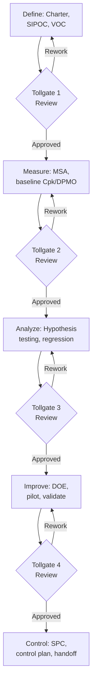

## Six Sigma DMAIC Methodology


### Overview

DMAIC (Define, Measure, Analyze, Improve, Control) is the core structured problem-solving methodology of Six Sigma, used to improve existing processes by systematically reducing variation and defects using statistical rigor. Developed at Motorola in the 1980s and refined at General Electric under Jack Welch in the 1990s, Six Sigma takes its name from the statistical goal of achieving a process capability of $6\sigma$ — a defect rate of approximately 3.4 defects per million opportunities (DPMO) once a standard 1.5$\sigma$ long-term process shift is accounted for. In precision metrology and quality control, DMAIC provides the rigorous statistical backbone for investigating chronic measurement variation, gauge capability issues, and process capability shortfalls that simpler PDCA cycles may not resolve on their own.

**Key Points**

- Distinguishes itself from PDCA by its statistical depth — each phase has a defined toolkit of quantitative methods, and progression between phases is typically gated by formal tollgate reviews
- Practitioner roles follow a martial-arts-inspired belt hierarchy: Yellow Belt (basic awareness), Green Belt (part-time project leader), Black Belt (full-time expert, mentors Green Belts), Master Black Belt (organizational Six Sigma strategist)
- DMAIC is applied to existing processes; its counterpart DMADV (or DFSS — Design for Six Sigma) is used for designing new processes or products from scratch
- Heavily reliant on the seven basic QC tools, plus more advanced statistical methods: hypothesis testing, regression analysis, and design of experiments (DOE)

### The Five Phases

#### 1. Define

Establish the problem statement, project scope, goals, and customer requirements (Voice of the Customer, VOC).

- Key deliverable: the **project charter** — documents the business case, problem statement, goal statement, scope, timeline, and team roles
- Key tool: **SIPOC diagram** (Suppliers, Inputs, Process, Outputs, Customers) — a high-level process map establishing boundaries before detailed analysis begins
- Metrology application: defining a project scoped around a specific chronic issue, such as "reduce dimensional nonconformance on Part X's critical bore diameter from 3.2% to under 1% within two quarters"

#### 2. Measure

Establish a reliable baseline of current process performance and validate that the measurement system itself is trustworthy before drawing conclusions from the data.

- Key tool: **Measurement System Analysis (MSA)**, most commonly a **Gauge R&R study**, conducted before any process data is trusted — a foundational Six Sigma principle is that a measurement system must itself be validated before it can be used to characterize a process
- Key tool: **process capability analysis** ($C_p$, $C_{pk}$, $P_p$, $P_{pk}$) to quantify current baseline performance against specification limits
- Key metric: **DPMO (Defects Per Million Opportunities)** and corresponding sigma level, calculated from baseline defect data

$$DPMO = \frac{\text{Number of Defects}}{\text{Number of Units} \times \text{Opportunities per Unit}} \times 1{,}000{,}000$$

#### 3. Analyze

Identify and statistically validate the root cause(s) of the problem, distinguishing correlation from causation.

- Key tools: hypothesis testing (t-tests, ANOVA, chi-square tests) to statistically confirm whether observed differences (between machines, operators, shifts, or lots) are significant or attributable to random variation
- Key tool: **regression analysis** to quantify the relationship between input variables (X's) and the output response (Y), often expressed in Six Sigma shorthand as $Y = f(X)$
- Key tool: fishbone diagrams and 5 Whys to structure root cause hypotheses before statistical testing narrows them down

#### 4. Improve

Develop, test, and implement solutions that address the validated root cause(s), typically piloted before full-scale rollout.

- Key tool: **Design of Experiments (DOE)** — structured, statistically efficient experimentation (e.g., full factorial or fractional factorial designs) to determine optimal process parameter settings, superior to one-factor-at-a-time testing for detecting interaction effects between variables
- Key tool: piloting the improved process on a limited scale and statistically confirming the improvement (e.g., via a paired t-test comparing before/after capability)
- Overlaps directly with the Do/Check portion of a PDCA sub-cycle

#### 5. Control

Institutionalize the improvement and ensure the gains are sustained over time, preventing regression to the prior state.

- Key tool: **Statistical Process Control (SPC)** via control charts, to monitor the improved process continuously and detect special-cause variation before it produces defects
- Key deliverable: the **Control Plan** — documents the standardized process, monitoring frequency, control limits, and reaction plan for out-of-control conditions
- Key tool: **Response Plan / Reaction Plan** — a documented procedure for what to do when the control chart signals an out-of-control condition

### Diagram: DMAIC Cycle (svg_diagram)

<svg xmlns="http://www.w3.org/2000/svg" viewBox="0 0 600 200">
<title>DMAIC Cycle (svg_diagram)</title>
<g font-size="12" text-anchor="middle">
<rect x="10" y="60" width="100" height="60" rx="8" fill="#ebf8ff" stroke="#2b6cb0" stroke-width="2" />
<text x="60" y="95" font-weight="bold">Define</text>



```
<rect x="130" y="60" width="100" height="60" rx="8" fill="#f0fff4" stroke="#2f855a" stroke-width="2" />
<text x="180" y="95" font-weight="bold">Measure</text>

<rect x="250" y="60" width="100" height="60" rx="8" fill="#fffaf0" stroke="#c05621" stroke-width="2" />
<text x="300" y="95" font-weight="bold">Analyze</text>

<rect x="370" y="60" width="100" height="60" rx="8" fill="#faf5ff" stroke="#805ad5" stroke-width="2" />
<text x="420" y="95" font-weight="bold">Improve</text>

<rect x="490" y="60" width="100" height="60" rx="8" fill="#fff5f5" stroke="#c53030" stroke-width="2" />
<text x="540" y="95" font-weight="bold">Control</text>

<line x1="110" y1="90" x2="128" y2="90" stroke="#333" stroke-width="2" marker-end="url(#arrowd)" />
<line x1="230" y1="90" x2="248" y2="90" stroke="#333" stroke-width="2" marker-end="url(#arrowd)" />
<line x1="350" y1="90" x2="368" y2="90" stroke="#333" stroke-width="2" marker-end="url(#arrowd)" />
<line x1="470" y1="90" x2="488" y2="90" stroke="#333" stroke-width="2" marker-end="url(#arrowd)" />
```

</g>
<text x="60" y="145" font-size="9" text-anchor="middle">Charter, SIPOC, VOC</text>
<text x="180" y="145" font-size="9" text-anchor="middle">MSA, Cpk baseline</text>
<text x="300" y="145" font-size="9" text-anchor="middle">Hypothesis testing,<br />regression</text>
<text x="420" y="145" font-size="9" text-anchor="middle">DOE, piloting</text>
<text x="540" y="145" font-size="9" text-anchor="middle">SPC, control plan</text>
</svg>

### Application to a Metrology/Process Capability Problem

**Example**

- **Define**: Charter targets reducing scrap on a critical bore diameter from 3.2% to under 1% within one quarter; SIPOC establishes the process boundary from raw casting through final CMM inspection
- **Measure**: A Gauge R&R study confirms the CMM measurement system is acceptable (%GRR = 8%); baseline process capability is calculated at $C_{pk} = 0.95$ against a two-sided tolerance, confirming the process is not currently capable
- **Analyze**: ANOVA across three machining cells reveals a statistically significant difference in mean bore diameter between cells ($p < 0.05$); regression analysis identifies coolant temperature as a significant predictor of dimensional drift within the worst-performing cell
- **Improve**: A fractional factorial DOE tests coolant temperature, feed rate, and tool wear interval; optimal settings identified and piloted, raising $C_{pk}$ to 1.45 on the pilot cell
- **Control**: An $\bar{X}$-R control chart is implemented on the bore diameter with a documented reaction plan; the control plan mandates coolant temperature monitoring as a new process input control, and the improvement is rolled out to the remaining two cells

### DMAIC vs. PDCA vs. DMADV

| Framework | Best Suited For | Statistical Rigor | Typical Duration |
| --- | --- | --- | --- |
| PDCA | General, often lower-complexity improvement cycles | Variable, often qualitative | Days to weeks |
| DMAIC | Improving an existing process with a measurable, chronic problem | High — formal hypothesis testing, DOE | Weeks to months |
| DMADV/DFSS | Designing a new process or product to meet a Six Sigma capability target from inception | High, plus design/simulation tools | Months |

### Mermaid: DMAIC Tollgate Review Flow



### Common Pitfalls

- Skipping or rushing the Measure phase's MSA validation step — drawing statistical conclusions in Analyze from a measurement system that has not itself been validated invalidates the entire downstream analysis
- Jumping to Improve before root cause is statistically confirmed in Analyze, resulting in solutions that address symptoms rather than causes
- Weak Control phase execution — implementing an improvement without a sustained monitoring plan is a common failure mode, since gains achieved in Improve frequently erode without an active control chart and documented reaction plan
- Over-applying DMAIC's full statistical rigor to problems simple enough for a lighter PDCA cycle, consuming disproportionate time and resources relative to the problem's impact

**Related Topics**

- Gauge R&R and measurement system analysis
- Process capability analysis ($C_p$, $C_{pk}$, $P_p$, $P_{pk}$)
- Design of Experiments (DOE)
- Statistical Process Control (SPC) and control charts
- Seven basic quality control tools
- PDCA cycle
- Design for Six Sigma (DFSS) / DMADV