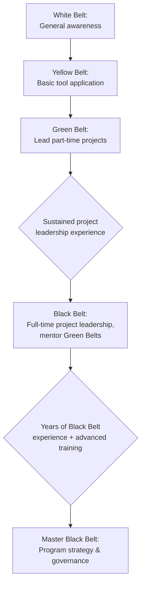

## Lean Six Sigma Belt Structure

### Overview

The Lean Six Sigma belt structure is a tiered certification and organizational hierarchy, borrowed metaphorically from martial arts ranking systems, used to denote an individual's level of training, expertise, and organizational responsibility within a Lean Six Sigma deployment. Rather than a single certifying body, belt requirements and curricula are defined independently by professional bodies (such as ASQ and IASSC) and individual organizations, so specific requirements vary, but the general hierarchy and role expectations are broadly consistent across implementations. In a precision metrology and quality control organization, belt-holders typically lead or support DMAIC projects targeting measurement system capability, calibration program efficiency, and process capability improvement.

**Key Points**

- No single global certifying authority exists — certification bodies include ASQ (American Society for Quality), IASSC (International Association for Six Sigma Certification), and many corporate internal certification programs, each with somewhat different requirements
- Belt levels generally denote both depth of statistical training and scope of project leadership responsibility, not merely completion of a training course
- Certification commonly requires demonstrating competency through a combination of training, examination, and (for Green Belt and above) completion of a documented improvement project with measurable results
- The structure integrates Lean tools (5S, kanban, value stream mapping, poka-yoke) alongside Six Sigma's statistical DMAIC methodology, reflecting the merged "Lean Six Sigma" discipline

### The Belt Hierarchy

#### White Belt

Entry-level awareness training, typically a half-day to one-day introduction to basic Lean Six Sigma concepts and terminology.

- Role: general awareness for all employees; may participate in improvement projects as a team member but does not lead them
- Typical training: introduction to the eight wastes, basic PDCA, and the concept of DMAIC at a high level

#### Yellow Belt

Foundational-level training providing enough statistical and process literacy to actively participate in DMAIC projects as a team member and apply basic quality tools independently.

- Role: supports Green Belt/Black Belt-led projects; may independently apply the seven basic QC tools (check sheets, Pareto charts, fishbone diagrams) to local problems
- Typical training: 2–3 days; covers basic statistics, process mapping, and the seven basic QC tools
- Metrology application: an inspector trained to Yellow Belt level can independently construct and interpret a Pareto chart of nonconformance types or maintain a control chart, without leading a full DMAIC project

#### Green Belt

Intermediate-level certification qualifying an individual to lead DMAIC projects part-time, typically alongside their regular job function, usually under the mentorship of a Black Belt.

- Role: leads small-to-medium scope improvement projects (commonly requiring roughly 10–25% of work time); applies statistical tools including hypothesis testing, regression, and basic DOE
- Typical training: 1–2 weeks of classroom instruction plus a certification project demonstrating measurable process improvement, commonly required by certifying bodies such as ASQ
- Metrology application: a quality engineer certified as Green Belt might lead a project reducing Gauge R&R variation on a critical characteristic, applying ANOVA-based Gauge R&R analysis and control charting independently

#### Black Belt

Advanced-level certification qualifying an individual as a full-time (or majority-time) Six Sigma project leader and internal expert, typically also responsible for mentoring Green Belts.

- Role: leads larger-scope, higher-complexity, cross-functional DMAIC projects; applies advanced statistical methods including full/fractional factorial DOE, multiple regression, and advanced hypothesis testing; mentors Green Belts on their projects
- Typical training: 4–5 weeks of classroom instruction (often delivered over several months) plus one or more certification projects with documented, quantified financial or quality impact
- Metrology application: a Black Belt might lead a facility-wide project establishing a statistically optimized calibration interval program using reliability-based interval analysis across the entire gauge population, coordinating input from multiple departments

#### Master Black Belt

The most advanced tier, representing organizational-level Six Sigma strategy, training, and program governance rather than individual project execution.

- Role: trains and certifies Black Belts and Green Belts; selects and prioritizes the organization's Six Sigma project portfolio; serves as the primary statistical and methodological authority within the organization; often reports directly to senior leadership on program-wide results
- Typical path: several years of Black Belt project experience, plus additional advanced statistical and change-management training
- Metrology application: a Master Black Belt might be responsible for establishing organization-wide standards for measurement system analysis methodology, training curriculum, and DMAIC project selection criteria across all quality and metrology functions

### Diagram: Belt Hierarchy (svg_diagram)

<svg xmlns="http://www.w3.org/2000/svg" viewBox="0 0 500 320">
<title>Lean Six Sigma Belt Hierarchy (svg_diagram)</title>
<g font-size="12">
<rect x="150" y="10" width="200" height="40" fill="#f7fafc" stroke="#4a5568" stroke-width="2" />
<text x="250" y="35" text-anchor="middle" font-weight="bold">White Belt</text>



```
<rect x="130" y="65" width="240" height="40" fill="#fefcbf" stroke="#975a16" stroke-width="2" />
<text x="250" y="90" text-anchor="middle" font-weight="bold">Yellow Belt</text>

<rect x="110" y="120" width="280" height="45" fill="#c6f6d5" stroke="#2f855a" stroke-width="2" />
<text x="250" y="140" text-anchor="middle" font-weight="bold">Green Belt</text>
<text x="250" y="155" text-anchor="middle" font-size="9">Part-time project lead</text>

<rect x="80" y="180" width="340" height="50" fill="#2d3748" stroke="#1a202c" stroke-width="2" />
<text x="250" y="202" text-anchor="middle" font-weight="bold" fill="white">Black Belt</text>
<text x="250" y="218" text-anchor="middle" font-size="9" fill="#cbd5e0">Full-time project lead, mentors Green Belts</text>

<rect x="50" y="245" width="400" height="55" fill="#1a1a1a" stroke="#000" stroke-width="2" />
<text x="250" y="270" text-anchor="middle" font-weight="bold" fill="white">Master Black Belt</text>
<text x="250" y="286" text-anchor="middle" font-size="9" fill="#cbd5e0">Program strategy, trains Black Belts</text>
```

</g>
</svg>

### Belt Comparison Table

| Belt | Typical Time Commitment | Project Leadership Scope | Statistical Depth |
| --- | --- | --- | --- |
| White | Awareness only | None | Basic terminology |
| Yellow | Part of regular duties | Supports projects as team member | Seven basic QC tools |
| Green | ~10-25% of work time | Leads small/medium DMAIC projects | Hypothesis testing, basic DOE |
| Black | Full-time or majority-time | Leads large, cross-functional projects; mentors Green Belts | Advanced DOE, multiple regression |
| Master Black | Full-time, strategic | Governs organization's entire Six Sigma program | Expert-level, trains other belts |

### Certification Requirements (General Pattern)

While specific requirements vary by certifying body, a common pattern across ASQ, IASSC, and most corporate programs includes:

- Completion of formal training hours appropriate to the belt level
- Passing a written examination covering the relevant statistical and methodological content
- For Green Belt and above: successful completion of at least one real improvement project with documented, quantified before/after results, often requiring sign-off from a mentor or the organization's quality function
- [Inference: exact examination formats, minimum training hours, and project documentation requirements differ meaningfully between certifying bodies and individual organizations, so a specific numeric requirement should be verified against the certifying body or internal program in question rather than assumed universal]

### Mermaid: Typical Career Progression Path



### Application in a Metrology-Focused Organization

**Example**

A quality department structures its Lean Six Sigma program so that all inspectors and calibration technicians receive Yellow Belt training as a baseline, enabling them to independently maintain control charts and construct Pareto analyses of recurring nonconformance types. Quality engineers pursue Green Belt certification, each leading one DMAIC project annually targeting a specific measurement or process capability gap (e.g., reducing %GRR on a specific gauge family). A senior metrology engineer holds Black Belt certification and leads the facility's highest-priority annual project — such as redesigning the calibration interval methodology across the entire gauge inventory — while mentoring the Green Belt-certified engineers on their smaller-scope projects.

**Related Topics**

- Six Sigma DMAIC methodology
- Design of Experiments (DOE)
- Gauge R&R and measurement system analysis
- Seven basic quality control tools
- PDCA cycle
- Design for Six Sigma (DFSS)
- Hoshin Kanri policy deployment (project selection alignment)