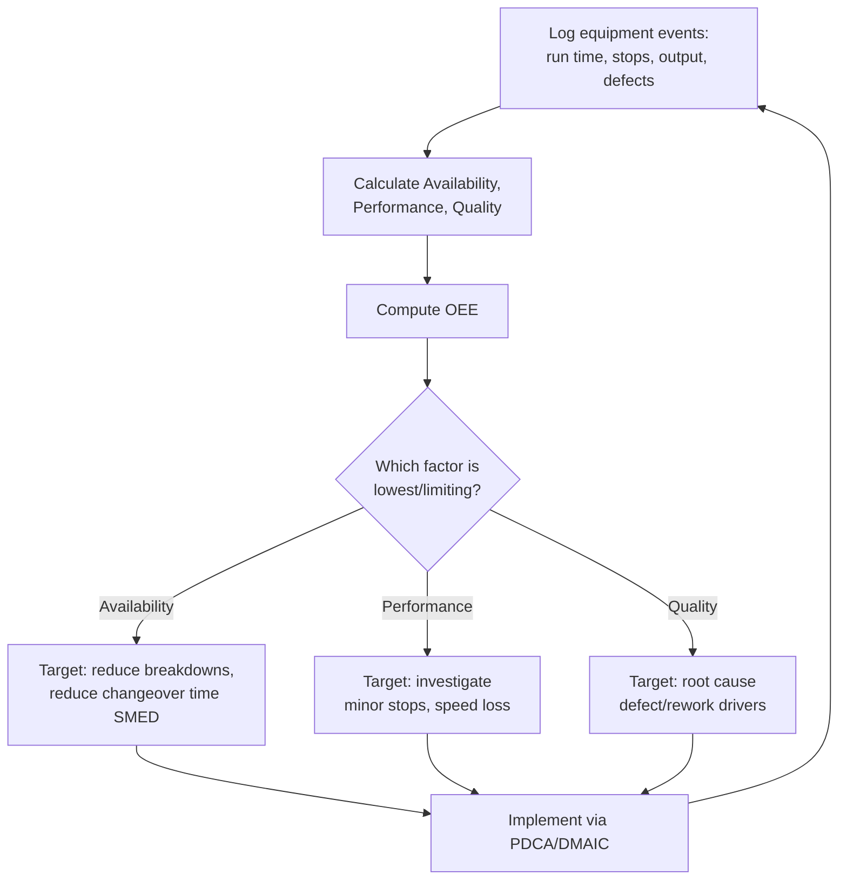

## Overall Equipment Effectiveness

### Overview

Overall Equipment Effectiveness (OEE) is a standardized metric used to quantify how effectively a piece of equipment, production line, or measurement instrument is utilized relative to its full theoretical productive potential, by combining three independent loss factors — Availability, Performance, and Quality — into a single composite percentage. Developed within the Total Productive Maintenance (TPM) framework by Seiichi Nakajima, OEE is one of the most widely adopted metrics in Lean manufacturing for diagnosing equipment-related losses. In precision metrology, OEE is applied both to production equipment and, distinctively, to measurement equipment itself (CMMs, automated gauging stations), where equipment downtime and measurement throughput directly gate overall production flow.

**Key Points**

- OEE = Availability × Performance × Quality, each expressed as a decimal fraction, with the product expressed as a percentage
- A "world-class" OEE benchmark is commonly cited as 85%, though this figure originated in discrete manufacturing contexts and should be treated as an industry reference point rather than a universal target [Inference: applicable benchmarks vary substantially by industry, equipment type, and process complexity]
- OEE decomposes total available time into six classic "Big Losses": breakdowns and setup/adjustment (Availability losses), idling/minor stops and reduced speed (Performance losses), and process defects and reduced yield (Quality losses)
- In metrology contexts, OEE applied to a CMM or automated gauging station reveals whether inspection capacity — not just production capacity — is a hidden constraint on overall throughput

### The Three OEE Components

#### Availability

The ratio of actual run time to planned production time, capturing losses from unplanned downtime (breakdowns, failures) and planned stops (changeovers, setup, calibration).

$$\text{Availability} = \frac{\text{Run Time}}{\text{Planned Production Time}}$$

Metrology-specific consideration: a CMM's "Availability" loss should explicitly separate calibration/qualification downtime (necessary, value-preserving) from unplanned breakdown or probe failure downtime (pure loss), since these carry very different improvement implications.

#### Performance

The ratio of actual output rate to the theoretical maximum (ideal) rate, capturing losses from running slower than the equipment's rated speed and from minor stops too brief to be logged as full downtime events.

$$\text{Performance} = \frac{\text{Ideal Cycle Time} \times \text{Total Count}}{\text{Run Time}}$$

Metrology-specific consideration: a CMM running a measurement program at a conservative speed to protect probe accuracy, or experiencing frequent brief pauses for manual part reorientation, shows Performance loss distinct from downtime.

#### Quality

The ratio of good (conforming) units produced to total units started, capturing losses from scrap, rework, and startup/yield losses.

$$\text{Quality} = \frac{\text{Good Count}}{\text{Total Count}}$$

Metrology-specific consideration: for a measurement process itself, "Quality" loss can capture the rate of measurement redos caused by probe crashes, incorrect program execution, or invalid measurement conditions requiring re-inspection.

### The OEE Formula

$$OEE = \text{Availability} \times \text{Performance} \times \text{Quality}$$

**Example**

A CMM is scheduled for 8 hours (480 minutes) of planned production time per shift.

- Run time: 400 minutes (80 minutes lost to a probe recalibration event and an unplanned software fault) → Availability = 400/480 = 0.833
- Ideal cycle time is 2 minutes per part; 180 parts were measured in the 400 minutes of run time → ideal time for 180 parts = 360 minutes → Performance = 360/400 = 0.900
- Of 180 parts measured, 174 produced valid, usable measurement results (6 required re-measurement due to fixture slippage) → Quality = 174/180 = 0.967

$$OEE = 0.833 \times 0.900 \times 0.967 = 0.725 \text{ (72.5\%)}$$

### Diagram: OEE Loss Waterfall (svg_diagram)

<svg xmlns="http://www.w3.org/2000/svg" viewBox="0 0 560 300">
<title>OEE Loss Waterfall (svg_diagram)</title>
<g font-size="11">
<rect x="20" y="20" width="520" height="35" fill="#2b6cb0" />
<text x="280" y="43" text-anchor="middle" fill="white" font-weight="bold">Planned Production Time (480 min)</text>



```
<rect x="20" y="65" width="433" height="30" fill="#4299e1" />
<rect x="453" y="65" width="87" height="30" fill="#e2e8f0" />
<text x="236" y="85" text-anchor="middle" fill="white" font-size="10">Run Time (400 min)</text>
<text x="497" y="85" text-anchor="middle" font-size="9">Downtime loss (80)</text>
<text x="280" y="110" text-anchor="middle" font-weight="bold" fill="#2b6cb0">Availability = 83.3%</text>

<rect x="20" y="135" width="390" height="30" fill="#38a169" />
<rect x="410" y="135" width="43" height="30" fill="#e2e8f0" />
<text x="215" y="155" text-anchor="middle" fill="white" font-size="10">Ideal-equivalent Time (360 min)</text>
<text x="280" y="180" text-anchor="middle" font-weight="bold" fill="#2f855a">Performance = 90.0%</text>

<rect x="20" y="205" width="377" height="30" fill="#c05621" />
<rect x="397" y="205" width="13" height="30" fill="#e2e8f0" />
<text x="208" y="225" text-anchor="middle" fill="white" font-size="10">Good Output (174 parts equiv.)</text>
<text x="280" y="250" text-anchor="middle" font-weight="bold" fill="#c05621">Quality = 96.7%</text>
```

</g>
<text x="280" y="280" font-size="14" font-weight="bold" text-anchor="middle" fill="#1a365d">OEE = 83.3% × 90.0% × 96.7% ≈ 72.5%</text>
</svg>

### The Six Big Losses

| Category | Loss Type | Affects |
| --- | --- | --- |
| Downtime | Equipment breakdown/failure | Availability |
| Downtime | Setup and adjustment (changeover) | Availability |
| Speed | Idling and minor stops | Performance |
| Speed | Reduced speed operation | Performance |
| Quality | Process defects (scrap/rework) | Quality |
| Quality | Reduced yield (startup losses) | Quality |

### Mermaid: OEE Data Collection and Improvement Loop



### Applying OEE to a Measurement/Inspection Station

Applying OEE to inspection equipment — rather than only production equipment — surfaces a distinct class of hidden constraint: a CMM or automated gauge with low OEE can bottleneck an entire production line even when upstream machining equipment shows high OEE, since parts cannot ship until inspection is complete. This makes OEE a natural complement to value stream mapping, which visually identifies the queue/wait time such a bottleneck produces, while OEE quantifies why the bottleneck station itself is underperforming.

**Example**

Two production cells feed a single shared CMM. Both machining cells individually show OEE above 88%, but the shared CMM's OEE is 61%, driven primarily by low Availability (frequent probe requalification stops) and low Performance (a conservative measurement speed adopted after past probe-crash incidents). Despite excellent machining performance, overall line throughput is capped by the CMM's OEE — directing improvement effort toward the measurement station rather than the machining cells, which a purely production-focused metric would have missed.

### OEE Benchmarks and Interpretation

| OEE Range | Common Interpretation |
| --- | --- |
| Below 65% | Typically indicates significant, often untracked loss; common starting point before OEE tracking is introduced |
| 65-75% | Below the commonly cited "world-class" reference, but not unusual for early-stage improvement efforts |
| 75-85% | Approaching, or at, commonly referenced benchmark ranges depending on industry |
| Above 85% | Often cited as a general "world-class" reference point, though the appropriate target varies by equipment type and industry [Inference] |

### Common Pitfalls

- Setting an ideal cycle time (used in the Performance calculation) based on an aspirational rather than a validated achievable rate, which distorts the Performance figure and makes cross-equipment comparisons unreliable
- Failing to separate planned, value-adding downtime (such as necessary gauge calibration or qualification) from true unplanned loss when calculating Availability, which can make a well-maintained measurement station appear artificially worse than an under-maintained one
- Tracking OEE only for production equipment while ignoring measurement/inspection equipment, missing inspection-station bottlenecks that gate overall line throughput
- Treating a single "world-class" OEE benchmark as a universal target without adjusting for equipment type, industry, and process complexity

**Related Topics**

- Total Productive Maintenance (TPM)
- Value stream mapping
- Single-Minute Exchange of Die (SMED)
- Process capability analysis ($C_p$, $C_{pk}$)
- Statistical Process Control (SPC)
- Six Sigma DMAIC methodology
- Kanban and pull systems