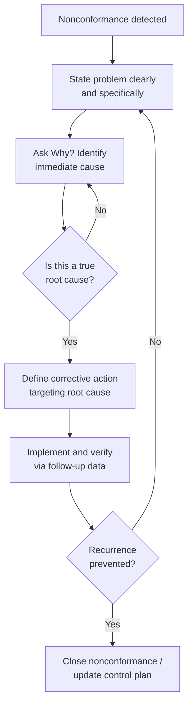

## Five Whys Analysis

### Overview

The Five Whys is a simple, iterative root cause analysis technique in which the question "why?" is asked repeatedly — conventionally five times, though not rigidly fixed at that number — to trace a problem's visible symptom back through successive causal layers to its true underlying root cause. Developed within the Toyota Production System by Sakichi Toyoda and formalized by Taiichi Ohno, Five Whys is valued for requiring no specialized statistical training while still systematically preventing teams from stopping their investigation at a superficial or symptomatic cause. In precision metrology and quality control, Five Whys is frequently the first analytical step applied to a nonconformance before more statistically rigorous tools (hypothesis testing, DOE) are brought in to validate the hypothesis it generates.

**Key Points**

- "Five" is a convention, not a strict rule — the technique concludes when a true root cause (something within the organization's control to fix, and whose correction would prevent recurrence) is reached, which may take fewer or more than five iterations
- Distinguishes a root cause from a contributing factor: a root cause, once corrected, prevents the problem from recurring; a contributing factor merely made the problem more likely or more severe
- Commonly used in combination with a fishbone (Ishikawa) diagram — fishbone identifies candidate cause categories broadly, while Five Whys drills vertically into a single causal chain
- Frequently the initial qualitative analysis step within the Analyze phase of Six Sigma's DMAIC methodology, generating hypotheses that are then statistically validated

### The Core Process

#### 1. Define the Problem Clearly

State the observed problem precisely and specifically, avoiding vague or overly broad framing — a poorly defined starting problem statement propagates imprecision through every subsequent "why."

#### 2. Ask "Why did this happen?"

Identify the immediate, most direct cause of the stated problem, based on verified fact where possible rather than assumption.

#### 3. Repeat for Each Successive Answer

Take the answer to each "why" and ask "why" again, treating the previous answer as the new problem to explain — continuing until the team reaches a cause that is both actionable and, if corrected, would prevent recurrence.

#### 4. Identify the Root Cause

Recognize when the causal chain has reached a true root cause — typically a process, procedural, training, or system-design gap — rather than continuing to a cause outside the organization's control (such as "the operator made a mistake," which is itself usually a symptom of an inadequate process design or missing poka-yoke).

#### 5. Develop and Verify the Corrective Action

Propose a corrective action targeting the identified root cause, and verify — ideally through data collected after implementation — that the corrective action actually prevents recurrence, closing the loop into a PDCA cycle.

### Worked Example: Metrology Application

**Example**

**Problem**: A batch of precision-machined shafts was shipped with bore diameters outside the specified tolerance, discovered by the customer rather than by internal inspection.

1. **Why were out-of-tolerance shafts shipped?**

   Because the final inspection step did not detect the out-of-tolerance condition before shipment.
2. **Why didn't final inspection detect it?**

   Because the CMM used for final inspection was reading within tolerance, but its readings were biased due to an uncorrected calibration offset.
3. **Why was there an uncorrected calibration offset?**

   Because the CMM's most recent calibration certificate showed a bias correction factor that was not applied to the inspection program.
4. **Why was the bias correction factor not applied?**

   Because the calibration technician's certificate hand-off process does not require confirmation that correction factors are entered into the inspection program before the gauge is returned to service.
5. **Why does the hand-off process not require this confirmation?**

   Because no standard work instruction defines a mandatory verification step between calibration certificate issuance and inspection program update — this is the root cause.

**Root cause**: Absence of a standardized, mandatory verification step linking calibration certificate data to inspection program configuration.

**Corrective action**: Implement a poka-yoke-style control requiring inspection program sign-off against the current calibration certificate before a gauge is released to production use, with the control formally documented in a revised calibration hand-off work instruction.

### Diagram: Five Whys Causal Chain (svg_diagram)

<svg xmlns="http://www.w3.org/2000/svg" viewBox="0 0 560 340">
<title>Five Whys Causal Chain (svg_diagram)</title>
<g font-size="10">
<rect x="20" y="10" width="520" height="35" fill="#c53030" rx="5" />
<text x="280" y="32" text-anchor="middle" fill="white" font-weight="bold">Problem: Out-of-tolerance shafts shipped</text>



```
<line x1="280" y1="45" x2="280" y2="60" stroke="#333" stroke-width="2" marker-end="url(#arrow5w)" />
<rect x="20" y="60" width="520" height="35" fill="#fed7d7" stroke="#c53030" rx="5" />
<text x="280" y="82" text-anchor="middle">Why 1: Final inspection didn't detect it</text>

<line x1="280" y1="95" x2="280" y2="110" stroke="#333" stroke-width="2" marker-end="url(#arrow5w)" />
<rect x="20" y="110" width="520" height="35" fill="#feebc8" stroke="#c05621" rx="5" />
<text x="280" y="132" text-anchor="middle">Why 2: CMM readings biased by calibration offset</text>

<line x1="280" y1="145" x2="280" y2="160" stroke="#333" stroke-width="2" marker-end="url(#arrow5w)" />
<rect x="20" y="160" width="520" height="35" fill="#fefcbf" stroke="#975a16" rx="5" />
<text x="280" y="182" text-anchor="middle">Why 3: Bias correction factor not applied to program</text>

<line x1="280" y1="195" x2="280" y2="210" stroke="#333" stroke-width="2" marker-end="url(#arrow5w)" />
<rect x="20" y="210" width="520" height="35" fill="#c6f6d5" stroke="#2f855a" rx="5" />
<text x="280" y="232" text-anchor="middle">Why 4: Hand-off process lacks confirmation step</text>

<line x1="280" y1="245" x2="280" y2="260" stroke="#333" stroke-width="2" marker-end="url(#arrow5w)" />
<rect x="20" y="260" width="520" height="45" fill="#2f855a" rx="5" />
<text x="280" y="280" text-anchor="middle" fill="white" font-weight="bold">Why 5 (Root Cause): No standard work instruction</text>
<text x="280" y="294" text-anchor="middle" fill="white" font-weight="bold">requires calibration-to-program verification</text>
```

</g>
</svg>

### Five Whys vs. Related Root Cause Tools

| Tool | Structure | Best Suited For |
| --- | --- | --- |
| Five Whys | Linear, single causal chain | Focused problems with one dominant causal pathway |
| Fishbone (Ishikawa) diagram | Branching, multi-category | Broad brainstorming across several candidate cause categories before drilling down |
| Fault Tree Analysis (FTA) | Branching, logic-gated (AND/OR) | Complex systems with multiple independent or combined failure pathways |
| Statistical hypothesis testing | Quantitative, data-driven | Validating (not generating) a root cause hypothesis with statistical confidence |

### Mermaid: Five Whys Within a Broader Corrective Action Process



### Common Pitfalls

- Stopping the analysis at a cause that is convenient or easy to accept (often "operator error") rather than continuing to the underlying system, process, or design gap that allowed the error to occur and go undetected
- Relying on assumption or opinion at each "why" step rather than verified fact — each answer should be checked against evidence where possible, not simply the most plausible-sounding explanation
- Treating Five Whys as adequate for problems with multiple independent contributing causes; a single linear chain cannot represent a genuinely branching causal structure, which calls for a fishbone diagram or fault tree instead
- Skipping the verification step after implementing a corrective action — without confirming the fix actually prevents recurrence, the "root cause" identified may have been incomplete or incorrect

**Related Topics**

- Seven basic quality control tools (fishbone diagram)
- Six Sigma DMAIC methodology (Analyze phase)
- Poka-yoke mistake-proofing techniques
- Fault Tree Analysis (FTA)
- Failure Mode and Effects Analysis (FMEA)
- Corrective and Preventive Action (CAPA) systems
- PDCA cycle