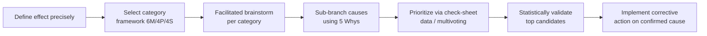

## Cause and Effect Diagrams

### Overview

A cause-and-effect diagram — most commonly known as an Ishikawa diagram or fishbone diagram due to its visual resemblance to a fish skeleton — is a structured brainstorming tool used to systematically identify and organize the potential causes of a specific effect (typically a defect, failure, or quality problem). Developed by Kaoru Ishikawa in the 1960s as part of Japan's broader quality movement, it is one of the seven basic quality control tools and remains among the most widely applied root cause analysis tools in manufacturing and metrology, precisely because it structures group brainstorming without requiring statistical expertise to construct or interpret.

**Key Points**

- Also called an Ishikawa diagram (after its creator) or fishbone diagram (after its visual shape)
- Organizes potential causes into major categories branching off a central spine that points to the effect, preventing brainstorming from becoming an unstructured, disorganized list
- Distinguishes itself from Five Whys by branching broadly across multiple candidate cause categories simultaneously, rather than drilling linearly down a single causal chain — the two tools are frequently used together, with fishbone providing breadth and Five Whys providing depth on a selected branch
- A cause-and-effect diagram generates hypotheses; it does not itself statistically validate which candidate cause is the true driver — that validation typically requires data collection and, for rigorous confirmation, hypothesis testing

### Standard Structure

- **Head (effect)**: a box on the right side of the diagram stating the specific problem or defect being investigated, written as precisely as possible
- **Spine**: a horizontal line running from the head back to the left, serving as the diagram's backbone
- **Major category branches**: large diagonal lines off the spine, each labeled with a major cause category
- **Sub-causes**: smaller branches off each major category line, representing more specific candidate causes within that category, which can themselves be further sub-branched for greater specificity

### Standard Category Frameworks

Different major-category conventions are used depending on industry context; manufacturing environments, including precision metrology, most commonly use the 6M framework.

| Framework | Categories | Typical Context |
| --- | --- | --- |
| 6M (Manufacturing) | Man, Machine, Method, Material, Measurement, Mother Nature (Environment) | Manufacturing and metrology processes |
| 4P | People, Process, Policies, Plant | Service and administrative processes |
| 4S | Surroundings, Suppliers, Systems, Skills | Service industries |

The inclusion of "Measurement" as its own explicit category in the 6M framework is particularly relevant to metrology applications, since it separates true process variation from variation introduced by the measurement system itself — a distinction that Gauge R&R studies are specifically designed to quantify.

### Diagram: Fishbone Structure with 6M Categories (svg_diagram)

<svg xmlns="http://www.w3.org/2000/svg" viewBox="0 0 620 400">
<title>Cause and Effect (Fishbone) Diagram Structure (svg_diagram)</title>
<g font-size="11">
<line x1="20" y1="200" x2="480" y2="200" stroke="#333" stroke-width="3" />
<polygon points="480,190 480,210 510,200" fill="#c53030" />
<rect x="510" y="180" width="100" height="40" fill="#c53030" rx="4" />
<text x="560" y="204" text-anchor="middle" fill="white" font-weight="bold" font-size="10">Out-of-tolerance</text>



```

<line x1="120" y1="200" x2="70" y2="60" stroke="#2b6cb0" stroke-width="2" />
<text x="60" y="50" fill="#1a365d" font-weight="bold">Man</text>
<line x1="95" y1="130" x2="130" y2="120" stroke="#666" stroke-width="1" />
<text x="60" y="115" font-size="9">Training gap</text>

<line x1="220" y1="200" x2="190" y2="60" stroke="#2f855a" stroke-width="2" />
<text x="180" y="50" fill="#1c4532" font-weight="bold">Machine</text>
<text x="180" y="115" font-size="9">Spindle wear</text>

<line x1="320" y1="200" x2="310" y2="60" stroke="#c05621" stroke-width="2" />
<text x="300" y="50" fill="#652b19" font-weight="bold">Method</text>
<text x="290" y="115" font-size="9">No standard work</text>


<line x1="120" y1="200" x2="70" y2="340" stroke="#805ad5" stroke-width="2" />
<text x="55" y="360" fill="#44337a" font-weight="bold">Material</text>
<text x="50" y="300" font-size="9">Lot variation</text>

<line x1="220" y1="200" x2="190" y2="340" stroke="#c53030" stroke-width="2" />
<text x="160" y="360" fill="#742a2a" font-weight="bold">Measurement</text>
<text x="180" y="300" font-size="9">Gauge bias</text>

<line x1="320" y1="200" x2="310" y2="340" stroke="#975a16" stroke-width="2" />
<text x="270" y="360" fill="#5f370e" font-weight="bold">Mother Nature</text>
<text x="290" y="300" font-size="9">Temp fluctuation</text>
```

</g>
</svg>

### Constructing a Cause-and-Effect Diagram

#### 1. Define the Effect Precisely

State the specific problem in the head box — vague problem statements ("bad quality") produce unfocused brainstorming; specific statements ("bore diameter measures 0.15mm oversize on Line 3") produce actionable branches.

#### 2. Select the Category Framework

Choose 6M, 4P, 4S, or a custom framework appropriate to the process being investigated; custom categories are acceptable when the standard frameworks don't fit the context well.

#### 3. Brainstorm Causes Within Each Category

Using a facilitated group session (often the same cross-functional group involved in a quality circle), generate candidate causes under each major category — encouraging quantity over immediate judgment during this phase, deferring evaluation until brainstorming is complete.

#### 4. Sub-Branch for Specificity

For each identified cause, ask "why" iteratively (borrowing directly from Five Whys) to push causes to a more specific, actionable level — "training gap" might sub-branch into "no documented setup procedure" and "no refresher training schedule."

#### 5. Prioritize Candidate Causes for Investigation

Since a fishbone diagram typically generates more candidate causes than can be investigated simultaneously, the team prioritizes — often via multivoting or by cross-referencing against check-sheet frequency data — which branches to pursue first with data collection and statistical validation.

### Application to a Metrology Investigation

**Example**

**Effect**: Repeated Gauge R&R failures (%GRR > 10%) on a caliper-based inspection of a critical bore diameter.

- **Man**: Inconsistent hand pressure applied by different operators; no standardized grip/approach technique documented
- **Machine**: Caliper jaws show wear at contact points, introducing inconsistent contact geometry
- **Method**: No standard work instruction specifies part orientation or number of repeat readings per part
- **Material**: Parts have a slight surface finish variation from two different suppliers, affecting contact consistency
- **Measurement**: Caliper resolution (0.01mm) is only marginally adequate relative to the tolerance band being verified
- **Mother Nature**: Inspection station is near a loading dock door with measurable temperature swings across shifts

Following brainstorming, the team cross-references branches against check-sheet data collected over two weeks and identifies "Man" (technique variation) and "Measurement" (marginal gauge resolution) as the highest-frequency contributing factors, prioritizing those two branches for a formal Gauge R&R study with controlled operator technique and consideration of a higher-resolution instrument.

### Mermaid: Fishbone-to-Validation Workflow



### Cause-and-Effect Diagram vs. Related Tools

| Tool | Direction | Output |
| --- | --- | --- |
| Fishbone/Ishikawa diagram | Broad, multi-category brainstorm | List of categorized candidate causes |
| Five Whys | Narrow, linear drill-down | Single causal chain to root cause |
| Fault Tree Analysis (FTA) | Logic-gated, branching | Probabilistic combination of failure pathways |
| Affinity diagram | Bottom-up clustering of unstructured ideas | Thematic groupings without predefined categories |

### Common Pitfalls

- Allowing the diagram to become a list of symptoms rather than causes — each branch entry should represent something that, if changed, would plausibly affect the frequency or severity of the effect
- Treating the completed diagram as a final answer rather than a hypothesis-generation tool — branches must still be validated against data before corrective action is committed
- Overloading a single diagram with an excessively broad effect statement, producing so many candidate causes that prioritization becomes impractical; splitting into multiple, more specific effect statements is often more productive
- Conducting the brainstorming session with a non-representative group (e.g., engineers only, without frontline operator input), missing causes that are only visible to those who work the process daily — a gap quality circles are specifically structured to close

**Related Topics**

- Five whys analysis
- Seven basic quality control tools
- Gauge R&R and measurement system analysis
- Six Sigma DMAIC methodology (Analyze phase)
- Quality circles
- Fault Tree Analysis (FTA)
- Failure Mode and Effects Analysis (FMEA)