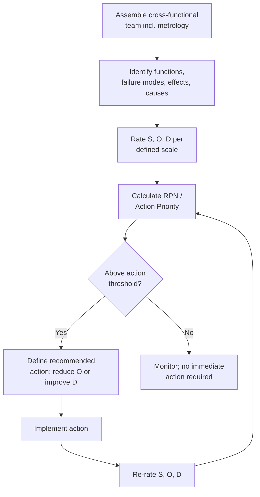

## Failure Mode and Effects Analysis


### Overview

Failure Mode and Effects Analysis (FMEA) is a systematic, proactive risk analysis methodology used to identify potential ways a process, product, or design could fail, assess the severity and likelihood of each failure mode, evaluate how well current controls would detect it, and prioritize corrective action before failures occur. Originally developed by the U.S. military (MIL-P-1629, 1949) and later adopted extensively by NASA and the automotive industry, FMEA is a cornerstone of proactive quality planning, distinguishing itself from most other root cause tools (Five Whys, fishbone diagrams) by being applied before a failure occurs rather than after. In precision metrology, FMEA is applied both to the product/process being manufactured and, distinctly, to the measurement system itself — identifying how a gauge, fixture, or inspection method could fail to detect a nonconformance.

**Key Points**

- Two primary variants: **Design FMEA (DFMEA)**, analyzing potential failure modes in a product design, and **Process FMEA (PFMEA)**, analyzing potential failure modes in a manufacturing or assembly process
- Central output metric: the **Risk Priority Number (RPN)**, calculated as Severity × Occurrence × Detection, used to prioritize which failure modes warrant corrective action first
- Foundational to automotive quality standards (AIAG-VDA FMEA Handbook, IATF 16949) and aerospace quality standards; frequently a required deliverable within APQP (Advanced Product Quality Planning)
- The AIAG-VDA FMEA Handbook (jointly issued by AIAG and VDA, first published 2019) introduced an alternative **Action Priority (AP)** rating system (High/Medium/Low) alongside RPN, addressing known limitations of RPN as a pure multiplicative score

### The Three Core Rating Scales

Each identified potential failure mode is rated on three independent scales, typically 1–10, though 1–5 scales are also used in some implementations.

| Rating | What It Measures | Scale Anchor (1-10, AIAG convention) |
| --- | --- | --- |
| **Severity (S)** | How serious the effect of the failure would be if it occurred | 1 = no discernible effect; 10 = hazardous, without warning, safety/regulatory noncompliance |
| **Occurrence (O)** | How likely the failure mode's cause is to occur | 1 = failure unlikely, no known occurrences; 10 = failure almost inevitable |
| **Detection (D)** | How likely current controls are to detect the failure before it reaches the customer | 1 = detection is almost certain; 10 = no known detection method exists |

Note: for Detection, a lower number represents better (more certain) detection capability — this inverse relationship is a common source of confusion during initial FMEA training.

### Risk Priority Number and Action Priority

$$RPN = S \times O \times D$$

RPN ranges from 1 (lowest risk) to 1000 (highest risk) on a standard 1–10 scale. Failure modes are typically ranked by RPN, with a threshold (organization-defined) triggering mandatory corrective action.

[Inference: RPN's purely multiplicative structure is widely recognized in the FMEA literature as having a significant limitation — different S/O/D combinations can produce identical RPN values despite representing very different risk profiles (e.g., high severity with low occurrence vs. low severity with high occurrence), which is a primary motivation behind the AIAG-VDA Handbook's introduction of the Action Priority table as a complementary, non-multiplicative ranking method that gives severity greater independent weight.]

### The FMEA Process

#### 1. Assemble a Cross-Functional Team

FMEA is inherently a team exercise, typically including design engineering, manufacturing/process engineering, quality engineering, and — critically for metrology-relevant failure modes — inspection/metrology personnel.

#### 2. Define Scope and Function

Establish the boundary of analysis (a specific process step, subsystem, or product feature) and document its intended function or requirement.

#### 3. Identify Potential Failure Modes

For each function, brainstorm the ways it could fail to meet its intended requirement — e.g., "bore diameter measures within tolerance limits" might fail as "bore diameter oversize" or "bore diameter undersize."

#### 4. Identify Potential Effects

For each failure mode, identify the consequence(s) if it reaches the customer or next process step — e.g., "shaft cannot be assembled" or "excessive bearing wear in service."

#### 5. Identify Potential Causes

For each failure mode, identify the root cause(s) that could produce it — this step frequently draws directly on fishbone diagram or Five Whys analysis conducted separately.

#### 6. Identify Current Controls

Document existing prevention controls (that reduce occurrence) and detection controls (that would catch the failure before it escapes) — this is where measurement and inspection methods are explicitly documented and rated.

#### 7. Rate Severity, Occurrence, and Detection

Assign S, O, D ratings using a defined, consistent scale (often a company-standard or AIAG-VDA reference table) to maintain rating consistency across the team and across different FMEAs.

#### 8. Calculate RPN / Determine Action Priority

Calculate RPN and/or apply the AP table to rank failure modes by risk.

#### 9. Define and Implement Recommended Actions

For high-priority failure modes, define specific corrective actions — often targeting Occurrence (via poka-yoke or process control) or Detection (via improved inspection method or increased sampling) — with assigned owners and due dates.

#### 10. Recalculate Risk After Action

Once actions are implemented, re-rate S, O, D and recalculate RPN/AP to confirm risk has been reduced to an acceptable level — closing the loop, conceptually parallel to the Check/Act phases of PDCA.

### Diagram: FMEA Risk Assessment Flow (svg_diagram)

<svg xmlns="http://www.w3.org/2000/svg" viewBox="0 0 620 260">
<title>FMEA Risk Assessment Flow (svg_diagram)</title>
<g font-size="10" text-anchor="middle">
<rect x="10" y="20" width="100" height="45" rx="5" fill="#ebf8ff" stroke="#2b6cb0" stroke-width="2" />
<text x="60" y="40">Function /</text><text x="60" y="53">Requirement</text>



```
<rect x="130" y="20" width="100" height="45" rx="5" fill="#fff5f5" stroke="#c53030" stroke-width="2" />
<text x="180" y="40">Failure</text><text x="180" y="53">Mode</text>

<rect x="250" y="20" width="100" height="45" rx="5" fill="#fffaf0" stroke="#c05621" stroke-width="2" />
<text x="300" y="40">Effect(s)</text>
<text x="300" y="53" font-size="9">→ Severity (S)</text>

<rect x="370" y="20" width="100" height="45" rx="5" fill="#f0fff4" stroke="#2f855a" stroke-width="2" />
<text x="420" y="40">Cause(s)</text>
<text x="420" y="53" font-size="9">→ Occurrence (O)</text>

<rect x="490" y="20" width="120" height="45" rx="5" fill="#faf5ff" stroke="#805ad5" stroke-width="2" />
<text x="550" y="40">Current Controls</text>
<text x="550" y="53" font-size="9">→ Detection (D)</text>

<line x1="110" y1="42" x2="128" y2="42" stroke="#333" stroke-width="2" marker-end="url(#arrowf)" />
<line x1="230" y1="42" x2="248" y2="42" stroke="#333" stroke-width="2" marker-end="url(#arrowf)" />
<line x1="350" y1="42" x2="368" y2="42" stroke="#333" stroke-width="2" marker-end="url(#arrowf)" />
<line x1="470" y1="42" x2="488" y2="42" stroke="#333" stroke-width="2" marker-end="url(#arrowf)" />

<rect x="200" y="110" width="200" height="45" rx="5" fill="#2d3748" />
<text x="300" y="130" fill="white" font-weight="bold">RPN = S × O × D</text>
<text x="300" y="145" fill="#cbd5e0" font-size="9">or Action Priority (AP)</text>

<line x1="300" y1="65" x2="300" y2="108" stroke="#333" stroke-width="2" marker-end="url(#arrowf)" />

<rect x="180" y="180" width="240" height="50" rx="5" fill="#1a365d" />
<text x="300" y="200" fill="white" font-weight="bold">Prioritize &amp; Implement</text>
<text x="300" y="215" fill="#bee3f8" font-size="9">Recommended Actions</text>
<line x1="300" y1="155" x2="300" y2="178" stroke="#333" stroke-width="2" marker-end="url(#arrowf)" />
```

</g>
</svg>

### Application to Metrology: PFMEA for an Inspection Process

**Example**

| Function | Failure Mode | Effect | S | Cause | O | Current Control | D | RPN |
| --- | --- | --- | --- | --- | --- | --- | --- | --- |
| Verify bore diameter within tolerance | Out-of-tolerance part passed as conforming | Nonconforming part ships to customer | 8 | Gauge calibration offset uncorrected in software | 3 | Annual calibration only; no in-process gauge check | 6 | 144 |
| Verify bore diameter within tolerance | Conforming part rejected as nonconforming | Unnecessary scrap/rework cost | 4 | Operator technique variation (contact pressure) | 5 | Visual inspection of technique by supervisor (infrequent) | 7 | 140 |

Following this analysis, the team prioritizes the first failure mode (RPN 144, and notably higher severity) for corrective action: implementing a daily gauge verification check against a certified reference standard before production use, targeting the Detection rating, alongside integrating the calibration correction factor directly into the inspection program to reduce Occurrence — both of which would be re-rated and RPN recalculated once implemented.

### DFMEA vs. PFMEA

| Aspect | Design FMEA (DFMEA) | Process FMEA (PFMEA) |
| --- | --- | --- |
| Scope | Product/component design | Manufacturing/assembly/inspection process |
| Typical failure modes | Design fails to meet functional requirement | Process step fails to produce/verify conforming output |
| Owner | Design engineering | Manufacturing/quality engineering |
| Metrology relevance | Whether the design is measurable/verifiable at all (measurability, GD&T feasibility) | Whether the inspection method reliably detects a given nonconformance |

### Mermaid: FMEA Integration with Corrective Action Cycle



### Common Pitfalls

- Rating Occurrence and Detection based on assumption or optimism rather than actual historical data or validated control effectiveness, producing an artificially low RPN that understates true risk
- Treating a high RPN threshold as the only trigger for action, while ignoring a high Severity rating on its own — a low-probability, high-severity failure mode (e.g., a safety-critical characteristic) often warrants action regardless of its multiplicative RPN, which is precisely the gap the AIAG-VDA Action Priority table was designed to close
- Conducting FMEA as a one-time compliance exercise (e.g., solely to satisfy a customer or IATF 16949 requirement) rather than as a living document updated when the process, design, or failure history changes
- Omitting metrology/inspection personnel from the FMEA team, resulting in Detection ratings that don't accurately reflect the real-world reliability of the measurement method being credited as a control

**Related Topics**

- Cause and effect diagrams
- Five whys analysis
- Advanced Product Quality Planning (APQP)
- Poka-yoke mistake-proofing techniques
- Gauge R&R and measurement system analysis
- Fault Tree Analysis (FTA)
- Six Sigma DMAIC methodology