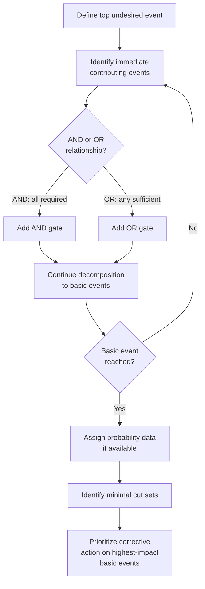

## Fault Tree Analysis

### Overview

Fault Tree Analysis (FTA) is a deductive, top-down failure analysis technique that models the logical relationships between a specific undesired top-level event (typically a system failure or hazard) and its underlying contributing causes, using a graphical tree structure connected by logic gates. Developed at Bell Laboratories in 1962 for the U.S. Air Force's Minuteman missile launch control system, FTA is distinguished from most other root cause tools by its formal use of Boolean logic (AND/OR gates), which allows it to model combinations of failures — capturing situations where a top-level failure requires multiple simultaneous conditions, not just a single causal chain. In precision metrology and quality control, FTA is most valuable for analyzing complex measurement system failures or safety-critical nonconformances where several independent factors must align for a failure to occur.

**Key Points**

- Deductive reasoning (top-down: starting from a known undesired event and working backward to identify its causes), in contrast to FMEA's inductive reasoning (bottom-up: starting from potential causes and working forward to identify their effects)
- Uses formal logic gates — most commonly AND and OR — to represent whether a top event requires all contributing conditions simultaneously (AND) or any one of several conditions independently (OR)
- Enables quantitative analysis: if the probability of each base (root) event is known, the probability of the top event can be calculated using Boolean algebra
- Widely used in aerospace, nuclear, and automotive functional safety standards (e.g., referenced within IEC 61025 and supporting ISO 26262 and SAE ARP4761 safety analyses)

### Core Symbols and Logic Gates

| Symbol | Name | Meaning |
| --- | --- | --- |
| Rectangle | Top event / intermediate event | An event that results from further logical combination of lower events |
| Circle | Basic (root) event | A fundamental cause requiring no further decomposition; probability data typically assigned here |
| AND gate | Logical AND | The output event occurs only if ALL input events occur simultaneously |
| OR gate | Logical OR | The output event occurs if ANY ONE (or more) of the input events occurs |
| Diamond | Undeveloped event | An event not further analyzed, due to insufficient information or because further decomposition is not warranted |
| Triangle | Transfer symbol | Indicates the tree continues on another page/section, used for large trees |

### Diagram: Basic FTA Structure (svg_diagram)

<svg xmlns="http://www.w3.org/2000/svg" viewBox="0 0 580 340">
<title>Fault Tree Analysis Structure (svg_diagram)</title>
<g font-size="10">
<rect x="220" y="10" width="180" height="40" fill="#c53030" stroke="#742a2a" stroke-width="2" />
<text x="310" y="35" text-anchor="middle" fill="white" font-weight="bold">Top Event:<br /></text>
<text x="310" y="35" text-anchor="middle" fill="white" font-weight="bold">Nonconforming part shipped</text>



```
<line x1="310" y1="50" x2="310" y2="70" stroke="#333" stroke-width="2" />
<polygon points="280,70 340,70 310,95" fill="#f7fafc" stroke="#333" stroke-width="2" />
<text x="310" y="85" text-anchor="middle" font-size="9" font-weight="bold">AND</text>

<line x1="290" y1="95" x2="180" y2="130" stroke="#333" stroke-width="1.5" />
<line x1="330" y1="95" x2="440" y2="130" stroke="#333" stroke-width="1.5" />

<rect x="90" y="130" width="180" height="40" fill="#fffaf0" stroke="#c05621" stroke-width="2" />
<text x="180" y="155" text-anchor="middle" font-size="9">Part is out of tolerance</text>

<rect x="350" y="130" width="180" height="40" fill="#fffaf0" stroke="#c05621" stroke-width="2" />
<text x="440" y="155" text-anchor="middle" font-size="9">Inspection fails to detect it</text>

<line x1="440" y1="170" x2="440" y2="190" stroke="#333" stroke-width="2" />
<polygon points="410,190 470,190 440,215" fill="#f7fafc" stroke="#333" stroke-width="2" />
<text x="440" y="205" text-anchor="middle" font-size="9" font-weight="bold">OR</text>

<line x1="420" y1="215" x2="350" y2="250" stroke="#333" stroke-width="1.5" />
<line x1="460" y1="215" x2="530" y2="250" stroke="#333" stroke-width="1.5" />

<circle cx="330" cy="270" r="35" fill="#ebf8ff" stroke="#2b6cb0" stroke-width="2" />
<text x="330" y="266" text-anchor="middle" font-size="8">Gauge out</text>
<text x="330" y="278" text-anchor="middle" font-size="8">of calibration</text>

<circle cx="530" cy="270" r="35" fill="#ebf8ff" stroke="#2b6cb0" stroke-width="2" />
<text x="530" y="266" text-anchor="middle" font-size="8">Operator skips</text>
<text x="530" y="278" text-anchor="middle" font-size="8">required check</text>

<circle cx="180" cy="230" r="35" fill="#f0fff4" stroke="#2f855a" stroke-width="2" />
<text x="180" y="234" text-anchor="middle" font-size="8">Process<br />drift</text>
```

</g>
</svg>

### Quantitative Analysis

If failure probabilities are assigned to each basic event, the probability of the top event can be calculated using Boolean probability rules:

**AND gate** (all inputs required):

$$P(\text{Output}) = P(A) \times P(B) \times \ldots \times P(N)$$

**OR gate** (any input sufficient), using the general inclusion-exclusion formula (commonly approximated by simple summation when individual probabilities are small):

$$P(\text{Output}) \approx P(A) + P(B) - P(A)P(B) \quad \text{(for two independent events)}$$

**Example**

Using the diagram above: suppose $P(\text{process drift}) = 0.02$ (2% of parts drift out of tolerance), $P(\text{gauge out of calibration}) = 0.01$, and $P(\text{operator skips required check}) = 0.03$.

$$P(\text{inspection fails}) \approx 0.01 + 0.03 - (0.01 \times 0.03) = 0.0397$$


$$P(\text{top event}) = P(\text{part out of tolerance}) \times P(\text{inspection fails}) = 0.02 \times 0.0397 \approx 0.00079 \; (0.079\%)$$

This quantifies that roughly 8 in 10,000 parts are expected to ship nonconforming under current conditions — a figure that can then be used to evaluate whether additional controls (reducing any individual basic event probability) are warranted, and which basic event contributes most to overall risk.

### The FTA Process

#### 1. Define the Top Event

Precisely state the undesired event being analyzed — as with fishbone diagrams, specificity matters; "shaft assembly fails in service" is more analyzable than "quality problem."

#### 2. Identify Immediate, Necessary, and Sufficient Causes

Determine the direct contributing events immediately below the top event, and the logical relationship (AND/OR) connecting them to the top event.

#### 3. Continue Decomposition

Repeat the process for each intermediate event, continuing downward until reaching basic events — root causes that are not further decomposed, either because they represent fundamental component/human failure modes or because further decomposition is not practically useful.

#### 4. Assign Probability Data (for Quantitative FTA)

Where reliability or historical failure rate data exists for basic events (e.g., gauge calibration drift rate, historical operator error rate), assign probabilities to enable quantitative top-event probability calculation.

#### 5. Analyze Minimal Cut Sets

Identify **minimal cut sets** — the smallest combinations of basic events that, if they all occur, are sufficient to cause the top event. A single-basic-event cut set represents a single point of failure with no redundancy, typically the highest-priority target for corrective action.

#### 6. Prioritize and Implement Risk Reduction

Target basic events with the highest contribution to top-event probability, or minimal cut sets with the fewest events (least redundancy), for corrective action — commonly via poka-yoke, redundant controls, or process changes.

### FTA vs. FMEA

| Aspect | FMEA | Fault Tree Analysis |
| --- | --- | --- |
| Direction | Inductive (bottom-up): cause → effect | Deductive (top-down): effect → causes |
| Logic structure | Implicit; each failure mode assessed independently | Explicit Boolean logic gates (AND/OR) |
| Handles combined failures | Not directly — each cause typically assessed in isolation | Directly — AND gates explicitly model required combinations |
| Typical output | Ranked list (RPN/Action Priority) of failure modes | Probability of top event; identification of minimal cut sets |
| Best suited for | Broad, systematic review of many potential failure modes | Deep analysis of a specific, often safety-critical, undesired event |

### Mermaid: FTA Development Process



### Application to a Metrology Safety-Critical Scenario

**Example**

A CMM-based inspection process for a safety-critical aerospace bore feature is analyzed via FTA for the top event "safety-critical bore feature nonconformance reaches customer undetected." Decomposition reveals this requires an AND combination of (1) the bore itself being out of tolerance AND (2) the inspection process failing to catch it. The inspection failure branch further decomposes via an OR gate into: gauge calibration drift, incorrect CMM program executed, or a probe qualification error — meaning any single one of these three conditions, combined with an actual out-of-tolerance part, is sufficient to produce the undesired outcome. This structure — visually and logically distinct from a linear Five Whys chain — makes clear that redundant detection controls (e.g., a secondary independent verification step) would need to fail simultaneously with the primary CMM check to still result in escape, directly informing where to invest in redundancy for the highest-risk feature.

### Common Pitfalls

- Confusing AND and OR gate logic during construction, which produces a probability calculation that is either far too optimistic (an AND used where OR is correct dramatically understates risk) or far too pessimistic
- Assigning basic event probabilities without a credible data source (historical failure rate, calibration drift data, reliability data), producing a quantitative result with a false sense of precision
- Treating FTA as a substitute for FMEA rather than a complement — FTA excels at deep analysis of a specific top event but is impractical as a tool for broadly surveying many possible failure modes across an entire system, which is FMEA's strength
- Stopping decomposition at a level that is still too abstract to assign meaningful probability data or target with a specific corrective action

**Related Topics**

- Failure mode and effects analysis
- Cause and effect diagrams
- Five whys analysis
- Reliability engineering and probability of failure
- Gauge R&R and measurement system analysis
- Functional safety standards (ISO 26262, SAE ARP4761)
- Six Sigma DMAIC methodology