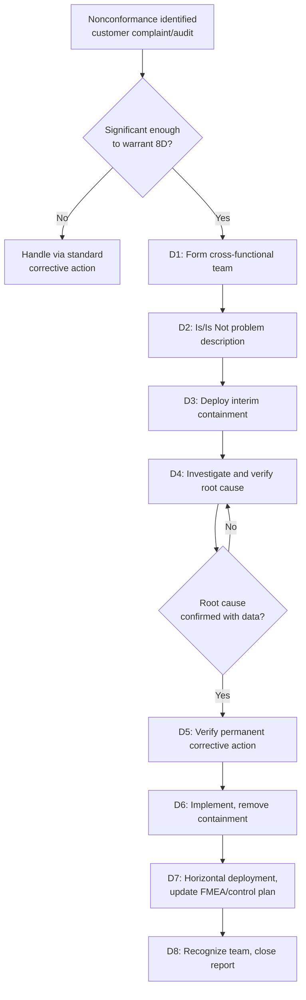

## Eight Discipline Problem Solving Methodology


### Overview

The Eight Disciplines (8D) methodology is a structured, team-based problem-solving process used to identify, correct, and permanently eliminate the root cause of a recurring or significant nonconformance, with particular emphasis on rapid containment of the immediate problem while a thorough root cause investigation proceeds in parallel. Developed by Ford Motor Company in the late 1980s (formalized in Ford's "Team Oriented Problem Solving" manual) and now a near-universal requirement in automotive and many other manufacturing supply chains, 8D is distinguished from other root cause frameworks by its explicit, disciplined sequencing — particularly its separation of immediate containment (D3) from permanent corrective action (D5–D6), which prevents a team from treating a quick fix as if it were the final solution. In precision metrology, 8D is the standard framework for responding to customer-reported dimensional nonconformances, measurement system failures, and calibration excursions.

**Key Points**

- Widely required as the standard corrective action report format by automotive OEMs and referenced within IATF 16949
- Distinguishes itself from Five Whys and fishbone diagrams (which it typically incorporates as tools within D4) by being a full end-to-end process — from problem description through team recognition — rather than a single analytical technique
- The critical structural feature is D3 (Interim Containment Action): a temporary fix deployed immediately to protect the customer while root cause investigation is still underway, explicitly distinct from the permanent corrective action developed later
- Often used interchangeably in practice with the term "corrective action report" or "CAR," though 8D specifically refers to the eight-step structured format

### The Eight Disciplines

#### D0: Prepare and Plan

(Often treated as a preliminary step preceding the formal "eight" disciplines in modern implementations) Confirm whether the emergency response process is required, gather initial symptom data, and determine whether 8D is the appropriate response mechanism for the issue at hand.

#### D1: Establish the Team

Assemble a small, cross-functional team with the process knowledge, authority, and time allocated to conduct the investigation — typically including representation from quality, manufacturing/process engineering, and, for measurement-related issues, metrology or calibration personnel.

#### D2: Describe the Problem

Define the problem with maximum specificity, commonly using the **"Is / Is Not"** analysis technique to bound what the problem is, where it occurs, when it occurs, and its extent, contrasted explicitly against what it is not, where it does not occur, and so on — sharpening the investigation's scope before analysis begins.

#### D3: Develop Interim Containment Actions (ICA)

Implement an immediate, temporary action to isolate the problem from the customer while the root cause investigation proceeds — such as 100% sorting inspection of suspect inventory, a temporary hold on shipment, or increased inspection frequency. The ICA is explicitly not the final fix; it exists solely to limit further harm during the investigation window.

#### D4: Define and Verify Root Cause(s)

Identify and statistically or empirically verify the root cause of the problem, typically applying fishbone diagrams, Five Whys, or — for more complex or safety-critical issues — Fault Tree Analysis or formal hypothesis testing. Critically, 8D requires verification of the root cause with data, not just a plausible hypothesis, before proceeding to D5.

#### D5: Choose and Verify Permanent Corrective Actions (PCA)

Select a permanent corrective action that addresses the verified root cause, and verify (ideally through a pilot or trial run with data) that it resolves the problem without introducing new issues, before full implementation.

#### D6: Implement and Validate Permanent Corrective Actions

Implement the permanent corrective action at full scale, remove the interim containment action once the permanent action is confirmed effective, and validate through ongoing monitoring (often via a control chart) that the problem does not recur.

#### D7: Prevent Recurrence

Update systemic documents — control plans, FMEAs, work instructions, calibration procedures — and, critically, assess whether the same root cause could affect other similar processes, products, or locations (horizontal deployment), preventing the same failure mode from resurfacing elsewhere in the organization.

#### D8: Recognize the Team

Formally acknowledge the team's contribution and close out the 8D report — a discipline-building step that reinforces organizational commitment to the structured process rather than treating problem-solving as solely a compliance exercise.

### Diagram: 8D Process Flow (svg_diagram)

<svg xmlns="http://www.w3.org/2000/svg" viewBox="0 0 620 380">
<title>8D Problem Solving Process Flow (svg_diagram)</title>
<g font-size="10">
<rect x="20" y="10" width="110" height="35" rx="5" fill="#f7fafc" stroke="#4a5568" stroke-width="2" />
<text x="75" y="32" text-anchor="middle">D0: Plan</text>



```
<rect x="150" y="10" width="110" height="35" rx="5" fill="#ebf8ff" stroke="#2b6cb0" stroke-width="2" />
<text x="205" y="32" text-anchor="middle">D1: Team</text>

<rect x="280" y="10" width="110" height="35" rx="5" fill="#ebf8ff" stroke="#2b6cb0" stroke-width="2" />
<text x="335" y="32" text-anchor="middle">D2: Describe</text>

<rect x="410" y="10" width="180" height="35" rx="5" fill="#fff5f5" stroke="#c53030" stroke-width="2.5" />
<text x="500" y="32" text-anchor="middle" font-weight="bold">D3: Interim Containment</text>

<line x1="130" y1="27" x2="148" y2="27" stroke="#333" stroke-width="2" marker-end="url(#arrow8d)" />
<line x1="260" y1="27" x2="278" y2="27" stroke="#333" stroke-width="2" marker-end="url(#arrow8d)" />
<line x1="390" y1="27" x2="408" y2="27" stroke="#333" stroke-width="2" marker-end="url(#arrow8d)" />

<line x1="500" y1="45" x2="500" y2="80" stroke="#333" stroke-width="2" marker-end="url(#arrow8d)" />
<rect x="380" y="80" width="210" height="35" rx="5" fill="#f0fff4" stroke="#2f855a" stroke-width="2" />
<text x="485" y="102" text-anchor="middle">D4: Verify Root Cause</text>

<line x1="485" y1="115" x2="485" y2="150" stroke="#333" stroke-width="2" marker-end="url(#arrow8d)" />
<rect x="365" y="150" width="240" height="35" rx="5" fill="#f0fff4" stroke="#2f855a" stroke-width="2" />
<text x="485" y="172" text-anchor="middle">D5: Verify Permanent Corrective Action</text>

<line x1="485" y1="185" x2="485" y2="220" stroke="#333" stroke-width="2" marker-end="url(#arrow8d)" />
<rect x="365" y="220" width="240" height="35" rx="5" fill="#faf5ff" stroke="#805ad5" stroke-width="2" />
<text x="485" y="242" text-anchor="middle">D6: Implement &amp; Validate PCA</text>

<line x1="485" y1="255" x2="485" y2="290" stroke="#333" stroke-width="2" marker-end="url(#arrow8d)" />
<rect x="365" y="290" width="240" height="35" rx="5" fill="#fffaf0" stroke="#c05621" stroke-width="2" />
<text x="485" y="312" text-anchor="middle">D7: Prevent Recurrence</text>

<line x1="485" y1="325" x2="485" y2="345" stroke="#333" stroke-width="2" marker-end="url(#arrow8d)" />
<rect x="400" y="345" width="170" height="30" rx="5" fill="#2d3748" />
<text x="485" y="365" text-anchor="middle" fill="white">D8: Recognize Team</text>
```

</g>
</svg>

### Application to a Metrology-Related Nonconformance

**Example**

**D0/D1**: A customer reports a shipment of precision shafts with out-of-tolerance bore diameters; a cross-functional team is assembled including quality engineering, machining, and the calibration lab supervisor.

**D2**: Is/Is Not analysis establishes the problem occurs specifically on Line 3, only on parts run in the past 10 days, only on the bore feature (not other dimensions), and does not occur on Lines 1 or 2 running the same part.

**D3**: Interim containment implements 100% dimensional re-inspection of all in-transit and in-stock inventory from Line 3 over the affected date range, and places a temporary hold on further Line 3 shipments pending root cause confirmation.

**D4**: Investigation (using a fishbone diagram followed by targeted data collection) verifies the root cause: the CMM serving Line 3 had a calibration certificate issued 10 days prior showing a bias correction factor that was never entered into the inspection program — directly paralleling the Five Whys example given for that technique, illustrating how 8D formally incorporates other root cause tools within D4.

**D5**: The team verifies that entering the correct bias correction and adding a mandatory calibration-certificate-to-program verification step resolves the issue on a pilot batch.

**D6**: The corrective action is implemented on Line 3's CMM; the interim 100% inspection is removed once a control chart confirms the corrected process is stable and in tolerance.

**D7**: The team checks whether other CMMs across the facility have the same calibration hand-off gap (horizontal deployment) and updates the facility-wide calibration work instruction to mandate the verification step everywhere, not just on Line 3.

**D8**: The team is formally recognized, and the 8D report is closed and archived in the QMS as objective evidence for the customer and for future audit reference.

### 8D vs. Related Methodologies

| Aspect | 8D | DMAIC | PDCA |
| --- | --- | --- | --- |
| Primary use case | Reactive: responding to a specific, often customer-reported nonconformance | Reactive/proactive: improving a chronic process performance gap | General-purpose improvement cycle |
| Distinguishing feature | Explicit interim containment (D3) separate from permanent fix | Deep statistical rigor (hypothesis testing, DOE) | Simplicity; no fixed toolkit |
| Typical trigger | Customer complaint, audit finding, significant nonconformance | Identified chronic capability or defect-rate gap | Any improvement opportunity, large or small |
| Common industry requirement | Automotive (IATF 16949), aerospace | Six Sigma programs generally | Broadly applicable across ISO 9001 QMS |

### Mermaid: 8D Team Escalation and Closure Logic



### Common Pitfalls

- Treating the interim containment action (D3) as sufficient on its own and failing to complete the root cause investigation through D4–D6, leaving the underlying cause unaddressed and the problem likely to recur once containment is relaxed
- Proceeding to D5 with a root cause hypothesis that has not been genuinely verified with data — a common failure mode where a plausible-sounding explanation from a fishbone brainstorm is accepted without confirmation
- Skipping D7's horizontal deployment step, allowing the same root cause to produce a nonconformance elsewhere in the organization on a similar process or product
- Rushing through D2's problem description, leading the team's D4 investigation to chase symptoms broader or narrower than the actual problem, wasting investigation effort

**Related Topics**

- Five whys analysis
- Cause and effect diagrams
- Failure mode and effects analysis
- Fault tree analysis
- Six Sigma DMAIC methodology
- PDCA cycle
- Corrective and Preventive Action (CAPA) systems