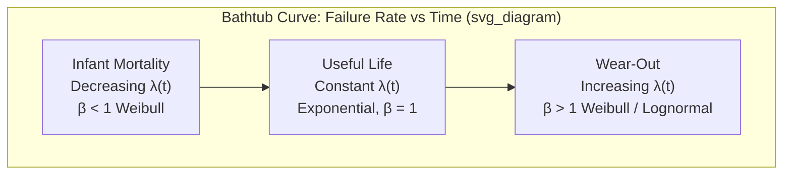

## The Bathtub Curve and Failure Distributions

### Overview

The bathtub curve is a graphical model describing how failure rate changes over the operational lifetime of a population of components or systems. It derives its name from the cross-sectional shape of a bathtub: high at both ends, low in the middle. This model underlies reliability engineering, warranty planning, maintenance scheduling, and quality control sampling strategies in precision metrology contexts, where instrument drift, gauge failure, and sensor degradation must be predicted and controlled.

### The Three Phases

**Key Points**

- **Infant Mortality (Early Failure) Region**: Decreasing failure rate over time. Failures here stem from manufacturing defects, material flaws, assembly errors, or latent weaknesses not caught by inspection.
- **Useful Life (Constant Failure Rate) Region**: Failures occur randomly and independently of age, typically caused by unpredictable stress events, environmental extremes, or operator-induced conditions rather than wear.
- **Wear-Out Region**: Increasing failure rate as components approach the end of their designed service life, driven by fatigue, corrosion, abrasion, or cumulative material degradation.

### Mathematical Representation

The failure rate function $\lambda(t)$ over time $t$ is the core quantity described by the bathtub curve. It relates to the probability density function $f(t)$ and reliability function $R(t)$ (survival function) as:

$$\lambda(t) = \frac{f(t)}{R(t)}$$

where

$$R(t) = 1 - F(t) = \int_t^\infty f(\tau)\, d\tau$$

and $F(t)$ is the cumulative distribution function (CDF) of failure times.

The cumulative hazard function $H(t)$ relates to reliability by:

$$R(t) = e^{-H(t)}, \quad H(t) = \int_0^t \lambda(\tau)\, d\tau$$

### Statistical Distributions Modeling Each Phase

**Weibull Distribution**

The Weibull distribution is the most widely used model because a single distribution family can represent all three bathtub regions depending on its shape parameter $\beta$ (beta). Its hazard function is:

$$\lambda(t) = \frac{\beta}{\eta}\left(\frac{t}{\eta}\right)^{\beta - 1}$$

where $\eta$ (eta) is the scale parameter (characteristic life) and $\beta$ is the shape parameter.

- $\beta < 1$: decreasing failure rate → models infant mortality
- $\beta = 1$: constant failure rate → reduces to the exponential distribution, models useful life
- $\beta > 1$: increasing failure rate → models wear-out

The Weibull PDF is:

$$f(t) = \frac{\beta}{\eta}\left(\frac{t}{\eta}\right)^{\beta-1} e^{-(t/\eta)^\beta}$$

**Exponential Distribution**

Used specifically for the constant-hazard useful-life phase, characterized by the memoryless property:

$$P(T > s + t \mid T > s) = P(T > t)$$

Its PDF and hazard function are:

$$f(t) = \lambda e^{-\lambda t}, \quad \lambda(t) = \lambda \text{ (constant)}$$

This memorylessness is a defining diagnostic: an aged, surviving unit is statistically as good as new, which is why constant-λ models are inappropriate for wear-related failures.

**Lognormal Distribution**

Frequently used for wear-out and fatigue-driven failures, particularly in mechanical and electronic component degradation, and in metrology for gauge drift processes where failure results from a multiplicative accumulation of small effects:

$$f(t) = \frac{1}{t\sigma\sqrt{2\pi}} \exp\left(-\frac{(\ln t - \mu)^2}{2\sigma^2}\right)$$

**Mixed Weibull Model**

Real bathtub behavior is often modeled as a superposition (mixture) of three separate distributions — one per phase — rather than one continuous function:

$$\lambda(t) = \lambda_1(t) + \lambda_2(t) + \lambda_3(t)$$

where each $\lambda_i(t)$ dominates in its respective time region. This is common in reliability software (e.g., ReliaSoft Weibull++, Minitab) when fitting field failure data that shows a clear bathtub signature.

### Bathtub Curve Diagram

### SVG Illustration of Curve Shape

<svg xmlns="http://www.w3.org/2000/svg" viewBox="0 0 640 320">
<text x="320" y="20" font-size="14" text-anchor="middle" font-family="sans-serif" font-weight="bold">Bathtub Curve — Failure Rate λ(t) vs Time (svg_diagram)</text>
<line x1="60" y1="270" x2="600" y2="270" stroke="black" stroke-width="1.5" />
<line x1="60" y1="270" x2="60" y2="40" stroke="black" stroke-width="1.5" />
<text x="330" y="300" font-size="12" text-anchor="middle" font-family="sans-serif">Time (t)</text>
<text x="25" y="150" font-size="12" text-anchor="middle" font-family="sans-serif" transform="rotate(-90 25,150)">Failure Rate λ(t)</text>
<path d="M 60 100 C 130 260, 180 260, 230 262 L 430 262 C 480 260, 520 200, 590 60" stroke="#2b6cb0" stroke-width="3" fill="none" />
<line x1="230" y1="40" x2="230" y2="270" stroke="gray" stroke-dasharray="4,4" />
<line x1="430" y1="40" x2="430" y2="270" stroke="gray" stroke-dasharray="4,4" />
<text x="140" y="290" font-size="11" text-anchor="middle" font-family="sans-serif">Infant Mortality</text>
<text x="330" y="290" font-size="11" text-anchor="middle" font-family="sans-serif">Useful Life</text>
<text x="510" y="290" font-size="11" text-anchor="middle" font-family="sans-serif">Wear-Out</text>
</svg>

### Application in Precision Metrology & Quality Control

**Example**

A CMM (coordinate measuring machine) probe supplier collects field failure data across 500 units over 5 years. Analysts fit a mixed-Weibull model to warranty return data:

- Early failures (first 500 hours) show $\beta \approx 0.6$, attributed to defective probe tip bonding — addressed through enhanced burn-in testing (screening).
- Mid-life failures (500–20,000 hours) show near-constant hazard, $\beta \approx 1.0$, driven by random electrical transients — addressed through surge protection design.
- Late-life failures (>20,000 hours) show $\beta \approx 3.2$, consistent with mechanical bearing wear — used to set a recommended replacement interval before failure probability rises sharply.

This directly informs calibration interval assignment, preventive maintenance scheduling, and gauge R&R (repeatability and reproducibility) program design, since a gauge nearing its wear-out phase can introduce systematic measurement bias.

### Reliability Engineering Practices Tied to Each Phase

**Infant Mortality Mitigation**

- Environmental Stress Screening (ESS)
- Burn-in testing
- HALT (Highly Accelerated Life Testing)
- Incoming inspection and supplier quality audits

**Useful Life Management**

- Preventive maintenance is largely ineffective against constant-hazard failures since they are age-independent; redundancy and condition monitoring are more effective mitigations
- Statistical process control (SPC) to detect anomalous failure spikes

**Wear-Out Management**

- Scheduled replacement / preventive maintenance based on $\eta$ and $\beta$ estimates
- Predictive maintenance using degradation trend monitoring (vibration analysis, drift tracking)
- Life testing to validate design life claims

### Parameter Estimation Methods

- **Maximum Likelihood Estimation (MLE)**: Preferred for censored reliability data (common in field return datasets where many units haven't yet failed)
- **Median Rank Regression (MRR)**: Traditional graphical method using Weibull probability plots
- **Probability Plotting**: Visual linearization of the CDF on Weibull paper to estimate $\beta$ and $\eta$

[Inference] The choice between MLE and MRR can materially affect estimated parameters for small sample sizes (n < 20), with MLE generally preferred in modern practice due to better statistical properties under censoring.

### Common Pitfalls

- Assuming a single failure mode explains all data points, when mixed populations (multiple failure modes) require mixture modeling
- Using mean time between failures (MTBF) as a universal reliability metric — MTBF is only meaningful for the constant-hazard (exponential) region and is frequently misapplied to wear-out data
- Ignoring censored data (units still operating without failure) in parameter fitting, which biases the estimated distribution

**Conclusion**

The bathtub curve provides a conceptual and mathematical framework linking observed failure timing to underlying physical failure mechanisms. Its practical value lies not in the curve shape itself but in the ability to decompose real-world failure data into distinct Weibull or exponential components, each pointing to a different root cause and requiring a different quality control or maintenance response.

**Related Topics**

- Weibull Analysis and Parameter Estimation (MLE vs. Median Rank Regression)
- Accelerated Life Testing (HALT/HASS) Methodologies
- Mean Time Between Failures (MTBF) vs. Mean Time To Failure (MTTF)
- Censored Data Analysis in Reliability Statistics
- Gauge R&R Studies and Measurement System Analysis (MSA)
- Preventive vs. Predictive Maintenance Strategies
- Reliability Block Diagrams and System-Level Reliability Modeling
- Calibration Interval Optimization Based on Drift/Wear Data