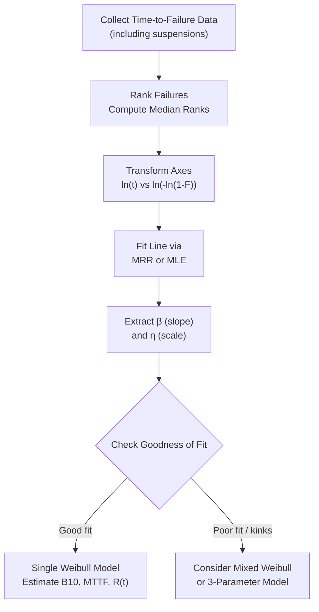

## Weibull Analysis

### Overview

Weibull analysis is a statistical methodology for modeling time-to-failure data using the Weibull distribution, enabling engineers to characterize failure behavior, estimate reliability metrics, and predict future failures from relatively small or censored datasets. Named after Waloddi Weibull, it is the dominant tool in reliability engineering because a single two- or three-parameter family can represent decreasing, constant, or increasing failure rates.

### The Weibull Distribution

**Two-Parameter Weibull**

The probability density function (PDF):

$$f(t) = \frac{\beta}{\eta}\left(\frac{t}{\eta}\right)^{\beta - 1} \exp\left[-\left(\frac{t}{\eta}\right)^{\beta}\right]$$

The cumulative distribution function (CDF), representing unreliability $F(t)$:

$$F(t) = 1 - \exp\left[-\left(\frac{t}{\eta}\right)^{\beta}\right]$$

The reliability function:

$$R(t) = \exp\left[-\left(\frac{t}{\eta}\right)^{\beta}\right]$$

The hazard (failure rate) function:

$$\lambda(t) = \frac{\beta}{\eta}\left(\frac{t}{\eta}\right)^{\beta - 1}$$

**Parameters**

- $\eta$ (eta): scale parameter, also called characteristic life — the time at which 63.2% of units are expected to have failed, regardless of $\beta$
- $\beta$ (beta): shape parameter, determines failure mode character

**Three-Parameter Weibull**

Introduces a location parameter $\gamma$ (gamma), representing a failure-free period:

$$f(t) = \frac{\beta}{\eta}\left(\frac{t-\gamma}{\eta}\right)^{\beta - 1} \exp\left[-\left(\frac{t-\gamma}{\eta}\right)^{\beta}\right], \quad t > \gamma$$

This is used when physical or engineering evidence supports a minimum time before which failure cannot occur (e.g., minimum fatigue cycles before crack initiation).

### Interpreting the Shape Parameter β

**Key Points**

- $\beta < 1$: Decreasing failure rate — infant mortality, typically due to manufacturing defects or quality escapes
- $\beta = 1$: Constant failure rate — reduces to exponential distribution, random failures independent of age
- $1 < \beta < 2$: Early wear-out, mild increasing failure rate
- $\beta = 2$: Equivalent to Rayleigh distribution, linear increasing hazard
- $\beta = 3$ to $4$: Approximates a normal distribution, typical of fatigue/wear mechanisms
- $\beta > 1$: General wear-out signature, failure rate increases with age

### Parameter Estimation Methods

**Median Rank Regression (MRR) / Probability Plotting**

Failure times are ranked and plotted on Weibull probability paper, which linearizes the CDF via a double-log transform:

$$\ln\left[-\ln(1 - F(t))\right] = \beta \ln(t) - \beta \ln(\eta)$$

This is a linear equation of form $y = mx + b$, where the slope $m = \beta$ and the line's position determines $\eta$. Median ranks (via Bernard's approximation) are used to estimate $F(t_i)$ for each ordered failure:

$$F(t_i) \approx \frac{i - 0.3}{n + 0.4}$$

where $i$ is the failure order number and $n$ is the total sample size.

**Maximum Likelihood Estimation (MLE)**

MLE finds $\beta$ and $\eta$ that maximize the likelihood function given the observed (and censored) data:

$$L(\beta, \eta) = \prod_{i=1}^{n} f(t_i)^{\delta_i} \, R(t_i)^{1-\delta_i}$$

where $\delta_i = 1$ if the unit failed and $\delta_i = 0$ if the observation is (right-)censored (still surviving at the time of data collection).

[Inference] MLE generally provides more statistically efficient estimates than MRR, particularly for small samples or heavily censored datasets, though MRR remains popular because of its visual, interpretable plot and ease of communication to non-statisticians.

### Types of Censoring

**Key Points**

- **Right Censoring**: Unit has not failed by the end of the observation period (most common in field data)
- **Left Censoring**: Failure occurred before the first inspection, exact time unknown
- **Interval Censoring**: Failure occurred between two known inspection times
- **Suspended (Type I / Type II) Censoring**: Test terminated at a fixed time (Type I) or fixed number of failures (Type II)

Handling censored data correctly is essential; ignoring suspensions (treating them as failures or discarding them) biases $\beta$ and $\eta$ estimates, typically underestimating reliability.

### Goodness-of-Fit Assessment

- **Correlation coefficient ($r$)** on the probability plot: values close to 1 indicate good fit
- **Anderson-Darling test**: More sensitive to tail deviations, commonly used in commercial reliability software
- **Likelihood ratio tests**: Used to compare 2-parameter vs. 3-parameter model fit, or to test whether a mixture model is statistically justified over a single Weibull

### Confidence Bounds

Reliability estimates require confidence intervals to communicate estimation uncertainty, especially with small sample sizes. Common approaches:

- **Fisher Matrix bounds**: Derived from the inverse of the Fisher information matrix around the MLE estimates
- **Likelihood Ratio bounds**: Often more accurate for small samples, based on the likelihood ratio statistic's asymptotic chi-square distribution

[Unverified] Exact bound tightness depends on sample size, censoring proportion, and software implementation details; results may vary slightly across commercial packages (e.g., Minitab vs. ReliaSoft Weibull++) due to differing numerical optimization routines.

### Mixed Weibull (Competing Failure Modes)

When failure data shows multiple distinct failure mechanisms (e.g., visible "kinks" or "dog-legs" on the probability plot), a mixture model is used:

$$F(t) = \sum_{j=1}^{k} p_j F_j(t)$$

where $p_j$ is the proportion of the population subject to failure mode $j$, and each $F_j(t)$ has its own $\beta_j$, $\eta_j$. This is the standard method for constructing a bathtub-curve fit from raw field data.

### Weibull Probability Plot Diagram

### SVG Illustration: Effect of β on Failure Rate Shape

<svg xmlns="http://www.w3.org/2000/svg" viewBox="0 0 640 320">
<text x="320" y="20" font-size="14" text-anchor="middle" font-family="sans-serif" font-weight="bold">Weibull Hazard Shapes by β (svg_diagram)</text>
<line x1="60" y1="270" x2="600" y2="270" stroke="black" stroke-width="1.5" />
<line x1="60" y1="270" x2="60" y2="40" stroke="black" stroke-width="1.5" />
<text x="330" y="300" font-size="12" text-anchor="middle" font-family="sans-serif">Time (t)</text>
<text x="25" y="150" font-size="12" text-anchor="middle" font-family="sans-serif" transform="rotate(-90 25,150)">λ(t)</text>
<path d="M 60 60 C 150 200, 250 255, 350 265 C 450 268, 550 270, 590 270" stroke="#c53030" stroke-width="2.5" fill="none" />
<path d="M 60 200 L 590 200" stroke="#2b6cb0" stroke-width="2.5" fill="none" />
<path d="M 60 265 C 200 260, 350 200, 450 120 C 500 80, 550 55, 590 45" stroke="#2f855a" stroke-width="2.5" fill="none" />
<text x="500" y="90" font-size="11" fill="#2f855a" font-family="sans-serif">β &gt; 1 (wear-out)</text>
<text x="500" y="190" font-size="11" fill="#2b6cb0" font-family="sans-serif">β = 1 (constant)</text>
<text x="150" y="230" font-size="11" fill="#c53030" font-family="sans-serif">β &lt; 1 (infant mortality)</text>
</svg>

### Application in Precision Metrology & Quality Control

**Example**

A metrology lab tracks calibration drift-induced failures (units exceeding tolerance) for a batch of 40 digital micrometers over 3 years, with 12 units still in service (right-censored) at the study's end. MLE fitting yields $\beta = 2.8$, $\eta = 4.2$ years.

Interpretation:

- $\beta = 2.8 > 1$ confirms wear-out behavior (mechanical spindle wear, thread degradation)
- $B_{10}$ life (time at which 10% of population fails) is calculated by solving $F(t) = 0.10$:

$$t_{B10} = \eta \left[-\ln(1 - 0.10)\right]^{1/\beta} = \eta (0.1054)^{1/2.8}$$

This B10 life directly informs the recommended re-verification or replacement interval, ensuring instruments are pulled from service before their failure probability becomes unacceptable for the required measurement uncertainty budget.

### Key Reliability Metrics Derived from Weibull Parameters

- **Mean Time To Failure (MTTF)**: $\text{MTTF} = \eta \, \Gamma\left(1 + \frac{1}{\beta}\right)$, where $\Gamma$ is the gamma function
- **Median Life**: $t_{50} = \eta (\ln 2)^{1/\beta}$
- **B_X Life**: Time by which $X\%$ of the population is expected to fail, solved from the CDF
- **Reliability at time $t$**: Direct substitution into $R(t) = \exp[-(t/\eta)^\beta]$

### Common Pitfalls

- Fitting a single Weibull distribution to data containing multiple competing failure modes, producing a misleading average $\beta$ that fits neither mechanism well
- Excluding suspended (non-failed) units from the dataset rather than properly censoring them, which overestimates the failure rate
- Small sample sizes (n < 10) can produce unstable $\beta$ estimates; confidence bounds should always accompany point estimates in such cases
- Confusing $\eta$ (63.2% failure point) with MTTF; the two are only equal when $\beta = 1$

**Conclusion**

Weibull analysis converts raw failure and censoring data into a compact, physically interpretable model. The shape parameter identifies the dominant failure mechanism category, while the scale parameter anchors the time axis, together enabling calculation of reliability, hazard rate, and percentile life metrics essential for calibration scheduling, warranty analysis, and quality control decision-making in precision measurement systems.

**Related Topics**

- The Bathtub Curve and Failure Distributions
- Mixed Weibull Analysis for Competing Failure Modes
- Accelerated Life Testing and Weibull Life-Stress Models
- Confidence Bounds: Fisher Matrix vs. Likelihood Ratio Methods
- B10 Life and Its Use in Preventive Maintenance Planning
- Reliability Block Diagrams and System Reliability Modeling
- Censored Data Handling in Survival Analysis
- Software Tools for Weibull Fitting (Minitab, ReliaSoft Weibull++, JMP)