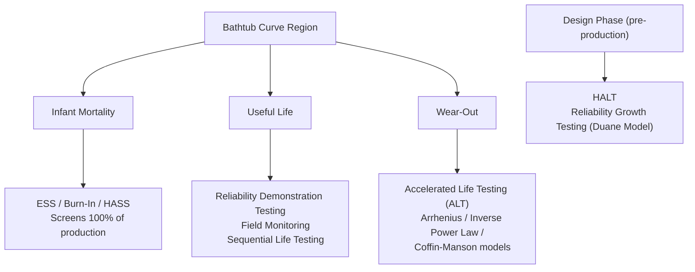

## Reliability Testing Methods

### Overview

Reliability testing methods are the empirical procedures used to generate the failure-time data that feeds statistical models such as Weibull analysis and bathtub curve characterization. These methods span accelerated laboratory tests designed to induce failures quickly, field-monitoring approaches that observe natural failure behavior, and screening tests intended to remove defective units before shipment. Selection of a method depends on the failure mechanism of interest, available test time, sample cost, and the required confidence level for the reliability claim.

### Classification of Reliability Test Types

**Key Points**

- **Qualification / Design Verification Tests**: Confirm a design meets reliability requirements before production release
- **Screening Tests**: Applied to 100% of production units to eliminate infant-mortality failures (not for reliability estimation, but for defect removal)
- **Accelerated Life Tests (ALT)**: Induce failures faster than normal use conditions by elevating stress, used to estimate life distribution parameters
- **Reliability Demonstration Tests (RDT)**: Statistically demonstrate that a reliability or MTBF target is met with a specified confidence level
- **Field / In-Service Monitoring**: Passive collection of failure and censoring data from units in actual use

### Accelerated Life Testing (ALT)

**Purpose**

ALT exposes units to stress levels (temperature, voltage, humidity, vibration, cycling) higher than normal operating conditions to induce failures within a practical test duration, then extrapolates back to use-condition life using a physics-based acceleration model.

**Arrhenius Model (Temperature Acceleration)**

Used for temperature-driven failure mechanisms (chemical degradation, diffusion, corrosion):

$$AF = \exp\left[\frac{E_a}{k}\left(\frac{1}{T_{use}} - \frac{1}{T_{stress}}\right)\right]$$

where $AF$ is the acceleration factor, $E_a$ is the activation energy (eV), $k$ is Boltzmann's constant ($8.617 \times 10^{-5}$ eV/K), and $T$ is absolute temperature in Kelvin.

**Inverse Power Law (Voltage/Stress Acceleration)**

Used for electrical or mechanical stress-driven mechanisms:

$$AF = \left(\frac{S_{stress}}{S_{use}}\right)^n$$

where $S$ is the stress level and $n$ is a material/mechanism-specific exponent determined empirically.

**Coffin-Manson Model (Thermal Cycling / Fatigue)**

Used for solder joint fatigue and thermal cycling fatigue failures:

$$N_f = C (\Delta T)^{-m}$$

where $N_f$ is cycles to failure, $\Delta T$ is the temperature swing, and $C$, $m$ are material constants.

[Inference] Acceleration models assume the failure mechanism at the elevated stress is identical to the mechanism at use conditions; if higher stress triggers a different failure mode, extrapolated life predictions become invalid — this is a documented limitation rather than a universal guarantee of the method.

### HALT (Highly Accelerated Life Testing)

HALT applies stresses well beyond normal operating and even design limits — including combined thermal cycling and vibration — in a step-stress fashion to rapidly discover design and process weaknesses. Unlike ALT, HALT is not intended to produce statistically quantifiable life data; its goal is qualitative: find the "destruct limit" and precipitate latent defects for design improvement.

**Key Points**

- Step-stress profiles increase stress until failure ("fundamental limit of the technology") is found
- Not used for MTBF/Weibull parameter estimation — purely a design-margin discovery tool
- Commonly followed by HASS (Highly Accelerated Stress Screening) in production to screen for the same weaknesses

### Reliability Demonstration Testing (RDT)

RDT determines the minimum sample size and test duration needed to demonstrate, with a target confidence level $C$, that the true reliability or failure rate meets a specified requirement, assuming an underlying distribution (commonly exponential for constant-hazard systems).

For an exponential (constant-hazard) assumption with zero failures allowed:

$$T = \frac{\eta}{2} \chi^2_{(C, 2)}$$

More generally, using the chi-square relationship for $r$ observed failures:

$$T = \frac{MTBF_{required} \times \chi^2_{(1-C,\, 2r+2)}}{2}$$

where $T$ is total required test time (unit-hours), and $\chi^2$ is the chi-square distribution value at confidence $C$ with the corresponding degrees of freedom.

### Environmental Stress Screening (ESS)

ESS is applied to production units (not samples) to precipitate and detect latent manufacturing defects before shipment, directly targeting the infant-mortality region of the bathtub curve.

**Common ESS Techniques**

- **Thermal Cycling**: Rapid temperature transitions to stress solder joints, connectors, and material interfaces
- **Random Vibration**: Broadband vibration exposure to detect loose components, cracked solder, or mechanical fatigue-prone assemblies
- **Burn-In**: Extended powered operation at elevated temperature to precipitate early-life electronic failures
- **Power Cycling**: Repeated on/off cycling to stress thermal expansion-contraction interfaces

### Life Testing Approaches by Censoring Type

**Key Points**

- **Complete (Type I) Test**: Fixed test duration; all surviving units are right-censored at cutoff
- **Failure-Terminated (Type II) Test**: Test ends after a predetermined number of failures, regardless of elapsed time
- **Sudden Death Testing**: Units divided into subgroups; each subgroup tested until first failure, providing early Weibull estimates with fewer total failures needed
- **Sequential Life Testing**: Accept/reject decisions made continuously as data accumulates, potentially shortening test duration when results are conclusively good or bad early

### Reliability Growth Testing

Applied during development to track reliability improvement as design deficiencies are found and corrected (test-analyze-fix-test, TAAF). The **Duane Model** is commonly used to track cumulative MTBF growth:

$$MTBF_c(t) = K t^{\alpha}$$

where $t$ is cumulative test time, $K$ is a constant, and $\alpha$ (growth rate) typically ranges from 0.2 to 0.6 in mature development programs. Plotted on log-log axes, cumulative MTBF forms a straight line whose slope is $\alpha$.

### Testing Methods by Bathtub Region

### Test Method Selection Flow

<svg xmlns="http://www.w3.org/2000/svg" viewBox="0 0 640 380">
<text x="320" y="20" font-size="14" text-anchor="middle" font-family="sans-serif" font-weight="bold">Reliability Test Method Selection (svg_diagram)</text>
<rect x="240" y="40" width="160" height="40" rx="6" fill="#ebf8ff" stroke="#2b6cb0" />
<text x="320" y="65" font-size="12" text-anchor="middle" font-family="sans-serif">What is the test goal?</text>
<line x1="320" y1="80" x2="140" y2="130" stroke="black" />
<line x1="320" y1="80" x2="320" y2="130" stroke="black" />
<line x1="320" y1="80" x2="500" y2="130" stroke="black" />
<rect x="60" y="130" width="160" height="50" rx="6" fill="#f0fff4" stroke="#2f855a" />
<text x="140" y="150" font-size="11" text-anchor="middle" font-family="sans-serif">Find design</text>
<text x="140" y="165" font-size="11" text-anchor="middle" font-family="sans-serif">weaknesses → HALT</text>
<rect x="240" y="130" width="160" height="50" rx="6" fill="#fffaf0" stroke="#c05621" />
<text x="320" y="150" font-size="11" text-anchor="middle" font-family="sans-serif">Screen production</text>
<text x="320" y="165" font-size="11" text-anchor="middle" font-family="sans-serif">units → ESS / HASS</text>
<rect x="420" y="130" width="180" height="50" rx="6" fill="#fff5f5" stroke="#c53030" />
<text x="510" y="150" font-size="11" text-anchor="middle" font-family="sans-serif">Estimate life distribution</text>
<text x="510" y="165" font-size="11" text-anchor="middle" font-family="sans-serif">→ ALT + Weibull fit</text>
</svg>

### Application in Precision Metrology & Quality Control

**Example**

A manufacturer of load cells for precision weighing systems must qualify a new strain gauge bonding process. The reliability program is structured as follows:

1. **HALT** is run on 6 prototype units, applying combined vibration and thermal step-stress to find the destruct limit and uncover an adhesive delamination weakness at extreme temperature.
2. The bonding process is redesigned; **reliability growth testing** across three design iterations tracks MTBF improvement using the Duane model, confirming $\alpha \approx 0.35$.
3. **ALT** using the Arrhenius model at three elevated temperatures (85°C, 105°C, 125°C) estimates activation energy $E_a$ for the adhesive degradation mechanism, producing a Weibull life model at rated use temperature (23°C).
4. **ESS** (thermal cycling + burn-in) is implemented on 100% of production units to screen infant-mortality bonding defects before units ship.
5. **RDT** confirms, at 90% confidence, that the load cell meets its stated MTBF requirement before full production release.

This layered approach directly supports calibration interval justification and measurement uncertainty budgeting, since a load cell's reliability profile affects how much drift risk is acceptable between recalibrations.

### Common Pitfalls

- Applying an acceleration model (Arrhenius, IPL) across a stress range wide enough to trigger a different failure mechanism than observed at use conditions, invalidating extrapolation
- Treating HALT results as quantitative life predictions rather than qualitative design-margin findings
- Running RDT with an assumed exponential (constant-hazard) distribution when the actual failure mode is wear-out, leading to incorrect sample size and duration calculations
- Confusing ESS (100% screening) with ALT/RDT (sampling-based life estimation) — they serve fundamentally different purposes

**Conclusion**

Reliability testing methods form a toolkit rather than a single procedure: HALT and reliability growth testing shape design robustness, ALT and RDT generate the statistical life data underpinning Weibull models, and ESS/HASS remove latent defects from production. Matching the correct test method to the bathtub curve region and failure mechanism under investigation is essential for generating valid, actionable reliability data in precision measurement and quality systems.

**Related Topics**

- The Bathtub Curve and Failure Distributions
- Weibull Analysis
- Accelerated Life Test Models: Arrhenius, Inverse Power Law, Coffin-Manson
- HALT and HASS Program Design
- Reliability Growth Modeling (Duane and Crow-AMSAA Models)
- Sample Size Determination for Reliability Demonstration Testing
- Failure Mode and Effects Analysis (FMEA) as a Test-Planning Input
- Measurement Uncertainty Budgets and Calibration Interval Analysis