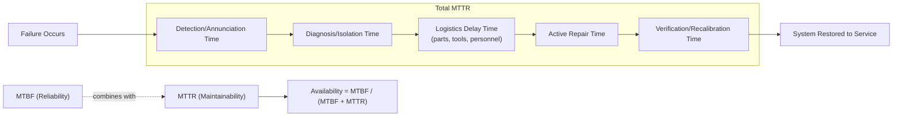

## Maintainability and Availability

### Overview

Maintainability and availability are complementary reliability engineering disciplines that address what happens after a failure occurs and how effectively a system returns to operational status. While reliability quantifies the probability of failure-free operation, maintainability quantifies how quickly and easily a failed system can be restored, and availability combines both to express the overall proportion of time a system is capable of performing its intended function. In precision metrology, these concepts directly govern equipment uptime, calibration lab throughput, and the economic justification for maintenance and spares strategies.

### Maintainability Fundamentals

**Definition**

Maintainability is the probability that a failed system will be restored to a specified operational condition within a given time period, when maintenance is performed by personnel with stated skill levels using prescribed procedures and resources.

**Mean Time To Repair (MTTR)**

The average time required to diagnose, repair, and restore a system to operation:

$$MTTR = \frac{\sum_{i=1}^{n} T_{r,i}}{n}$$

where $T_{r,i}$ is the repair time for the $i$-th repair event and $n$ is the number of repair events.

**Repair Time Distribution**

Repair times are frequently modeled with a **lognormal distribution** rather than an exponential or normal distribution, because most repairs are quick but occasional repairs take disproportionately long (heavy right tail from difficult diagnostics, parts unavailability, or specialist requirements):

$$f(t) = \frac{1}{t\sigma\sqrt{2\pi}} \exp\left(-\frac{(\ln t - \mu)^2}{2\sigma^2}\right)$$

**Maintainability Function**

The probability that repair is completed by time $t$, analogous to the reliability function but for restoration:

$$M(t) = \int_0^t g(\tau)\, d\tau$$

where $g(\tau)$ is the repair time probability density function.

### Components of Repair Time (MTTR Breakdown)

**Key Points**

- **Fault Detection/Annunciation Time**: Time from failure occurrence to detection (alarm, alert, or operator noticing)
- **Fault Isolation/Diagnosis Time**: Time to localize the failure to a specific component or subsystem
- **Logistics Delay Time**: Time waiting for spare parts, tools, or qualified personnel to arrive (often the largest and most variable component)
- **Active Repair Time**: Actual hands-on time performing disassembly, replacement, reassembly
- **Verification/Checkout Time**: Time to confirm the system is functioning correctly and, in metrology contexts, recalibrated before return to service

### Availability

**Definition**

Availability is the probability that a system is operational and capable of performing its intended function at a given point in time, or over a specified interval.

**Inherent Availability**

Considers only corrective maintenance (repair) time, excluding logistics delays and preventive maintenance:

$$A_i = \frac{MTBF}{MTBF + MTTR}$$

**Achieved Availability**

Includes both corrective and preventive maintenance downtime:

$$A_a = \frac{MTBM}{MTBM + \bar{M}}$$

where $MTBM$ is mean time between all maintenance actions (corrective + preventive) and $\bar{M}$ is mean maintenance downtime across both types.

**Operational Availability**

The most realistic real-world measure, incorporating all sources of downtime including logistics and administrative delays:

$$A_o = \frac{MTBM}{MTBM + MDT}$$

where $MDT$ is mean down time, encompassing diagnosis, logistics delay, active repair, and verification.

### Availability Comparison Table (Conceptual)

| Metric | Includes Logistics Delay | Includes Preventive Maintenance | Realism |
| --- | --- | --- | --- |
| Inherent Availability ($A_i$) | No | No | Idealized, design-focused |
| Achieved Availability ($A_a$) | No | Yes | Intermediate |
| Operational Availability ($A_o$) | Yes | Yes | Most realistic, field-representative |

### Relationship Between Reliability and Maintainability

Availability formalizes the trade-off between how often a system fails (reliability, expressed via MTBF or $\lambda$) and how quickly it is restored (maintainability, via MTTR). A system with relatively low MTBF can still achieve high availability if MTTR is sufficiently small, and vice versa. This trade-off underlies decisions such as whether to invest in higher-reliability (higher-cost) components versus faster repair infrastructure (spares, modular design, diagnostics).

$$A_i = \frac{MTBF}{MTBF + MTTR} = \frac{1}{1 + \frac{MTTR}{MTBF}}$$

This form shows availability approaches 1 as the MTTR/MTBF ratio approaches zero — i.e., availability is driven by the *ratio* of downtime to uptime, not by either quantity in isolation.

### Design for Maintainability

**Key Points**

- **Modularity**: Designing systems as replaceable modules (line-replaceable units, LRUs) to minimize active repair time via swap-and-return rather than in-situ repair
- **Built-In Test (BIT) / Self-Diagnostics**: Reduces fault detection and isolation time significantly
- **Accessibility**: Physical design that allows technicians to reach components without extensive disassembly
- **Standardization**: Common fasteners, connectors, and tools reduce logistics delay and technician training burden
- **Fault Isolation Design**: Clear diagnostic codes or indicators that map directly to failed components, avoiding trial-and-error troubleshooting

### System-Level Availability Modeling

For systems composed of multiple components, availability combines according to system architecture:

**Series System** (any component failure causes system failure):

$$A_{system} = \prod_{i=1}^{n} A_i$$

**Parallel/Redundant System** (system fails only if all redundant components fail):

$$A_{system} = 1 - \prod_{i=1}^{n} (1 - A_i)$$

### Maintainability and Availability Relationship Diagram

### SVG Illustration: Availability vs MTTR/MTBF Ratio

<svg xmlns="http://www.w3.org/2000/svg" viewBox="0 0 640 320">
<text x="320" y="20" font-size="14" text-anchor="middle" font-family="sans-serif" font-weight="bold">Availability vs MTTR/MTBF Ratio (svg_diagram)</text>
<line x1="60" y1="270" x2="600" y2="270" stroke="black" stroke-width="1.5" />
<line x1="60" y1="270" x2="60" y2="40" stroke="black" stroke-width="1.5" />
<text x="330" y="300" font-size="12" text-anchor="middle" font-family="sans-serif">MTTR / MTBF Ratio</text>
<text x="20" y="150" font-size="12" text-anchor="middle" font-family="sans-serif" transform="rotate(-90 20,150)">Availability</text>
<path d="M 60 55 C 150 90, 250 160, 350 210 C 450 240, 550 258, 590 265" stroke="#2b6cb0" stroke-width="3" fill="none" />
<text x="140" y="80" font-size="11" font-family="sans-serif">High Availability</text>
<text x="450" y="255" font-size="11" font-family="sans-serif">Low Availability</text>
</svg>

### Application in Precision Metrology & Quality Control

**Example**

A calibration laboratory operates 15 identical torque wrench calibration benches. Historical data yields MTBF = 2,000 hours and MTTR = 8 hours (average across detection, diagnosis, parts logistics, repair, and re-verification).

$$A_i = \frac{2000}{2000 + 8} = 0.9960 \, (99.60\%)$$

If logistics delay for a specific sensor component averages an additional 40 hours due to a single-source supplier, operational availability drops substantially:

$$A_o = \frac{2000}{2000 + 48} = 0.9766 \, (97.66\%)$$

This difference — nearly a full percentage point of additional downtime — directly informs whether the lab should stock critical spares locally (reducing logistics delay toward the inherent availability figure) versus accepting the operational availability with single-source procurement. For a lab with contractual turnaround-time commitments, this quantifies the business case for spare parts inventory investment.

### Common Pitfalls

- Reporting only inherent availability ($A_i$) in a quality or contractual context when the customer's actual experience reflects operational availability ($A_o$), which is typically lower and more relevant
- Treating MTTR as normally distributed when repair time data is typically right-skewed (lognormal), causing underestimation of tail-risk downtime
- Ignoring logistics delay time as a "maintainability" factor, when in practice it is often the dominant contributor to total downtime, especially for specialized metrology equipment with long supplier lead times
- Assuming redundancy always improves availability without accounting for common-cause failures that defeat parallel redundancy assumptions

**Conclusion**

Maintainability and availability translate raw reliability statistics into operationally meaningful uptime metrics. Where reliability engineering asks "how often will this fail," maintainability asks "how fast can we fix it," and availability synthesizes both into the single figure that matters most for production throughput, calibration lab scheduling, and equipment lifecycle economics. Effective availability improvement requires attacking both sides of the equation — increasing MTBF through reliability design and reducing MTTR through maintainability design and logistics optimization.

**Related Topics**

- The Bathtub Curve and Failure Distributions
- Weibull Analysis
- Reliability Testing Methods
- Mean Time Between Failures (MTBF) vs. Mean Time To Failure (MTTF)
- Reliability-Centered Maintenance (RCM)
- Spare Parts Provisioning and Logistics Delay Time Reduction
- Redundancy and Reliability Block Diagrams
- Total Productive Maintenance (TPM) in Calibration Lab Operations