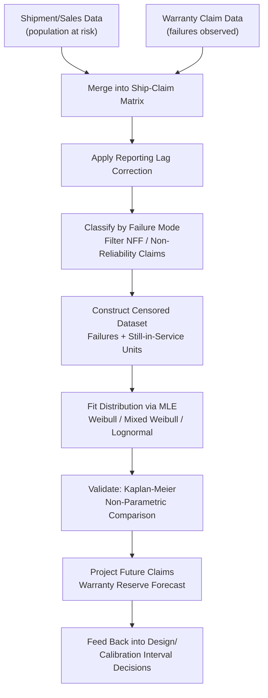

## Field Data and Warranty Analysis

### Overview

Field data and warranty analysis is the practice of extracting reliability information from products already in customer use, primarily through warranty claim records, service reports, and return data. Unlike controlled laboratory reliability testing, field data reflects actual usage conditions, environmental variation, and customer behavior, making it both more representative and considerably messier to analyze. This discipline closes the loop between design assumptions and real-world performance, and in precision metrology it underlies decisions on calibration interval adjustment, product recalls, design revisions, and warranty reserve forecasting.

### Why Field Data Differs from Test Data

**Key Points**

- **Usage Rate Variability**: Products accumulate age differently — a bench-mounted comparator used continuously in production accrues far more operating hours per calendar month than one used intermittently in a QC lab
- **Reporting Delay**: Time lag between actual failure and when a warranty claim is filed and recorded in the database
- **Incomplete Failure Descriptions**: Field technicians and customers often provide vague failure descriptions compared to controlled lab observations
- **Self-Selection Bias**: Only failures that generate a claim are recorded; units that fail outside the warranty period or are informally repaired never appear in the dataset
- **Unknown Population-at-Risk**: The exact number of units still in service (and thus at risk of failure) at any given time is often uncertain due to units being discarded, resold, or simply not returning claims

### Key Data Structures for Field Analysis

**Shipment and Sales Data**

Establishes the population entering service over time. Combined with claim data, this defines the "at-risk" population needed to compute failure rates.

**Warranty Claim Data**

Contains, at minimum: unit serial number or identifier, ship date, failure/claim date, and (ideally) failure mode classification. Time-to-failure for each claim is calculated as:

$$t_i = t_{claim,i} - t_{ship,i}$$

**Right-Censored Population**

All shipped units that have not yet failed (or filed a claim) by the analysis cutoff date are right-censored — their true failure time is unknown but is at least their current in-service age.

### Reporting Lag (Reporting Delay) Correction

A critical and frequently overlooked adjustment: claims for recent failures are systematically undercounted at the time of analysis because not all failures have yet been reported. This produces an artificial downward bias in recent-period failure counts if uncorrected.

**Reporting Lag Distribution**

The delay between failure and claim registration is itself modeled as a distribution (often lognormal or exponential), and used to compute a correction factor for recent data:

$$\hat{N}_{true}(t) = \frac{N_{observed}(t)}{P(\text{reported by analysis date} \mid \text{failed at } t)}$$

[Inference] Reporting lag correction is standard practice in mature warranty analysis programs (e.g., automotive, medical device, and industrial equipment sectors), though the specific correction model varies by industry and data maturity; without this correction, the most recent 1-3 months of field data typically appear artificially reliable.

### Constructing the Field Reliability Dataset

**Key Points**

- **Build the "ship/claim matrix"**: For each shipment cohort (e.g., monthly production batches), track cumulative claims over calendar time
- **Convert calendar time to usage time**: Where possible, normalize to actual operating hours/cycles rather than calendar age, since usage rate variability otherwise contaminates the failure-time estimate
- **Classify failure modes**: Separate claims by root cause (if known) before fitting distributions, since mixed failure modes require mixture modeling (as in Weibull analysis)
- **Exclude non-reliability claims**: Cosmetic issues, customer-induced damage, or no-fault-found (NFF) returns should be filtered or analyzed separately from true reliability failures

### Statistical Fitting to Field Data

Field data is fit using the same distributions covered in Weibull analysis (2-parameter Weibull, mixed Weibull, lognormal), but with maximum likelihood estimation (MLE) strongly preferred over median rank regression, because field data is heavily right-censored (the vast majority of shipped units have not failed) and MLE handles censoring more rigorously.

$$L(\theta) = \prod_{i \in \text{failures}} f(t_i; \theta) \prod_{j \in \text{censored}} R(t_j; \theta)$$

where $\theta$ represents the distribution parameters (e.g., $\beta$, $\eta$ for Weibull).

### Warranty Cost and Reserve Forecasting

**Purpose**

Once a reliability model (e.g., Weibull $\beta$, $\eta$) is fit to field data, it can be projected forward to forecast expected future claims and associated warranty cost liability.

**Expected Future Claims**

For a cohort of $N$ units shipped at time $t_0$, the expected cumulative claims by future time $t$ is:

$$E[\text{Claims}(t)] = N \times F(t) = N \left[1 - \exp\left(-\left(\frac{t}{\eta}\right)^{\beta}\right)\right]$$

**Warranty Reserve**

Financial reserve is typically forecast as expected future claims multiplied by average cost per claim, summed across all active shipment cohorts still within their warranty window, and used for financial accrual accounting purposes.

### Common Field Data Analysis Approaches

**Key Points**

- **Kaplan-Meier Estimator**: Non-parametric method for estimating the survival function directly from censored field data without assuming an underlying distribution — useful as an exploratory step before fitting a parametric model
- **Cohort Analysis**: Comparing failure behavior across different production batches, supplier lots, or design revisions to detect process shifts
- **Nelson-Aalen Estimator**: Non-parametric estimator of the cumulative hazard function, complementary to Kaplan-Meier
- **Recurrent Event Analysis**: For repairable systems where the same unit can generate multiple claims over its lifetime, requiring models (e.g., Crow-AMSAA/NHPP) distinct from single-failure-time Weibull analysis

### Field Data Analysis Workflow

### SVG Illustration: Reporting Lag Effect on Observed Claims

<svg xmlns="http://www.w3.org/2000/svg" viewBox="0 0 640 320">
<text x="320" y="20" font-size="14" text-anchor="middle" font-family="sans-serif" font-weight="bold">Reporting Lag Effect on Claim Counts (svg_diagram)</text>
<line x1="60" y1="270" x2="600" y2="270" stroke="black" stroke-width="1.5" />
<line x1="60" y1="270" x2="60" y2="40" stroke="black" stroke-width="1.5" />
<text x="330" y="300" font-size="12" text-anchor="middle" font-family="sans-serif">Calendar Time (months)</text>
<text x="20" y="150" font-size="12" text-anchor="middle" font-family="sans-serif" transform="rotate(-90 20,150)">Observed Claims</text>
<path d="M 60 240 C 150 200, 250 160, 350 130 C 420 110, 460 100, 500 95" stroke="#2b6cb0" stroke-width="3" fill="none" />
<path d="M 500 95 C 530 105, 560 130, 590 180" stroke="#2b6cb0" stroke-width="3" stroke-dasharray="5,4" fill="none" />
<path d="M 500 95 C 540 90, 570 88, 600 85" stroke="#c53030" stroke-width="2" stroke-dasharray="2,3" fill="none" />
<text x="150" y="255" font-size="10" font-family="sans-serif">Fully reported region</text>
<text x="440" y="200" font-size="10" fill="#2b6cb0" font-family="sans-serif">Apparent drop (uncorrected)</text>
<text x="480" y="70" font-size="10" fill="#c53030" font-family="sans-serif">Corrected trend</text>
</svg>

### Application in Precision Metrology & Quality Control

**Example**

A manufacturer of digital indicators (dial gauge replacements) ships 10,000 units per quarter with a 2-year warranty. At month 18 of tracking, the warranty database shows 312 claims. Raw analysis suggests a declining claim rate in the most recent 2 months — but reporting lag correction reveals this is an artifact: the true failure rate is stable when adjusted for the average 6-week claim-filing delay.

After correction and MLE fitting, the field data yields $\beta = 1.15$, $\eta = 6.8$ years — close to constant hazard but with a slight wear-out trend. Cross-referencing failure mode codes reveals 60% of claims relate to a specific display driver IC batch from one supplier lot. Isolating this lot's data and re-fitting separately shows $\beta = 0.7$ (classic infant-mortality signature) for that lot specifically, versus $\beta = 3.1$ (wear-out) for all other production — correctly identifying a supplier quality escape rather than a general design wear-out issue. This directly triggers a targeted lot-specific corrective action rather than a costly across-the-board design change.

### Common Pitfalls

- Failing to apply reporting lag correction, leading to false conclusions that reliability is improving in the most recent reporting periods
- Treating the "at-risk population" as the total number ever shipped rather than the number still within the observation window and not yet failed or censored-out
- Ignoring failure mode heterogeneity, fitting a single Weibull to data containing multiple distinct root causes (as in the supplier lot example above)
- Excluding out-of-warranty failures from field reliability estimates entirely, which truncates the dataset and can bias wear-out characterization since most wear-out failures occur after the warranty period expires
- Confusing "no fault found" (NFF) returns with genuine failures, inflating apparent failure rates

**Conclusion**

Field data and warranty analysis validates and refines the reliability predictions made during design and qualification testing by grounding them in actual customer-use conditions. Proper handling of censoring, reporting lag, and failure-mode classification is essential to avoid misleading conclusions, and the resulting models directly support warranty reserve forecasting, root-cause identification, and evidence-based revision of maintenance or calibration schedules.

**Related Topics**

- The Bathtub Curve and Failure Distributions
- Weibull Analysis
- Reliability Testing Methods
- Maintainability and Availability
- Kaplan-Meier and Nelson-Aalen Non-Parametric Estimators
- Recurrent Event Analysis and the Crow-AMSAA (NHPP) Model
- Root Cause Analysis and Corrective Action (CAPA) Systems
- Supplier Quality Management and Lot Traceability