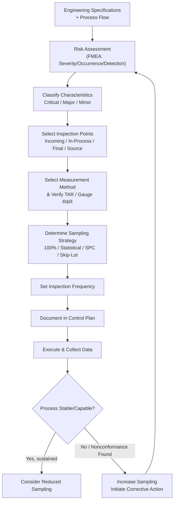

## Inspection Planning Strategy

### Overview

Inspection planning strategy is the systematic process of determining what to inspect, when, how, and with what frequency across a product's manufacturing and supply chain to achieve quality objectives at acceptable cost and risk. It bridges design requirements, process capability, and quality control resources into an executable plan that specifies characteristics, methods, sampling approaches, and acceptance criteria at each production stage. In precision metrology contexts, inspection planning determines not only what gets measured but which measurement systems and traceable standards are appropriate for the tolerances involved.

### Objectives of Inspection Planning

**Key Points**

- Prevent nonconforming product from advancing to the next process step or reaching the customer
- Verify process control and detect drift before it produces defects (rather than only sorting good from bad after the fact)
- Optimize inspection resource allocation — balancing cost of inspection against cost of escaped defects
- Provide objective evidence of conformance for regulatory, contractual, or certification requirements (e.g., ISO 9001, AS9100, IATF 16949)
- Generate data for process capability studies, SPC, and continuous improvement

### Inputs to Inspection Planning

**Key Points**

- **Engineering Drawings and Specifications**: Dimensional tolerances, geometric dimensioning and tolerancing (GD&T), material and surface finish requirements
- **Process Flow / Routing**: Identifies natural inspection points (incoming, in-process, final)
- **Risk Assessment Outputs**: FMEA severity/occurrence/detection rankings identify which characteristics warrant tighter control
- **Historical Quality Data**: Prior defect rates, customer complaints, and process capability indices ($C_p$, $C_{pk}$) inform where inspection effort should concentrate
- **Customer and Regulatory Requirements**: Contractually mandated inspection points, certificates of conformance, or source inspection requirements
- **Measurement System Capability**: Availability of appropriately calibrated gauges/instruments with sufficient resolution and accuracy for the tolerance being verified

### Classification of Inspection Points

**Incoming (Receiving) Inspection**

Verifies purchased materials, components, or subassemblies meet specification before entering production. Strategy ranges from 100% inspection to reduced/skip-lot sampling based on supplier quality history.

**In-Process Inspection**

Performed at intermediate manufacturing stages to catch defects close to their source, minimizing value added to nonconforming product before detection. Often tied to specific process steps identified as high-risk in FMEA (e.g., post-heat-treatment, post-machining critical dimension checks).

**Final Inspection**

Verifies the completed product against all applicable specifications before release, shipment, or certification. Serves as the last verification gate but is the most costly point at which to catch a defect, since maximum value has already been added.

**Source Inspection**

Performed at the supplier's facility, often by the customer or a third party, before shipment — used for critical or high-risk purchased items where receiving inspection alone is considered insufficient.

### Determining Characteristics to Inspect

**Key Points**

- **Critical Characteristics**: Directly affect safety, function, fit, or regulatory compliance — typically require 100% inspection or highly capable process control
- **Major Characteristics**: Affect fit, function, or performance but not safety — moderate sampling or SPC monitoring often sufficient
- **Minor Characteristics**: Cosmetic or non-functional deviations — typically lowest inspection priority, often reduced or skip-lot sampling
- Characteristic classification is frequently formalized via a **Control Plan**, which maps each characteristic to its specification, measurement method, sample size, frequency, and reaction plan

### Sampling Strategy Decisions

**Key Points**

- **100% Inspection**: Required for critical/safety characteristics or when process capability is insufficient ($C_{pk}$ below acceptance threshold)
- **Statistical Sampling**: Uses acceptance sampling plans (e.g., ANSI/ASQ Z1.4, Z1.9) to inspect a representative subset and make lot disposition decisions with defined risk levels (producer's risk $\alpha$, consumer's risk $\beta$)
- **SPC-Based Monitoring**: Periodic sampling to monitor process stability via control charts, relying on demonstrated process capability rather than lot-by-lot acceptance decisions
- **Skip-Lot Sampling**: Reduced inspection frequency for suppliers/processes with demonstrated sustained quality performance, with defined reversion rules if nonconformances occur
- **Audit Sampling**: Periodic verification sampling independent of production release decisions, used to validate that the overall inspection system is functioning correctly

### Selecting Measurement Methods and Equipment

**Key Points**

- Match instrument resolution and accuracy to tolerance width — a common heuristic is the **10:1 rule** (Test Accuracy Ratio, TAR), where measurement uncertainty should be no more than 1/10 of the tolerance band, though 4:1 is a more commonly accepted modern minimum given rising equipment costs at tighter tolerances
- Consider **Gauge R&R** (repeatability and reproducibility) results when selecting or validating a measurement system for a given characteristic
- Balance measurement speed/cost against required accuracy — e.g., a CMM offers high accuracy but lower throughput than a fixed-limit gauge or vision system
- Ensure the selected instrument is included in the calibration program with an appropriate calibration interval based on its criticality and drift history (linking to reliability/Weibull-based interval-setting from earlier reliability topics)

### Test Accuracy Ratio (TAR) Relationship

$$TAR = \frac{\text{Tolerance}}{\text{Measurement Uncertainty}}$$

A TAR of 4:1 or higher is generally considered the minimum acceptable ratio to ensure the measurement system does not consume an excessive portion of the tolerance band through its own uncertainty.

### Inspection Frequency Determination

**Key Points**

- Tied to process stability: a statistically stable, capable process ($C_{pk} \geq 1.33$ typical minimum) may justify reduced sampling frequency
- Tied to consequence of failure: higher severity characteristics warrant more frequent or continuous verification regardless of demonstrated capability
- Tied to production volume and batch size: frequency is often expressed per lot, per shift, or per fixed quantity produced
- Dynamic adjustment: frequency should increase following process changes, tooling changes, or detected nonconformances, and may decrease following sustained demonstrated control (as in skip-lot logic)

### Inspection Planning Workflow

### SVG Illustration: Inspection Point Cost-of-Detection Curve

<svg xmlns="http://www.w3.org/2000/svg" viewBox="0 0 640 320">
<text x="320" y="20" font-size="14" text-anchor="middle" font-family="sans-serif" font-weight="bold">Cost of Defect Detection by Inspection Point (svg_diagram)</text>
<line x1="60" y1="270" x2="600" y2="270" stroke="black" stroke-width="1.5" />
<line x1="60" y1="270" x2="60" y2="40" stroke="black" stroke-width="1.5" />
<text x="330" y="300" font-size="12" text-anchor="middle" font-family="sans-serif">Production Stage</text>
<text x="20" y="150" font-size="12" text-anchor="middle" font-family="sans-serif" transform="rotate(-90 20,150)">Cost to Correct</text>
<path d="M 80 250 C 200 240, 300 200, 400 140 C 470 100, 530 70, 580 50" stroke="#c53030" stroke-width="3" fill="none" />
<circle cx="80" cy="250" r="4" fill="#2f855a" />
<circle cx="240" cy="215" r="4" fill="#2b6cb0" />
<circle cx="400" cy="140" r="4" fill="#c05621" />
<circle cx="580" cy="50" r="4" fill="#c53030" />
<text x="80" y="270" font-size="10" text-anchor="middle" font-family="sans-serif">Incoming</text>
<text x="240" y="270" font-size="10" text-anchor="middle" font-family="sans-serif">In-Process</text>
<text x="400" y="270" font-size="10" text-anchor="middle" font-family="sans-serif">Final</text>
<text x="580" y="270" font-size="10" text-anchor="middle" font-family="sans-serif">Customer/Field</text>
</svg>

### Application in Precision Metrology & Quality Control

**Example**

A manufacturer of precision-ground shafts (tolerance ±0.002 mm on diameter) develops an inspection plan as follows:

1. FMEA identifies diameter and roundness as critical characteristics (function-affecting, high severity) and surface finish as major.
2. Incoming inspection of raw bar stock uses statistical sampling (Z1.4, general inspection level II) for material certification verification, since raw stock defects are historically rare.
3. In-process inspection after grinding uses 100% inspection via an inline laser micrometer for diameter (critical characteristic), given the tight tolerance and cost of downstream scrap if missed.
4. A CMM performs periodic roundness verification via SPC sampling (every 10th part) once the grinding process demonstrates $C_{pk} \geq 1.5$ over 30 consecutive lots.
5. TAR is verified at 5.2:1 using a laser micrometer with $\pm0.0002$ mm uncertainty against the $\pm0.002$ mm tolerance, and the instrument's calibration interval is set based on drift history per the facility's reliability-based interval program.
6. Final inspection performs a reduced audit sample (skip-lot, 1-in-5 lots) given sustained in-process control, reverting to 100% audit if any lot fails.

This layered strategy concentrates inspection resources on the critical, tight-tolerance characteristic while minimizing redundant inspection of stable, capable process outputs.

### Common Pitfalls

- Relying solely on final inspection as a quality strategy, adding maximum cost to defects before they are caught (inspecting quality in rather than building it in)
- Applying uniform inspection intensity across all characteristics regardless of criticality, wasting resources on minor characteristics while under-inspecting critical ones
- Selecting measurement equipment without verifying TAR or Gauge R&R adequacy for the tolerance involved, introducing measurement system error that masks true process variation
- Failing to revise inspection frequency after process or tooling changes, continuing a sampling plan validated under now-obsolete conditions
- Treating skip-lot or reduced sampling as permanent rather than contingent on sustained demonstrated performance, with no defined reversion trigger

**Conclusion**

Inspection planning strategy translates specifications and risk assessments into an executable, resource-efficient verification system. Effective planning classifies characteristics by criticality, places inspection at the most cost-effective points in the process, matches measurement capability to tolerance requirements, and adapts sampling frequency to demonstrated process performance — forming the operational foundation upon which nonconforming material control and broader quality systems depend.

**Related Topics**

- Acceptance Sampling Plans (ANSI/ASQ Z1.4, Z1.9)
- Statistical Process Control (SPC) and Control Charts
- Gauge Repeatability and Reproducibility (Gauge R&R)
- Failure Mode and Effects Analysis (FMEA)
- Control Plan Development
- Measurement System Analysis (MSA) and Test Accuracy Ratio (TAR)
- Nonconforming Material Control and Disposition
- Process Capability Indices ($C_p$, $C_{pk}$)