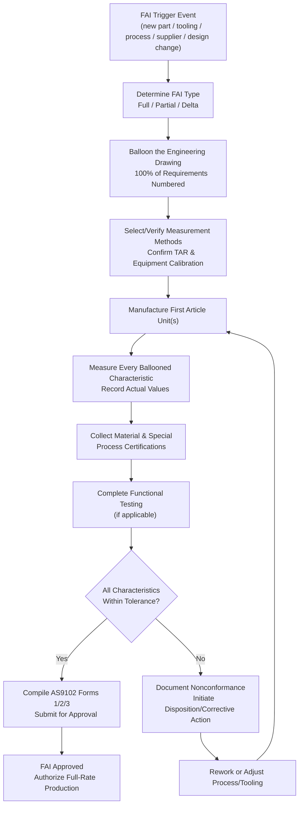

## First Article Inspection

### Overview

First Article Inspection (FAI) is a formal, comprehensive verification process performed on an initial sample unit (or small set) from a new production run, new tooling, new supplier, or after a significant process/design change, to confirm that the production process is capable of consistently manufacturing parts that conform to all engineering requirements before full-rate production proceeds. FAI serves as a gate: it validates the entire process, tooling, and documentation chain against the design intent using a single representative part, rather than sampling ongoing production. It is a formal requirement in aerospace (AS9102), automotive, medical device, and other regulated precision manufacturing sectors.

### Purpose and Triggers

**Key Points**

- Validates that production tooling, fixtures, and processes can produce parts meeting 100% of specified requirements
- Confirms measurement methods and documentation (drawings, specifications, purchase order requirements) are correctly interpreted and traceable
- Required triggers typically include: new part introduction, new or modified tooling, change of manufacturing location/facility, change of manufacturing process or material, a design change affecting form/fit/function, a lapse in production (typically 2+ years per AS9102 convention), or a change of supplier for the part

### AS9102 Framework (Aerospace Standard)

**Key Points**

- **Form 1 — Part Number Accountability**: Documents part number, revision, drawing reference, and identifies whether the FAI is full, partial, or a delta FAI
- **Form 2 — Product Accountability (Materials, Special Processes, Functional Testing)**: Records raw material certifications, special process approvals (heat treat, plating, NDT), and functional test results
- **Form 3 — Characteristic Accountability, Verification, and Compatibility**: The core dimensional record — every characteristic on the drawing (dimensional, GD&T, notes) is individually numbered (bubbled), measured, and recorded against its specified tolerance

**Full vs. Partial vs. Delta FAI**

- **Full FAI**: Complete verification of all characteristics, required for genuinely new parts
- **Partial FAI**: Covers only characteristics affected by a specific process, tooling, or design change, referencing the prior full FAI for unaffected characteristics
- **Delta FAI**: A subset verification specifically addressing what changed since the last full FAI (e.g., a single revised dimension)

### Ballooned Drawing (Characteristic Bubbling)

Every dimension, tolerance, note, and specification callout on the engineering drawing is assigned a unique sequential number ("balloon") that maps directly to a row in the characteristic accountability record (Form 3). This ensures complete traceability — every requirement on the drawing has a corresponding verified measurement result, and nothing is silently omitted.

**Key Points**

- Balloon numbers must cover 100% of drawing requirements, including general notes, material callouts, and surface finish requirements — not only dimensional tolerances
- GD&T callouts (position, flatness, profile, etc.) are bubbled individually and typically require documented measurement methodology given their complexity
- Reference dimensions (marked "REF" on drawings) are typically noted but not required to pass/fail against tolerance since they are non-mandatory

### FAI Data Requirements

**Key Points**

- **Actual measured value** for every characteristic, not merely a pass/fail indication — enables trend analysis and supports future partial/delta FAI comparisons
- **Measurement method/equipment used** for each characteristic, supporting traceability to calibrated, capable measurement systems
- **Material and process certifications**: mill certs, heat treat certs, plating/coating certification, special process approvals (e.g., NADCAP-accredited processes in aerospace)
- **Functional test results**, where applicable (e.g., proof load testing, electrical continuity, leak testing)
- **Nonconformance documentation**: any characteristic outside tolerance must be documented with a linked disposition (rework, use-as-is with engineering approval, scrap) before the FAI can be considered complete/approved

### Relationship to Measurement System Requirements

Because FAI often involves verifying tight tolerances and complex GD&T callouts for the first time on a new part, measurement system adequacy is a prerequisite:

- Test Accuracy Ratio (TAR) should be verified for each characteristic's chosen measurement method before FAI execution, consistent with inspection planning strategy
- CMM programs, if used, should themselves be validated (first-piece CMM program verification against a known/calibrated reference) before being trusted as the FAI measurement method
- Gauge R&R studies may be warranted for characteristics with historically difficult measurement repeatability, particularly on new or unfamiliar geometries

### FAI Process Flow

### SVG Illustration: Ballooned Drawing Concept

<svg xmlns="http://www.w3.org/2000/svg" viewBox="0 0 640 320">
<text x="320" y="20" font-size="14" text-anchor="middle" font-family="sans-serif" font-weight="bold">Ballooned Drawing to FAI Record Mapping (svg_diagram)</text>
<rect x="60" y="50" width="220" height="220" fill="none" stroke="black" stroke-width="1.5" />
<text x="170" y="70" font-size="11" text-anchor="middle" font-family="sans-serif">Engineering Drawing</text>
<line x1="90" y1="100" x2="240" y2="100" stroke="gray" />
<circle cx="80" cy="100" r="10" fill="none" stroke="#c53030" />
<text x="80" y="104" font-size="9" text-anchor="middle" font-family="sans-serif">1</text>
<line x1="90" y1="150" x2="240" y2="140" stroke="gray" />
<circle cx="80" cy="150" r="10" fill="none" stroke="#c53030" />
<text x="80" y="154" font-size="9" text-anchor="middle" font-family="sans-serif">2</text>
<line x1="90" y1="200" x2="240" y2="210" stroke="gray" />
<circle cx="80" cy="200" r="10" fill="none" stroke="#c53030" />
<text x="80" y="204" font-size="9" text-anchor="middle" font-family="sans-serif">3</text>
<line x1="280" y1="160" x2="360" y2="160" stroke="black" marker-end="url(#arrow)" />
<rect x="360" y="50" width="220" height="220" fill="none" stroke="black" stroke-width="1.5" />
<text x="470" y="70" font-size="11" text-anchor="middle" font-family="sans-serif">Form 3: Characteristic Record</text>
<text x="380" y="100" font-size="10" font-family="sans-serif">1 | Actual: 25.002mm | PASS</text>
<text x="380" y="150" font-size="10" font-family="sans-serif">2 | Actual: 0.008mm | PASS</text>
<text x="380" y="200" font-size="10" font-family="sans-serif">3 | Actual: Ra 0.4µm | PASS</text>
</svg>

### Application in Precision Metrology & Quality Control

**Example**

A precision instrument manufacturer introduces a new titanium housing part with 47 individually toleranced dimensional and geometric characteristics, including three true-position GD&T callouts and a critical bore diameter at ±0.005 mm. FAI execution proceeds as follows:

1. The drawing is ballooned, confirming all 47 characteristics plus material specification and anodizing callout are numbered — totaling 49 balloon items.
2. TAR verification confirms the bore diameter will be measured on a calibrated CMM with $\pm0.0008$ mm uncertainty, yielding TAR ≈ 6.25:1, exceeding the 4:1 minimum.
3. The true-position callouts require a documented CMM measurement strategy (datum scheme, probe approach) recorded alongside the actual measured position values.
4. Material certification (titanium alloy mill cert) and anodizing process certification (special process, outsourced to an accredited vendor) are collected and attached to Form 2.
5. One characteristic — a chamfer dimension — measures out of tolerance. A nonconformance is documented, engineering reviews and approves a "use-as-is" disposition since the deviation does not affect fit or function, and this disposition is recorded on Form 3 before FAI approval.
6. The completed FAI package (Forms 1, 2, 3, certifications, and disposition record) is submitted and approved, authorizing release to full-rate production.

This FAI package becomes the baseline reference for any future partial or delta FAI triggered by subsequent tooling or process changes to this part.

### Common Pitfalls

- Ballooning only dimensional tolerances while omitting general notes, material callouts, or surface finish requirements from the drawing, leaving gaps in the verification record
- Recording only pass/fail results rather than actual measured values, eliminating the ability to trend data or perform efficient delta FAI in the future
- Using uncalibrated or unverified measurement equipment for FAI, undermining the credibility of the entire verification even if the part is dimensionally acceptable
- Treating FAI as a one-time historical event rather than re-triggering it appropriately after subsequent tooling, process, supplier, or design changes
- Approving an FAI package with unresolved nonconformances lacking a documented and approved engineering disposition

**Conclusion**

First Article Inspection provides comprehensive, characteristic-by-characteristic objective evidence that a manufacturing process, tooling set, and documentation chain can produce a part meeting 100% of engineering requirements before committing to full production volume. Its rigor — complete drawing ballooning, actual value recording, and full material/process traceability — distinguishes it from routine in-process or final inspection sampling, making it a foundational control point in inspection planning strategy for new or changed parts.

**Related Topics**

- Inspection Planning Strategy
- Nonconforming Material Control and Disposition
- AS9102 Form 1/2/3 Documentation Requirements
- Measurement System Analysis (MSA) and Test Accuracy Ratio (TAR)
- GD&T (Geometric Dimensioning and Tolerancing) Verification Methods
- CMM Programming and Measurement Strategy Validation
- Special Process Approval and NADCAP Accreditation
- Production Part Approval Process (PPAP) in Automotive Quality Systems