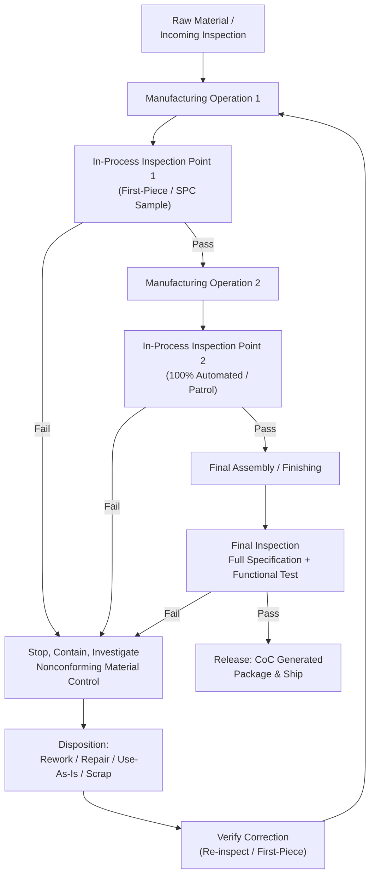

## In-Process and Final Inspection

### Overview

In-process and final inspection are the two production-stage verification activities that occur after incoming/receiving inspection and after (or during) manufacturing, forming the primary defense against nonconforming product reaching the customer. In-process inspection intervenes during manufacturing, close to the point where a characteristic is generated, while final inspection provides the last comprehensive verification before release, packaging, or shipment. Together they operationalize the inspection plan and control plan established during inspection planning, and generate the objective evidence and data streams that feed SPC, capability analysis, and nonconforming material control.

### In-Process Inspection

**Definition and Purpose**

In-process inspection verifies characteristics at intermediate stages of manufacturing, typically immediately after the operation that creates or is most likely to affect a given characteristic. Its principal advantage over final-only inspection is early detection — catching a nonconformance before additional value (labor, material, further processing) is added to a defective part.

**Key Points**

- Positioned at points identified in the control plan as high-risk based on FMEA occurrence/detection rankings or historical defect data
- Often integrated directly into the manufacturing cell (in-line gauging, vision systems) rather than requiring parts to travel to a separate inspection station
- Supports real-time or near-real-time process feedback, enabling operators to adjust process parameters before producing further nonconforming parts
- May use go/no-go fixed-limit gauges for speed, or variable measurement (micrometers, height gauges, CMM) when trend data is needed for SPC

**In-Process Inspection Methods**

- **First-Piece / Set-Up Verification**: Inspecting the first part(s) produced after a setup, tooling change, or job changeover before running the full batch
- **Patrol/Roving Inspection**: A quality technician periodically samples parts directly at the machine or workstation throughout a production run
- **Statistical Process Control (SPC) Sampling**: Periodic measurement of a characteristic plotted on a control chart to monitor process stability in real time, distinct from lot acceptance sampling
- **100% Automated Inspection**: Vision systems, laser scanners, or in-line gauges checking every part for critical characteristics at production speed

### Final Inspection

**Definition and Purpose**

Final inspection is the comprehensive verification performed on the completed product after all manufacturing operations are finished, confirming conformance to the full specification before the product is released for shipment, packaging, or customer delivery. It is the last opportunity to catch a nonconformance internally, but also the most expensive point of detection, since maximum labor, material, and processing value has already been invested.

**Key Points**

- Verifies characteristics that could not be checked in-process (e.g., those affected by later assembly, coating, or finishing steps)
- Includes cosmetic/appearance inspection frequently deferred from in-process stages
- Often includes functional testing (electrical, mechanical actuation, leak testing) that can only be performed on the completed assembly
- Generates the certificate of conformance (CoC) or inspection record required for customer delivery documentation
- Sampling approach ranges from 100% inspection (critical/safety characteristics) to statistical acceptance sampling (ANSI/ASQ Z1.4) depending on characteristic classification

### Comparison: In-Process vs. Final Inspection

| Aspect | In-Process Inspection | Final Inspection |
| --- | --- | --- |
| Timing | During manufacturing, near point of characteristic generation | After all operations complete |
| Primary Goal | Early detection, process control, prevent value-add to defects | Comprehensive conformance verification before release |
| Typical Method | SPC sampling, first-piece verification, 100% automated gauging | Statistical sampling or 100%, functional test, CoC generation |
| Cost of Escaped Defect | Lower (caught before further processing) | Higher (all value already added; risk of shipment) |
| Data Use | Real-time process adjustment, control charts | Lot disposition, shipment release, customer documentation |

### Reaction Plans for Out-of-Tolerance Results

Both in-process and final inspection require a documented reaction plan defining what happens when a measurement falls outside specification or a control chart signals an out-of-control condition:

**Key Points**

- **Stop and Contain**: Halt the process/line and quarantine suspect product (current part plus parts produced since the last known-good verification)
- **Root Cause Investigation**: Determine whether the nonconformance is an isolated event or indicates a systemic process shift
- **Disposition**: Route nonconforming material through the nonconforming material control process (rework, repair, use-as-is with engineering approval, scrap)
- **Verification of Correction**: Confirm the process is restored to a state of control (e.g., via first-piece re-verification) before resuming production
- **Escape Point Assessment**: Determine how far downstream (or whether to the customer) potentially affected product may have traveled, triggering containment or recall actions if needed

### Process Flow: In-Process to Final Inspection

### SVG Illustration: Inspection Point Placement Along Process Flow

<svg xmlns="http://www.w3.org/2000/svg" viewBox="0 0 640 260">
<text x="320" y="20" font-size="14" text-anchor="middle" font-family="sans-serif" font-weight="bold">Inspection Points Along Production Flow (svg_diagram)</text>
<line x1="40" y1="150" x2="600" y2="150" stroke="black" stroke-width="2" />
<rect x="40" y="120" width="90" height="60" fill="#ebf8ff" stroke="#2b6cb0" />
<text x="85" y="155" font-size="10" text-anchor="middle" font-family="sans-serif">Op 1</text>
<polygon points="150,150 165,140 180,150 165,160" fill="#f0fff4" stroke="#2f855a" />
<text x="165" y="190" font-size="9" text-anchor="middle" font-family="sans-serif">In-Process 1</text>
<rect x="200" y="120" width="90" height="60" fill="#ebf8ff" stroke="#2b6cb0" />
<text x="245" y="155" font-size="10" text-anchor="middle" font-family="sans-serif">Op 2</text>
<polygon points="310,150 325,140 340,150 325,160" fill="#f0fff4" stroke="#2f855a" />
<text x="325" y="190" font-size="9" text-anchor="middle" font-family="sans-serif">In-Process 2</text>
<rect x="360" y="120" width="90" height="60" fill="#ebf8ff" stroke="#2b6cb0" />
<text x="405" y="155" font-size="10" text-anchor="middle" font-family="sans-serif">Assembly</text>
<polygon points="470,150 485,135 500,150 485,165" fill="#fff5f5" stroke="#c53030" stroke-width="2" />
<text x="485" y="195" font-size="9" text-anchor="middle" font-family="sans-serif">Final Inspection</text>
<rect x="520" y="120" width="70" height="60" fill="#f0fff4" stroke="#2f855a" />
<text x="555" y="155" font-size="10" text-anchor="middle" font-family="sans-serif">Ship</text>
</svg>

### Application in Precision Metrology & Quality Control

**Example**

A manufacturer of precision pressure gauges implements the following inspection sequence for a critical assembly:

1. **In-process (Op: Bourdon tube forming)**: 100% automated laser measurement of tube curvature immediately after forming, since this characteristic directly determines gauge accuracy and cannot be economically corrected later. First-piece verification is mandatory after every tooling change.
2. **In-process (Op: dial calibration/adjustment)**: SPC sampling of pointer accuracy at five reference pressure points, one unit per 20 produced, plotted on an X-bar/R control chart to detect drift in the adjustment process.
3. **Final inspection**: Every completed gauge undergoes 100% functional testing across its full pressure range against a traceable dead-weight tester (linking to the facility's calibration and measurement traceability program), plus a statistical sample (Z1.4, level II) for cosmetic/labeling verification.
4. A gauge failing final functional test triggers containment of all units produced since the last successful in-process SPC check, root cause investigation into the adjustment station, and disposition of the affected lot before resuming shipment.

This layered approach ensures the highest-risk characteristic (tube forming, which is costly to correct downstream) receives 100% in-process verification, while lower-risk characteristics use statistically justified sampling, and final inspection provides the comprehensive functional confirmation required before a measurement instrument can be certified and shipped.

### Common Pitfalls

- Relying exclusively on final inspection without in-process checks, allowing defects to accumulate significant added value before detection
- Treating in-process SPC sampling as equivalent to lot acceptance sampling — SPC monitors process stability over time, while acceptance sampling makes a disposition decision on a specific lot; conflating the two misapplies both statistical frameworks
- Failing to define and document a reaction plan for out-of-control or out-of-tolerance results, leading to inconsistent or delayed response
- Allowing production to continue after an in-process failure without properly containing and assessing product made since the last known-good verification
- Neglecting to verify that final inspection measurement equipment maintains sufficient TAR for the tightest final-stage characteristics, particularly after upstream processes may have introduced cumulative tolerance stack-up

**Conclusion**

In-process and final inspection together implement the inspection plan's intent across the full production sequence: in-process inspection catches problems early and enables real-time process control, while final inspection provides the comprehensive last-gate verification and generates the documentation required for product release. Their effective integration — with clearly defined reaction plans for nonconformances — determines how much of a defect's cost is contained before it reaches the customer.

**Related Topics**

- Inspection Planning Strategy
- First Article Inspection
- Nonconforming Material Control and Disposition
- Statistical Process Control (SPC) and Control Charts
- Acceptance Sampling Plans (ANSI/ASQ Z1.4, Z1.9)
- Measurement System Analysis (MSA) and Test Accuracy Ratio (TAR)
- Containment and Escape Point Analysis
- Certificate of Conformance (CoC) Documentation Requirements