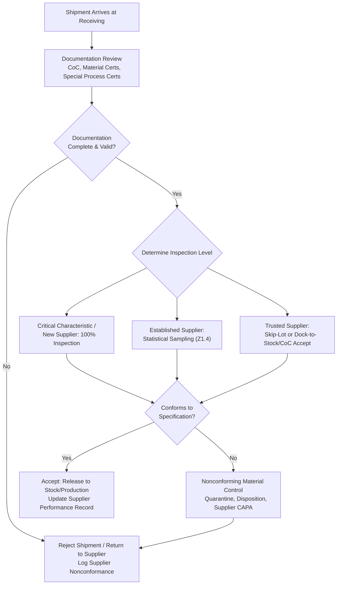

## Receiving and Incoming Inspection

### Overview

Receiving and incoming inspection is the verification activity performed on purchased materials, components, subassemblies, or products upon arrival at a facility, before they are released into production or stock. It serves as the first quality gate in the manufacturing chain, protecting downstream processes from supplier-introduced nonconformances. Unlike in-process or final inspection, incoming inspection strategy is heavily shaped by supplier quality history, criticality of the purchased item, and the practicality of verifying characteristics that may require destructive testing or specialized equipment not available to the supplier.

### Objectives of Incoming Inspection

**Key Points**

- Verify purchased items conform to purchase order requirements, drawings, and specifications before consuming production resources on them
- Confirm required documentation accompanies the shipment (certificates of conformance, material certifications, test reports)
- Detect supplier process drift or quality escapes before they propagate into finished product
- Establish traceability linking received material lots to subsequent production and, ultimately, to the customer
- Generate supplier performance data feeding supplier quality management and audit programs

### Inspection Strategy Spectrum

**Key Points**

- **100% Inspection**: Applied to critical characteristics, new suppliers without established history, or items where supplier process capability has not been demonstrated
- **Statistical Sampling**: Acceptance sampling plans (ANSI/ASQ Z1.4 for attributes, Z1.9 for variables) applied to represent lot quality with defined producer's risk ($\alpha$) and consumer's risk ($\beta$)
- **Reduced/Tightened Inspection**: Sampling plans that adjust inspection intensity based on recent lot history — consecutive accepted lots may trigger reduced sampling, while rejections trigger tightened inspection, per the switching rules embedded in standards like Z1.4
- **Skip-Lot Inspection**: Inspecting only a fraction of incoming lots (e.g., 1 in 5) for suppliers with a sustained record of conformance, with defined reversion criteria if a nonconformance occurs
- **Certificate of Conformance (CoC) Acceptance / Dock-to-Stock**: Bypassing physical inspection entirely for highly trusted suppliers, relying on supplier-provided documentation and periodic audit verification instead
- **Source Inspection**: Physical verification performed at the supplier's facility before shipment, used for critical items where receiving-dock inspection is deemed insufficient or impractical (e.g., large assemblies, destructive test requirements)

### Determining Incoming Inspection Level

**Key Points**

- **Criticality Classification**: Critical characteristics (safety, function) typically warrant tighter/100% incoming inspection regardless of supplier history; minor/cosmetic characteristics may justify reduced sampling or CoC acceptance
- **Supplier Quality Rating**: Historical defect rate, on-time delivery, and corrective action responsiveness inform whether a supplier qualifies for reduced inspection or dock-to-stock status
- **Approved Supplier List (ASL) Status**: Only qualified/approved suppliers should be eligible for reduced inspection tiers; new or provisional suppliers typically require elevated inspection until sufficient history accumulates
- **Special Process Requirements**: Purchased items involving special processes (heat treatment, plating, NDT, welding) often require certification review regardless of general sampling tier, since these processes cannot be verified by dimensional inspection alone

### Incoming Inspection Activities

**Documentation Review**

- Verify certificate of conformance matches purchase order revision and specification
- Confirm material certifications (mill certs) match required material grade/specification
- Review special process certifications (e.g., NADCAP-accredited heat treat or plating certificates) for validity and scope
- Confirm calibration certificates accompany any purchased items that are themselves measurement equipment or standards

**Physical/Dimensional Verification**

- Sample or 100% measurement of critical dimensions against drawing requirements
- Visual/cosmetic inspection per defined acceptance criteria (workmanship standards)
- Functional testing where applicable (e.g., electrical continuity on purchased electronic assemblies)

**Material Verification**

- Positive Material Identification (PMI) for critical alloys, using methods such as X-ray fluorescence (XRF) spectroscopy, particularly where material substitution risk exists
- Hardness testing, where specified, to verify heat treatment was correctly applied

### Sampling Plan Application Example (ANSI/ASQ Z1.4)

For attribute sampling, the plan defines sample size and acceptance number (Ac) / rejection number (Re) based on lot size and the selected Acceptable Quality Level (AQL):

$$n = f(\text{Lot Size}, \text{Inspection Level}), \quad \text{Accept if } d \leq Ac, \quad \text{Reject if } d \geq Re$$

where $d$ is the number of nonconforming units found in the sample $n$. Switching rules (normal → tightened → reduced) are applied based on the recent history of consecutive lot acceptances or rejections, per the standard's defined switching logic.

### Incoming Inspection Decision Flow

### SVG Illustration: Incoming Inspection Tier Selection by Supplier Performance

<svg xmlns="http://www.w3.org/2000/svg" viewBox="0 0 640 300">
<text x="320" y="20" font-size="14" text-anchor="middle" font-family="sans-serif" font-weight="bold">Inspection Tier vs Supplier Performance (svg_diagram)</text>
<line x1="60" y1="250" x2="600" y2="250" stroke="black" stroke-width="1.5" />
<line x1="60" y1="250" x2="60" y2="40" stroke="black" stroke-width="1.5" />
<text x="330" y="280" font-size="12" text-anchor="middle" font-family="sans-serif">Supplier Quality History (time)</text>
<text x="20" y="150" font-size="12" text-anchor="middle" font-family="sans-serif" transform="rotate(-90 20,150)">Inspection Intensity</text>
<path d="M 80 60 C 200 80, 300 150, 400 190 C 470 210, 530 220, 580 225" stroke="#2b6cb0" stroke-width="3" fill="none" />
<circle cx="80" cy="60" r="4" fill="#c53030" />
<text x="80" y="45" font-size="10" text-anchor="middle" font-family="sans-serif">New Supplier: 100%</text>
<circle cx="300" cy="150" r="4" fill="#c05621" />
<text x="300" y="135" font-size="10" text-anchor="middle" font-family="sans-serif">Established: Sampling</text>
<circle cx="580" cy="225" r="4" fill="#2f855a" />
<text x="580" y="240" font-size="10" text-anchor="middle" font-family="sans-serif">Trusted: Skip-Lot/CoC</text>
</svg>

### Application in Precision Metrology & Quality Control

**Example**

A precision instrument manufacturer receives sapphire lens blanks from two suppliers: Supplier A (5-year history, zero nonconformances) and Supplier B (newly qualified, first three shipments).

- **Supplier A shipments**: Skip-lot inspection at 1-in-4 lots, verifying only critical optical flatness and thickness via interferometry, since documentation review of the CoC and material certification is otherwise sufficient given the sustained performance record.
- **Supplier B shipments**: 100% dimensional inspection (diameter, thickness, flatness) plus PMI verification via XRF to confirm the sapphire composition matches specification, since no performance history yet justifies reduced sampling. Additionally, source inspection is scheduled at Supplier B's facility for the fourth shipment to observe their internal process controls directly.
- A nonconformance is discovered in Supplier B's third shipment (flatness out of tolerance on 3 of 20 sampled units). The lot is quarantined, dispositioned per nonconforming material control procedures, and a supplier corrective action request (SCAR) is issued. Inspection remains at 100% for all subsequent Supplier B shipments until root cause is confirmed resolved and a demonstrated conformance history is reestablished.

This approach concentrates inspection resources where risk is highest (new, unproven supplier) while avoiding redundant inspection effort on a supplier with sustained demonstrated capability — directly supporting efficient allocation of the metrology lab's optical measurement capacity.

### Common Pitfalls

- Granting reduced inspection or dock-to-stock status based on delivery performance alone without sufficient quality (conformance) history
- Failing to verify special process certifications (heat treat, plating, NDT) at incoming inspection, assuming dimensional conformance implies the special process was correctly performed
- Not verifying that a supplier's CoC references the correct part revision, allowing an obsolete revision to be accepted based on documentation review alone
- Applying reduced sampling plans without following the standard's formal switching rules, effectively granting unearned reduced scrutiny
- Neglecting positive material identification for critical alloys where visually identical but metallurgically different materials could be substituted, whether through error or counterfeit material risk

**Conclusion**

Receiving and incoming inspection establishes the first quality checkpoint in the production chain, filtering supplier-introduced nonconformances before they consume downstream manufacturing resources. Calibrating inspection intensity to criticality and demonstrated supplier performance — from 100% inspection for new or critical items to skip-lot or CoC acceptance for trusted suppliers — allows quality resources to be allocated where risk is genuinely highest, while formal switching and reversion rules ensure that reduced inspection remains contingent on sustained conformance rather than becoming a permanent, unmonitored assumption.

**Related Topics**

- Inspection Planning Strategy
- Nonconforming Material Control and Disposition
- Acceptance Sampling Plans (ANSI/ASQ Z1.4, Z1.9)
- Supplier Quality Management and Approved Supplier Lists
- Supplier Corrective Action Requests (SCAR)
- Positive Material Identification (PMI) Methods
- Special Process Approval and Certification Review
- First Article Inspection