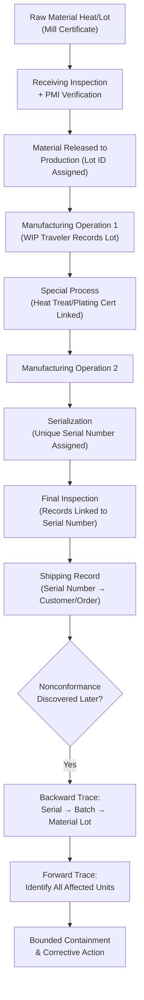

## Material Identification and Traceability

### Overview

Material identification and traceability is the system of practices and records that link a raw material, component, or finished product to its origin, processing history, and inspection results throughout its lifecycle. It ensures that at any point in the manufacturing chain, and even after a product has shipped, the specific material lot, heat, or batch used can be positively identified and its full history reconstructed. In precision metrology and quality control, traceability is foundational both to material conformance verification and to the broader concept of measurement traceability, and it underpins effective containment and root cause investigation whenever a nonconformance is discovered.

### Purpose and Regulatory Drivers

**Key Points**

- Enables rapid, bounded containment of affected product when a material or process nonconformance is discovered, rather than requiring recall of all production
- Supports root cause investigation by linking a defect to a specific material lot, supplier shipment, or processing batch
- Required by quality management system standards (ISO 9001, AS9100, IATF 16949, ISO 13485) as a mandatory element of product realization control
- Provides objective evidence for customer contractual requirements, particularly in aerospace, medical device, and defense sectors where full pedigree documentation is often mandated
- Supports counterfeit and fraudulent material risk mitigation, particularly for critical alloys and electronic components

### Levels of Material Identification

**Key Points**

- **Heat/Lot Number**: Identifies a specific production batch of raw material from the mill or primary producer, sharing common chemical composition and processing history
- **Batch/Lot Number (Manufactured Components)**: Identifies a group of components processed together through the same operations (e.g., same heat treatment furnace load, same plating bath cycle)
- **Serial Number**: Unique identifier for an individual unit, required when full genealogy of a single part (rather than a batch) must be tracked — common for critical, high-value, or safety-related components
- **Date Code**: Identifies the time period of manufacture, often used for electronic components where shelf life or obsolescence tracking matters

### Physical Marking Methods

**Key Points**

- **Direct Part Marking (DPM)**: Laser etching, engraving, or dot-peen marking directly onto the component, providing permanent identification that survives subsequent processing
- **Data Matrix / 2D Barcodes**: Enable machine-readable serialization, supporting automated data capture and reducing transcription errors
- **Tags and Labels**: Applied to raw stock, subassemblies, or containers where direct marking is impractical or would affect the part's function/surface
- **Color Coding**: Used for rapid visual differentiation of material grades or lots, typically supplementary to a primary identification method rather than a sole means of traceability
- **RFID Tagging**: Enables traceability through processes involving harsh environments (heat treatment, plating) where labels or direct marking might not survive

### Traceability Record Chain

A complete traceability system links records across every stage of the material and product lifecycle:

**Key Points**

- **Material Certification**: Mill certificate documenting chemical composition and mechanical properties of the raw material heat/lot
- **Receiving Inspection Record**: Links the received material lot to the incoming inspection results and disposition
- **Work-in-Process (WIP) Travelers**: Documents which material lot was used at each manufacturing operation, often accompanying the physical part or batch through the shop floor
- **Special Process Certifications**: Heat treatment, plating, or NDT certificates linked to the specific batch processed
- **Final Inspection and Test Records**: Linked to the specific serial number or lot at final release
- **Shipping Records**: Links the specific serial number/lot shipped to a specific customer order and date

### Positive Material Identification (PMI)

PMI verifies that the actual material composition of a component matches its specified grade, providing an independent check beyond documentation review — particularly important where material substitution risk exists (visually similar but metallurgically different alloys) or counterfeit material is a concern.

**Common PMI Methods**

- **X-Ray Fluorescence (XRF) Spectroscopy**: Portable or bench-mounted analysis providing rapid elemental composition verification, widely used for alloy sorting and verification
- **Optical Emission Spectroscopy (OES)**: More precise elemental analysis, typically used for lab-based verification of critical alloys, though it can be surface-marking on the part
- **Eddy Current Testing**: Used for conductivity-based sorting of certain alloy families
- **Hardness Testing**: Indirect verification that heat treatment was correctly applied, correlating with expected material properties

### Traceability Matrix Concept

A traceability matrix (or genealogy record) maps the relationship between raw material lots, in-process batches, and final serialized units, allowing bidirectional lookup:

$$\text{Raw Material Lot} \rightarrow \text{Process Batch} \rightarrow \text{Serial Number} \rightarrow \text{Customer/Shipment}$$

This structure supports both **forward traceability** (given a material lot, identify all affected finished units) and **backward traceability** (given a finished unit or customer complaint, identify its full material and process history).

### Traceability Chain Flow

### SVG Illustration: Forward vs Backward Traceability

<svg xmlns="http://www.w3.org/2000/svg" viewBox="0 0 640 300">
<text x="320" y="20" font-size="14" text-anchor="middle" font-family="sans-serif" font-weight="bold">Forward and Backward Traceability (svg_diagram)</text>
<rect x="40" y="120" width="120" height="50" fill="#ebf8ff" stroke="#2b6cb0" />
<text x="100" y="150" font-size="10" text-anchor="middle" font-family="sans-serif">Material Lot A</text>
<rect x="220" y="70" width="100" height="40" fill="#f0fff4" stroke="#2f855a" />
<text x="270" y="95" font-size="9" text-anchor="middle" font-family="sans-serif">Serial 001</text>
<rect x="220" y="150" width="100" height="40" fill="#f0fff4" stroke="#2f855a" />
<text x="270" y="175" font-size="9" text-anchor="middle" font-family="sans-serif">Serial 002</text>
<rect x="220" y="230" width="100" height="40" fill="#f0fff4" stroke="#2f855a" />
<text x="270" y="255" font-size="9" text-anchor="middle" font-family="sans-serif">Serial 003</text>
<line x1="160" y1="145" x2="220" y2="90" stroke="black" />
<line x1="160" y1="145" x2="220" y2="170" stroke="black" />
<line x1="160" y1="145" x2="220" y2="250" stroke="black" />
<text x="440" y="60" font-size="11" fill="#c53030" font-family="sans-serif" font-weight="bold">Forward: Lot → All Serials</text>
<text x="440" y="280" font-size="11" fill="#2b6cb0" font-family="sans-serif" font-weight="bold">Backward: Serial → Lot</text>
</svg>

### Application in Precision Metrology & Quality Control

**Example**

A manufacturer of precision gauge blocks receives tool steel heat lot #H-4471, which is direct-part-marked with a laser-etched batch code after receiving inspection and PMI verification (XRF confirms correct alloy composition matching the mill certificate). The lot is processed through heat treatment (linked via WIP traveler to heat treat furnace load #HT-2209) and precision grinding, then each finished gauge block is laser-etched with a unique serial number and undergoes final calibration against a traceable reference standard, with results recorded against that serial number.

Six months later, a customer reports dimensional drift outside specification on a gauge block. Backward traceability follows the serial number to heat lot #H-4471 and furnace load #HT-2209. Cross-referencing reveals two other gauge blocks from the same furnace load were shipped to different customers. Forward traceability from the furnace load identifies these units, enabling the manufacturer to proactively contact both customers and offer replacement/recalibration before the drift causes downstream measurement errors in their processes — rather than waiting for additional customer complaints to surface. Root cause investigation subsequently traces the issue to a temperature non-uniformity in that specific furnace load, isolating the corrective action to furnace calibration rather than a broader material or process design issue.

### Common Pitfalls

- Relying solely on batch/lot marking without serialization for critical or high-value components, preventing precise forward traceability to specific affected units when only a subset of a batch is actually defective
- Breaking the traceability chain during a manufacturing operation that does not properly update the WIP traveler or link the correct lot/batch identifier, creating a genealogy gap
- Accepting material certification documentation without PMI verification for critical alloys where substitution or counterfeit risk exists
- Using marking methods that do not survive subsequent processing (e.g., ink labels lost during plating or heat treatment), resulting in loss of identification mid-process
- Failing to maintain traceability records for the full required retention period specified by contract, regulation, or quality system requirements

**Conclusion**

Material identification and traceability provides the connective record structure that makes containment, root cause investigation, and nonconforming material control possible at a bounded, precise scope rather than requiring broad, costly recalls. Robust traceability — from heat/lot certification through serialization to final shipment — combined with positive material identification for critical materials, is a foundational control that protects both the manufacturer and the customer when nonconformances are inevitably discovered downstream.

**Related Topics**

- Receiving and Incoming Inspection
- Nonconforming Material Control and Disposition
- First Article Inspection
- Positive Material Identification (PMI) Methods
- Supplier Quality Management and Corrective Action
- Measurement Traceability to National/International Standards
- Root Cause Analysis and Containment Strategies
- Configuration Management and Document Control