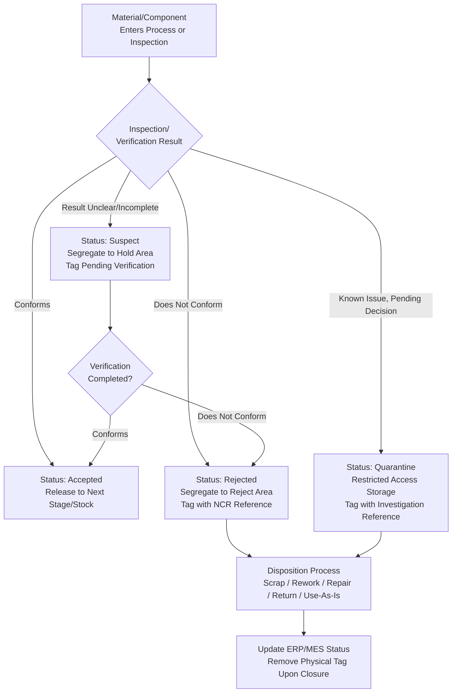

## Material Segregation and Classification

### Overview

Material segregation and classification is the practice of physically and administratively separating materials, components, and products according to their conformance status and disposition category, preventing nonconforming, suspect, or unidentified material from being inadvertently used, shipped, or mixed with conforming product. It operationalizes the containment principle that underlies effective nonconforming material control: a nonconformance cannot be properly dispositioned or investigated if the affected material cannot be physically located and isolated from the conforming population.

### Purpose and Rationale

**Key Points**

- Prevents accidental use or shipment of nonconforming material while disposition is pending or after rejection
- Provides visual and physical control that does not rely solely on paperwork or system records, reducing human error risk
- Supports accurate inventory accounting by ensuring conforming stock quantities are not inflated by material that is actually on hold or rejected
- Enables efficient root cause investigation by keeping suspect material physically accessible and unaltered pending analysis
- Required by quality management system standards (ISO 9001 clause on control of nonconforming outputs, AS9100, IATF 16949) as a mandatory control

### Material Status Classification Categories

**Key Points**

- **Conforming / Accepted**: Verified to meet all applicable specifications, released for use, further processing, or shipment
- **Nonconforming / Rejected**: Confirmed to not meet specification, pending or completed disposition (scrap, rework, repair, return to supplier, use-as-is)
- **Suspect / Unverified**: Status unknown — inspection incomplete, documentation missing, or a potential issue has been identified but not yet confirmed (e.g., material from a lot associated with a supplier alert but not yet individually verified)
- **On Hold**: Withheld from use pending a decision unrelated to a confirmed nonconformance (e.g., awaiting engineering disposition, awaiting customer approval, or a stop-work order)
- **Quarantined**: A more restrictive hold status typically applied when a known or strongly suspected nonconformance exists, often with tighter physical control requirements than general "hold" material
- **Scrap**: Confirmed nonconforming and dispositioned for destruction/disposal, requiring physical control to prevent inadvertent reuse

### Physical Segregation Methods

**Key Points**

- **Dedicated Physical Locations**: Separate cages, rooms, or clearly marked areas for hold, quarantine, and reject material, physically distinct from conforming stock and production flow
- **Color-Coded Tags/Labels**: Standardized color coding (e.g., red for reject, yellow for hold, green for accepted) provides immediate visual status recognition, though color coding should always be paired with written identification since color perception and standards can vary
- **Locked or Access-Controlled Storage**: For high-value or high-risk nonconforming material, restricting physical access prevents unauthorized movement or use
- **Bagging/Boxing with Status Labels**: Physically containing nonconforming material within its storage location, distinguishing it from loose conforming material even within a shared area
- **System-Level (ERP/MES) Status Flags**: Electronic status control that prevents a work order or shipment from drawing material flagged as nonconforming, on hold, or quarantined, complementing (not replacing) physical segregation

### Classification Tags and Documentation

**Key Points**

- Every segregated item or lot requires a physical tag or label identifying: material/lot/serial identification, status (hold/reject/quarantine), date, responsible person, and reference to the associated nonconformance record or hold order
- Tags should never be removed except by authorized personnel completing the disposition process, to prevent status from being lost or ambiguous
- Disposition records should reference back to the segregation tag/label to maintain a closed-loop link between physical material and paperwork

### Segregation in Different Production Contexts

**Key Points**

- **Receiving Area**: Newly arrived material pending incoming inspection should be segregated from released stock until inspection is complete, preventing premature use of unverified material
- **Shop Floor / WIP**: In-process nonconforming material must be immediately removed from the production flow at the point of detection to prevent commingling with conforming parts moving to the next operation
- **Storage/Warehouse**: Dedicated hold and quarantine areas, ideally physically separated from finished goods ready for shipment
- **Shipping Area**: Final verification that only conforming, released material reaches the shipping stage — segregation failures here carry the highest risk of customer escape

### Classification and Segregation Decision Flow

### SVG Illustration: Segregated Storage Area Layout

<svg xmlns="http://www.w3.org/2000/svg" viewBox="0 0 640 300">
<text x="320" y="20" font-size="14" text-anchor="middle" font-family="sans-serif" font-weight="bold">Segregated Material Storage Layout (svg_diagram)</text>
<rect x="40" y="60" width="160" height="180" fill="#f0fff4" stroke="#2f855a" stroke-width="2" />
<text x="120" y="90" font-size="11" text-anchor="middle" font-family="sans-serif" font-weight="bold">Conforming Stock</text>
<text x="120" y="110" font-size="9" text-anchor="middle" font-family="sans-serif">(Green Tag)</text>
<rect x="230" y="60" width="160" height="80" fill="#fffff0" stroke="#c05621" stroke-width="2" />
<text x="310" y="90" font-size="11" text-anchor="middle" font-family="sans-serif" font-weight="bold">Hold Area</text>
<text x="310" y="110" font-size="9" text-anchor="middle" font-family="sans-serif">(Yellow Tag)</text>
<rect x="230" y="160" width="160" height="80" fill="#fff5f5" stroke="#c53030" stroke-width="2" />
<text x="310" y="190" font-size="11" text-anchor="middle" font-family="sans-serif" font-weight="bold">Quarantine</text>
<text x="310" y="210" font-size="9" text-anchor="middle" font-family="sans-serif">(Restricted Access)</text>
<rect x="420" y="60" width="160" height="180" fill="#fdf2f8" stroke="#9b2c2c" stroke-width="2" stroke-dasharray="5,3" />
<text x="500" y="90" font-size="11" text-anchor="middle" font-family="sans-serif" font-weight="bold">Reject/Scrap</text>
<text x="500" y="110" font-size="9" text-anchor="middle" font-family="sans-serif">(Red Tag, Locked)</text>
</svg>

### Application in Precision Metrology & Quality Control

**Example**

A manufacturer of precision reference standards receives an incoming shipment of gauge steel blanks. During receiving inspection, dimensional measurements on 2 of 15 sampled blanks fall outside tolerance. The segregation response proceeds as follows:

1. The entire lot is immediately moved to the designated hold area and tagged "Suspect — Pending 100% Re-verification," referencing the incoming inspection record, since only a sample failed and the full lot's status is not yet determined.
2. The ERP system flags the lot number as on-hold, preventing production from drawing material from this lot even if a work order references it.
3. 100% re-inspection of the remaining 200 pieces in the lot identifies 8 additional nonconforming blanks. These 10 total nonconforming pieces are physically separated into the reject area, tagged with a reference to the nonconformance report (NCR), while the remaining 190 conforming pieces are re-tagged green and released to stock.
4. The 10 rejected blanks are held in quarantine (locked storage, given the ongoing supplier corrective action investigation) rather than immediately scrapped, since the supplier requests return of the nonconforming material for their own root cause analysis.
5. Only after the supplier corrective action is closed and the return shipment is confirmed are the quarantine tags removed and the transaction closed in the ERP system.

This segregation discipline ensures that during the several days required for 100% re-inspection and supplier coordination, no nonconforming gauge steel could be inadvertently pulled into production of a reference standard where dimensional error would propagate into a traceable measurement artifact.

### Common Pitfalls

- Relying on color-coded tags alone without written identification, creating ambiguity when tags fade, fall off, or are misapplied
- Allowing suspect or hold material to remain in the same physical location as conforming stock "temporarily," creating opportunity for accidental use
- Failing to synchronize physical segregation with system-level status flags, allowing a work order to draw material that is physically tagged as on-hold but not electronically blocked
- Removing segregation tags before the disposition process is formally closed and documented, breaking the link between physical material and its record
- Under-classifying suspect material as fully conforming to avoid the administrative burden of hold processing, effectively bypassing the containment control

**Conclusion**

Material segregation and classification provides the physical enforcement mechanism that makes nonconforming material control actually effective rather than merely documented. Clear status categories, consistent tagging discipline, dedicated physical locations, and synchronized electronic status flags together ensure that once a nonconformance or suspect condition is identified, the affected material is reliably contained until a proper disposition decision is made and executed.

**Related Topics**

- Nonconforming Material Control and Disposition
- Receiving and Incoming Inspection
- Material Identification and Traceability
- Nonconformance Report (NCR) Documentation
- Supplier Corrective Action Requests (SCAR)
- Containment and Root Cause Analysis
- Configuration Management and Document Control
- Quarantine Procedures for Suspect Counterfeit Materials