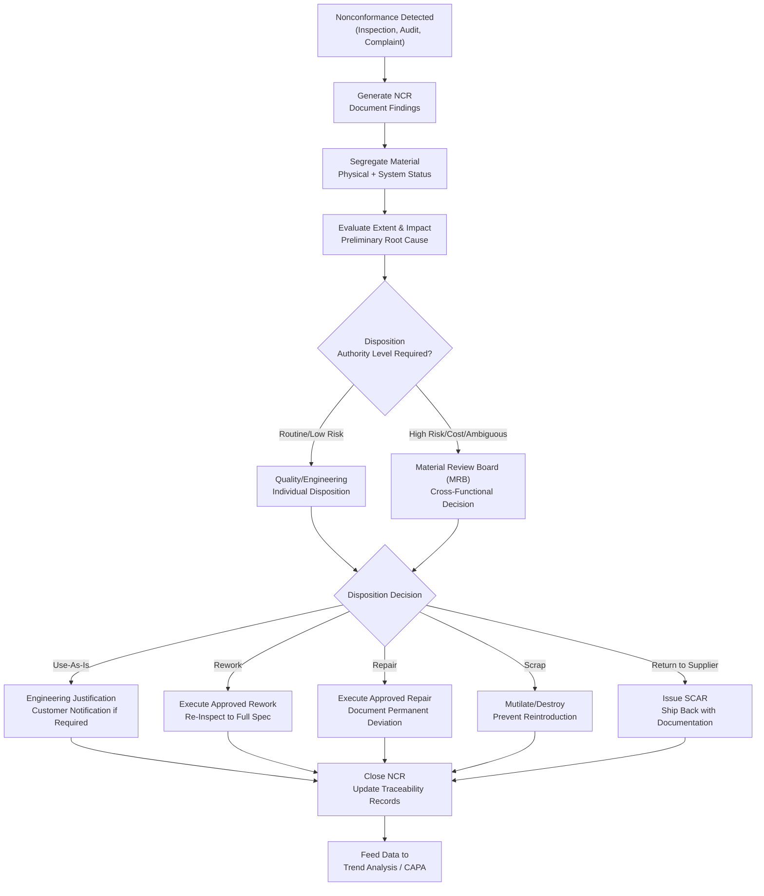

## Nonconforming Material Handling

### Overview

Nonconforming material handling is the formal process for identifying, documenting, evaluating, and dispositioning product or material that fails to meet specified requirements. It represents the procedural and decision-making counterpart to material segregation and classification — while segregation physically contains suspect or rejected material, nonconforming material handling defines the structured workflow that determines what ultimately happens to it. This process is a mandatory element of quality management systems (ISO 9001, AS9100, IATF 16949, ISO 13485) and directly determines whether a defect is contained cost-effectively or allowed to propagate further into production or to the customer.

### The Nonconforming Material Handling Process

**Key Points**

- **Identification**: A nonconformance is detected through inspection (incoming, in-process, final), audit, customer complaint, or supplier notification
- **Documentation**: A Nonconformance Report (NCR) or equivalent record is generated, capturing what was found, where, when, by whom, and against which requirement
- **Segregation**: The affected material is physically and/or electronically isolated to prevent inadvertent use (see material segregation and classification)
- **Evaluation**: Technical review determines the extent, root cause (where feasible at this stage), and potential impact of the nonconformance
- **Disposition Decision**: An authorized reviewer or Material Review Board (MRB) determines the appropriate disposition category
- **Disposition Execution**: The determined action (rework, repair, scrap, return, use-as-is) is carried out and verified
- **Closure and Records Update**: The NCR is closed, records updated, and data fed into trend analysis and corrective action systems

### Nonconformance Report (NCR) Content

**Key Points**

- Part/material identification (part number, revision, lot/serial number) with traceability reference
- Description of the nonconformance, including the specific requirement violated and the actual condition found
- Quantity affected and, where determinable at initial discovery, the extent of the affected population (single unit, lot, multiple lots)
- Detection point (incoming, in-process, final, field/customer)
- Reference to supporting objective evidence (measurement data, photos, test results)
- Disposition decision, approver identity, and date
- Verification of disposition completion

### Disposition Categories

**Use-As-Is**

The nonconforming characteristic does not affect form, fit, function, or safety sufficiently to warrant correction, and engineering formally approves the material for use without modification. This disposition requires documented engineering justification and, in many contractual/regulatory contexts, customer notification or approval, particularly in aerospace and medical device sectors.

**Rework**

The material is processed to bring it into full conformance with the original specification, using approved, previously qualified processes. Rework restores complete compliance and typically requires no special customer notification since the end result is a fully conforming part.

**Repair**

The material is processed to make it usable and functionally acceptable, but the result does not fully conform to the original specification (e.g., an oversized hole is bushed rather than restored to nominal). Repair typically requires an approved repair procedure and, in regulated industries, documented approval and customer notification since the part deviates permanently from the original design intent.

**Scrap**

The material is determined to be unusable and is dispositioned for destruction or disposal, with physical control to prevent inadvertent reintroduction into the supply chain (mutilation or defacement is often required for scrap parts resembling conforming ones).

**Return to Supplier**

For nonconforming purchased material, returning it to the supplier for their own investigation, credit, or replacement, typically accompanied by a Supplier Corrective Action Request (SCAR).

**Deviation/Waiver (Concession)**

A pre-approved, documented allowance to accept material that does not meet specification for a defined, limited scope (a specific lot or time period), typically requiring customer approval when the deviation affects contractually specified requirements — distinct from use-as-is in that a deviation is often requested and approved for planned/anticipated departures rather than after-the-fact.

### Material Review Board (MRB)

For nonconformances involving significant risk, cost, or ambiguity, disposition authority is often vested in a cross-functional Material Review Board rather than a single individual, typically including representatives from quality, engineering, and manufacturing (and, for certain contracts, a customer or regulatory representative).

**Key Points**

- Ensures technical, quality, and production perspectives all inform the disposition decision
- Common in aerospace and defense contracts where government or customer source inspection representatives may need to participate in or approve certain dispositions
- Provides a documented, defensible decision trail for higher-risk or higher-cost nonconformances

### Disposition Authority Considerations

**Key Points**

- Disposition authority (who is authorized to approve which disposition category) should be formally defined and typically scales with the risk/criticality of the affected characteristic
- Use-as-is and repair dispositions for critical/safety characteristics typically require engineering (not quality alone) sign-off, since these dispositions involve technical judgment about the original design intent
- Some disposition categories affecting contractual or regulatory requirements require customer or regulatory notification/approval regardless of internal authority levels

### Nonconforming Material Handling Flow

### SVG Illustration: Disposition Category Decision Factors

<svg xmlns="http://www.w3.org/2000/svg" viewBox="0 0 640 300">
<text x="320" y="20" font-size="14" text-anchor="middle" font-family="sans-serif" font-weight="bold">Disposition Category Selection Factors (svg_diagram)</text>
<line x1="60" y1="250" x2="600" y2="250" stroke="black" stroke-width="1.5" />
<line x1="60" y1="250" x2="60" y2="50" stroke="black" stroke-width="1.5" />
<text x="330" y="280" font-size="12" text-anchor="middle" font-family="sans-serif">Severity of Nonconformance</text>
<text x="20" y="150" font-size="12" text-anchor="middle" font-family="sans-serif" transform="rotate(-90 20,150)">Restorability</text>
<rect x="80" y="70" width="120" height="60" fill="#f0fff4" stroke="#2f855a" />
<text x="140" y="105" font-size="10" text-anchor="middle" font-family="sans-serif">Use-As-Is</text>
<rect x="230" y="70" width="120" height="60" fill="#ebf8ff" stroke="#2b6cb0" />
<text x="290" y="105" font-size="10" text-anchor="middle" font-family="sans-serif">Rework</text>
<rect x="380" y="150" width="120" height="60" fill="#fffaf0" stroke="#c05621" />
<text x="440" y="185" font-size="10" text-anchor="middle" font-family="sans-serif">Repair</text>
<rect x="450" y="220" width="130" height="25" fill="#fff5f5" stroke="#c53030" />
<text x="515" y="238" font-size="10" text-anchor="middle" font-family="sans-serif">Scrap</text>
</svg>

### Application in Precision Metrology & Quality Control

**Example**

A calibration laboratory discovers during final verification that a batch of 25 precision dial indicators exhibits a systematic 0.003 mm bias across the measurement range, traced to an incorrectly specified gear ratio in a supplier-provided movement assembly.

1. An NCR is generated documenting the bias, the affected lot (linked via traceability to the supplier's component batch), and the detection point (final calibration verification).
2. All 25 units are segregated to the hold area pending disposition; the ERP system flags the lot to prevent shipment.
3. Because the nonconformance affects a core functional/accuracy characteristic — directly relevant to the instrument's intended use as a measurement device — disposition authority is escalated to the Material Review Board, including engineering, quality, and a representative familiar with the customer's measurement uncertainty requirements.
4. The MRB determines "use-as-is" is not viable (the bias exceeds acceptable measurement uncertainty for the indicator's stated accuracy class) and "repair" is not practical (the gear ratio is a manufactured characteristic, not adjustable). Disposition is set to "rework": replace the movement assembly with correctly specified components and re-verify full calibration.
5. Rework is executed on all 25 units, each is re-verified against the full accuracy specification (not just the previously failed characteristic), and the NCR is closed with updated calibration certificates issued.
6. A parallel SCAR is issued to the movement assembly supplier, and the nonconformance data feeds into supplier performance tracking and a broader corrective action investigating why the incorrect gear ratio was not caught at incoming inspection.

This structured handling prevented instruments with a real, measurement-relevant defect from reaching customers who would rely on their stated accuracy class, while properly directing the corrective action to the actual root cause (a supplier component error) rather than only fixing the symptom.

### Common Pitfalls

- Selecting "use-as-is" disposition based on production or schedule pressure rather than genuine engineering justification that the deviation does not affect form, fit, function, or safety
- Failing to distinguish rework (restores full conformance) from repair (results in a permanent deviation) in records and customer communication, misrepresenting the true condition of delivered product
- Allowing informal or verbal disposition decisions for nonconformances that should require documented, authorized sign-off, particularly for critical characteristics
- Closing an NCR without verifying that the disposition was actually executed and re-inspected/re-tested as required
- Treating each nonconformance in isolation without feeding data into trend analysis, missing recurring patterns that indicate a systemic root cause requiring broader corrective action

**Conclusion**

Nonconforming material handling provides the structured decision framework that converts a detected defect into a documented, authorized, and verified resolution. By defining clear disposition categories, appropriate authority levels including Material Review Board escalation for higher-risk decisions, and closed-loop verification, this process ensures nonconforming material is neither inadvertently used nor unnecessarily scrapped, while generating the data trail necessary for effective root cause analysis and continuous improvement.

**Related Topics**

- Material Segregation and Classification
- Material Identification and Traceability
- Receiving and Incoming Inspection
- Inspection Planning Strategy
- Root Cause Analysis and Corrective Action (CAPA)
- Supplier Corrective Action Requests (SCAR)
- Material Review Board (MRB) Procedures
- Deviation and Waiver (Concession) Management