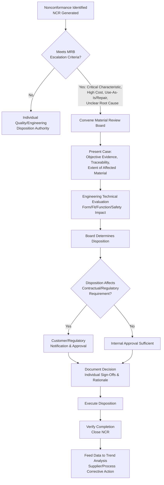

## Material Review Board Process

### Overview

The Material Review Board (MRB) process is a formal, cross-functional decision-making mechanism for evaluating and dispositioning nonconforming material that exceeds the routine authority, complexity, or risk threshold for individual disposition by quality or engineering personnel. Rather than a single reviewer making a disposition call, the MRB brings together multiple technical and organizational perspectives to ensure that decisions on ambiguous, high-cost, or high-risk nonconformances are technically sound, properly documented, and defensible. The MRB process is a formalized escalation path within the broader nonconforming material handling system, and is explicitly required or referenced in quality standards including AS9100, ISO 9001, and defense/government contracting regulations (e.g., ANSI/ASQ Z1.4 references, MIL-STD legacy frameworks).

### Purpose of the MRB

**Key Points**

- Provides a structured, multi-disciplinary review for nonconformances too complex, costly, or risky for single-person disposition authority
- Balances competing considerations: engineering (technical acceptability), quality (conformance and compliance), manufacturing (cost/schedule impact), and, where applicable, the customer/regulator (contractual and safety obligations)
- Creates a documented, auditable decision trail demonstrating that disposition was based on sound technical judgment rather than convenience or schedule pressure
- Prevents any single function from having unchecked authority to accept nonconforming product, particularly for characteristics with safety or functional significance

### When MRB Review Is Required

**Key Points**

- Nonconformances affecting critical or safety-related characteristics, regardless of the proposed disposition
- Proposed "use-as-is" or "repair" dispositions, since these result in delivered product that deviates from the original design intent and require the most rigorous justification
- Nonconformances of significant cost, quantity, or schedule impact
- Situations where root cause is unclear or where the nonconformance could indicate a systemic process issue extending beyond the immediate lot
- Contractual or regulatory requirements mandating MRB or customer-source involvement for certain material or contract types (common in aerospace/defense contracts, particularly government contracts referencing specific disposition authority requirements)
- Repeat or recurring nonconformances of the same type, indicating prior dispositions or corrective actions may have been ineffective

### MRB Composition

**Key Points**

- **Quality Representative**: Ensures the disposition process follows documented procedures, confirms objective evidence is complete, and represents the quality management system's compliance perspective
- **Engineering Representative**: Provides the technical judgment on whether a nonconformance affects form, fit, function, or safety, and whether use-as-is or repair is technically sound — this role typically carries primary authority for use-as-is and repair decisions
- **Manufacturing/Operations Representative**: Provides input on rework/repair feasibility, cost, and schedule impact
- **Customer or Government Representative** (where applicable): Required for certain contracts, particularly in aerospace and defense, where the customer retains approval authority over specific disposition categories
- **Materials/Supplier Quality Representative** (where applicable): Provides input when the nonconformance originates from purchased material, informing whether supplier corrective action is warranted in parallel

### MRB Decision Process

**Key Points**

- **Case Presentation**: The nonconformance, including objective evidence (measurements, photos, test data), traceability information, and extent of affected material, is presented to the board
- **Technical Evaluation**: Engineering assesses the actual impact of the deviation against the original design intent and applicable specifications
- **Disposition Determination**: The board collectively determines the appropriate disposition — use-as-is, rework, repair, scrap, or return to supplier — following the same disposition category definitions used in general nonconforming material handling
- **Documentation and Sign-Off**: Each board member's role and approval (or dissent) is formally recorded, along with the technical rationale supporting the decision
- **Customer/Regulatory Notification**: Where the disposition affects contractually specified requirements, formal notification or approval requests are issued as required before the disposition is executed

### MRB Authority Limits and Escalation

**Key Points**

- MRB authority itself is typically bounded — certain nonconformances (e.g., those affecting flight-critical or life-critical characteristics) may require escalation beyond the internal MRB to the customer, a designated engineering representative (DER) in aerospace contexts, or a regulatory body
- The MRB cannot override contractual requirements; if a disposition would violate a specific contractual or regulatory requirement, customer/regulatory approval is mandatory regardless of internal board consensus
- Some organizations define tiered MRB authority (e.g., a facility-level MRB for routine cases, escalating to a corporate or customer-inclusive MRB for higher-severity cases)

### MRB vs. Individual Disposition Authority

| Aspect | Individual Disposition | MRB Disposition |
| --- | --- | --- |
| Typical Scope | Routine, low-risk nonconformances with clear resolution | Complex, high-risk, ambiguous, or high-cost nonconformances |
| Decision Makers | Single quality or engineering authority | Cross-functional board (quality, engineering, manufacturing, customer where required) |
| Documentation Rigor | Standard NCR documentation | Enhanced: board composition, individual sign-offs, detailed technical rationale |
| Typical Disposition Categories | Rework, scrap, return to supplier | Use-as-is, repair, and any disposition affecting critical characteristics |
| Customer Involvement | Rare | Common, particularly in regulated industries |

### MRB Process Flow

### SVG Illustration: MRB Composition and Input Roles

<svg xmlns="http://www.w3.org/2000/svg" viewBox="0 0 640 320">
<text x="320" y="20" font-size="14" text-anchor="middle" font-family="sans-serif" font-weight="bold">Material Review Board Composition (svg_diagram)</text>
<circle cx="320" cy="170" r="60" fill="#ebf8ff" stroke="#2b6cb0" stroke-width="2" />
<text x="320" y="165" font-size="11" text-anchor="middle" font-family="sans-serif" font-weight="bold">MRB</text>
<text x="320" y="180" font-size="10" text-anchor="middle" font-family="sans-serif">Decision</text>
<rect x="60" y="60" width="140" height="45" fill="#f0fff4" stroke="#2f855a" />
<text x="130" y="87" font-size="10" text-anchor="middle" font-family="sans-serif">Quality Rep</text>
<rect x="440" y="60" width="140" height="45" fill="#fffaf0" stroke="#c05621" />
<text x="510" y="87" font-size="10" text-anchor="middle" font-family="sans-serif">Engineering Rep</text>
<rect x="60" y="220" width="140" height="45" fill="#fff5f5" stroke="#c53030" />
<text x="130" y="247" font-size="10" text-anchor="middle" font-family="sans-serif">Manufacturing Rep</text>
<rect x="440" y="220" width="140" height="45" fill="#faf5ff" stroke="#6b46c1" />
<text x="510" y="247" font-size="10" text-anchor="middle" font-family="sans-serif">Customer Rep</text>
<line x1="130" y1="105" x2="280" y2="140" stroke="black" />
<line x1="510" y1="105" x2="360" y2="140" stroke="black" />
<line x1="130" y1="220" x2="280" y2="195" stroke="black" />
<line x1="510" y1="220" x2="360" y2="195" stroke="black" />
</svg>

### Application in Precision Metrology & Quality Control

**Example**

A manufacturer of coordinate measuring machine (CMM) probe styli discovers, during final inspection, that a batch of 60 ruby-tipped styli has a tip diameter measuring 0.998 mm against a specification of 1.000 mm ± 0.001 mm — a deviation just outside the lower tolerance limit, affecting a characteristic directly tied to the instrument's measurement accuracy.

1. An NCR is generated, and because tip diameter is a critical characteristic directly affecting the customer's measurement uncertainty budget, the case is escalated to the MRB rather than dispositioned individually.
2. The MRB convenes with quality, engineering (specifically a metrologist familiar with the accuracy implications), and manufacturing representatives. Because two of the affected units were already shipped to an aerospace customer under a contract specifying MRB composition including a customer quality representative for any use-as-is disposition, that representative is included in the review.
3. Engineering evaluates whether the 0.002 mm undersize could be compensated through software calibration offset in the CMM's probe qualification routine. Analysis shows this compensation is valid only if the diameter is precisely and individually re-measured and entered into the specific CMM's calibration file — not a blanket acceptable-as-is for uncontrolled use.
4. The board determines: for the 58 units still in-house, disposition is "scrap" (economically preferable to conditional acceptance given the added calibration burden and residual risk). For the 2 units already shipped, disposition is "use-as-is with conditions" — requiring the customer to individually re-calibrate the specific probe offset — which requires the included customer representative's formal sign-off, given the contractual MRB composition requirement.
5. The decision, technical rationale, and each board member's sign-off (including the customer representative) are documented and attached to the NCR before closure.

This example illustrates why MRB escalation exists: engineering, quality, manufacturing, and even customer perspectives converged on different practical answers for materially identical nonconforming units simply because their downstream context (in-house scrap population vs. already-shipped, contractually governed units) differed.

### Common Pitfalls

- Convening an MRB without genuine engineering authority present, reducing the process to a documentation exercise rather than substantive technical evaluation
- Allowing schedule or cost pressure to dominate the board's decision, particularly pushing toward use-as-is dispositions without sufficient technical justification
- Failing to include a required customer or regulatory representative when contractually mandated, rendering the disposition potentially unauthorized despite internal consensus
- Treating MRB disposition as a one-time event disconnected from broader corrective action, missing the opportunity to address a systemic root cause behind a recurring nonconformance type
- Inconsistent application of MRB escalation criteria, where similar nonconformances are sometimes escalated and sometimes dispositioned individually without a clear, documented threshold

**Conclusion**

The Material Review Board process provides the escalation mechanism within nonconforming material handling for decisions too consequential, ambiguous, or contractually sensitive for individual disposition authority. By formally combining quality, engineering, manufacturing, and, where required, customer perspectives, the MRB ensures that decisions affecting critical characteristics or resulting in permanent deviation from specification (use-as-is, repair) receive rigorous, well-documented, and properly authorized technical review.

**Related Topics**

- Nonconforming Material Handling
- Material Segregation and Classification
- Material Identification and Traceability
- Disposition Categories: Use-As-Is, Rework, Repair, Scrap
- Supplier Corrective Action Requests (SCAR)
- Root Cause Analysis and Corrective Action (CAPA)
- Contractual and Regulatory Notification Requirements (Aerospace/Defense)
- Measurement Uncertainty Budgets and Their Role in Disposition Decisions