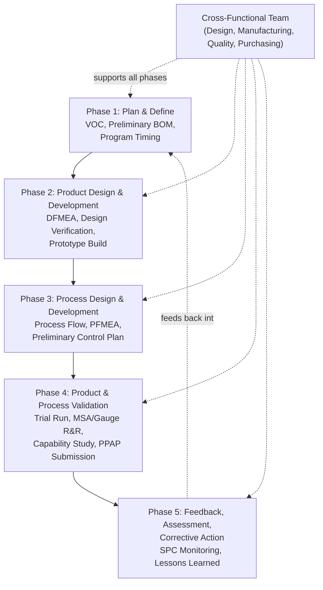

## Advanced Product Quality Planning

### Overview

Advanced Product Quality Planning (APQP) is a structured framework used primarily in the automotive industry, and adapted across other precision manufacturing sectors, for developing new products and processes with quality designed in from the outset rather than inspected in afterward. Originally formalized by AIAG (Automotive Industry Action Group) and now maintained jointly with VDA (German Association of the Automotive Industry) under the AIAG-VDA APQP framework, it provides a phased, cross-functional roadmap from concept through production launch, ensuring customer requirements are translated into a capable, controlled manufacturing process before volume production begins.

### Purpose and Objectives

**Key Points**

- Ensures customer satisfaction by systematically translating customer requirements into product and process specifications before production
- Promotes early identification of potential design and process risks, enabling proactive mitigation rather than reactive firefighting after launch
- Facilitates communication and coordination among all functions involved in product development (design, manufacturing, quality, purchasing)
- Establishes the documented linkage between design intent, process capability, and control methods that downstream tools (Control Plans, PPAP) depend upon
- Reduces the cost of quality by front-loading risk identification into the design and pre-production phases, where corrective changes are dramatically less expensive than post-launch corrections

### The Five Phases of APQP

**Phase 1: Plan and Define Program**

Establishes customer requirements and expectations, defines program objectives, and identifies preliminary product/process assumptions.

**Key Points**

- Voice of the Customer (VOC) inputs, including market research, warranty data from prior programs, and customer-specific requirements
- Preliminary Bill of Materials, preliminary process flow chart, and preliminary list of special/critical characteristics
- Product assurance plan and initial program timing established

**Phase 2: Product Design and Development**

Translates requirements into a design capable of meeting customer expectations, with formal risk assessment integrated throughout.

**Key Points**

- Design Failure Mode and Effects Analysis (DFMEA) to identify potential design-related failure modes and their effects
- Design for Manufacturability and Assembly (DFMA) review
- Design verification plan and prototype build, testing, and engineering drawing/specification finalization
- Identification of critical and significant characteristics carried forward into process design

**Phase 3: Process Design and Development**

Develops the manufacturing system and controls needed to produce a product meeting design requirements.

**Key Points**

- Process flow diagram detailing all steps from receiving through shipping
- Process Failure Mode and Effects Analysis (PFMEA) identifying potential process failure modes, their effects, and current controls
- Preliminary Control Plan defining measurement methods, sample sizes, and reaction plans for key characteristics
- Packaging standards, floor plan layout, and measurement systems analysis planning

**Phase 4: Product and Process Validation**

Validates that the manufacturing process, operating within actual production conditions, produces conforming product at the required rate.

**Key Points**

- Production trial run (significant production run, SPR) using actual production tooling, equipment, and environment
- Measurement Systems Analysis (MSA/Gauge R&R) execution to confirm measurement capability
- Preliminary process capability study to confirm the process can meet specification with acceptable capability indices ($C_p$, $C_{pk}$)
- Production Part Approval Process (PPAP) submission to the customer for approval
- Finalization of the Control Plan based on production trial run results

**Phase 5: Feedback, Assessment, and Corrective Action**

Evaluates the effectiveness of the quality planning effort using field/production data and drives continuous improvement.

**Key Points**

- Reduction of process variation through ongoing SPC monitoring
- Improved customer satisfaction tracking through warranty and field performance data
- Effective use of lessons learned to inform future program APQP efforts
- Formal transition from launch support to standard production quality management

### APQP Phase Flow

### Key Interconnected Deliverables

**Key Points**

- **DFMEA → PFMEA**: Design-level failure modes inform which process characteristics require the tightest control
- **PFMEA → Control Plan**: Process failure modes and their current controls directly populate the Control Plan's characteristic list, measurement methods, and reaction plans
- **Control Plan → PPAP**: The finalized Control Plan is a required PPAP submission element, demonstrating the process controls that will be sustained in production
- **MSA → Process Capability Study**: Measurement system adequacy (Gauge R&R) must be confirmed before capability study results ($C_p$/$C_{pk}$) can be trusted, since excessive measurement variation inflates apparent process variation

### APQP Timing Relative to Program Milestones

APQP phases are typically mapped against a program timing chart relative to Start of Production (SOP), with each phase's deliverables due at defined milestones before SOP (e.g., DFMEA complete at a defined point after design freeze, PPAP submission at a defined point before SOP). Timing charts visually track planned versus actual completion of each deliverable, providing program management visibility into quality planning risk.

### SVG Illustration: APQP Timing Relative to Start of Production

<svg xmlns="http://www.w3.org/2000/svg" viewBox="0 0 640 260">
<text x="320" y="20" font-size="14" text-anchor="middle" font-family="sans-serif" font-weight="bold">APQP Phase Timing Relative to SOP (svg_diagram)</text>
<line x1="40" y1="220" x2="600" y2="220" stroke="black" stroke-width="2" />
<line x1="520" y1="200" x2="520" y2="240" stroke="#c53030" stroke-width="2" />
<text x="520" y="255" font-size="10" text-anchor="middle" font-family="sans-serif" font-weight="bold">SOP</text>
<rect x="50" y="60" width="90" height="40" fill="#ebf8ff" stroke="#2b6cb0" />
<text x="95" y="85" font-size="9" text-anchor="middle" font-family="sans-serif">Phase 1</text>
<rect x="150" y="60" width="90" height="40" fill="#f0fff4" stroke="#2f855a" />
<text x="195" y="85" font-size="9" text-anchor="middle" font-family="sans-serif">Phase 2</text>
<rect x="250" y="60" width="120" height="40" fill="#fffaf0" stroke="#c05621" />
<text x="310" y="85" font-size="9" text-anchor="middle" font-family="sans-serif">Phase 3</text>
<rect x="380" y="60" width="130" height="40" fill="#fff5f5" stroke="#c53030" />
<text x="445" y="85" font-size="9" text-anchor="middle" font-family="sans-serif">Phase 4 (PPAP)</text>
<rect x="520" y="60" width="70" height="40" fill="#faf5ff" stroke="#6b46c1" />
<text x="555" y="85" font-size="9" text-anchor="middle" font-family="sans-serif">Phase 5</text>
</svg>

### Application in Precision Metrology & Quality Control

**Example**

A Tier 1 automotive supplier is developing a new sensor housing requiring a critical bore diameter tolerance of ±0.005 mm to accommodate a precision-fit sensor element. The APQP process proceeds as follows:

1. **Phase 1**: Customer specification review identifies the bore diameter and concentricity as customer-designated critical characteristics carrying special symbol designation on the drawing.
2. **Phase 2**: DFMEA identifies that dimensional variation in the bore could cause sensor misalignment (high severity), driving a design decision to add a locating feature reducing sensitivity to minor bore variation.
3. **Phase 3**: PFMEA on the boring operation identifies tool wear as the primary occurrence driver for bore diameter drift; the preliminary Control Plan specifies SPC sampling every 25 parts using an air gauge with confirmed adequate Test Accuracy Ratio, plus a defined reaction plan (tool change) triggered by a control chart warning limit rather than waiting for an out-of-tolerance part.
4. **Phase 4**: The significant production run confirms process capability of $C_{pk} = 1.62$ for the bore diameter, and Gauge R&R on the air gauge confirms less than 10% of tolerance consumed by measurement variation, both required for PPAP submission. The finalized Control Plan, capability study, and Gauge R&R report are submitted to the customer as part of the PPAP package.
5. **Phase 5**: Post-launch SPC data over the first six months confirms sustained capability, and a minor tool-wear-related trend identified at month 4 is corrected before producing any out-of-tolerance parts, validating the reaction plan established during Phase 3.

This example shows the deliverables of each phase directly feeding the next — DFMEA informing PFMEA, PFMEA informing the Control Plan, and the Control Plan and its supporting measurement validation forming the core of the PPAP submission.

### Common Pitfalls

- Treating APQP phases as a sequential checklist completed by quality alone, rather than a genuinely cross-functional effort involving design, manufacturing, and purchasing throughout
- Finalizing the Control Plan before the significant production run validates that measurement methods and sample sizes are actually practical and adequate under real production conditions
- Conducting DFMEA and PFMEA as isolated, disconnected exercises rather than ensuring design-level failure modes directly inform which process characteristics require the tightest control
- Submitting PPAP without genuine Gauge R&R validation, masking inadequate measurement system capability behind an apparently favorable capability index
- Treating Phase 5 (feedback and corrective action) as optional once PPAP approval is obtained, losing the opportunity to feed lessons learned into future program planning

**Conclusion**

Advanced Product Quality Planning provides the structured, phased framework connecting customer requirements through design, process development, and validation, ensuring that quality is engineered into a product and its manufacturing process before production begins rather than discovered through defects afterward. Its five phases build progressively on one another — from voice of customer through DFMEA/PFMEA risk assessment to validated, capable production processes documented in the Control Plan and PPAP — forming the foundational quality planning methodology that automotive and precision manufacturing core tools (FMEA, MSA, SPC, Control Plans, PPAP) all connect back to.

**Related Topics**

- Design and Process Failure Mode and Effects Analysis (DFMEA/PFMEA)
- Control Plan Development
- Production Part Approval Process (PPAP)
- Measurement Systems Analysis (MSA) and Gauge R&R
- Statistical Process Control (SPC) and Process Capability ($C_p$/$C_{pk}$)
- Inspection Planning Strategy
- First Article Inspection
- IATF 16949 Quality Management System Requirements