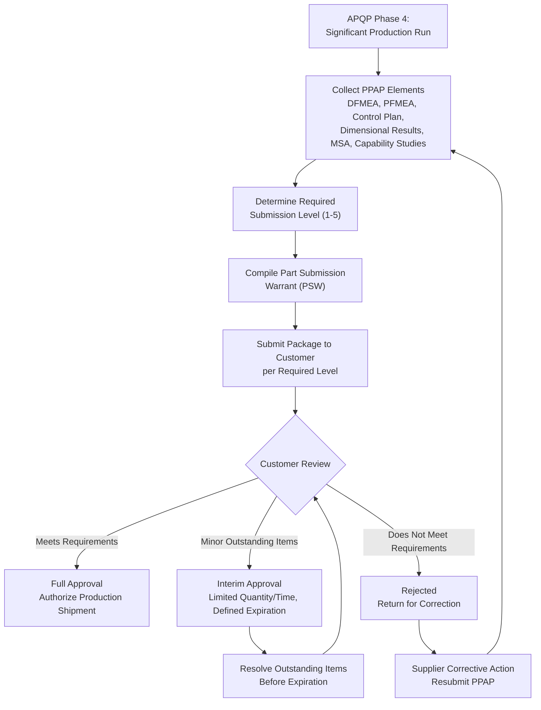

## Production Part Approval Process

### Overview

The Production Part Approval Process (PPAP) is a standardized methodology, defined by AIAG (and jointly with VDA under the AIAG-VDA framework), used primarily in the automotive industry to demonstrate that a supplier's production process, operating at production rate using production tooling and equipment, can consistently produce parts meeting all customer engineering requirements. PPAP represents the formal submission and approval gate at the conclusion of Advanced Product Quality Planning (APQP) Phase 4, providing the customer with objective evidence before authorizing full-rate production shipment.

### Purpose of PPAP

**Key Points**

- Provides evidence that the supplier understands and has correctly interpreted all customer engineering design record and specification requirements
- Demonstrates the manufacturing process has the potential to produce product consistently meeting requirements during an actual production run
- Confirms measurement systems used to verify conformance are themselves adequate (via MSA/Gauge R&R)
- Establishes an approved baseline against which future changes (process, tooling, location, supplier) must be re-validated
- Required not only for new parts but re-triggered by significant changes, analogous to the re-trigger logic for First Article Inspection

### PPAP Submission Levels

PPAP defines five submission levels specifying what documentation must be physically submitted to the customer versus retained at the supplier's facility, allowing customers to tailor the rigor of review to part risk and program requirements.

**Key Points**

- **Level 1**: Part Submission Warrant (PSW) only, submitted to the customer
- **Level 2**: PSW with product samples and limited supporting data submitted to the customer
- **Level 3**: PSW with product samples and complete supporting data submitted to the customer (most common default level)
- **Level 4**: PSW and other requirements as defined by the customer
- **Level 5**: PSW with product samples and complete supporting data available for review at the supplier's facility (customer reviews on-site rather than receiving a physical submission package)

### The 18 PPAP Elements

**Key Points**

1. **Design Records**: Current engineering drawing, including any authorized engineering change documents
2. **Authorized Engineering Change Documents**: Records of any engineering changes not yet incorporated into the drawing but authorized for production
3. **Customer Engineering Approval**: Where required by the customer, evidence of design approval (e.g., for supplier-designed parts)
4. **Design FMEA (DFMEA)**: Where the supplier has design responsibility
5. **Process Flow Diagram**: Documents all process steps and sequence in the manufacture of the part
6. **Process FMEA (PFMEA)**: Documents potential process failure modes, effects, and current controls
7. **Control Plan**: Documents the methods used to control production processes for part quality
8. **Measurement System Analysis (MSA) Studies**: Gauge R&R and related studies confirming measurement system capability
9. **Dimensional Results**: Complete dimensional evaluation of all characteristics against the ballooned drawing, analogous in structure to First Article Inspection's Form 3
10. **Material, Performance Test Results**: Test results demonstrating conformance to material and performance specifications
11. **Initial Process Studies**: Preliminary process capability studies ($C_p$/$C_{pk}$ or equivalent) for special/critical characteristics
12. **Qualified Laboratory Documentation**: Evidence that testing laboratories used are qualified (accredited or customer-approved)
13. **Appearance Approval Report (AAR)**: Required for parts with appearance requirements (color, grain, texture)
14. **Sample Production Parts**: Physical samples from the significant production run, retained by supplier or customer per submission level
15. **Master Sample**: A retained reference sample used for future comparison, particularly for characteristics not easily measured dimensionally
16. **Checking Aids**: Documentation of any special gauges/fixtures used for verification, including their own calibration/maintenance requirements
17. **Records of Compliance with Customer-Specific Requirements**: Any additional customer-specific PPAP or quality requirements beyond the standard AIAG elements
18. **Part Submission Warrant (PSW)**: The summary document declaring the submission's purpose, reason, and the supplier's declaration that all requirements are met, signed by an authorized supplier representative

### Part Submission Warrant (PSW) Content

**Key Points**

- Identifies the part number, revision level, and submission reason (initial submission, engineering change, tooling transfer, etc.)
- States the results of the dimensional, material, and performance evaluations
- Declares whether the submission is a "full approval," "interim approval" (temporary, with conditions and expiration), or "rejected" status
- Includes the supplier's formal declaration and signature certifying the submission's accuracy

### PPAP Submission Reasons (Re-Trigger Events)

Analogous to First Article Inspection re-trigger logic, PPAP is required not only for new parts but whenever specific changes occur:

**Key Points**

- New part or product (initial submission)
- Engineering change affecting design records, specifications, or materials
- Correction of a discrepancy on a previously submitted part
- Change of supplier's manufacturing location, process, tooling, or equipment
- Tooling transferred to a different facility, replaced, or refurbished beyond specified limits
- Change in test/inspection method that could affect conformance verification
- Product or process changes resulting from a customer-requested corrective action

### PPAP Approval Status Categories

**Key Points**

- **Full Approval**: All requirements are met; the part is approved for shipment of production quantities without restriction
- **Interim Approval**: Temporary approval permitting shipment of a limited quantity or for a limited time while specific outstanding requirements are resolved, with a defined expiration and required follow-up
- **Rejected**: The submission does not meet requirements; production shipment is not authorized until resubmission and approval

### PPAP Process Flow

### SVG Illustration: PPAP Element Categories

<svg viewBox="0 0 640 300" xmlns="http://www.w3.org/2000/svg">
<text x="320" y="20" font-size="14" text-anchor="middle" font-family="sans-serif" font-weight="bold">PPAP Element Categories (svg_diagram)</text>
<rect x="40" y="50" width="160" height="200" fill="#ebf8ff" stroke="#2b6cb0" stroke-width="2"/>
<text x="120" y="70" font-size="11" text-anchor="middle" font-family="sans-serif" font-weight="bold">Design/Risk</text>
<text x="120" y="95" font-size="9" text-anchor="middle" font-family="sans-serif">Design Records</text>
<text x="120" y="115" font-size="9" text-anchor="middle" font-family="sans-serif">DFMEA</text>
<text x="120" y="135" font-size="9" text-anchor="middle" font-family="sans-serif">PFMEA</text>
<text x="120" y="155" font-size="9" text-anchor="middle" font-family="sans-serif">Process Flow</text>
<rect x="240" y="50" width="160" height="200" fill="#f0fff4" stroke="#2f855a" stroke-width="2"/>
<text x="320" y="70" font-size="11" text-anchor="middle" font-family="sans-serif" font-weight="bold">Verification</text>
<text x="320" y="95" font-size="9" text-anchor="middle" font-family="sans-serif">Control Plan</text>
<text x="320" y="115" font-size="9" text-anchor="middle" font-family="sans-serif">MSA / Gauge R&R</text>
<text x="320" y="135" font-size="9" text-anchor="middle" font-family="sans-serif">Dimensional Results</text>
<text x="320" y="155" font-size="9" text-anchor="middle" font-family="sans-serif">Capability Studies</text>
<rect x="440" y="50" width="160" height="200" fill="#fffaf0" stroke="#c05621" stroke-width="2"/>
<text x="520" y="70" font-size="11" text-anchor="middle" font-family="sans-serif" font-weight="bold">Declaration</text>
<text x="520" y="95" font-size="9" text-anchor="middle" font-family="sans-serif">PSW</text>
<text x="520" y="115" font-size="9" text-anchor="middle" font-family="sans-serif">Sample Parts</text>
<text x="520" y="135" font-size="9" text-anchor="middle" font-family="sans-serif">Master Sample</text>
<text x="520" y="155" font-size="9" text-anchor="middle" font-family="sans-serif">Checking Aids</text>
</svg>

### Application in Precision Metrology & Quality Control

**Example**

A precision components supplier submits PPAP for a newly tooled sensor bracket with a critical hole position tolerance (true position ±0.05 mm) and a customer-designated critical characteristic on flatness.

1. The significant production run produces 300 parts using production tooling at full cycle rate, from which the dimensional results element records actual measured values for every ballooned characteristic on the drawing, structured identically to a First Article Inspection record.
2. MSA is performed on the CMM program used for hole position verification, confirming Gauge R&R (%GRR) below the customer's required 10% threshold — without this, the subsequent capability study would not be trustworthy.
3. Initial process capability study on the critical hole position, based on 30 consecutive parts from the trial run, shows $C_{pk} = 1.45$, exceeding the customer's minimum requirement of 1.33 for critical characteristics.
4. A checking fixture (special gauge) built specifically to verify flatness is documented as a checking aid, including its own calibration schedule, since this fixture itself becomes part of ongoing production verification.
5. The complete Level 3 package — PSW, dimensional results, MSA studies, capability study, PFMEA, Control Plan, process flow diagram, and sample parts — is submitted to the customer.
6. The customer's review identifies that the appearance approval report was omitted (the bracket has a customer-specified surface finish appearance requirement); the supplier issues interim approval documentation covering this gap with a committed resolution date, and the customer grants interim approval for initial production shipments pending the missing element.

This demonstrates how PPAP submission draws directly on APQP Phase 3/4 deliverables (PFMEA, Control Plan) and measurement validation work (MSA, capability studies) that mirror concepts from inspection planning and First Article Inspection, but packages them specifically for formal customer approval of production readiness.

### Common Pitfalls

- Submitting a capability study without first confirming measurement system adequacy via MSA/Gauge R&R, producing a capability index that may be misleading due to excessive measurement variation
- Conducting the "significant production run" under non-representative conditions (e.g., reduced rate, non-production tooling, or with additional manual sorting not part of normal production), invalidating the evidence PPAP is meant to provide
- Treating interim approval as equivalent to full approval, continuing production shipment past the interim approval's expiration without resolving outstanding items
- Failing to re-trigger PPAP submission after a qualifying change (tooling transfer, process change, engineering change), shipping production parts under an approval that no longer reflects the current process
- Omitting required PPAP elements applicable to the specific part (e.g., appearance approval report for parts with appearance requirements), leading to incomplete submissions and delayed approval

**Conclusion**

The Production Part Approval Process provides the formal, standardized evidence package and customer approval gate confirming that a supplier's actual production process — not merely prototype or trial parts — can consistently manufacture conforming product. By integrating design risk assessment (DFMEA/PFMEA), process control documentation (Control Plan), and measurement/capability validation (MSA, capability studies) into a single structured submission, PPAP closes the loop on Advanced Product Quality Planning and establishes the approved baseline against which all future part or process changes must be re-validated.

**Related Topics**

- Advanced Product Quality Planning (APQP)
- Design and Process Failure Mode and Effects Analysis (DFMEA/PFMEA)
- Control Plan Development
- Measurement Systems Analysis (MSA) and Gauge R&R
- Process Capability Indices ($C_p$/$C_{pk}$)
- First Article Inspection
- Part Submission Warrant (PSW) Documentation
- IATF 16949 Quality Management System Requirements