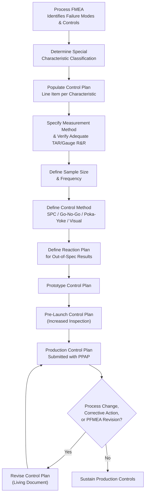

## Control Plans

### Overview

A Control Plan is a structured, living document that describes the systems and processes required to control a part or process, specifying for each characteristic what will be measured, how, how often, and what action to take if the measurement is out of specification. It serves as the operational synthesis point of Advanced Product Quality Planning, translating the risk analysis performed in Design and Process FMEA into concrete, executable shop-floor controls, and forms one of the core required elements of Production Part Approval Process submission.

### Purpose of the Control Plan

**Key Points**

- Provides a single, structured reference document linking each product/process characteristic to its specification, measurement method, sample size, frequency, and reaction plan
- Ensures process controls identified as necessary during PFMEA risk assessment are actually implemented and sustained in production, not merely analyzed on paper
- Serves as a training and communication tool for operators and quality personnel regarding what to check, how, and what to do when a result is out of specification
- Provides objective evidence to customers and auditors that appropriate controls exist for critical, significant, and standard characteristics
- Functions as a living document, updated whenever process changes, corrective actions, or new risk information (e.g., a new PFMEA revision) warrant revision

### Three Types of Control Plans (Phased with APQP)

**Key Points**

- **Prototype Control Plan**: Used during initial builds, describing dimensional measurements, material, and performance tests that will occur during prototype build (APQP Phase 2)
- **Pre-Launch Control Plan**: Used after prototype but before full production, typically involving increased inspection frequency, additional controls, or 100% inspection while process capability is still being demonstrated (APQP Phase 3)
- **Production Control Plan**: The full, ongoing production-level document reflecting the controls sustained during normal volume production once process capability is validated (APQP Phase 4 onward, submitted with PPAP)

### Core Control Plan Elements (Columns)

**Key Points**

- **Part/Process Number and Description**: Identifies the specific part, operation, or process step covered
- **Characteristic Number**: Links back to the ballooned drawing/PFMEA item numbering for traceability across documents
- **Product/Process Characteristic**: The specific dimension, feature, or process parameter being controlled
- **Special Characteristic Classification**: Designates whether the characteristic is critical, significant, key, or standard, often using customer-specific symbols (e.g., a diamond, shield, or flag symbol denoting a customer-designated special characteristic)
- **Specification/Tolerance**: The engineering requirement the characteristic must meet
- **Measurement Technique**: The gauge, instrument, or method used to evaluate the characteristic
- **Sample Size and Frequency**: How many units are checked and how often (every part, every N parts, per shift, per lot)
- **Control Method**: The type of control used — SPC control chart, go/no-go gauge, error-proofing (poka-yoke) device, visual check, etc.
- **Reaction Plan**: The specific, documented action to take when the characteristic is found out of specification or the control method signals an out-of-control condition

### Linkage to PFMEA and Special Characteristics

The Control Plan is not developed in isolation — it is the direct downstream output of the Process FMEA. Each PFMEA line item's identified failure mode, its current process controls (detection), and its resulting Risk Priority Number (RPN) or Action Priority (AP) ranking inform:

$$\text{PFMEA Failure Mode} \rightarrow \text{Current/Recommended Controls} \rightarrow \text{Control Plan Line Item}$$

Characteristics flagged in PFMEA as high-risk (high severity, high occurrence, or low detection capability) typically receive the tightest Control Plan treatment: higher sampling frequency, SPC monitoring rather than periodic spot-checks, or 100% automated inspection.

### Special Characteristic Symbols

**Key Points**

- **Critical Characteristic**: Typically denotes a characteristic affecting safety or regulatory compliance, often requiring the most stringent control and documentation
- **Significant/Key Characteristic**: Affects fit, function, or customer satisfaction but not safety; still requires formal SPC or equivalent monitoring
- Symbol conventions vary by customer/OEM (e.g., different automotive manufacturers use different symbols for the same underlying concept), and the Control Plan must correctly apply the specific customer's designated symbols where the drawing specifies them

### Reaction Plans

A reaction plan is the specific, pre-defined response when a Control Plan characteristic is found nonconforming or an SPC signal indicates loss of process control. A well-constructed reaction plan avoids ambiguity by specifying exact steps rather than general guidance.

**Key Points**

- Immediate containment action (stop the process, segregate parts produced since the last known-good check)
- Notification requirements (who must be informed and how quickly)
- Investigation/troubleshooting steps specific to that characteristic and process
- Criteria for resuming production (e.g., successful first-piece re-verification)
- Explicit linkage to the broader nonconforming material control and disposition process for any product already produced

### Control Plan Structure and Flow

### SVG Illustration: Control Plan Column Structure

<svg xmlns="http://www.w3.org/2000/svg" viewBox="0 0 640 260">
<text x="320" y="20" font-size="14" text-anchor="middle" font-family="sans-serif" font-weight="bold">Control Plan Column Flow (svg_diagram)</text>
<rect x="20" y="60" width="90" height="140" fill="#ebf8ff" stroke="#2b6cb0" />
<text x="65" y="80" font-size="9" text-anchor="middle" font-family="sans-serif">Characteristic</text>
<rect x="120" y="60" width="90" height="140" fill="#f0fff4" stroke="#2f855a" />
<text x="165" y="80" font-size="9" text-anchor="middle" font-family="sans-serif">Specification</text>
<rect x="220" y="60" width="90" height="140" fill="#fffaf0" stroke="#c05621" />
<text x="265" y="80" font-size="9" text-anchor="middle" font-family="sans-serif">Measurement
Technique</text>
<rect x="320" y="60" width="90" height="140" fill="#fff5f5" stroke="#c53030" />
<text x="365" y="80" font-size="9" text-anchor="middle" font-family="sans-serif">Sample
Size/Freq</text>
<rect x="420" y="60" width="90" height="140" fill="#faf5ff" stroke="#6b46c1" />
<text x="465" y="80" font-size="9" text-anchor="middle" font-family="sans-serif">Control
Method</text>
<rect x="520" y="60" width="90" height="140" fill="#fef3c7" stroke="#92400e" />
<text x="565" y="80" font-size="9" text-anchor="middle" font-family="sans-serif">Reaction
Plan</text>
</svg>

### Application in Precision Metrology & Quality Control

**Example**

A supplier manufactures precision fuel injector nozzles with a customer-designated critical characteristic on spray orifice diameter (±0.0015 mm). The Control Plan for this characteristic is structured as follows:

- **Characteristic**: Spray orifice diameter, linked to PFMEA line item #14 (drill tool wear identified as primary occurrence cause)
- **Special Characteristic Classification**: Critical (customer diamond symbol per their drawing convention)
- **Specification**: 0.3000 mm ± 0.0015 mm
- **Measurement Technique**: Optical comparator with calibrated reticle, confirmed via prior Gauge R&R study to consume less than 15% of tolerance
- **Sample Size/Frequency**: 100% inspection (justified by critical classification and PFMEA-identified moderate detection capability of the current control)
- **Control Method**: Automated optical inspection integrated into the drilling cell, feeding results directly to an SPC system
- **Reaction Plan**: If any part exceeds ±0.0012 mm (a tightened internal warning limit inside the true tolerance), the drilling tool is automatically flagged for replacement, the affected part is segregated per nonconforming material control procedures, and production continues only after a documented first-piece re-verification confirms restored control.

This Control Plan line item directly traces back to the PFMEA's identification of tool wear as a high-risk occurrence driver, and its reaction plan builds in a proactive tool-change trigger before parts actually go out of tolerance — reducing both scrap and the risk of shipping a nonconforming critical characteristic. The Control Plan, along with the supporting Gauge R&R study, forms part of this part's PPAP submission package.

### Common Pitfalls

- Developing the Control Plan disconnected from the PFMEA, resulting in inspection frequency and methods that do not reflect actual identified process risk
- Writing vague reaction plans ("investigate and correct") rather than specific, actionable steps that operators can execute consistently
- Failing to update the Control Plan as a living document after process changes, corrective actions, or engineering changes, leaving it out of sync with actual production practice
- Applying the same generic sampling frequency across all characteristics regardless of special characteristic classification, under-controlling critical characteristics or over-controlling minor ones
- Specifying a measurement technique without confirming adequate Gauge R&R/TAR for the tolerance being verified, undermining the reliability of the entire control point

**Conclusion**

The Control Plan operationalizes the risk analysis performed during Design and Process FMEA into concrete, executable production controls, specifying exactly what is measured, how, how often, and what happens when something goes wrong. As a living document that evolves across prototype, pre-launch, and production phases and remains subject to revision throughout the product's life, it forms the connective tissue between APQP's upstream risk assessment and PPAP's downstream validation, ensuring that identified risks translate into sustained, effective shop-floor control rather than remaining theoretical.

**Related Topics**

- Advanced Product Quality Planning (APQP)
- Production Part Approval Process (PPAP)
- Design and Process Failure Mode and Effects Analysis (DFMEA/PFMEA)
- Measurement Systems Analysis (MSA) and Gauge R&R
- Statistical Process Control (SPC) and Control Charts
- Inspection Planning Strategy
- Special Characteristic Classification and Symbol Conventions
- Nonconforming Material Handling and Reaction Plan Execution