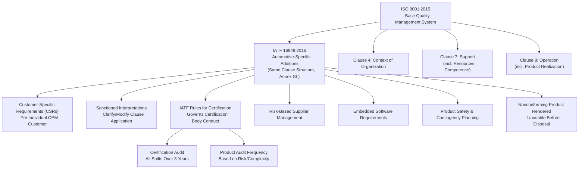

## IATF 16949 Requirements

### Overview

IATF 16949 is the globally recognized quality management system standard for the automotive supply chain, developed by the International Automotive Task Force in coordination with ISO and supported by AIAG. It is not a standalone standard but sets specific requirements for the application of ISO 9001 in organizations that manufacture automotive production parts, service parts, or accessory parts, and the current edition, IATF 16949:2016, must be used together with ISO 9001:2015, addressing defect prevention, variation reduction, and waste minimization across the supply chain. It was developed with support from AIAG and requires third-party certification by a recognized certification body. Because it layers automotive-specific requirements onto the ISO 9001 clause structure rather than replacing it, organizations pursuing certification must satisfy both the base ISO 9001 requirements and the automotive-sector additions simultaneously. [dqsglobal](https://www.dqsglobal.com/vi/tai-lieu/trung-tam-kien-thuc-dqs/iatf-16949-explained)[16949store](https://16949store.com/iatf-16949-standards/what-is-iatf-16949/)

### Standard Structure

**Key Points**

- IATF 16949:2016 follows the Annex SL High Level Structure (Clauses 1–10) and layers automotive-sector requirements onto the same clause numbering as ISO 9001, meaning automotive-specific requirements should be read as additions to the corresponding ISO 9001 clause rather than as a separate, independent set of clauses [dqsglobal](https://www.dqsglobal.com/vi/tai-lieu/trung-tam-kien-thuc-dqs/iatf-16949-explained)
- The standard adapted the new ISO high-level structure (Annex L/SL) to align with other management system standards including ISO 14001 and ISO 45001, facilitating integrated management system audits across multiple standards [16949store](https://16949store.com/iatf-16949-standards/what-is-iatf-16949/)
- The standard was published in October 2016 in a two-manual format [yandex](https://portal.yandex.com.tr/yaozet/auto/iatf-16949-faq-overview-id1-MgMDe15h)
- [Unverified] A future revision is reportedly in development, with the IATF having indicated that work on the next edition will begin after the revised ISO 9001 is published; specific scope and timing should be confirmed against current IATF communications as the program progresses.

### Clause 4 — Context of the Organization

**Key Points**

- Organizations must determine internal and external issues relevant to the quality management system, identify interested parties (including customers, regulators, and supply chain partners), and define the QMS scope [dqsglobal](https://www.dqsglobal.com/bs/istrazi/dqs-centar-znanja/iatf-16949-objasnjenje)
- Automotive-specific additions require documented processes addressing customer-specific requirements and confirmation that these are evaluated and incorporated into the QMS

### Key Focus Areas Beyond Base ISO 9001

**Key Points**

- Product safety, risk management, and contingency planning receive explicit, elevated requirements compared to base ISO 9001 [16949store](https://16949store.com/iatf-16949-standards/what-is-iatf-16949/)
- Requirements for embedded software address the increasing software content in automotive components [16949store](https://16949store.com/iatf-16949-standards/what-is-iatf-16949/)
- Change and warranty management, and management of sub-tier suppliers are addressed as automotive-specific extensions [16949store](https://16949store.com/iatf-16949-standards/what-is-iatf-16949/)
- A risk-based supplier management approach is required, extending quality system responsibility down the supply chain rather than treating supplier conformance as a one-time qualification event [yandex](https://portal.yandex.com.tr/yaozet/auto/iatf-16949-faq-overview-id1-MgMDe15h)

### Customer-Specific Requirements (CSRs)

**Key Points**

- Documentation must include all direct customers, including non-IATF OEMs, and customer-specific requirements must be evaluated and documented [yandex](https://portal.yandex.com.tr/yaozet/auto/iatf-16949-faq-overview-id1-MgMDe15h)
- Organizations must also ensure compliance with applicable statutory and regulatory requirements [yandex](https://portal.yandex.com.tr/yaozet/auto/iatf-16949-faq-overview-id1-MgMDe15h)
- CSRs function as a layer of requirements on top of both ISO 9001 and IATF 16949 itself, meaning full conformance requires tracking and satisfying each individual OEM customer's specific documented expectations, which can vary significantly between customers

### Process Management Requirements

**Key Points**

- Multiple documented processes can be grouped into a single process where appropriate, allowing flexibility in QMS documentation structure [yandex](https://portal.yandex.com.tr/yaozet/auto/iatf-16949-faq-overview-id1-MgMDe15h)
- Nonconforming products must be rendered unusable before disposal, a specific automotive-sector control beyond generic nonconforming material handling, intended to prevent inadvertent reintroduction of rejected/scrapped material into the supply chain [yandex](https://portal.yandex.com.tr/yaozet/auto/iatf-16949-faq-overview-id1-MgMDe15h)
- Process approach requirements emphasize managing interconnected processes (as opposed to isolated departmental activities) to consistently meet customer expectations

### Auditing and Verification Requirements

**Key Points**

- Manufacturing processes must be audited across all shifts over a three-year period, ensuring that internal audit coverage does not systematically miss shift-specific process variation [yandex](https://portal.yandex.com.tr/yaozet/auto/iatf-16949-faq-overview-id1-MgMDe15h)
- Product audit frequency depends on risk and product complexity, rather than being fixed at a uniform interval regardless of part criticality [yandex](https://portal.yandex.com.tr/yaozet/auto/iatf-16949-faq-overview-id1-MgMDe15h)
- Third-party certification audits are conducted by IATF-recognized certification bodies operating under a separate governing document (the IATF Rules), distinct from the technical standard itself

### The IATF Rules Document

**Key Points**

- The Rules for Achieving and Maintaining IATF Recognition define the requirements for IATF-recognized certification bodies conducting IATF 16949 audits and issuing certificates, governing the certification process itself rather than the technical QMS requirements [afnor](https://www.boutique.afnor.org/en-gb/standard/iatf-16949-fr-regles/rules-for-achieving-and-maintaining-iatf-recognition-sixth-edition/if12/420046)
- The current Sixth Edition, published April 2024, strengthens and clarifies certification body processes, incorporates prior Sanctioned Interpretations and FAQs, and updates eligibility requirements for certification [afnor](https://www.boutique.afnor.org/en-gb/standard/iatf-16949-fr-regles/rules-for-achieving-and-maintaining-iatf-recognition-sixth-edition/if12/420046)
- The Sixth Edition operates alongside the Fifth Edition until it fully replaces it on January 1, 2025 [afnor](https://www.boutique.afnor.org/en-gb/standard/iatf-16949-fr-regles/rules-for-achieving-and-maintaining-iatf-recognition-sixth-edition/if12/420046)[dqsglobal](https://www.dqsglobal.com/bs/istrazi/dqs-centar-znanja/iatf-16949-objasnjenje)
- Organizations preparing for or maintaining certification must track three parallel streams: the technical standard itself, the Rules document, and active Sanctioned Interpretations, since interpretations can clarify or modify how specific clauses are audited without changing the standard's published text [dqsglobal](https://www.dqsglobal.com/bs/istrazi/dqs-centar-znanja/iatf-16949-objasnjenje)

### IATF 16949 Requirement Layering

### SVG Illustration: IATF 16949 as an ISO 9001 Overlay

<svg xmlns="http://www.w3.org/2000/svg" viewBox="0 0 640 300">
<text x="320" y="20" font-size="14" text-anchor="middle" font-family="sans-serif" font-weight="bold">IATF 16949 as an ISO 9001 Overlay (svg_diagram)</text>
<rect x="120" y="60" width="400" height="180" fill="#ebf8ff" stroke="#2b6cb0" stroke-width="2" />
<text x="320" y="85" font-size="12" text-anchor="middle" font-family="sans-serif" font-weight="bold">ISO 9001:2015 (Clauses 1-10)</text>
<rect x="150" y="100" width="340" height="120" fill="#f0fff4" stroke="#2f855a" stroke-width="2" stroke-dasharray="6,3" />
<text x="320" y="120" font-size="11" text-anchor="middle" font-family="sans-serif" font-weight="bold">+ IATF 16949 Automotive Additions</text>
<text x="320" y="145" font-size="9" text-anchor="middle" font-family="sans-serif">Risk-Based Supplier Management</text>
<text x="320" y="165" font-size="9" text-anchor="middle" font-family="sans-serif">Embedded Software Requirements</text>
<text x="320" y="185" font-size="9" text-anchor="middle" font-family="sans-serif">Product Safety / Contingency Planning</text>
<text x="320" y="205" font-size="9" text-anchor="middle" font-family="sans-serif">Customer-Specific Requirements</text>
</svg>

### Application in Precision Metrology & Quality Control

**Example**

A precision fastener manufacturer supplying multiple automotive OEMs under IATF 16949 certification must reconcile customer-specific measurement and documentation requirements with the base standard. One OEM customer's CSR mandates a specific control chart software package and defined SPC reaction plan format for all critical characteristics, while another accepts the supplier's standard SPC system provided capability indices are reported quarterly. The supplier's Control Plan documentation must therefore reference the base IATF 16949 measurement and control requirements while incorporating each customer's specific CSR variations, tracked in a formal customer-specific requirements matrix reviewed during internal and certification audits.

For a critical bolt torque-tension characteristic tied to vehicle safety, the risk-based supplier management requirement drives the fastener manufacturer to extend equivalent measurement system verification (Gauge R&R, calibration traceability) requirements down to its own raw material supplier, rather than treating supplier qualification as satisfied by a one-time incoming inspection. Internal audit scheduling ensures the torque verification station is audited across all three production shifts within the required three-year window, since shift-specific variation in operator technique or environmental conditions could otherwise go undetected by an audit program concentrated on a single shift.

### Common Pitfalls

- Treating IATF 16949 as a standalone standard rather than reading its clauses as additions layered onto the corresponding ISO 9001 clause, missing base ISO 9001 requirements that still fully apply
- Failing to track and evaluate customer-specific requirements systematically, particularly when supplying multiple OEM customers with differing documented expectations
- Disposing of nonconforming product without first rendering it unusable, creating risk of inadvertent reintroduction into the supply chain
- Scheduling internal audits without ensuring coverage across all production shifts over the required multi-year cycle, missing shift-specific process variation
- Not tracking active Sanctioned Interpretations alongside the published standard text, potentially auditing against an outdated understanding of how a clause is currently interpreted

**Conclusion**

IATF 16949 provides the automotive industry's standardized quality management framework by extending ISO 9001 with sector-specific requirements addressing defect prevention, risk-based supplier management, product safety, and customer-specific documentation. Its layered structure — base ISO 9001 clauses, automotive-specific additions, customer-specific requirements, and the separately governed certification Rules — requires organizations to track multiple concurrent sources of requirements, making disciplined document control and customer requirement tracking essential to sustained certification and effective quality system operation.

**Related Topics**

- Advanced Product Quality Planning (APQP)
- Production Part Approval Process (PPAP)
- Control Plan Development
- Design and Process Failure Mode and Effects Analysis (DFMEA/PFMEA)
- Measurement Systems Analysis (MSA) and Gauge R&R
- Supplier Quality Management and Risk-Based Supplier Controls
- Nonconforming Material Handling and Disposal Requirements
- ISO 9001:2015 Quality Management System Fundamentals