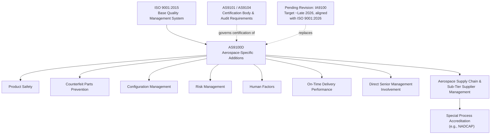

## AS9100 Aerospace Quality Requirements

### Overview

AS9100 is the globally recognized quality management system standard for the aviation, space, and defense industries, first published in 1999 by SAE to unify quality standards across the aerospace and defense sectors. The current active revision, AS9100D (formally AS9100:2016 Rev D), incorporates the entire ISO 9001:2015 requirement set and adds substantial aerospace-specific requirements, including direct senior management involvement, product safety, counterfeit parts prevention, risk management, configuration management, and on-time delivery performance. It is maintained by the International Aerospace Quality Group (IAQG) and, like IATF 16949 in automotive, layers sector-specific requirements onto the ISO 9001 clause structure rather than functioning as a fully independent standard.

### Standard Structure and ISO 9001 Relationship

**Key Points**

- AS9100D is built on the ISO 9001:2015 Annex SL high-level structure, with aerospace-specific requirements added within and alongside the corresponding ISO 9001 clauses
- The standard also supports the FAA's FAR Title 14 Part 21 requirements, connecting the quality management framework to specific aviation regulatory certification requirements
- Companion standards exist for related aerospace supply chain functions: AS9110 for maintenance, repair, and overhaul (MRO) organizations, and AS9120 for stockist distributors
- [Unverified] A revision is in progress, with the standard being rebranded as IA9100 to reflect a move toward a single unified global document; based on currently available industry reporting, publication is targeted for late 2026 aligned with the ISO 9001:2026 revision, though exact scope and dates should be confirmed against current IAQG publications as the process concludes.

### Key Additions Beyond ISO 9001

**Product Safety**

Dedicated clauses require organizations to establish, implement, and maintain a process for achieving product safety throughout the product lifecycle, reflecting the safety-critical nature of aerospace hardware where a nonconformance can have catastrophic consequences.

**Counterfeit Parts Prevention**

Requires a documented approach to preventing the use of counterfeit or suspect counterfeit parts, particularly relevant given the aerospace industry's reliance on long-tail legacy parts and complex, multi-tier supply chains where counterfeit electronic and hardware components are a recognized risk.

**Configuration Management**

Addresses controlling a product's design and performance characteristics throughout its life cycle, ensuring that the specific configuration of a delivered product (including any authorized deviations or engineering changes) remains fully traceable and controlled, particularly important given long aerospace product service lives spanning decades.

**Risk Management**

Requires organizations to identify and address risks associated with product realization processes, extending beyond generic ISO 9001 risk-based thinking into more formalized operational risk management tied to product safety, reliability, and regulatory conformity.

**Human Factors**

Recognizes that many aerospace quality escapes originate from human-system interaction failures rather than pure process or equipment failure, requiring attention to work environment, competence, and conditions that could lead to human error in critical operations.

**On-Time Delivery**

Given the criticality of aerospace supply chains to program schedules, the standard places specific emphasis on measuring and managing on-time delivery performance as a quality system metric, not merely a business/logistics concern.

### Direct Senior Management Involvement

**Key Points**

- AS9100D requires more direct, demonstrable top management involvement in the quality management system than base ISO 9001, reflecting the criticality of aerospace product quality to safety outcomes
- Management must establish and enforce policies supporting the standard's requirements and ensure they are adequately resourced, rather than delegating quality system ownership entirely to a quality department

### Aerospace Supply Chain Management Requirements

**Key Points**

- AS9100 requires aerospace-specific supplier management and control provisions, extending oversight requirements into sub-tier suppliers given the depth and complexity of aerospace supply chains
- Special process approval (heat treatment, plating, non-destructive testing, welding) frequently requires accreditation from recognized aerospace-specific bodies (e.g., NADCAP), connecting AS9100 supplier control requirements to external special process qualification schemes
- Purchasing and supplier flow-down requirements ensure that aerospace-specific quality requirements (not just the buyer's own requirements) are correctly communicated down through multiple supply chain tiers

### Certification and Audit Framework

**Key Points**

- Third-party certification is required, similar to IATF 16949, conducted by IAQG-recognized certification bodies
- Certification audits and related requirements are themselves governed by companion documents, historically AS9101 (audit requirements) and AS9104 (certification scheme requirements), which are also undergoing coordinated revision alongside the core standard
- [Unverified] Industry sources indicate the companion audit and certification body standards are being revised in parallel as IA9101 and IA9104/1, representing what has been described as a significant adjustment to aerospace quality management certification; specifics should be verified against current IAQG publications given the standard is still in transition.

### AS9100 Requirement Layering

### SVG Illustration: AS9100 as an ISO 9001 Overlay

<svg xmlns="http://www.w3.org/2000/svg" viewBox="0 0 640 300">
<text x="320" y="20" font-size="14" text-anchor="middle" font-family="sans-serif" font-weight="bold">AS9100D as an ISO 9001 Overlay (svg_diagram)</text>
<rect x="120" y="60" width="400" height="200" fill="#ebf8ff" stroke="#2b6cb0" stroke-width="2" />
<text x="320" y="85" font-size="12" text-anchor="middle" font-family="sans-serif" font-weight="bold">ISO 9001:2015 (Clauses 1-10)</text>
<rect x="145" y="100" width="350" height="140" fill="#f0fff4" stroke="#2f855a" stroke-width="2" stroke-dasharray="6,3" />
<text x="320" y="120" font-size="11" text-anchor="middle" font-family="sans-serif" font-weight="bold">+ AS9100D Aerospace Additions</text>
<text x="320" y="145" font-size="9" text-anchor="middle" font-family="sans-serif">Product Safety / Counterfeit Prevention</text>
<text x="320" y="165" font-size="9" text-anchor="middle" font-family="sans-serif">Configuration Management</text>
<text x="320" y="185" font-size="9" text-anchor="middle" font-family="sans-serif">Risk Management / Human Factors</text>
<text x="320" y="205" font-size="9" text-anchor="middle" font-family="sans-serif">On-Time Delivery / Sub-Tier Supplier Control</text>
<text x="320" y="225" font-size="9" text-anchor="middle" font-family="sans-serif">Direct Senior Management Involvement</text>
</svg>

### Application in Precision Metrology & Quality Control

**Example**

A precision aerospace fastener manufacturer, AS9100D certified, produces titanium fasteners for a commercial aircraft structural application. AS9100D-specific requirements manifest across the metrology and quality program as follows:

1. **Configuration management**: The fastener's dimensional specification, material grade, and any authorized deviations are tied to a specific engineering revision, with full traceability maintained (linking to material identification and traceability practices) throughout the product's decades-long service life expectation.
2. **Counterfeit parts prevention**: Incoming titanium bar stock undergoes positive material identification (XRF-based PMI) at receiving inspection specifically to guard against counterfeit or substituted material entering a flight-critical part, a control emphasized more heavily under AS9100D than under generic ISO 9001.
3. **Special process accreditation**: The fastener's heat treatment and any plating are performed only by NADCAP-accredited suppliers, with certification review at incoming inspection confirming current accreditation scope covers the specific process and material combination used.
4. **Human factors**: The final dimensional verification station is evaluated for error-likely conditions — ambiguous work instructions, interrupted workflow, and operator competence — with documented evidence that operators can explain critical acceptance criteria, reflecting AS9100's human factors emphasis in critical inspection operations.
5. **Risk management**: A formal risk assessment specifically addresses the failure mode of dimensional drift in the thread-rolling process, given the flight-critical nature of thread engagement, feeding directly into the Control Plan's sampling frequency and reaction plan for this characteristic.

This layered application shows how AS9100D's aerospace-specific additions directly shape metrology and quality practices — from material verification through special process control to human-factors-aware inspection station design — beyond what generic ISO 9001 alone would require.

### Common Pitfalls

- Treating AS9100D as a fully independent standard rather than reading its clauses as additions to the corresponding ISO 9001 clause structure
- Underestimating the counterfeit parts prevention requirement, relying solely on supplier certification documentation without independent material verification for critical/flight-safety components
- Failing to maintain full configuration traceability across a product's long aerospace service life, particularly when engineering changes or authorized deviations accumulate over time
- Overlooking human factors considerations in critical inspection or production operations, focusing quality system attention solely on process and equipment controls
- Not tracking the ongoing IA9100 revision process and its transition timeline, risking being caught unprepared when the new standard publishes and the transition period begins

**Conclusion**

AS9100D extends ISO 9001 with aerospace-specific requirements addressing the sector's unique safety-critical, long-service-life, and complex supply chain characteristics — product safety, counterfeit parts prevention, configuration management, risk management, and human factors chief among them. As the standard transitions toward its next revision (IA9100), organizations must continue satisfying current AS9100D requirements while monitoring the revision process, ensuring metrology and quality practices remain aligned with both the current standard's demands and the evolving expectations reflected in the upcoming update.

**Related Topics**

- Advanced Product Quality Planning (APQP)
- First Article Inspection (AS9102)
- Control Plan Development
- Material Identification and Traceability
- Positive Material Identification (PMI) and Counterfeit Parts Prevention
- Special Process Approval and NADCAP Accreditation
- Configuration Management Practices
- IATF 16949 Requirements