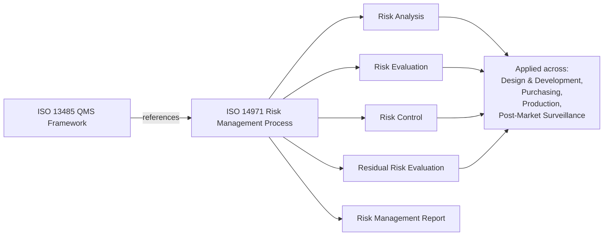
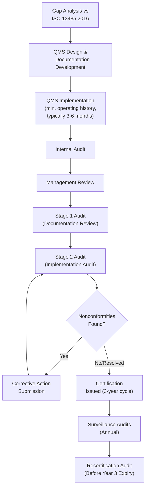

## ISO 13485 Medical Device Quality Overview

### Definition and Purpose

ISO 13485 is an internationally recognized standard that specifies requirements for a quality management system (QMS) where an organization needs to demonstrate its ability to provide medical devices and related services that consistently meet customer and applicable regulatory requirements. The standard is published by the International Organization for Standardization (ISO) and is used by organizations involved in one or more stages of the medical device life cycle, including design and development, production, storage and distribution, installation, servicing, and final decommissioning and disposal of medical devices, as well as the design, development, and provision of associated activities such as technical support.

The standard's primary purpose is to facilitate harmonized medical device regulatory requirements for QMS across multiple jurisdictions. It is based on the ISO 9001 process model approach but is a standalone document — organizations certify to ISO 13485 without needing to also certify to ISO 9001.

### Current Edition and Scope

The current edition is **ISO 13485:2016**, which superseded ISO 13485:2003. It applies to organizations regardless of size or type, except where explicitly stated as applicable only to certain device classifications (e.g., specific requirements for active implantable and sterile devices). Suppliers or external parties that provide a product (including QMS-related services) to such organizations can voluntarily apply the requirements as well, though ISO 13485 certification is not a legal requirement for suppliers.

**Key exclusion:** Unlike ISO 9001, ISO 13485 does not require demonstration of continual improvement of QMS effectiveness in the same open-ended way — instead, it emphasizes maintaining the effectiveness of the QMS through risk-based decision-making, with continual improvement scoped to the QMS's ability to meet regulatory and customer requirements rather than an unconstrained improvement mandate.

### Relationship to ISO 9001

| Aspect | ISO 9001:2015 | ISO 13485:2016 |
| --- | --- | --- |
| Structure | Annex SL (High-Level Structure, HLS) | Does NOT follow Annex SL |
| Customer satisfaction | Explicit requirement | Not explicitly required (focus is regulatory compliance) |
| Continual improvement | Broad, systemic requirement | Limited to maintaining QMS suitability/effectiveness |
| Risk-based thinking | General, qualitative | Formalized, tied to ISO 14971 risk management |
| Process approach | Yes | Yes |
| Documented procedures | Fewer mandated | Extensively mandated (validation, risk management, complaint handling, etc.) |

Because ISO 13485:2016 does not use the Annex SL high-level structure, integrating it with ISO 9001 or other management system standards (e.g., ISO 14001) requires more deliberate mapping of clauses rather than a plug-and-play alignment.

### Structure of the Standard (Clauses)

ISO 13485:2016 is organized into 8 clauses, with clauses 4 through 8 containing the auditable requirements:

```mermaid
flowchart TD
    C1["Clause 1: Scope"]
    C2["Clause 2: Normative References"]
    C3["Clause 3: Terms and Definitions"]
    C4["Clause 4: Quality Management System"]
    C5["Clause 5: Management Responsibility"]
    C6["Clause 6: Resource Management"]
    C7["Clause 7: Product Realization"]
    C8["Clause 8: Measurement, Analysis and Improvement"]

    C4 --> C4a["4.1 General QMS Requirements"]
    C4 --> C4b["4.2 Documentation Requirements"]

    C5 --> C5a["5.1-5.3 Mgmt Commitment, Focus, Policy"]
    C5 --> C5b["5.4-5.6 Planning, Responsibility, Review"]

    C6 --> C6a["6.1-6.2 Resources & HR"]
    C6 --> C6b["6.3-6.4 Infrastructure & Work Environment"]

    C7 --> C7a["7.1 Planning of Product Realization"]
    C7 --> C7b["7.2 Customer-Related Processes"]
    C7 --> C7c["7.3 Design and Development"]
    C7 --> C7d["7.4 Purchasing"]
    C7 --> C7e["7.5 Production and Service Provision"]
    C7 --> C7f["7.6 Control of Monitoring/Measuring Equipment"]

    C8 --> C8a["8.2 Monitoring and Measurement"]
    C8 --> C8b["8.3 Control of Nonconforming Product"]
    C8 --> C8c["8.4 Analysis of Data"]
    C8 --> C8d["8.5 Improvement (CAPA)"]
```

### Clause 4: Quality Management System Requirements

**Key Points**

- **4.1 General requirements:** The organization must document processes needed for the QMS, apply a risk-based approach to control of these processes, and ensure processes are implemented effectively. Outsourced processes must remain under organizational control, with responsibility documented.
- **4.2 Documentation requirements:** Requires a Quality Manual, a **Medical Device File** (unique to ISO 13485 — a compiled record referencing all documentation demonstrating conformity for a device or device family), documented procedures, records, and applicable regulatory requirements. Document and record control procedures are mandatory, with explicit requirements for retention periods tied to the device's defined life or a minimum period (commonly at least two years from release, or as dictated by applicable regulation, whichever is longer).

**Medical Device File contents typically include:**

- General device description and intended use/purpose
- Labeling and instructions for use (IFU)
- Specifications for product
- Manufacturing, packaging, storage, handling, and distribution specifications
- Measuring and monitoring procedures
- Installation and servicing requirements (if applicable)

### Clause 5: Management Responsibility

Top management must demonstrate commitment to the QMS through establishing a quality policy and measurable quality objectives, ensuring quality objectives are consistent with regulatory requirements, conducting management review at planned intervals, and appointing a **Management Representative** with defined authority for ensuring processes are established, reporting on QMS performance, and ensuring regulatory requirement awareness throughout the organization. Management review inputs and outputs are more prescriptive than in ISO 9001, requiring explicit review of regulatory changes, feedback (including complaints), and the suitability of processes for the current regulatory environment.

### Clause 6: Resource Management

Covers provision of resources, human resource competence (training, evaluation of effectiveness), infrastructure, and **work environment and contamination control**. The contamination control requirement is distinctive: organizations must document requirements for health, cleanliness, and clothing of personnel if contact with product or work environment could adversely affect device safety or performance — directly relevant to cleanroom and sterile manufacturing environments.

### Clause 7: Product Realization

This is the most extensive clause and the primary interface with metrology and quality control practice.

**7.1 Planning of Product Realization**

Requires documented risk management throughout product realization, in alignment with **ISO 14971** (Application of Risk Management to Medical Devices).

**7.2 Customer-Related Processes**

Determination of product requirements, review of requirements related to product, and communication arrangements — with explicit reference to regulatory reporting obligations (e.g., adverse event/vigilance reporting).

**7.3 Design and Development**

Highly structured, stage-gated requirements:

- 7.3.2 Design and development planning
- 7.3.3 Design and development inputs
- 7.3.4 Design and development outputs
- 7.3.5 Design and development review
- 7.3.6 Design and development verification
- 7.3.7 Design and development validation
- 7.3.8 Design and development transfer
- 7.3.9 Design and development change control
- 7.3.10 Design and development files

**Verification vs. Validation distinction (critical exam/interview concept):**

| Aspect | Verification | Validation |
| --- | --- | --- |
| Question answered | "Did we build the device right?" | "Did we build the right device?" |
| Reference point | Design inputs (specifications) | User needs / intended use |
| Timing | Throughout development | Typically on final/representative production units |
| Methods | Inspection, test, analysis, demonstration | Clinical evaluation, simulated/actual use testing |

**7.4 Purchasing**

Requires supplier evaluation and re-evaluation criteria proportional to the risk associated with the purchased product, with documented purchasing information sufficient to describe the product ordered, including, where appropriate, requirements for approval of product, procedures, processes, equipment, and personnel qualification.

**7.5 Production and Service Provision**

- 7.5.1 Control of production and service provision
- 7.5.2 Cleanliness of product (for products requiring cleaning prior to sterilization or use)
- 7.5.3 Installation activities
- 7.5.4 Servicing activities
- 7.5.5 Particular requirements for sterile medical devices (process validation, bioburden records)
- 7.5.6 Validation of processes for production and service provision (for processes whose output cannot be verified by subsequent monitoring/measurement — e.g., sterilization, injection molding parameters affecting hidden defects)
- 7.5.7 Particular requirements for validation of sterilization and sterile barrier systems
- 7.5.8 Identification (including UDI — Unique Device Identification, where regulation requires)
- 7.5.9 Traceability (mandatory system for tracing device history, with heightened requirements for implantable devices)
- 7.5.10 Customer property
- 7.5.11 Preservation of product

**7.6 Control of Monitoring and Measuring Equipment**

This subclause is where metrology practice is most directly codified. Requirements include:

- Calibration or verification at specified intervals, or prior to use, against measurement standards traceable to international or national measurement standards
- Where no such standard exists, the basis used for calibration/verification must be recorded
- Equipment must be adjusted or re-adjusted as necessary
- Identification to enable calibration status determination (e.g., calibration status labels/tags)
- Safeguarding against adjustments that would invalidate the measurement result
- Protection from damage and deterioration during handling, maintenance, and storage
- Records of calibration and verification results must be maintained
- **Software validation:** Computer software used for monitoring and measuring of specified requirements must be validated prior to initial use and, as appropriate, after changes, before formal use

### Clause 8: Measurement, Analysis and Improvement

**8.1 General:** Statistical techniques must be defined for establishing, controlling, and verifying process capability and product characteristics.

**8.2 Monitoring and Measurement**

- 8.2.1 Feedback (including a formal, documented process for gathering post-production information, feeding into risk management)
- 8.2.2 Complaint handling (formally distinct and mandatory procedure — every complaint must be investigated unless previously investigated for a similar situation and duplication is justified; investigation results must be documented, and if investigation determines regulatory reporting is required, that reporting must occur)
- 8.2.3 Reporting to regulatory authorities (advisory notices, vigilance/adverse event reporting)
- 8.2.4 Internal audit
- 8.2.5 Monitoring and measurement of processes
- 8.2.6 Monitoring and measurement of product (with specific requirement to maintain records identifying the person authorizing release of product)

**8.3 Control of Nonconforming Product**

Expanded relative to ISO 9001, with explicit subclauses:

- 8.3.1 General
- 8.3.2 Actions in response to nonconforming product detected before delivery
- 8.3.3 Actions in response to nonconforming product detected after delivery (includes rework requirements and documentation of rationale for any rework, with re-verification after rework)
- 8.3.4 Actions in response to nonconforming product detected after delivery — recall-related actions

**8.4 Analysis of Data**

Data analysis must include, at minimum: feedback, conformity to product requirements, characteristics/trends of processes and product (including opportunities for preventive action), suppliers, audits, and service reports (if applicable).

**8.5 Improvement**

- 8.5.1 General (implementing corrective/preventive actions, documentation changes resulting from these)
- 8.5.2 Corrective action (CAPA — investigating cause of nonconformities, evaluating need for action to prevent recurrence, implementing action, recording results, reviewing effectiveness)
- 8.5.3 Preventive action (identifying potential nonconformities and their causes before occurrence)

### Risk Management Integration (ISO 14971 Linkage)

ISO 13485:2016 explicitly cross-references **ISO 14971** for risk management application throughout the product life cycle rather than embedding detailed risk management methodology itself. The relationship functions as follows:

Risk-based thinking is not confined to product safety risk; ISO 13485:2016 requires risk-based approaches applied to determining the type and extent of controls needed for outsourced processes, determining the extent of documented procedures and records, and determining validation activities.

### Regulatory Harmonization and Regional Adoption

ISO 13485 serves as the QMS foundation referenced or incorporated by multiple regulatory frameworks:

| Region/Framework | Relationship to ISO 13485 |
| --- | --- |
| **EU MDR (2017/745) / IVDR (2017/746)** | ISO 13485 certification is not legally mandatory but is the de facto standard demonstrating QMS conformity; often required by Notified Bodies |
| **Health Canada (CMDCAS/MDSAP)** | ISO 13485 certification is a mandatory licensing requirement for most device classes |
| **US FDA (21 CFR Part 820, QSR)** | Historically a separate but similar framework; FDA has moved toward harmonizing 21 CFR 820 with ISO 13485:2016 (QMSR final rule, effective transition period through February 2026) |
| **MDSAP (Medical Device Single Audit Program)** | Uses ISO 13485:2016 as its QMS baseline, allowing a single audit to satisfy multiple regulatory jurisdictions (US, Canada, Australia, Brazil, Japan) |
| **Australia TGA** | Recognizes ISO 13485 certification (via MDSAP or equivalent) as part of conformity assessment |

[Inference] The FDA's QMSR transition timeline and exact harmonization details are subject to ongoing regulatory rulemaking; organizations should verify current status directly with FDA guidance at the time of implementation, as effective dates and transitional provisions may be updated.

### Certification Process

Certification is performed by accredited third-party certification bodies (Notified Bodies for EU purposes, or MDSAP Auditing Organizations for the multi-jurisdictional program). Certificates are typically valid for three years, subject to annual surveillance audits.

### Metrology and Quality Control Practitioner Relevance

For practitioners working in precision metrology and QC within medical device manufacturing, ISO 13485 directly governs:

- **Calibration program design:** Clause 7.6 mandates traceable calibration intervals, acceptance criteria, and out-of-tolerance (OOT) investigation procedures — OOT conditions typically trigger impact assessments on product released using the affected equipment.
- **Measurement Systems Analysis (MSA):** While not explicitly named in the standard, MSA/Gage R&R studies are the practical mechanism organizations use to demonstrate that monitoring/measuring equipment is "capable of the accuracy and precision necessary" (an implicit expectation under 7.6).
- **Process validation (IQ/OQ/PQ):** Required under 7.5.6 for special processes (e.g., sterilization, welding, adhesive curing) where output verification alone is insufficient to detect all nonconformities.
- **First Article Inspection and incoming inspection:** Feed into Clause 8.2.6 (monitoring and measurement of product) and Clause 7.4 (purchasing controls).
- **Statistical Process Control (SPC):** Supports the Clause 8.1 requirement to define statistical techniques for process/product characteristic verification.
- **Device History Record (DHR) and traceability:** Metrology records (calibration certificates, inspection data) often form part of the objective evidence retained within the DHR to support Clause 7.5.9 traceability requirements.

### Example: Calibration Nonconformity Workflow Under Clause 7.6/8.3

**Example**

A coordinate measuring machine (CMM) used to verify critical dimensions on an orthopedic implant is found out-of-tolerance during its scheduled calibration.

1. Equipment is immediately quarantined/removed from service (identification of calibration status per 7.6).
2. QC initiates an **impact assessment**: all product measured on the CMM since the last known-good calibration is identified via calibration records and traceability data (Clause 7.5.9).
3. Products found nonconforming as a result are dispositioned under Clause 8.3 (control of nonconforming product) — segregated, evaluated for use-as-is, rework, or scrap.
4. If nonconforming product was already distributed, Clause 8.3.3/8.3.4 requirements for post-delivery nonconformity (potentially including recall procedures and regulatory notification per 8.2.3) are triggered.
5. Root cause investigation and CAPA (Clause 8.5.2) are opened to determine why the equipment drifted out of tolerance and to prevent recurrence (e.g., shortened calibration interval, environmental control review).
6. Effectiveness of the corrective action is verified at a subsequent review.

### Common Pitfalls in Implementation

- Treating ISO 13485 as "ISO 9001 plus a bit more" rather than recognizing its distinct regulatory-compliance orientation and non-Annex-SL structure
- Under-scoping the Medical Device File, omitting required elements such as risk management file cross-references
- Failing to validate software used in production or for monitoring/measuring (a frequently cited audit nonconformity)
- Inadequate impact assessment scope when equipment calibration failures are discovered (not tracing back far enough through production records)
- Insufficient distinction between design verification and design validation activities and records

### Related Topics

- ISO 14971 – Risk Management for Medical Devices
- 21 CFR Part 820 / FDA QMSR (Quality Management System Regulation)
- EU MDR 2017/745 and IVDR 2017/746 requirements
- MDSAP (Medical Device Single Audit Program)
- Design Controls and Design History File (DHF)
- Measurement Systems Analysis (Gage R&R) in regulated environments
- Process Validation (IQ/OQ/PQ) for sterilization and special processes
- Unique Device Identification (UDI) systems
- Device History Record (DHR) vs. Device Master Record (DMR)
- CAPA (Corrective and Preventive Action) system design
- Statistical Process Control in regulated manufacturing
- Calibration traceability to NIST/national metrology institutes