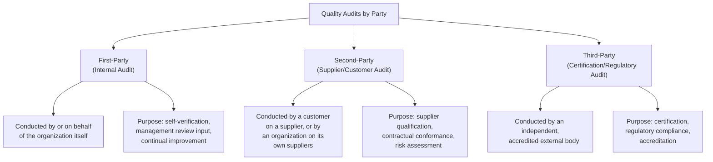
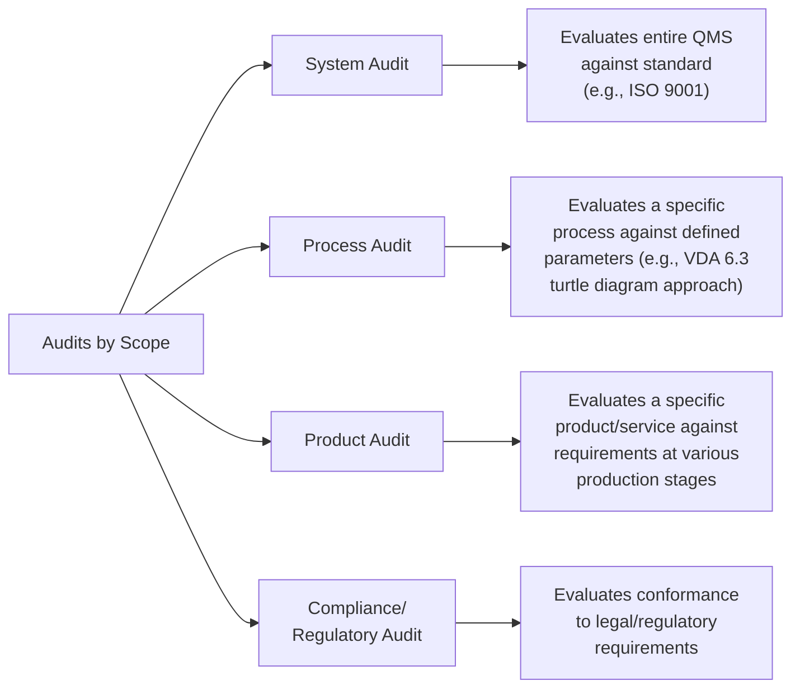
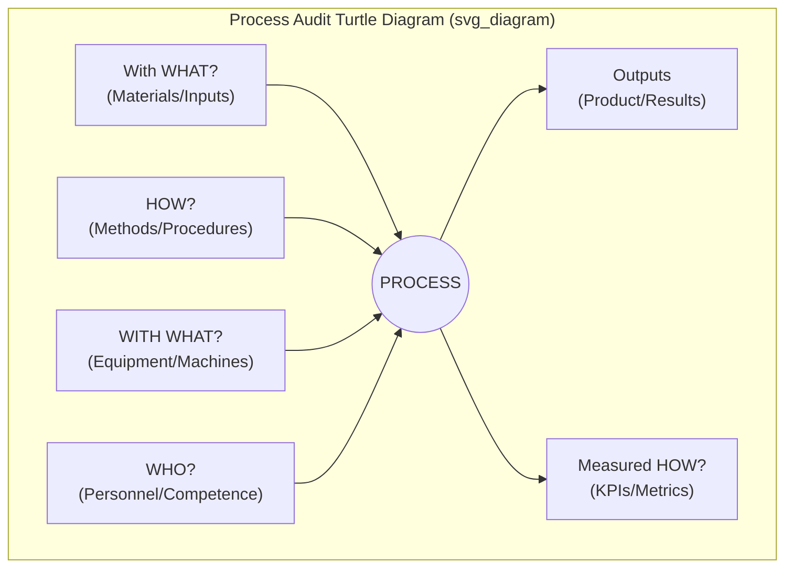
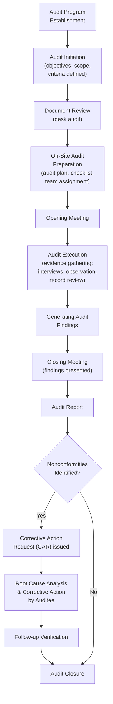

## Types of Quality Audits

### Definition and Purpose

A quality audit is a systematic, independent, and documented process for obtaining audit evidence and evaluating it objectively to determine the extent to which audit criteria (procedures, standards, specifications, or regulatory requirements) are fulfilled. Audits serve as a core verification mechanism within quality management systems (QMS), providing objective assurance that processes are effective, conforming, and capable of consistently delivering conforming product or service. The governing framework for audit principles and terminology is **ISO 19011** (Guidelines for auditing management systems), while certification audits against standards such as ISO 9001, ISO 13485, or IATF 16949 follow additional accreditation body rules (e.g., IAF MD 5, ISO 17021).

### Classification by Relationship of Auditor to Auditee

This is the most fundamental classification axis and determines audit independence, authority, and typical outcomes.

**First-Party (Internal) Audits**

Performed by the organization's own personnel (or contracted auditors acting on the organization's behalf) against its own QMS requirements and applicable standards. Internal audits are mandatory under most management system standards (e.g., ISO 9001 Clause 9.2, ISO 13485 Clause 8.2.4, IATF 16949 Clause 9.2.2) and must be planned, scheduled, and conducted by auditors independent of the area being audited to preserve objectivity. Findings feed directly into management review and the corrective action (CAPA) system.

**Second-Party Audits**

Conducted by one organization on another with which it has a direct business interest — most commonly a customer auditing a supplier, or a purchasing organization qualifying a potential vendor before contract award. Second-party audits are not accredited/certified audits; they are conducted under the authority of the contracting organization and typically use criteria defined by that organization's own supplier quality requirements, customer-specific requirements (CSRs), or purchase contract terms. Common in automotive (OEM supplier audits) and aerospace (AS9100 supply chain flow-down) sectors.

**Third-Party Audits**

Conducted by an independent organization with no commercial interest in the outcome, typically an accredited certification body (registrar), for the purpose of issuing formal certification (e.g., ISO 9001, ISO 13485, IATF 16949, AS9100 certificates) or by a regulatory authority for legal compliance verification (e.g., FDA facility inspections, notified body audits under EU MDR). Third-party audit findings carry legal or contractual weight — nonconformities can result in certificate suspension, withdrawal, or regulatory sanctions.

| Attribute | First-Party | Second-Party | Third-Party |
| --- | --- | --- | --- |
| Auditor independence | Internal (org-independent function) | External (customer org) | Fully independent (accredited body) |
| Authority basis | Internal QMS requirement | Contract/business relationship | Accreditation/regulation |
| Typical frequency | Scheduled (e.g., annual cycle) | Pre-contract, periodic | Initial cert + annual surveillance |
| Outcome | Internal CAPA, mgmt review input | Vendor approval/rating, contract terms | Certificate issuance/maintenance |
| Formal standard | ISO 19011 | ISO 19011 + customer criteria | ISO 19011 + ISO 17021 (accreditation) |

### Classification by Scope/Subject Matter

**System Audit**

Evaluates the entire management system (or a defined segment of it) against a reference standard, examining whether documented processes exist, are implemented, and are effective in an interconnected way. System audits assess how well clauses of a standard (e.g., ISO 9001 Clauses 4-10) are institutionalized across the organization, typically sampling across multiple departments and processes within an audit cycle.

**Process Audit**

Focuses on a single process (e.g., heat treatment, welding, incoming inspection, calibration) and evaluates whether the process is performed according to defined parameters, work instructions, and specifications, and whether it consistently produces conforming output. In automotive quality (IATF 16949 ecosystem), the **VDA 6.3** process audit methodology using the "turtle diagram" (examining inputs, outputs, methods, machines, materials, personnel, and measures/KPIs for a process) is the dominant structured approach.

**Turtle Diagram concept (illustrative structure used in process audits):**

**Product Audit**

Evaluates a specific product or service, at various stages (in-process, final, or post-delivery), against specified requirements — drawings, specifications, customer requirements, and regulatory standards — independent of the process that produced it. Product audits verify the actual characteristics of the deliverable itself rather than the process controls, often performed as a "customer eyes" simulation, re-measuring critical dimensions and verifying labeling/documentation matches the physical unit. Common in automotive layout inspection programs and pre-shipment verification.

**Compliance/Regulatory Audit**

Evaluates conformance to legal, statutory, or regulatory requirements (e.g., environmental permits, FDA 21 CFR Part 820, EU MDR, export control regulations). These may be conducted by regulators directly (inspections) or internally/by second parties as a readiness check before a regulatory inspection.

### Classification by Purpose/Trigger

| Audit Type | Trigger/Purpose | Typical Scope |
| --- | --- | --- |
| **Certification (Registration) Audit** | Initial pursuit of formal certification | Full system, Stage 1 (documentation) + Stage 2 (implementation) |
| **Surveillance Audit** | Periodic maintenance of existing certification | Partial system, rotating clause/process coverage |
| **Recertification (Renewal) Audit** | Certificate renewal before expiry (typically every 3 years) | Full system review |
| **Follow-up Audit** | Verification of corrective action closure for prior nonconformities | Limited to affected areas/clauses |
| **Special/For-Cause Audit** | Triggered by a significant quality event (recall, major complaint, regulatory flag) | Focused on root-cause area |
| **Supplier Qualification Audit** | Pre-award vendor evaluation | Full or targeted system/process review |
| **Extension/Scope Change Audit** | Adding a facility, product line, or site to existing certificate | Scope-specific |

### Audit Process Flow (Generic, per ISO 19011)

### Finding Classifications

Audit findings are typically categorized by severity, which determines the response timeline and any impact on certification status:

- **Major Nonconformity:** A systemic failure of the QMS to meet a requirement, an absence of a required process/procedure, or a breakdown that could result in product/service failure to meet requirements; often defined as the total absence or complete failure of a system to meet a requirement, or a number of minor nonconformities against the same requirement indicating systemic failure. Can jeopardize certification.
- **Minor Nonconformity:** An isolated lapse or single observed instance of failure to meet a requirement, not indicating a systemic breakdown.
- **Observation (Opportunity for Improvement, OFI):** Not a nonconformity but a noted area where practice could be strengthened; does not require formal corrective action, though many organizations track OFIs voluntarily.

[Inference] Exact terminology and thresholds for major vs. minor classification can vary slightly between certification bodies and accreditation schemes (e.g., some use "critical nonconformity" as an additional tier); organizations should confirm definitions with their specific registrar or applicable accreditation body documents.

### Audit Techniques and Evidence-Gathering Methods

- **Document/Record Review:** Examining procedures, work instructions, quality records, calibration certificates, and training records for existence and conformance.
- **Interview:** Structured or semi-structured questioning of process owners and operators to verify understanding and practical implementation (distinct from documented procedure).
- **Observation:** Direct witnessing of a process being performed in real time.
- **Sampling:** Statistically or judgmentally selecting records/products/processes for examination, since full population review is rarely feasible.
- **Trace/Horizontal Audit:** Following a single product or lot through the entire process flow from raw material to shipment to verify continuity of control.
- **Vertical Audit:** Deep-diving into a single process or department in detail, examining all relevant inputs, controls, and outputs at that station.

### Example: Layered Audit Program Structure (Automotive Context)

**Example**

An automotive Tier 1 supplier under IATF 16949 typically operates a layered audit program combining multiple audit types on a defined cadence:

1. **Daily** – Layered Process Audits (LPAs) performed by shift supervisors/team leads at the station level (a lightweight process audit checking critical control points).
2. **Monthly** – Internal process audits (first-party) targeting specific VDA 6.3-style process evaluations on a rotating schedule covering all processes annually.
3. **Quarterly** – Product audits simulating customer receiving inspection on finished goods.
4. **Annually** – Full internal system audit (first-party) covering all IATF 16949 clauses, timed ahead of the external surveillance audit.
5. **Annually** – Second-party customer audits (OEM-conducted) for key accounts.
6. **Annually** – Third-party surveillance audit by the certification body, alternating with a full recertification audit every three years.

This layered structure ensures continuous verification at multiple levels of granularity and independence, rather than relying on a single annual audit event to catch systemic issues.

### Common Pitfalls in Audit Practice

- Confusing audit types and applying certification-audit rigor/documentation expectations to a lightweight internal process check (or vice versa), misallocating audit resources
- Using auditors who lack independence from the process/area being audited (compromising first-party audit objectivity)
- Treating findings closure as complete once a correction (fix) is made, without addressing root cause (corrective action) — a common and frequently cited third-party audit nonconformity itself
- Inadequate sampling rationale, leading to findings that do not reflect true systemic performance
- Failing to verify effectiveness of corrective actions in follow-up audits (closing findings based on paperwork alone rather than confirmed on-site verification)

### Related Topics

- ISO 19011 – Guidelines for Auditing Management Systems
- VDA 6.3 Process Audit Methodology
- Corrective Action Request (CAR) and Root Cause Analysis (5 Why, Fishbone/Ishikawa)
- IATF 16949 Layered Process Audits (LPA)
- Supplier Quality Management and Vendor Scorecards
- ISO 17021 – Conformity Assessment for Certification Bodies
- AS9100 Aerospace Audit Requirements and Flow-down
- Management Review Process (ISO 9001 Clause 9.3)
- Nonconformity Classification and CAPA Systems
- Regulatory Inspection Readiness (FDA, EU MDR/Notified Body Audits)