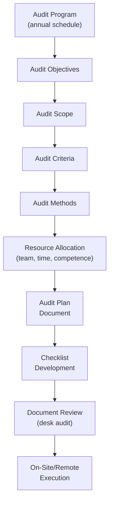
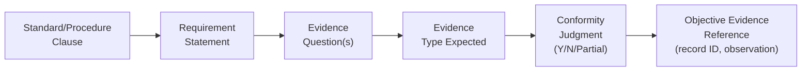

## Audit Planning and Checklist Development

### Definition and Purpose

Audit planning is the structured process of defining the objectives, scope, criteria, resources, schedule, and methodology for an audit before evidence gathering begins. Checklist development is the tactical output of this planning — a documented tool that translates audit criteria into specific, verifiable questions or evidence-collection prompts used during the on-site or remote audit execution. Together, these activities ensure audits are conducted consistently, thoroughly, efficiently, and with traceable linkage between audit criteria and findings. The governing reference framework is **ISO 19011** (Guidelines for auditing management systems), Clause 6 (Conducting an Audit).

### Audit Planning Inputs and Framework

**Audit Objectives** define what the audit is intended to accomplish — e.g., determining conformity of the QMS to ISO 9001, evaluating process capability, verifying corrective action effectiveness, or assessing readiness for external certification.

**Audit Scope** describes the boundaries of the audit: physical locations, organizational units, activities, and processes to be covered, and the time period the audit addresses. Scope must be sufficiently defined to prevent both wasted effort (over-scoping) and coverage gaps (under-scoping).

**Audit Criteria** are the reference points against which conformity is evaluated — the applicable standard clauses (e.g., ISO 9001:2015, IATF 16949, AS9100D), internal procedures, work instructions, contractual/customer requirements, and applicable statutory/regulatory requirements.

**Audit Methods** define how evidence will be gathered — on-site observation, interview, remote/virtual audit techniques, document sampling, and any statistical sampling plan for records or product.

### The Audit Program vs. Individual Audit Plan

| Level | Document | Content |
| --- | --- | --- |
| Strategic | Audit Program | Annual/multi-year schedule of all audits, resource allocation, audit program objectives, risk-based prioritization of areas/processes |
| Tactical | Audit Plan | Specific to a single audit event: dates, scope, criteria, team, itinerary, meeting schedule |
| Operational | Checklist | Specific to auditor/process assignment within a single audit: detailed questions, evidence prompts, reference clauses |

The audit program itself should apply risk-based thinking to prioritization — processes with higher risk to product/service conformity, higher change frequency, or a history of nonconformities are typically audited more frequently or with greater depth than stable, low-risk processes.

### Audit Plan Document — Typical Contents

- Audit objectives, scope, and criteria
- Identification of audit team members and roles (lead auditor, team member/s, technical expert, observer if applicable)
- Dates and locations/sites of audit activities
- Time and duration allocated to each activity/area
- Roles and responsibilities of guides/escorts from the auditee organization
- Areas, processes, functions, or departments to be audited, with allocated time per area
- Language of the audit (relevant in multinational operations)
- Logistics arrangements (travel, site access, safety/PPE requirements)
- Confidentiality provisions
- Reporting distribution list
- Follow-up arrangements for any anticipated corrective action process

### Checklist Development Methodology

Checklists translate abstract audit criteria into concrete, answerable evidence-collection items. Effective checklist development follows a structured decomposition process:

**Step 1 — Decompose the criteria:** Break the applicable standard or procedure into individual, discrete requirements. A single clause (e.g., ISO 9001 7.1.5, "Monitoring and measuring resources") may generate multiple checklist line items covering calibration, traceability, and software validation separately.

**Step 2 — Formulate open-ended, evidence-seeking questions:** Checklist questions should avoid closed yes/no phrasing that invites a scripted answer and instead prompt the auditee to demonstrate or produce evidence. Compare:

- Weak: "Do you calibrate your gauges?"
- Strong: "Show me the calibration record for this gauge and explain how the interval was determined."

**Step 3 — Identify expected evidence type:** For each question, define what objective evidence would satisfy it — a record, a physical observation, a system screen, an interview response corroborated by a document.

**Step 4 — Map to audit trail/turtle diagram elements (for process audits):** Particularly in VDA 6.3-style process audits, checklist items are organized around the turtle diagram dimensions (inputs, methods, machines, personnel, outputs, and metrics) to ensure comprehensive process coverage rather than a purely clause-by-clause walkthrough.

**Step 5 — Sequence logically:** Order checklist items to follow either the natural process flow (horizontal/trace audit) or the standard's clause structure (system audit), minimizing redundant movement between areas.

**Step 6 — Build in sampling guidance:** Specify sample sizes or sampling logic where the checklist calls for record review (e.g., "select 3 calibration records from the past 6 months for critical gauges").

### Example Checklist Excerpt (Calibration Control, ISO 9001 Clause 7.1.5 / ISO 13485 Clause 7.6)

**Example**

| Item | Requirement Reference | Audit Question | Evidence Expected | Result | Objective Evidence |
| --- | --- | --- | --- | --- | --- |
| 1 | 7.1.5.1 | Is there a documented calibration procedure defining intervals and methods? | Calibration SOP |  | SOP-QC-014 Rev C |
| 2 | 7.1.5.1 | Select 3 gauges from the calibration master list. Are calibration records current and within interval? | Calibration certificates/records |  | Gauge IDs CMM-07, MIC-22, HG-11 |
| 3 | 7.1.5.1 | Is calibration traceable to national/international measurement standards? | Certificate showing traceability chain |  | Cert #4471-B |
| 4 | 7.1.5.2 | Is software used for measurement (e.g., CMM software) validated prior to use? | Software validation record |  | VAL-CMM-003 |
| 5 | 7.1.5.1 | Is there an out-of-tolerance (OOT) procedure, and can an example investigation be shown? | OOT investigation record |  | NCR-2026-014 |
| 6 | General | Interview operator: describe what happens if a gauge fails calibration mid-use. | Verbal explanation consistent with procedure |  | Interview: [Name] |

### Types of Checklists by Format

- **Clause-based checklist:** Organized strictly by standard clause numbering; most common for system/certification audits, ensures full standard coverage.
- **Process-based/turtle checklist:** Organized around a single process's inputs, methods, machines, people, outputs, and metrics; typical for process audits (VDA 6.3, internal process audits).
- **Trace/horizontal checklist:** Organized around the physical/informational flow of a specific product or order, following it station-by-station (used for supply chain traceability verification).
- **Question bank/matrix checklist:** A larger master list of potential questions from which the auditor selects a relevant subset based on scope, often maintained in spreadsheet or audit-software form with linked evidence fields.

### Resource and Competence Planning

Audit planning must also address the audit team's competence relative to the scope. ISO 19011 emphasizes that auditors should possess the necessary knowledge and skills, including:

- Generic auditing principles, procedures, and techniques
- Knowledge of the management system standard(s) and reference documents
- Sector/technical-specific knowledge relevant to the processes being audited (e.g., welding metallurgy for a welding process audit, sterilization science for a medical device sterile-barrier audit)
- Organizational and operational context knowledge

Where the audit team lacks specific technical depth, a **technical expert** may be assigned to support the lead auditor without independent authority to conduct the audit alone.

### Timing Allocation and Sampling Rationale

Time allocated per audit area should be proportionate to:

- Process risk and complexity
- History of nonconformities in that area
- Regulatory criticality (e.g., sterilization, safety-critical characteristics)
- Volume of records requiring sampling

Sample size determination for record review is typically judgment-based but should be defensible and documented — common practices include reviewing a minimum number of records per process per audit cycle, or applying a statistically justified sampling percentage tied to population size and risk.

[Inference] Specific numerical sampling formulas (e.g., square-root-based sampling) are sometimes used by organizations but are not mandated by ISO 19011 itself; the standard requires only that the sampling approach be appropriate to the audit objectives, and specific sampling methodology should be confirmed against the applicable certification scheme or internal audit procedure.

### Pre-Audit Document Review (Desk Audit)

Before on-site activity, auditors typically perform a document review of the auditee's quality manual, key procedures, previous audit reports, and open corrective actions. This desk audit serves to:

- Confirm documented system elements exist to satisfy stated criteria before committing on-site time
- Identify areas of concern to target during on-site execution
- Refine and finalize the checklist based on organization-specific documentation and prior findings

### Opening and Closing Meeting Planning

The audit plan should specify the agenda for the opening meeting (introductions, confirmation of scope/objectives/criteria, confirmation of logistics, confidentiality reminders, method of reporting) and the closing meeting (presentation of findings, clarification of any disagreements, next steps and timeline for corrective action response).

### Common Pitfalls in Audit Planning and Checklist Development

- Overly rigid, closed-question checklists that produce scripted "yes" answers rather than probing for genuine objective evidence
- Checklists copied generically from a standard without adaptation to the organization's actual processes and risk profile
- Failing to update checklists to reflect previous audit findings, process changes, or new regulatory requirements
- Under-allocating time to high-risk or historically problematic processes in favor of even time distribution across all areas
- Treating the checklist as the complete audit rather than a tool — over-reliance on checklist completion without following unexpected evidence trails that arise during execution
- Insufficient auditor independence or technical competence for the specific process being audited, planned without adequate technical expert support

### Related Topics

- ISO 19011 – Guidelines for Auditing Management Systems
- Types of Quality Audits (First/Second/Third-Party, System/Process/Product)
- VDA 6.3 Turtle Diagram Process Audit Methodology
- Audit Sampling Techniques and Statistical Justification
- Nonconformity Classification and Corrective Action Requests (CAR)
- Auditor Competence and Certification Requirements
- Internal Audit Program Design (Risk-Based Scheduling)
- Management Review Process Inputs/Outputs
- Document Control and Record Retention Requirements
- Root Cause Analysis Methods (5 Why, Fishbone/Ishikawa)