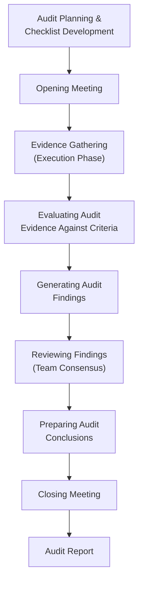
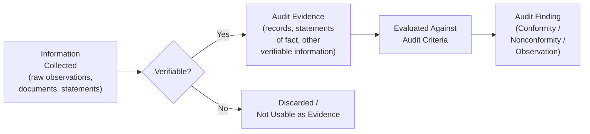

## Audit Execution and Evidence Gathering

### Definition and Purpose

Audit execution is the on-site (or remote) phase of the audit process in which the audit team collects and verifies information relevant to the audit objectives, scope, and criteria, and evaluates it against defined requirements to generate audit findings. Evidence gathering is the core activity within execution — the systematic collection of verifiable information (records, observations, statements) that can be evaluated against audit criteria. This phase is governed primarily by **ISO 19011** Clause 6.4 (Conducting the audit activities) and represents the transition from planning into the generation of objective, defensible findings.

### Position in the Overall Audit Process

### The Evidence-to-Finding Chain

Understanding the relationship between information collected, audit evidence, and audit findings is foundational to sound execution:

Per ISO 19011 terminology: **audit evidence** is defined as records, statements of fact, or other information relevant to the audit criteria and verifiable, while **audit findings** are the results of evaluating the collected audit evidence against audit criteria. Only verifiable information qualifies as usable audit evidence — unverified hearsay or unsubstantiated claims cannot support a finding.

### Opening Meeting

Execution formally begins with the opening meeting, which serves to:

- Confirm agreement on the audit plan, including objectives, scope, and criteria
- Introduce the audit team and their roles
- Confirm formal communication channels between the audit team and the auditee
- Confirm resources and facilities the audit team requires
- Confirm confidentiality and information security arrangements
- Confirm relevant health/safety, security, and emergency procedures for the audit team
- Confirm the method for reporting findings, including grading of nonconformities
- Provide an opportunity for the auditee to ask questions

### Evidence-Gathering Methods

**Interview**

Interviews should be conducted with personnel at the appropriate level and function performing the activities or tasks within the audit scope. Effective interview technique includes:

- Putting the interviewee at ease before probing
- Explaining the reason for the interview and any notes being taken
- Using open-ended questions ("Walk me through what happens when...") rather than leading or closed yes/no questions
- Asking the interviewee to demonstrate the activity rather than only describe it, wherever feasible
- Corroborating verbal statements with documented or observed evidence rather than accepting them as standalone evidence

**Observation**

Direct witnessing of activities, processes, conditions, or the work environment as they occur in real time. Observation provides strong evidence because it captures actual practice rather than a described or documented version of practice, and is particularly valuable for verifying that documented procedures are genuinely followed on the shop floor.

**Document and Record Review**

Examination of quality manuals, procedures, work instructions, forms, and records (calibration certificates, training records, inspection results, nonconformance reports, CAPA records) to verify existence, currency, approval status, and consistency with actual practice.

**Sampling**

Because full-population review is rarely feasible, auditors select representative samples of records, product, or process instances. Sampling should be planned during checklist development but may be adjusted dynamically during execution as evidence trails emerge (e.g., following a nonconformity discovered in one record back through related batches).

**Tracing (Horizontal Audit Technique)**

Following a specific product, lot, or transaction through its entire process flow — from purchase order or raw material receipt through production, inspection, and shipment — verifying that all required controls, records, and approvals exist at each stage in sequence. Particularly effective for traceability verification under standards like ISO 13485 (Clause 7.5.9) or IATF 16949.

**Remote/Virtual Audit Techniques**

Where permitted by the applicable audit program or accreditation scheme, evidence may be gathered via:

- Live video walkthroughs of facilities and processes
- Screen-sharing for electronic record/system review
- Video or teleconference interviews
- Secure electronic document transfer

[Inference] The extent to which remote evidence-gathering is acceptable for certification-grade audits depends on the applicable accreditation body's current policy (e.g., IAF guidance on ICT-assisted audits); organizations should verify current allowances with their certification body rather than assume full equivalence to on-site audit methods.

### Recording Evidence During Execution

Auditors should record evidence against each checklist item with sufficient specificity to allow the finding to be independently verified later — this typically includes:

- Specific document/record identifiers (e.g., procedure number and revision, record/form ID, sample lot number)
- Names/roles of personnel interviewed (or anonymized role references, per organizational policy)
- Date and location of observation
- A factual, objective description of what was observed or reviewed (avoiding auditor opinion or interpretive language at the point of recording)

**Example**

Weak evidence note: "Calibration seems fine."

Strong evidence note: "Reviewed calibration certificate #4471-B for micrometer MIC-22, dated 2026-03-14, next due 2027-03-14, traceable to NIST via accredited calibration lab (ISO 17025 cert #0592.01). Consistent with calibration master list entry."

### Evaluating Evidence Against Criteria

Once evidence is collected, it must be evaluated against the applicable audit criteria to determine conformity. This evaluation should distinguish:

| Evidence Outcome | Classification | Action |
| --- | --- | --- |
| Evidence confirms requirement is met | Conformity | Noted, no further action |
| Evidence confirms requirement is not met | Nonconformity | Documented finding, graded (major/minor) |
| Evidence is inconclusive or insufficient | Requires further investigation | Additional sampling, follow-up interview |
| Evidence reveals a potential improvement, but no requirement is violated | Observation/OFI | Noted separately from nonconformities |

### Managing the Audit Trail Dynamically

Effective auditors treat the checklist as a starting structure rather than a rigid script. Evidence gathered often reveals leads that warrant deviation from the planned sequence — for example, discovering an unresolved nonconformity in a training record may justify extending interview time in that area at the expense of a lower-risk area, within the constraints of the overall audit plan and time allocation. This adaptive approach is consistent with a risk-based audit methodology, provided any significant scope adjustment is communicated to the auditee and, where material, agreed with the audit client.

### Team Coordination During Execution (Multi-Auditor Teams)

For audits conducted by a team, coordination during execution includes:

- Periodic team briefings (e.g., end-of-day) to share findings and identify cross-cutting issues
- A lead auditor role responsible for overall audit management, team assignment, and consolidation of findings
- Clear allocation of scope/process ownership to avoid duplicate or gapped coverage
- Escalation protocol for significant findings that may affect overall audit conclusions or require immediate notification (e.g., product safety issues, potential regulatory reporting obligations discovered mid-audit)

### Guides and Observers

Auditee-appointed guides typically accompany the audit team to facilitate access, arrange interviews, and provide site-specific safety orientation. Guides should not influence or unduly interfere with the conduct of the audit; auditors should be alert to situations where a guide's presence appears to affect interviewee candor and may request private interview time where appropriate and permitted by the audit plan.

### Handling Access, Confidentiality, and Safety Constraints

Execution planning and real-time management must account for:

- Restricted or confidential areas (e.g., proprietary process technology, classified/ITAR-controlled areas in aerospace/defense) requiring pre-arranged access protocols
- Personal protective equipment (PPE) and site safety induction requirements
- Data confidentiality for any records containing personally identifiable information or commercially sensitive data

### Common Pitfalls in Audit Execution

- Accepting verbal assertions as evidence without corroboration through documents or observation
- Leading or closed-question interview technique that produces auditor-suggested rather than genuine responses
- Insufficient sample size or non-representative sampling that fails to detect systemic issues
- Failing to trace unexpected leads discovered during execution, adhering too rigidly to the original checklist sequence
- Recording vague, non-specific evidence notes that cannot be independently verified during finding review or later audit follow-up
- Allowing guide influence to suppress candid interview responses
- Drawing conclusions (nonconformity determinations) during evidence gathering itself rather than through a separate evaluation step, leading to premature or biased judgments

### Related Topics

- ISO 19011 – Guidelines for Auditing Management Systems
- Audit Planning and Checklist Development
- Types of Quality Audits (First/Second/Third-Party)
- Generating and Grading Audit Findings (Major/Minor/Observation)
- Root Cause Analysis and Corrective Action Requests (CAR)
- Audit Reporting and Closing Meeting Procedures
- Remote/ICT-Assisted Auditing Techniques
- Auditor Competence Requirements (ISO 19011 Clause 7)
- Traceability Verification (Horizontal/Trace Audits)
- Supplier and Second-Party Audit Practices